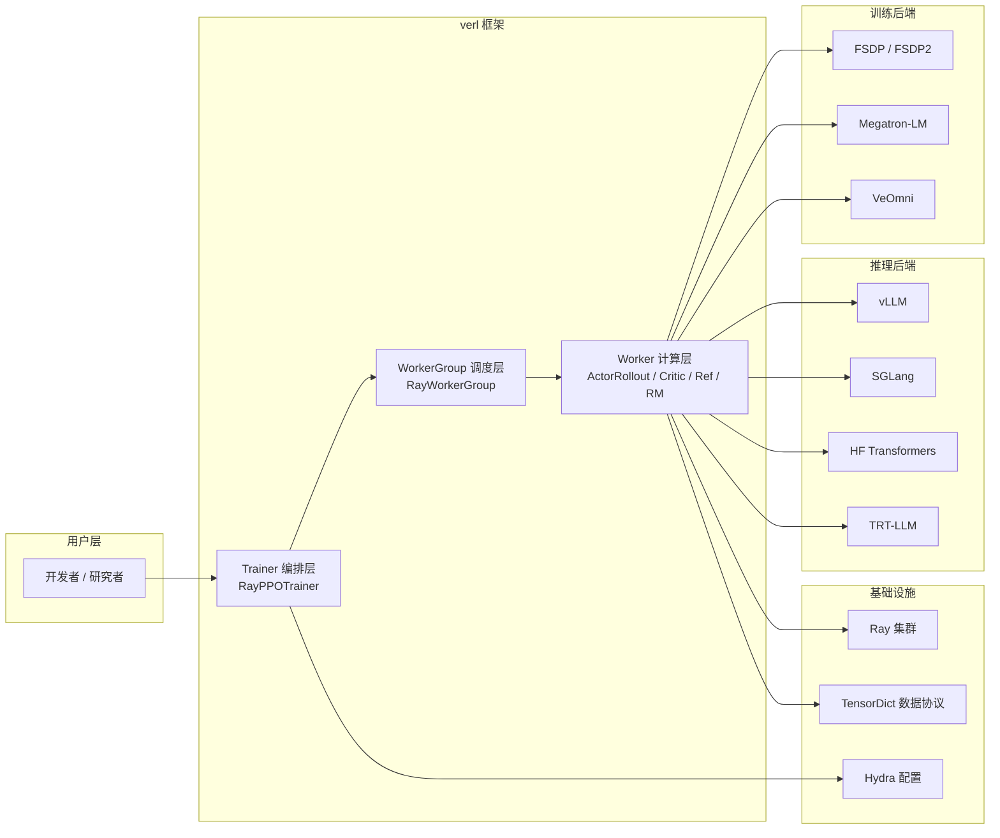
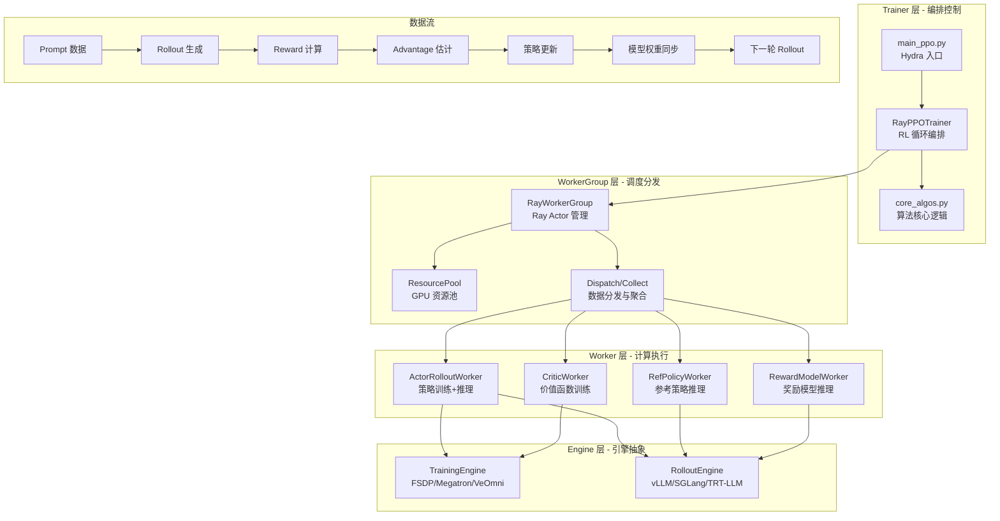
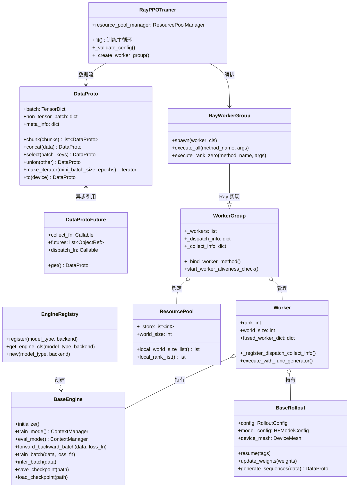
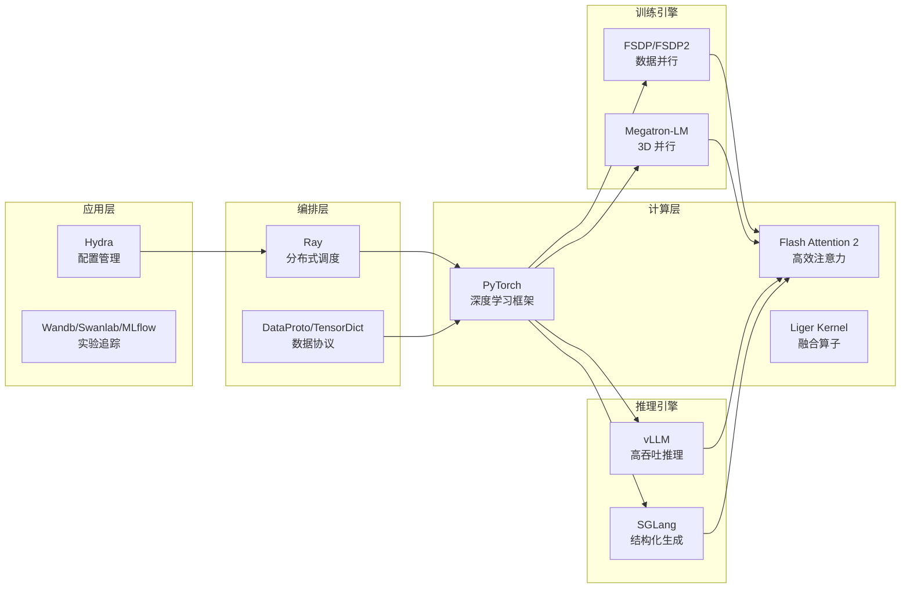

# verl 项目概览与架构总览

## 【总】开篇概述

### 核心定位

verl（Volcano Engine Reinforcement Learning）是字节跳动 Seed 团队发起的、面向大语言模型（LLM）的强化学习训练库，其学术论文为 **HybridFlow: A Flexible and Efficient RLHF Framework**（EuroSys 2025）。verl 致力于解决大模型后训练（post-training）阶段中 RLHF/RLVR 训练的工程挑战，提供灵活、高效、生产可用的 RL 训练能力。当前版本为 0.9.0.dev，已在豆包（Doubao）、Seed-Thinking 等产品中大规模落地验证。

### 核心问题：为什么需要 verl？

RLHF 训练面临三大关键挑战：

1. **训练-推理异构性**：RL 训练循环中同时包含训练（前向+反向）和推理（生成 rollout）两个阶段，二者对计算框架的需求截然不同——训练需要 FSDP/Megatron-LM 等分布式训练框架，推理需要 vLLM/SGLang 等高吞吐推理引擎。如何让异构框架在同一循环中高效协作是核心难题。
2. **资源调度复杂性**：不同模型（Actor、Critic、Reference、Reward）需要不同的并行策略和 GPU 分配，如何灵活地将模型映射到不同 GPU 集合、支持共置（colocate）与分离（disaggregate）部署，直接影响资源利用率和可扩展性。
3. **算法多样性**：从 PPO 到 GRPO、DAPO、ReMax、REINFORCE++、RLOO 等算法层出不穷，每种算法的数据流和计算依赖各异，框架需要支持算法的快速迭代和灵活组合。

### 全局概览图



### 关键结论预览

1. **混合控制器编程模型**：verl 的核心创新——通过 `Dispatch`/`Collect` 机制实现异构计算框架间的数据分发与聚合，解耦计算依赖与数据依赖。
2. **模块化 Engine 抽象**：`BaseEngine` 定义统一接口，FSDP/Megatron/vLLM/SGLang 等作为可插拔后端，训练与推理引擎可独立替换。
3. **DataProto 数据协议**：基于 TensorDict 的统一数据交换协议，支持跨 Worker 的高效序列化、分块、聚合与传输。
4. **灵活设备映射**：通过 `ResourcePool` 和 `PlacementGroup` 支持模型到 GPU 的灵活映射，支持共置与分离部署。
5. **3D HybridEngine**：在 Actor-Rollout 共置场景下，通过权重 resharding 消除内存冗余，显著降低训练-推理切换的通信开销。

---

## 【分】逐层展开

### 1. 项目背景与动机

#### RLHF 训练的挑战

RLHF（Reinforcement Learning from Human Feedback）是大模型对齐人类偏好的核心技术路线，其训练循环包含以下步骤：

```
Prompt → Rollout（推理生成）→ Reward（奖励计算）→ Training（策略更新）→ 更新模型 → 下一轮
```

这一循环面临以下工程挑战：

| 挑战维度 | 具体问题 |
|---------|---------|
| **训练-推理异构性** | 训练需要梯度同步（FSDP/Megatron），推理需要 KV Cache 和连续批处理（vLLM/SGLang），二者并行策略、内存布局、权重格式均不同 |
| **资源调度复杂性** | Actor、Critic、Reference、Reward Model 需要不同数量的 GPU，如何高效分配和复用资源？共置模式下如何避免内存冲突？ |
| **算法多样性** | PPO 需要 Critic，GRPO 不需要；DAPO 需要 dynamic sampling；ReMax 需要 reward 重新计算——框架必须支持灵活的数据流编排 |
| **扩展性** | 从单机 8 卡到 671B 模型数百卡，框架需要在不同规模下保持高效 |

#### HybridFlow 论文核心思想

HybridFlow 的核心贡献是提出了**混合控制器编程模型（Hybrid Controller Programming Model）**：

- **单控制器（Single Controller）**：在 Driver 进程中统一编排 RL 数据流，通过 `@register` 装饰器声明每个 Worker 方法的分发（Dispatch）和聚合（Collect）模式，实现数据流的灵活表达。
- **多控制器（Multi Controller）**：每个 Worker Group 内部通过 NCCL/Gloo 等集合通信库进行分布式训练/推理，保持高性能。
- **解耦设计**：计算逻辑（Worker 内部）与数据依赖（Worker 间）分离，新增算法只需修改 Trainer 层的数据流编排，无需修改底层 Engine。

#### 与同类框架对比

| 特性 | verl (HybridFlow) | OpenRLHF | DeepSpeed-Chat | NeMo-Aligner |
|------|-------------------|----------|----------------|--------------|
| 训练后端 | FSDP/FSDP2/Megatron-LM | DeepSpeed ZeRO | DeepSpeed ZeRO | Megatron-LM |
| 推理后端 | vLLM/SGLang/HF/TRT-LLM | vLLM | DeepSpeed Inference | TensorRT-LLM |
| 编程模型 | 混合控制器（单控+多控） | Ray Actor 模型 | 单进程多模型 | Megatron 分布式 |
| 算法支持 | PPO/GRPO/DAPO/ReMax/RLOO/REINFORCE++/... | PPO/GRPO/DPO | PPO | PPO/DPO |
| 设备映射 | 灵活（共置/分离/混合） | 固定分配 | 固定分配 | 固定分配 |
| 权重 Resharding | 3D HybridEngine | 无 | 无 | 无 |
| 多模态支持 | VLM RL（Qwen2.5-VL/Kimi-VL） | 有限 | 无 | 有限 |
| MoE 支持 | DeepSeek-671B/Qwen3-235B | 有限 | 无 | 有限 |
| 硬件支持 | NVIDIA/AMD/Ascend | NVIDIA | NVIDIA | NVIDIA |

### 2. 核心特性清单

#### 多后端训练

- **FSDP**：PyTorch 原生 Fully Sharded Data Parallel，支持 FSDP1 和 FSDP2
- **FSDP2**：推荐的后端，更好的吞吐和内存使用，兼容 `torch.compile`，支持 CPU Offloading + 梯度累积
- **Megatron-LM**：支持张量并行（TP）、流水线并行（PP）、序列并行（SP）、专家并行（EP），适用于超大模型
- **VeOmni**：面向多模态/扩散模型的训练后端
- **MindSpeed**：华为昇腾 NPU 适配后端
- **TorchTitan**：PyTorch 原生大规模训练后端

#### 多后端推理

- **vLLM**：高吞吐推理引擎，支持 vLLM >= 0.8.2，支持异步服务模式
- **SGLang**：支持多轮对话、Agent RL、VLM RLHF、Server-based RL
- **HF Transformers**：HuggingFace 原生推理，轻量级方案
- **TRT-LLM**：NVIDIA TensorRT-LLM 推理后端，支持 FP8 量化

#### 多算法支持

| 算法 | 特点 | 是否需要 Critic | 典型应用 |
|------|------|----------------|---------|
| PPO | 经典 on-policy 算法 | 是 | 通用对齐 |
| GRPO | Group Relative Policy Optimization | 否 | DeepSeek-R1 |
| DAPO | Dynamic Advantage with Policy Optimization | 否 | AIME 2024 SOTA |
| ReMax | 基于奖励重新计算的方差缩减 | 否 | 高效训练 |
| REINFORCE++ | 改进的 REINFORCE | 否 | 轻量训练 |
| RLOO | Leave-One-Out 基线 | 否 | 方差缩减 |
| PRIME | Process Reinforcement through Implicit Rewards | 否 | 过程奖励 |
| GSPO | Group Shaped Policy Optimization | 否 | GRPO 变体 |

#### 灵活设备映射

- **共置模式（Colocate）**：Actor 和 Rollout 共享同一组 GPU，通过 3D HybridEngine 实现零拷贝权重切换
- **分离模式（Disaggregate）**：不同模型部署在不同 GPU 集合上，通过 TransferQueue 高效传输数据
- **混合模式**：部分模型共置、部分分离，灵活组合

#### 多模态支持

- 支持 VLM（Vision-Language Model）的 RL 训练
- 已适配模型：Qwen2.5-VL、Qwen3-VL、Kimi-VL、GLM-4V 等
- 支持多轮对话与工具调用（Agent Loop）

### 3. 整体架构图



**三层架构职责说明：**

| 层级 | 核心类 | 职责 |
|------|--------|------|
| **Trainer 层** | `RayPPOTrainer` | 编排 RL 训练循环（Prompt → Rollout → Reward → Training），管理 Checkpoint、日志、指标 |
| **WorkerGroup 层** | `RayWorkerGroup` | 管理 Ray Actor 生命周期，通过 `Dispatch`/`Collect` 机制实现数据分发与聚合，管理 `ResourcePool` |
| **Worker 层** | `TrainingWorker` 等 | 封装具体计算逻辑，内部持有 `BaseEngine` 实例，执行前向/反向/推理 |

**数据流说明：**

1. **Prompt → Rollout**：将 Prompt 数据通过 `DP_COMPUTE_PROTO` 分发到 ActorRollout Worker，调用 vLLM/SGLang 生成响应
2. **Rollout → Reward**：将生成结果发送到 Reward Worker（函数奖励或模型奖励），计算 token-level 或 episode-level 奖励
3. **Reward → Training**：在 Trainer 层计算 Advantage（GAE/GRPO 等），分发到 Actor/Critic Worker 执行策略/价值更新
4. **Training → Update**：更新后的权重通过 3D HybridEngine 或权重同步机制同步到 Rollout Engine

### 4. 核心抽象关系图



**关键关系说明：**

- **DataProto** 是贯穿整个系统的数据协议，所有 Worker 间通信都通过它进行。`DataProtoFuture` 提供异步引用，避免 Driver 端等待数据传输。
- **Worker** 是最小计算单元，运行在 Ray Actor 上，内部持有 `BaseEngine`（训练）或 `BaseRollout`（推理）实例。
- **WorkerGroup** 管理一组 Worker，通过 `@register` 装饰器自动绑定方法，实现 `Dispatch`/`Collect` 的透明调用。
- **RayPPOTrainer** 是顶层编排器，管理 `ResourcePoolManager` 和多个 `RayWorkerGroup`，驱动 RL 训练循环。
- **EngineRegistry** 是引擎注册中心，根据 `model_type` 和 `backend` 动态创建对应的 Engine 实例。

### 5. 技术栈总览



| 技术栈 | 版本要求 | 职责 |
|--------|---------|------|
| **Python** | >= 3.10 | 运行时 |
| **PyTorch** | >= 2.6 | 深度学习框架，提供分布式原语 |
| **Ray** | ray[default] | 分布式调度，Actor 管理，Placement Group |
| **Hydra** | hydra-core | 基于 YAML 的层次化配置管理 |
| **TensorDict** | 0.8.0 ~ 0.10.0 | 张量字典，DataProto 的底层数据结构 |
| **Transformers** | transformers | HuggingFace 模型加载与兼容 |
| **vLLM** | >= 0.8.2 | 高吞吐推理引擎 |
| **SGLang** | 最新版 | 结构化生成推理引擎 |
| **Flash Attention** | 2.x | 高效注意力计算 |
| **PEFT** | peft | LoRA 等参数高效微调 |
| **Datasets** | datasets | 数据集加载与处理 |

### 6. 关键文件索引表

| 文件路径 | 职责 |
|---------|------|
| `verl/__init__.py` | 包入口，导出 `DataProto` 和 `__version__`，加载插件和 ModelScope 适配 |
| `verl/protocol.py` | 核心数据协议 `DataProto`、`DataProtoFuture`、`BatchData`，定义数据交换标准 |
| `verl/trainer/ppo/ray_trainer.py` | PPO 训练器核心，`RayPPOTrainer` 编排 RL 训练循环 |
| `verl/trainer/ppo/core_algos.py` | RL 算法核心逻辑：PPO loss、GAE、KL penalty、Advantage 估计等 |
| `verl/trainer/main_ppo.py` | PPO 训练入口，Hydra 配置加载，Ray 集群初始化 |
| `verl/trainer/config/config.py` | 配置管理，OmegaConf 到 dataclass 的转换 |
| `verl/single_controller/base/worker.py` | `Worker` 基类，分布式 Worker 的初始化与环境配置 |
| `verl/single_controller/base/worker_group.py` | `WorkerGroup` 基类和 `ResourcePool`，Worker 组管理与方法绑定 |
| `verl/single_controller/base/decorator.py` | `@register` 装饰器，`Dispatch`/`Execute` 枚举，分发与聚合机制 |
| `verl/single_controller/ray/base.py` | Ray 实现：`RayWorkerGroup`、`ResourcePoolManager`、Placement Group 管理 |
| `verl/workers/engine/base.py` | `BaseEngine` 抽象基类和 `EngineRegistry`，训练引擎的统一接口 |
| `verl/workers/engine_workers.py` | `TrainingWorker`，组合 Engine 和 Rollout 的 Worker 实现 |
| `verl/workers/rollout/base.py` | `BaseRollout` 抽象基类，推理引擎的统一接口 |
| `verl/workers/rollout/vllm_rollout/vllm_rollout.py` | vLLM 推理后端实现 |
| `verl/workers/rollout/sglang_rollout/sglang_rollout.py` | SGLang 推理后端实现 |
| `verl/workers/reward_manager/` | 奖励管理器：naive/batch/dapo/prime 等多种奖励策略 |

---

## 【总】总结升华

### 回顾核心设计要点

verl 的架构设计围绕"**解耦**"这一核心理念展开：

1. **计算与数据解耦**：Worker 内部专注计算逻辑，Worker 间的数据流由 `Dispatch`/`Collect` 机制透明管理，新增算法只需修改 Trainer 层编排。
2. **训练与推理解耦**：`BaseEngine` 和 `BaseRollout` 分别抽象训练和推理接口，后端可独立替换，FSDP 训练 + vLLM 推理、Megatron 训练 + SGLang 推理等组合自由搭配。
3. **模型与资源解耦**：`ResourcePool` 将模型需求与物理 GPU 解耦，支持灵活的共置/分离/混合部署策略。

### 设计亮点与权衡分析

**亮点：**

- **混合控制器编程模型**是 verl 最核心的创新，它让 RL 数据流的表达既灵活（单控制器统一编排）又高效（多控制器分布式执行），这是区别于其他框架的关键设计。
- **3D HybridEngine** 在 Actor-Rollout 共置场景下，通过权重 resharding 避免了模型权重的重复加载，显著降低了内存占用和切换延迟。
- **DataProto 协议**基于 TensorDict，提供了丰富的数据操作（chunk/concat/select/union），使得跨 Worker 的数据流转简洁高效。
- **EngineRegistry** 注册机制支持按 `model_type` + `backend` + `device` + `vendor` 四维查找，便于扩展新后端和硬件适配。

**权衡：**

- **Ray 依赖**：系统深度依赖 Ray 进行分布式调度，在非 Ray 环境（如纯 MPI 集群）下难以使用。
- **配置复杂度**：Hydra 层次化配置虽然灵活，但配置文件嵌套较深（actor/critic/engine/algorithm 各有子配置），学习曲线较陡。
- **内存开销**：DataProto 在 Driver 端需要完整持有数据用于分发/聚合，在超大批量场景下可能成为瓶颈（`DataProtoFuture` 部分缓解了此问题）。

### 扩展性与局限性

**扩展性：**

- **新算法**：继承 `AdvantageEstimator` 注册新的优势估计方法，或修改 `RayPPOTrainer` 的数据流编排即可。
- **新训练后端**：继承 `BaseEngine` 并通过 `@EngineRegistry.register` 注册。
- **新推理后端**：继承 `BaseRollout` 并在 `get_rollout_class` 中注册。
- **新硬件**：通过 `Platform` 插件机制和 `EngineRegistry` 的 vendor 维度支持新硬件适配。

**局限性：**

- 当前主要面向 on-policy RL 算法，off-policy 算法（如 DPO）的支持相对有限。
- 多轮对话和 Agent RL 仍在 experimental 阶段，尚未完全稳定。
- 大规模集群（千卡级别）的容错和弹性训练能力尚在建设中。
- 文档和测试覆盖仍在持续完善中，部分实验性功能缺乏充分文档。
