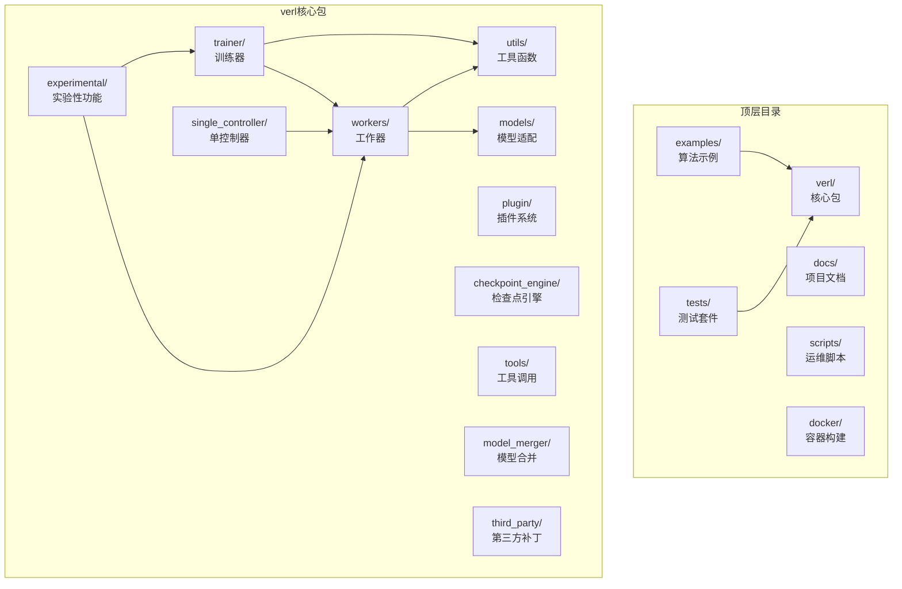
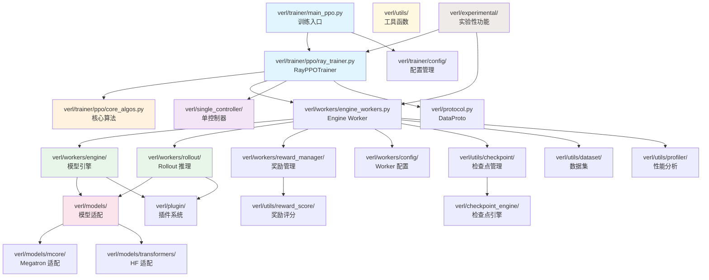

# verl 代码目录结构详解

## 【总】开篇概述

### 项目代码组织方式

verl 是一个面向大语言模型（LLM）强化学习后训练的生产级框架，其代码组织遵循 **"核心包 + 示例驱动 + 插件化扩展"** 的三层架构模式。核心包 `verl/` 封装了训练、推理、通信、检查点等全部基础设施；`examples/` 以算法为维度提供开箱即用的运行脚本；`tests/` 和 `docs/` 分别保障质量与可维护性。

### 核心问题

> verl 的代码结构如何反映其设计理念？

verl 的设计理念可概括为三点：**解耦训练与推理**（Actor/Critic 与 Rollout 分离）、**多后端可插拔**（vLLM / SGLang / TensorRT-LLM / Megatron 等后端统一抽象）、**分布式优先**（基于 Ray 的单控制器模式调度多 Worker）。这些理念直接映射到了目录结构中——`workers/` 下的 `rollout/` 和 `engine/` 各自按后端实现子目录，`single_controller/` 独立封装分布式调度逻辑，`trainer/` 与 `workers/` 严格分离。

### 全局概览图



### 关键结论预览

1. **训练-推理解耦**：`trainer/` 编排训练循环，`workers/` 封装推理与模型引擎，二者通过 `DataProto` 协议通信
2. **多后端统一抽象**：Rollout（vLLM/SGLang/TRT-LLM/Naive）和 Engine（FSDP/Megatron/Automodel/VeOmni/MindSpeed/TorchTitan）均采用基类 + 子目录实现模式
3. **实验性功能隔离**：`experimental/` 目录承载 fully_async、agent_loop、reward_loop 等前沿特性，与稳定 API 隔离
4. **配置驱动**：`trainer/config/` 和 `workers/config/` 采用 Hydra YAML 层次化配置，支持多训练范式组合

---

## 【分】逐层展开

### 1. 顶层目录结构说明

| 目录 | 职责 |
|------|------|
| `verl/` | 核心 Python 包，包含训练、推理、通信、工具等全部业务逻辑 |
| `examples/` | 按算法分类的运行示例脚本（PPO、GRPO、DAPO 等），是用户入口 |
| `tests/` | 测试套件，含单元测试、分布式测试、E2E 测试、NPU 测试、静态检查 |
| `docs/` | Sphinx 文档源码，含算法说明、教程、API 参考等 |
| `scripts/` | 运维与辅助脚本（模型转换、检查点迁移、配置生成等） |
| `docker/` | 多平台 Docker 构建文件（CUDA、ROCm、Ascend NPU） |
| `.github/` | CI/CD 工作流定义，含 GPU/NPU/Ascend 多平台流水线 |

### 2. verl/ 核心包逐层解析

#### 2.1 verl/trainer/ — 训练器

训练器是 verl 的编排核心，负责训练循环、算法实现和配置管理。

```
verl/trainer/
├── config/                  # Hydra 配置层次
│   ├── actor/               # Actor 配置（fsdp/megatron/veomni 等）
│   ├── algorithm/           # 算法配置（rollout_correction 等）
│   ├── critic/              # Critic 配置
│   ├── data/                # 数据配置
│   ├── distillation/        # 蒸馏配置
│   ├── engine/              # 引擎配置（automodel/fsdp/megatron 等）
│   ├── model/               # 模型配置
│   ├── model_engine/        # 模型引擎配置
│   ├── optim/               # 优化器配置
│   ├── ref/                 # 参考策略配置
│   ├── reward/              # 奖励配置
│   ├── rollout/             # Rollout 配置
│   ├── algorithm.py         # 算法配置数据类
│   ├── config.py            # 配置合并与验证逻辑
│   └── ppo_trainer.yaml     # PPO 训练器主配置
├── distillation/            # 蒸馏损失实现
│   ├── fsdp/                # FSDP 蒸馏损失
│   ├── megatron/            # Megatron 蒸馏损失
│   └── losses.py            # 通用蒸馏损失
├── ppo/                     # PPO 算法核心
│   ├── core_algos.py        # 核心算法（GAE、PPO-clip、优势计算）
│   ├── metric_utils.py      # 训练指标工具
│   ├── padding_utils.py     # Padding 处理
│   ├── prefix_grouper_utils.py  # 前缀分组
│   ├── ray_trainer.py       # RayPPOTrainer 主训练循环
│   ├── reward.py            # 奖励计算
│   ├── rollout_corr_helper.py   # Rollout 校正辅助
│   └── utils.py             # PPO 工具函数
├── main_ppo.py              # PPO 训练入口（Hydra）
├── main_ppo_sync.py         # 同步 PPO 入口
├── main_eval.py             # 评估入口
├── main_generation_server.py # 生成服务入口
├── sft_trainer.py           # SFT 训练器
├── sft_trainer_ray.py       # Ray 版 SFT 训练器
└── constants_ppo.py         # PPO 常量定义
```

**关键设计**：`config/` 目录采用 Hydra 分层配置，每个组件（actor、critic、engine、rollout 等）独立配置，通过 `config.py` 合并为完整训练配置。`ppo/ray_trainer.py` 是最核心的文件，实现了 `RayPPOTrainer` 类，编排整个 PPO 训练循环。

#### 2.2 verl/workers/ — 工作器

工作器封装了模型推理、训练引擎和奖励计算的具体实现，是 verl 多后端可插拔架构的核心体现。

```
verl/workers/
├── config/                  # Worker 配置数据类
│   ├── actor.py             # Actor 配置
│   ├── critic.py            # Critic 配置
│   ├── engine.py            # 引擎配置
│   ├── model.py             # 模型配置
│   ├── optimizer.py         # 优化器配置
│   ├── rollout.py           # Rollout 配置
│   ├── reward.py            # 奖励配置
│   ├── checkpoint.py        # 检查点配置
│   ├── disaggregation.py    # 分离部署配置
│   ├── distillation.py      # 蒸馏配置
│   └── megatron_peft.py     # Megatron PEFT 配置
├── engine/                  # 模型训练引擎（按后端分目录）
│   ├── base.py              # 引擎基类
│   ├── automodel/           # HFAutomodel 引擎
│   ├── fsdp/                # FSDP 引擎
│   ├── megatron/            # Megatron-LM 引擎
│   ├── mindspeed/           # MindSpeed 引擎（Ascend NPU）
│   ├── torchtitan/          # TorchTitan 引擎
│   └── veomni/              # VeOmni 引擎
├── rollout/                 # 推理 Rollout 实现（按后端分目录）
│   ├── base.py              # Rollout 基类
│   ├── hf_rollout.py        # HuggingFace Rollout
│   ├── llm_server.py        # LLM 服务抽象
│   ├── naive/               # 朴素 Rollout
│   ├── sglang_rollout/      # SGLang 推理后端
│   ├── trtllm_rollout/      # TensorRT-LLM 推理后端
│   └── vllm_rollout/        # vLLM 推理后端
├── reward_manager/          # 奖励管理器
│   ├── abstract.py          # 奖励管理器抽象基类
│   ├── naive.py             # 朴素奖励管理
│   ├── batch.py             # 批量奖励管理
│   ├── dapo.py              # DAPO 奖励策略
│   ├── prime.py             # PRIME 奖励策略
│   └── registry.py          # 奖励管理器注册表
├── utils/                   # Worker 工具
│   ├── losses.py            # 损失函数
│   └── padding.py           # Padding 工具
└── engine_workers.py        # Engine Worker 入口（Ray Actor）
```

**关键设计**：`engine/` 和 `rollout/` 均采用 **基类 + 子目录** 模式。每个子目录包含 `transformer_impl.py`（具体实现）和 `utils.py`（辅助函数），实现统一接口下的多后端切换。`reward_manager/` 通过注册表模式支持不同奖励策略的动态选择。

#### 2.3 verl/models/ — 模型适配

模型适配层为不同训练框架和模型架构提供统一接口。

```
verl/models/
├── mcore/                   # Megatron-Core 适配
│   ├── bridge.py            # Megatron 模型桥接
│   ├── mbridge.py           # Megatron 多模态桥接
│   ├── config_converter.py  # HF → Megatron 配置转换
│   ├── loader.py            # 模型权重加载
│   ├── saver.py             # 模型权重保存
│   ├── weight_converter.py  # 权重格式转换
│   ├── model_forward.py     # 模型前向传播
│   ├── model_forward_1f1b_overlap.py  # 1F1B 重叠前向
│   ├── model_forward_fused.py  # 融合前向
│   ├── model_initializer.py # 模型初始化
│   ├── patch.py             # Megatron 补丁
│   ├── mtp_patch.py         # MTP（多Token预测）补丁
│   ├── registry.py          # 模型注册表
│   └── util.py              # 工具函数
├── transformers/            # HuggingFace Transformers 适配
│   ├── llama.py             # LLaMA 模型适配
│   ├── qwen2.py             # Qwen2 模型适配
│   ├── qwen2_vl.py          # Qwen2-VL 视觉模型适配
│   ├── qwen3_5.py           # Qwen3.5 模型适配
│   ├── qwen3_vl.py          # Qwen3-VL 视觉模型适配
│   ├── glm4v.py             # GLM-4V 视觉模型适配
│   ├── kimi_vl.py           # Kimi-VL 视觉模型适配
│   ├── apertus.py           # Apertus 模型适配
│   ├── dense_common.py      # Dense 模型通用逻辑
│   ├── tiled_mlp.py         # Tiled MLP 实现
│   ├── monkey_patch.py      # Transformers 猴子补丁
│   └── npu_patch.py         # NPU 兼容补丁
├── registry.py              # 全局模型注册表
└── weight_loader_registry.py # 权重加载器注册表
```

**关键设计**：`mcore/` 负责 Megatron-LM 与 HuggingFace 之间的模型桥接，包括配置转换、权重格式转换和前向传播适配。`transformers/` 为每种模型架构提供独立的适配文件，通过 `registry.py` 实现模型类型的动态注册与查找。

#### 2.4 verl/utils/ — 工具函数

工具函数层是 verl 最大的子包，提供横切关注点的实现。

```
verl/utils/
├── checkpoint/              # 检查点管理
│   ├── checkpoint_handler.py    # 检查点处理器
│   ├── checkpoint_manager.py    # 检查点管理器
│   ├── fsdp_checkpoint_manager.py  # FSDP 检查点管理
│   └── megatron_checkpoint_manager.py  # Megatron 检查点管理
├── dataset/                 # 数据集工具
│   ├── rl_dataset.py        # RL 训练数据集
│   ├── rm_dataset.py        # 奖励模型数据集
│   ├── multiturn_sft_dataset.py  # 多轮 SFT 数据集
│   ├── dataset_utils.py     # 数据集工具函数
│   └── vision_utils.py      # 视觉数据工具
├── debug/                   # 调试工具
│   ├── metrics.py           # 调试指标
│   ├── performance.py       # 性能调试
│   └── trajectory_tracker.py # 轨迹追踪
├── kernel/                  # 自定义 CUDA Kernel
│   ├── fp8_kernel.py        # FP8 精度 Kernel
│   ├── kernels.py           # 通用 Kernel
│   └── linear_cross_entropy.py  # 融合交叉熵 Kernel
├── megatron/                # Megatron 工具集
│   ├── dist_checkpointing.py # 分布式检查点
│   ├── memory.py            # 内存管理
│   ├── optimizer.py         # 优化器适配
│   ├── pipeline_parallel.py # 流水线并行
│   ├── sequence_parallel.py # 序列并行
│   ├── tensor_parallel.py   # 张量并行
│   ├── router_replay_patch.py  # Router Replay 补丁
│   └── router_replay_utils.py  # Router Replay 工具
├── profiler/                # 性能分析
│   ├── profile.py           # Profiler 基类
│   ├── torch_profile.py     # Torch Profiler
│   ├── torch_memory_profile.py  # 内存 Profiler
│   ├── nvtx_profile.py      # NVTX Profiler
│   ├── mstx_profile.py      # MSTX Profiler（NPU）
│   └── performance.py       # 性能指标收集
├── reward_score/            # 奖励评分函数
│   ├── math_reward.py       # 数学题奖励
│   ├── math_verify.py       # 数学验证
│   ├── math_dapo.py         # DAPO 数学奖励
│   ├── gsm8k.py             # GSM8K 奖励
│   ├── geo3k.py             # Geo3K 奖励
│   ├── rlla.py              # RLLA 奖励
│   ├── prime_code/          # PRIME 代码奖励
│   ├── prime_math/          # PRIME 数学奖励
│   └── sandbox_fusion/      # Sandbox Fusion 奖励
├── qat/                     # 量化感知训练
│   ├── core.py              # QAT 核心
│   ├── linear.py            # QAT 线性层
│   ├── quantizer.py         # 量化器
│   └── vllm_patch.py        # vLLM QAT 补丁
├── modelopt/                # ModelOpt 量化工具
│   ├── quantize.py          # 量化逻辑
│   ├── qat_utils.py         # QAT 工具
│   └── qat_weight_exporter.py  # QAT 权重导出
├── skip/                    # Skip 管理器
│   ├── base_skip.py         # Skip 基类
│   ├── rollout_skip.py      # Rollout Skip
│   ├── skip_manager.py      # Skip 管理器
│   └── config.py            # Skip 配置
├── vllm/                    # vLLM 适配工具
│   ├── patch.py             # vLLM 补丁
│   ├── utils.py             # vLLM 工具
│   ├── vllm_fp8_utils.py    # vLLM FP8 工具
│   └── npu_vllm_patch.py    # NPU vLLM 补丁
├── sglang/                  # SGLang 适配工具
│   └── sglang_fp8_utils.py  # SGLang FP8 工具
├── trtllm/                  # TensorRT-LLM 适配工具
│   └── trtllm_fp8_utils.py  # TRT-LLM FP8 工具
├── veomni/                  # VeOmni 适配工具
│   └── router_replay.py     # Router Replay
├── rendezvous/              # 分布式同步
│   └── ray_backend.py       # Ray 后端同步
├── logger/                  # 日志
│   └── aggregate_logger.py  # 聚合日志器
├── experimental/            # 实验性工具
│   └── torch_functional.py  # 实验性 Torch 函数
├── metric/                  # 指标工具
│   └── utils.py             # 指标工具函数
├── activation_offload.py    # 激活卸载
├── attention_utils.py       # 注意力工具
├── chat_template.py         # 聊天模板
├── config.py                # 配置工具
├── device.py                # 设备抽象（CUDA/NPU）
├── distributed.py           # 分布式工具
├── flops_counter.py         # FLOPs 计数器
├── fp8_utils.py             # FP8 通用工具
├── fs.py                    # 文件系统工具
├── fsdp_utils.py            # FSDP 工具
├── groupwise.py             # 分组工具
├── hdfs_io.py               # HDFS I/O
├── import_utils.py          # 导入工具
├── logging_utils.py         # 日志工具
├── megatron_peft_utils.py   # Megatron PEFT 工具
├── megatron_utils.py        # Megatron 通用工具
├── memory_utils.py          # 内存工具
├── model.py                 # 模型工具
├── net_utils.py             # 网络工具
├── npu_flash_attn_utils.py  # NPU Flash Attention 工具
├── py_functional.py         # Python 函数式工具
├── ray_utils.py             # Ray 工具
├── rollout_trace.py         # Rollout 追踪
├── seqlen_balancing.py      # 序列长度均衡
├── tensordict_utils.py      # TensorDict 工具
├── tokenizer.py             # Tokenizer 工具
├── torch_dtypes.py          # Torch 数据类型
├── torch_functional.py      # Torch 函数式工具
├── tracking.py              # 实验追踪（WandB等）
├── transferqueue_utils.py   # TransferQueue 工具
├── transformers_compat.py   # Transformers 兼容层
└── ulysses.py               # Ulysses 序列并行
```

**关键设计**：`utils/` 按功能域划分子目录（checkpoint、dataset、kernel、profiler 等），每个子目录内聚一组相关工具。顶层散落的 `.py` 文件则是跨域通用工具。`device.py` 提供了 CUDA/NPU 的统一设备抽象，是跨硬件兼容的关键。

#### 2.5 verl/single_controller/ — 单控制器

单控制器是 verl 分布式调度的核心抽象，基于 Ray 实现中心化的 Worker 编排。

```
verl/single_controller/
├── base/
│   ├── decorator.py         # Worker 函数装饰器（@register）
│   ├── worker.py            # Worker 基类
│   └── worker_group.py      # WorkerGroup 管理
└── ray/
    └── base.py              # Ray 后端实现
```

**关键设计**：`decorator.py` 提供了 `@register` 装饰器，将普通方法注册为可远程调用的 Worker 函数。`worker_group.py` 管理 Worker 的创建、销毁和资源分配。`ray/base.py` 基于 Ray Actor 实现具体的远程调用。

#### 2.6 verl/plugin/ — 插件系统

```
verl/plugin/
└── platform/
    ├── platform_base.py     # 平台抽象基类
    ├── platform_cuda.py     # CUDA 平台实现
    ├── platform_npu.py      # NPU 平台实现
    └── platform_manager.py  # 平台管理器
```

**关键设计**：插件系统当前主要承载平台抽象（CUDA/NPU），通过 `platform_manager.py` 自动检测硬件并选择对应平台实现。`verl/__init__.py` 中还通过 setuptools entry_points 支持外部插件自动发现。

#### 2.7 verl/experimental/ — 实验性功能

```
verl/experimental/
├── agent_loop/              # Agent 循环（工具调用）
│   ├── agent_loop.py        # Agent 循环主逻辑
│   ├── single_turn_agent_loop.py  # 单轮 Agent
│   ├── tool_agent_loop.py   # 工具调用 Agent
│   ├── tool_parser.py       # 工具解析器
│   └── utils.py             # Agent 工具
├── fully_async_policy/      # 全异步策略训练
│   ├── fully_async_main.py  # 异步训练入口
│   ├── fully_async_rollouter.py  # 异步 Rollouter
│   ├── fully_async_trainer.py    # 异步 Trainer
│   ├── message_queue.py     # 消息队列
│   ├── detach_utils.py      # 分离工具
│   ├── config/              # 异步训练配置
│   └── shell/               # 运行脚本
├── one_step_off_policy/     # 单步离策略训练
│   ├── main_ppo.py          # 入口
│   └── ray_trainer.py       # Ray Trainer
├── reward_loop/             # 奖励循环
│   ├── reward_loop.py       # 奖励循环主逻辑
│   ├── reward_model.py      # 奖励模型
│   ├── reward_manager/      # 奖励管理器（含多种策略）
│   └── router/              # 路由器（含 SGLang 路由）
├── separation/              # 训练推理分离部署
│   ├── engine_workers.py    # 分离引擎 Worker
│   ├── ray_trainer.py       # 分离训练器
│   └── utils.py             # 分离工具
└── teacher_loop/            # 教师模型循环（蒸馏）
    ├── teacher_manager.py   # 教师管理器
    └── teacher_model.py     # 教师模型
```

**关键设计**：`experimental/` 是 verl 前沿特性的孵化器。`fully_async_policy/` 实现了生成与训练完全解耦的异步训练模式；`agent_loop/` 支持工具调用的多轮 Agent RL；`reward_loop/` 将奖励计算独立为可扩展的循环。这些特性成熟后会逐步迁移到稳定 API。

#### 2.8 verl/checkpoint_engine/ — 检查点引擎

```
verl/checkpoint_engine/
├── base.py                  # 检查点引擎基类
├── nccl_checkpoint_engine.py    # NCCL 检查点引擎
├── hccl_checkpoint_engine.py    # HCCL 检查点引擎（Ascend NPU）
├── mooncake_checkpoint_engine.py # Mooncake 检查点引擎
├── kimi_checkpoint_engine.py    # Kimi 检查点引擎
└── nixl_checkpoint_engine.py    # NIXL 检查点引擎
```

**关键设计**：检查点引擎按通信后端分类，NCCL 用于 NVIDIA GPU，HCCL 用于 Ascend NPU，Mooncake/Kimi/NIXL 是第三方高性能传输库，用于大规模分布式场景下的检查点快速保存与恢复。

#### 2.9 verl/tools/ — 工具调用

```
verl/tools/
├── base_tool.py             # 工具基类
├── function_tool.py         # 函数工具实现
├── schemas.py               # 工具 Schema 定义
└── tool_registry.py         # 工具注册表
```

**关键设计**：为 Agent RL 提供工具调用基础设施，`function_tool.py` 支持将 Python 函数自动注册为可调用工具，`tool_registry.py` 管理工具的注册与查找。

#### 2.10 verl/model_merger/ — 模型合并

```
verl/model_merger/
├── base_model_merger.py     # 合并器基类
├── fsdp_model_merger.py     # FSDP 模型合并
├── megatron_model_merger.py # Megatron 模型合并
└── __main__.py              # 命令行入口
```

**关键设计**：支持将分布式训练的模型分片合并为完整模型，FSDP 和 Megatron 各有独立的合并逻辑。可通过 `python -m verl.model_merger` 直接调用。

#### 2.11 verl/third_party/ — 第三方补丁

```
verl/third_party/
├── torch/
│   └── distributed/
│       └── checkpoint/
│           └── state_dict.py  # Torch 分布式检查点补丁
└── vllm/
    └── __init__.py            # vLLM 补丁入口
```

**关键设计**：对第三方库的补丁修复，`torch/distributed/checkpoint/` 修复了 PyTorch 分布式检查点的状态字典处理问题。

### 3. examples/ 示例目录解析

`examples/` 按算法分类组织，每个子目录包含一种训练算法的运行脚本：

| 子目录 | 算法 | 说明 |
|--------|------|------|
| `ppo_trainer/` | PPO | 近端策略优化，verl 的核心算法 |
| `grpo_trainer/` | GRPO | 群组相对策略优化，无需 Critic |
| `cispo_trainer/` | CISPO | Clipped IS 策略优化 |
| `dppo_trainer/` | DPPO | 差分 PPO |
| `gdpo_trainer/` | GDPO | 群组差分策略优化 |
| `gmpo_trainer/` | GMPO | 群组最大策略优化 |
| `gpg_trainer/` | GPG | 群组策略梯度 |
| `gspo_trainer/` | GSPO | 群组自博弈策略优化 |
| `remax_trainer/` | ReMax | ReMax 奖励最大化 |
| `rloo_trainer/` | RLOO | Leave-One-Out 优势估计 |
| `sapo_trainer/` | SAPO | 自适应策略优化 |
| `otb_trainer/` | OTB | Off-Trust-Bound |
| `mtp_trainer/` | MTP | 多 Token 预测训练 |
| `on_policy_distillation_trainer/` | OPD | 在策略蒸馏 |
| `prefix_grouper/` | Prefix Grouper | 前缀分组训练 |
| `reinforce_plus_plus_trainer/` | REINFORCE++ | REINFORCE++ 算法 |
| `rollout_correction/` | Rollout Corr | Rollout 校正 |
| `router_replay/` | Router Replay | 路由重放 |
| `sft/` | SFT | 监督微调（含多模态、多轮） |
| `tuning/` | Tuning | LoRA、Scaling 等调优 |
| `profile/` | Profile | 性能分析脚本 |
| `data_preprocess/` | 预处理 | 数据集预处理脚本 |
| `tutorial/` | Tutorial | 入门教程（Ray、SkyPilot、Slurm） |
| `generation/` | Generation | 纯推理生成 |

每个算法目录通常包含 `README.md` 和若干 `.sh` 脚本，脚本命名遵循 `run_{model}_{backend}.sh` 的约定（如 `run_qwen3_8b_fsdp.sh`、`run_qwen3_30b_a3b_megatron.sh`）。

### 4. tests/ 测试目录解析

```
tests/
├── checkpoint_engine/       # 检查点引擎测试
├── experimental/            # 实验性功能测试
│   ├── agent_loop/          # Agent 循环测试
│   ├── fully_async_policy/  # 全异步策略测试
│   ├── reward_loop/         # 奖励循环测试
│   └── vla/                 # VLA 测试
├── models/                  # 模型适配测试
├── plugin/                  # 插件系统测试
├── single_controller/       # 单控制器测试
├── tools/                   # 工具调用测试
├── trainer/                 # 训练器测试
│   └── ppo/                 # PPO 算法测试
├── utils/                   # 工具函数测试
│   ├── ckpt/                # 检查点测试
│   ├── dataset/             # 数据集测试
│   ├── debug/               # 调试测试
│   ├── megatron/            # Megatron 测试
│   ├── reward_score/        # 奖励评分测试
│   └── veomni/              # VeOmni 测试
├── workers/                 # Worker 测试
│   ├── config/              # 配置测试
│   ├── reward_manager/      # 奖励管理器测试
│   └── rollout/             # Rollout 测试（含多后端）
├── special_distributed/     # 分布式专项测试
├── special_e2e/             # 端到端专项测试
├── special_npu/             # NPU 专项测试
├── special_sanity/          # 静态检查（lint、导入、文档）
└── special_standalone/      # 独立运行测试
```

**测试组织特点**：
- **按模块分目录**：与 `verl/` 包结构一一对应
- **special_ 前缀**：标记需要特殊运行环境的测试（GPU、NPU、分布式、E2E）
- **命名约定**：`test_{功能}_{运行环境}.py`，如 `test_decorator_on_cpu.py`、`test_correctness_on_gpu.py`
- **静态检查**：`special_sanity/` 包含导入检查、文档验证、类型覆盖率等非运行时测试

### 5. docs/ 文档目录解析

```
docs/
├── start/                   # 快速入门
│   ├── quickstart.rst       # 快速开始
│   ├── install.rst          # 安装指南
│   ├── multinode.rst        # 多节点部署
│   └── agentic_rl.rst       # Agent RL 入门
├── algo/                    # 算法文档（PPO、GRPO、DAPO 等 14 种算法）
├── advance/                 # 高级特性（检查点、Megatron、FSDP 等）
├── workers/                 # Worker 文档（引擎、Rollout 等）
├── preparation/             # 数据准备
├── perf/                    # 性能调优
├── low_precision/           # 低精度训练（FP8、QAT）
├── examples/                # 示例文档
├── api/                     # API 参考
├── faq/                     # 常见问题
├── ascend_tutorial/         # Ascend NPU 教程
├── amd_tutorial/            # AMD ROCm 教程
├── sglang_multiturn/        # SGLang 多轮对话
├── contributing/            # 贡献指南
├── blog/                    # 博客
└── data/                    # 数据相关
```

### 6. scripts/ 脚本目录解析

| 脚本 | 职责 |
|------|------|
| `converter_hf_to_mcore.py` | HuggingFace → Megatron-Core 权重转换 |
| `generate_trainer_config.sh` | 自动生成训练器配置文件 |
| `init_random_model.py` | 初始化随机模型权重 |
| `install_vllm_sglang_mcore.sh` | 安装 vLLM + SGLang + Megatron-Core |
| `install_vllm_mcore_npu.sh` | 安装 NPU 版 vLLM + Megatron-Core |
| `install_sglang_mcore_npu.sh` | 安装 NPU 版 SGLang + Megatron-Core |
| `legacy_model_merger.py` | 旧版模型合并脚本 |
| `megatron_merge_lora.py` | Megatron LoRA 合并 |
| `migrate_megatron_checkpoint_layout.py` | Megatron 检查点布局迁移 |
| `print_cfg.py` | 打印配置信息 |
| `rollout_viewer.py` | Rollout 结果可视化 |
| `diagnose.py` | 诊断工具 |
| `veomni/moe_merge.py` | MoE 模型合并 |
| `veomni/moe_split.py` | MoE 模型拆分 |

### 7. 关键文件职责说明

| 文件路径 | 职责 |
|----------|------|
| `verl/__init__.py` | 包入口，版本管理，插件发现，NPU 兼容补丁 |
| `verl/protocol.py` | DataProto 数据传输协议，模块间通信基础 |
| `verl/base_config.py` | BaseConfig 不可变配置基类，支持字典式访问 |
| `verl/trainer/main_ppo.py` | PPO 训练入口，Hydra 配置加载 |
| `verl/trainer/ppo/ray_trainer.py` | RayPPOTrainer，PPO 训练主循环编排 |
| `verl/trainer/ppo/core_algos.py` | PPO 核心算法（GAE、PPO-clip、优势计算） |
| `verl/trainer/ppo/reward.py` | 奖励计算逻辑 |
| `verl/trainer/config/config.py` | 配置合并与验证 |
| `verl/trainer/sft_trainer.py` | SFT 训练器实现 |
| `verl/workers/engine_workers.py` | Engine Worker 入口（Ray Actor） |
| `verl/workers/engine/base.py` | 模型引擎基类 |
| `verl/workers/engine/fsdp/transformer_impl.py` | FSDP 引擎实现 |
| `verl/workers/engine/megatron/transformer_impl.py` | Megatron 引擎实现 |
| `verl/workers/rollout/base.py` | Rollout 基类 |
| `verl/workers/rollout/vllm_rollout/vllm_rollout.py` | vLLM Rollout 实现 |
| `verl/workers/rollout/sglang_rollout/sglang_rollout.py` | SGLang Rollout 实现 |
| `verl/workers/rollout/trtllm_rollout/trtllm_rollout.py` | TensorRT-LLM Rollout 实现 |
| `verl/workers/reward_manager/abstract.py` | 奖励管理器抽象基类 |
| `verl/workers/reward_manager/registry.py` | 奖励管理器注册表 |
| `verl/models/mcore/bridge.py` | Megatron 模型桥接 |
| `verl/models/mcore/config_converter.py` | HF → Megatron 配置转换 |
| `verl/models/mcore/weight_converter.py` | 权重格式转换 |
| `verl/models/transformers/llama.py` | LLaMA 模型适配 |
| `verl/models/transformers/qwen2.py` | Qwen2 模型适配 |
| `verl/single_controller/base/decorator.py` | Worker 函数注册装饰器 |
| `verl/single_controller/base/worker_group.py` | WorkerGroup 管理 |
| `verl/utils/checkpoint/checkpoint_manager.py` | 检查点管理器 |
| `verl/utils/dataset/rl_dataset.py` | RL 训练数据集 |
| `verl/utils/reward_score/math_reward.py` | 数学题奖励函数 |
| `verl/utils/device.py` | 设备抽象（CUDA/NPU 统一接口） |
| `verl/utils/profiler/profile.py` | 性能分析器 |
| `verl/checkpoint_engine/base.py` | 检查点引擎基类 |
| `verl/experimental/fully_async_policy/fully_async_main.py` | 全异步训练入口 |
| `verl/experimental/agent_loop/agent_loop.py` | Agent 循环主逻辑 |
| `verl/plugin/platform/platform_base.py` | 平台抽象基类 |
| `verl/tools/function_tool.py` | 函数工具实现 |

### 8. 模块依赖关系图



---

## 【总】总结升华

### 代码组织的设计原则

1. **关注点分离**：训练编排（`trainer/`）与执行实现（`workers/`）严格分离，二者通过 `DataProto` 协议和 `single_controller` 调度层通信，互不直接依赖内部实现。

2. **策略模式与注册表**：Rollout 后端（vLLM/SGLang/TRT-LLM）、Engine 后端（FSDP/Megatron/VeOmni）、奖励管理器、模型适配器等均采用基类 + 注册表模式，新增后端只需实现接口并注册，无需修改已有代码。

3. **配置驱动**：Hydra 分层配置将算法参数、模型参数、训练参数、硬件参数解耦为独立 YAML，通过组合实现不同训练范式，避免硬编码。

4. **实验隔离**：`experimental/` 目录将前沿特性与稳定 API 隔离，特性成熟后逐步迁移，保证核心包稳定性。

5. **跨硬件统一**：`plugin/platform/` 和 `utils/device.py` 提供 CUDA/NPU 统一抽象，`checkpoint_engine/` 按 NCCL/HCCL 分类，实现一套代码多硬件运行。

### 模块间依赖关系总结

- **纵向依赖**：`main_ppo.py` → `ray_trainer.py` → `engine_workers.py` → `engine/` + `rollout/` → `models/`，形成清晰的调用链
- **横向依赖**：`utils/` 被所有模块依赖，是底层基础设施；`protocol.py` 是模块间数据传输的契约
- **弱依赖**：`experimental/` 依赖 `trainer/` 和 `workers/`，但反向不依赖；`plugin/` 被引擎层弱依赖
- **无依赖**：`third_party/` 仅提供补丁，不依赖 verl 内部模块

### 扩展性分析

| 扩展场景 | 扩展方式 | 涉及目录 |
|----------|----------|----------|
| 新增推理后端 | 继承 Rollout 基类，在 `rollout/` 下新建子目录 | `verl/workers/rollout/` |
| 新增训练引擎 | 继承 Engine 基类，在 `engine/` 下新建子目录 | `verl/workers/engine/` |
| 新增模型架构 | 在 `models/transformers/` 下新增适配文件并注册 | `verl/models/transformers/` |
| 新增训练算法 | 在 `trainer/` 下新增算法子目录，参考 `ppo/` 结构 | `verl/trainer/` |
| 新增硬件平台 | 在 `plugin/platform/` 下新增平台实现 | `verl/plugin/platform/` |
| 新增检查点后端 | 继承检查点引擎基类，新增引擎文件 | `verl/checkpoint_engine/` |
| 新增奖励策略 | 继承奖励管理器基类并注册 | `verl/workers/reward_manager/` |

verl 的代码结构充分体现了 **"开闭原则"**——对扩展开放，对修改关闭。通过基类约束接口、注册表管理实现、配置驱动组合，使得新增后端、算法、模型等扩展场景无需修改核心代码，只需在对应目录下新增实现即可。
