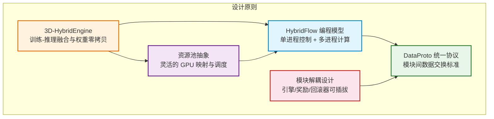
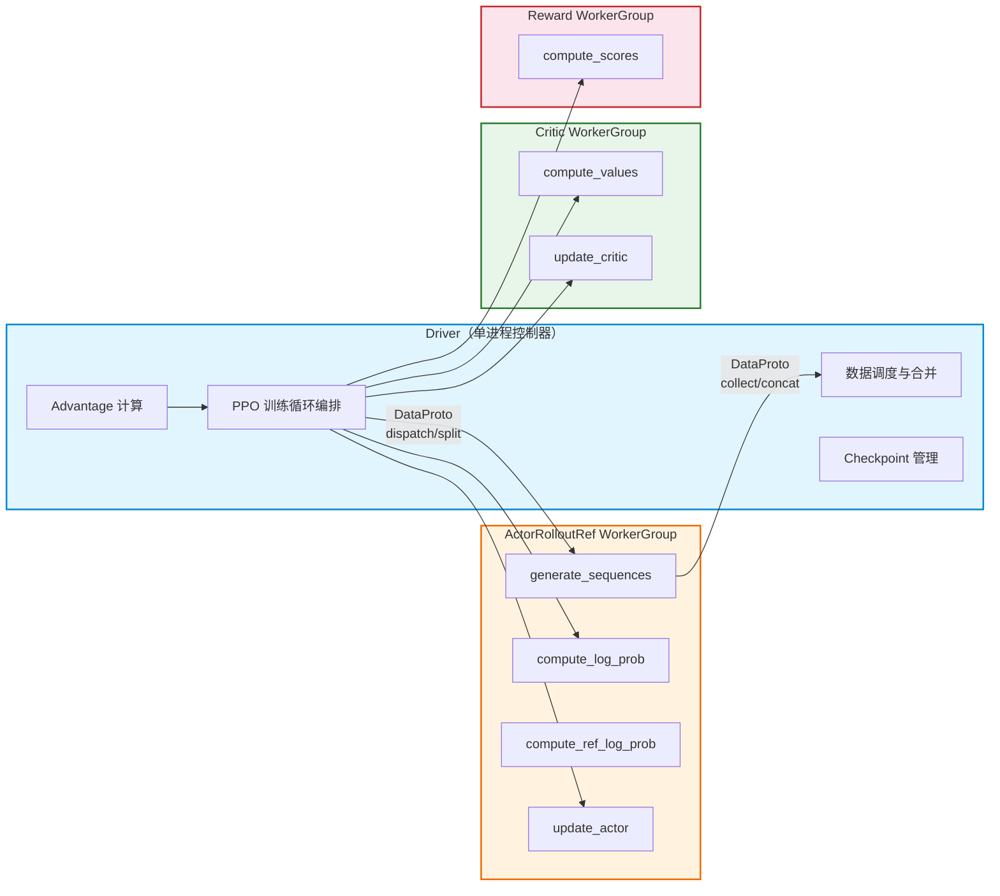
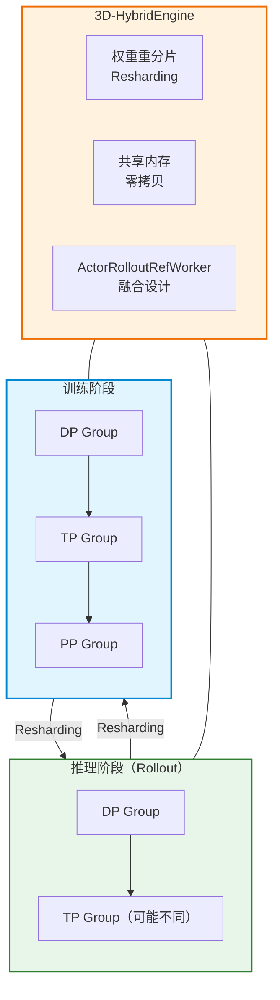
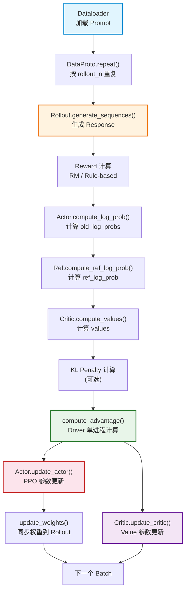
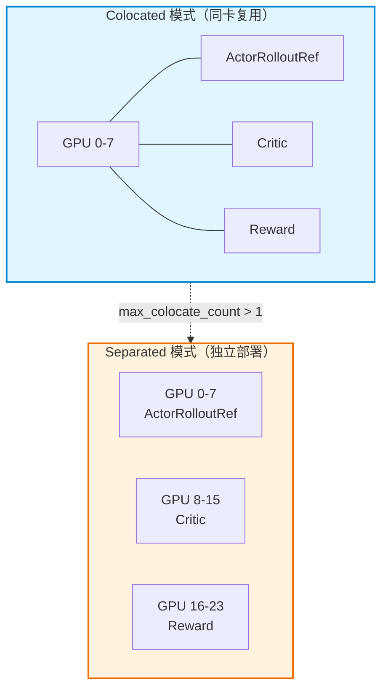

# verl 设计理念与核心原理

## 【总】开篇概述

### 核心设计理念

verl 是 HybridFlow 论文的开源实现，其核心设计理念可以概括为一句话：**将 RL 训练的控制流与计算流解耦，在保持分布式计算效率的同时，提供单进程般的编程体验。**

在 LLM 时代，RLHF 训练面临一个根本性的架构矛盾：RL 算法的控制逻辑（如 PPO 的 rollout → reward → advantage → update 流程）天然适合单进程顺序执行，但 LLM 的计算流（训练、推理）必须依赖多进程分布式并行。verl 的全部设计，都围绕如何优雅地解决这一矛盾展开。

### 核心问题：verl 为什么这样设计？

传统深度 RL 框架面对 LLM 场景时，存在三种可能的架构选择：

| 架构选择 | 优势 | 劣势 |
|---------|------|------|
| 纯单进程 | 简单易调试 | LLM 计算无法放入单 GPU |
| 统一多控制器（纯分布式） | 通信最优 | 控制流与计算流耦合，难以复用和扩展 |
| **混合控制器（verl 的选择）** | 控制流简单、计算流可复用 | 额外的数据通信开销 |

verl 选择了**混合控制器**架构：控制流运行在单进程 Driver 上，计算流运行在多进程 Worker 集群上。这一选择的核心洞察是——RL 算法的创新主要发生在控制流层面（新的算法、新的训练流程），而计算流（训练引擎、推理引擎）相对稳定。将两者解耦后，更换训练后端（FSDP → Megatron）或推理后端（vLLM → SGLang）无需修改算法代码。

### 全局概览图



### 五个最重要的设计要点

1. **HybridFlow 编程模型**：Driver（单进程控制器）编排 RL 算法流程，WorkerGroup（多进程工作器）执行分布式计算，通过 `@register` 装饰器自动处理数据分发与收集
2. **3D-HybridEngine**：Actor 与 Rollout 融合在同一 Worker 中，训练和推理共享同一组 GPU，通过权重重分片（Resharding）而非权重复制实现引擎切换，消除内存冗余
3. **DataProto 统一数据协议**：基于 TensorDict 的数据容器，支持 chunk/concat/union 等操作，作为所有模块间数据交换的标准接口
4. **模块解耦与可插拔**：训练引擎（FSDP/Megatron）、推理引擎（vLLM/SGLang）、奖励模型均可独立替换，通过 Registry 模式实现动态注册
5. **ResourcePool 资源抽象**：将 GPU 集群抽象为资源池，支持 Colocated（同卡复用）和 Separated（独立部署）两种模式，通过 ResourcePoolManager 统一调度

---

## 【分】逐层展开

### 1. HybridFlow 编程模型

#### 1.1 混合控制器设计

verl 将 RL 训练抽象为**两级数据流**：

- **控制流（Control Flow）**：定义 RL 算法的高层逻辑，如 PPO 中"先 rollout，再计算 advantage，最后更新参数"的执行顺序。控制流运行在**单进程 Driver** 上
- **计算流（Computation Flow）**：定义神经网络的前向/反向/优化器步骤。计算流运行在**多进程 Worker** 上

这种分离使得编写 RL 算法如同编写单进程程序一样简单：

```python
# PPO 主循环 —— 看起来像单进程代码，实际运行在分布式环境
for prompt in dataloader:
    output = actor_rollout_ref_wg.generate_sequences(prompt)      # 多进程推理
    old_log_prob = actor_rollout_ref_wg.compute_log_prob(output)  # 多进程前向
    ref_log_prob = actor_rollout_ref_wg.compute_ref_log_prob(output)
    values = critic_wg.compute_values(output)
    rewards = reward_wg.compute_scores(output)
    advantages = compute_advantages(values, rewards)  # 单进程计算
    actor_rollout_ref_wg.update_actor(output)         # 多进程训练
    critic_wg.update_critic(output)
```

#### 1.2 Driver 与 Worker 的职责划分



**Driver 的职责**：
- 编排 RL 算法的执行顺序（控制流）
- 执行轻量级计算（如 advantage 估计、KL 惩罚计算）
- 通过 WorkerGroup 代理调用远程 Worker 方法
- 管理训练状态（global_steps、checkpoint）

**Worker 的职责**：
- 执行重量级神经网络计算（训练、推理）
- 管理模型权重、优化器状态
- 处理分布式通信（TP/PP/DP）

#### 1.3 为什么选择混合控制器架构

**vs 纯分布式（统一多控制器）**：纯分布式将控制流也实现为多进程程序，所有进程执行相同代码、通过 rank 区分行为。这种方式在固定流程下通信开销最小，但存在两个致命问题：

1. **难以复用**：控制流与计算流耦合，切换训练后端（FSDP → Megatron）需要重写整个训练循环
2. **难以调试**：多进程环境下无法方便地检查中间张量

**vs 纯单进程**：LLM 的计算规模决定了必须使用分布式计算，纯单进程不可行。

**混合控制器的权衡**：Driver 与 Worker 之间的数据传输会引入额外通信开销。verl 通过以下方式缓解：
- 使用 Ray 的共享内存和零拷贝序列化减少数据传输成本
- 将 Actor 与 Rollout 融合在同一 Worker 中，避免训练-推理切换时的权重传输
- 支持异步 Rollout 模式，重叠计算与通信

#### 1.4 @register 装饰器：语法糖的核心

`@register` 装饰器是连接 Driver 与 Worker 的桥梁。它将三步操作封装为一次方法调用：

1. **Dispatch**：将输入数据按策略拆分（如按 DP 维度切分 DataProto）
2. **Execute**：将拆分后的数据分发给各 Worker 执行远程调用
3. **Collect**：收集各 Worker 的输出并合并（如 concat DataProto）

```python
# Worker 端定义
class ActorRolloutRefWorker(Worker):
    @register(dispatch_mode=Dispatch.DP_COMPUTE_PROTO)
    def compute_log_prob(self, data: TensorDict) -> TensorDict:
        output = self.actor.infer_batch(data)
        return output.cpu()

# Driver 端调用 —— 如同本地方法
output = actor_rollout_ref_wg.compute_log_prob(batch)
```

Dispatch 模式决定了数据如何分发：

| Dispatch 模式 | Dispatch 行为 | Collect 行为 | 典型场景 |
|--------------|-------------|------------|---------|
| `ONE_TO_ALL` | 复制输入到所有 Worker | 收集所有输出为列表 | `init_model`, `save_checkpoint` |
| `DP_COMPUTE_PROTO` | 按 DP 维度切分 DataProto | Concat 所有 Worker 的 DataProto | `compute_log_prob`, `update_actor` |
| `ALL_TO_ALL` | 原样传递 | 原样返回 | 自定义场景 |
| `make_nd_compute_dataproto_dispatch_fn` | 按 N 维并行拓扑切分 | 按 N 维并行拓扑合并 | Megatron 3D 并行 |

---

### 2. 3D-HybridEngine

#### 2.1 3D 并行与 Hybrid Engine 的关系

LLM 训练通常采用 3D 并行策略：数据并行（DP）、张量并行（TP）、流水线并行（PP）。在 RLHF 场景中，训练阶段和推理阶段对并行度的需求不同——训练可能需要较大的 TP/PP 来容纳模型，而推理可能需要不同的 TP 配置以优化吞吐。



#### 2.2 训练-推理切换时的权重重分片（Resharding）

传统方案中，训练引擎和推理引擎各自维护一份模型权重，切换时需要将权重从训练引擎序列化后加载到推理引擎。这带来两个问题：

1. **内存冗余**：同一模型在 GPU 上存在两份权重副本
2. **通信开销**：权重在引擎间传输耗时显著

3D-HybridEngine 的核心创新是**权重重分片**：训练和推理共享同一份权重内存，切换时仅重新划分并行维度，而非复制权重。

具体流程：
1. 训练阶段：模型按训练的 DP/TP/PP 配置分布在不同 GPU 上
2. 切换到推理：将权重按推理的 TP/PP 配置重新分片（Resharding），通过 NCCL 通信重排权重
3. 推理完成：将权重按训练配置重新分片回来

这一过程通过 `update_weights` 方法实现。在 Colocated 模式下，Actor 和 Rollout 共享同一组 GPU，权重同步通过进程内通信完成（naive 模式），避免了跨进程序列化开销。

#### 2.3 ActorRolloutRefWorker 的融合设计

`ActorRolloutRefWorker` 是 HybridEngine 的核心载体，它将 Actor、Rollout 和 Reference Policy 三种角色融合在同一个 Worker 中：

```python
class ActorRolloutRefWorker(Worker, DistProfilerExtension):
    def __init__(self, config, role, ...):
        self.role = role  # "actor", "rollout", "ref", "actor_rollout", "actor_rollout_ref"
        self._is_actor = role in ["actor", "actor_rollout", "actor_rollout_ref"]
        self._is_rollout = role in ["rollout", "actor_rollout", "actor_rollout_ref"]
        self._is_ref = role in ["ref", "actor_rollout_ref"]
```

融合设计带来三重好处：

1. **Actor + Rollout 融合**：权重在同一进程内，通过 `update_weights` 直接同步，无需跨进程通信。Rollout 使用 `sleep`/`resume` 机制管理 GPU 内存——训练时 Rollout 释放权重内存，推理时重新加载
2. **Actor + Ref 融合**：在 LoRA 场景下，Reference Policy 就是 Actor 的 base model，无需额外加载模型，只需在推理时禁用 LoRA adapter（`no_lora_adapter=True`）
3. **灵活组合**：通过 `role` 参数控制实例化哪些子模块，支持从纯 Actor 到三合一的多种配置

---

### 3. 数据流设计

#### 3.1 完整的 PPO 训练数据流



数据流中的关键操作：

1. **Prompt 加载**：从 DataLoader 读取 prompt batch，包装为 `DataProto`
2. **Rollout 重复**：`DataProto.repeat(rollout_n)` 将每个 prompt 重复 n 次（n 为每个 prompt 的采样数）
3. **生成序列**：Rollout 引擎（vLLM/SGLang）异步生成 response
4. **奖励计算**：支持 RM 打分和规则奖励，可组合使用
5. **Log Prob 计算**：Actor 重新计算 old_log_probs（而非直接使用 rollout 的 log_probs，以避免重要性采样偏差）
6. **Advantage 计算**：在 Driver 单进程上执行，支持 GAE、GRPO、REINFORCE++ 等多种估计器
7. **参数更新**：Actor 和 Critic 分别进行 PPO 更新
8. **权重同步**：更新后的权重通过 checkpoint engine 或直接内存拷贝同步到 Rollout

#### 3.2 同步 vs 异步训练模式

verl 支持两种训练模式：

**同步模式（Sync）**：
- Rollout 生成 → 等待完成 → Reward 计算 → 训练更新 → 权重同步 → 下一轮
- 简单可靠，但 GPU 利用率有间隙

**异步模式（Async）**：
- 使用 `AgentLoopManager` 管理 Rollout，支持流式生成和奖励计算
- Rollout 与训练可重叠执行
- 通过 `LLMServerManager` 管理 vLLM/SGLang 服务实例的生命周期（sleep/wake）
- 权重通过 `CheckpointEngine`（如 NFS、Redis）异步传输

当前版本中，异步模式是默认且推荐的模式（`self.async_rollout_mode = True`）。

#### 3.3 On-Policy vs Off-Policy 数据流差异

**On-Policy（标准 PPO）**：
- Rollout 使用的策略与训练更新的策略相同
- `old_log_probs` 直接由当前 Actor 重新计算
- 数据严格来自当前策略

**Off-Policy（带 Rollout Correction）**：
- Rollout 使用 `π_rollout`，训练更新 `π_θ`，两者可能不同
- 引入重要性采样（IS）权重进行修正
- 支持 bypass 模式（`old_log_probs = rollout_log_probs`）和解耦模式（重新计算 `π_old` 作为稳定锚点）
- 通过 `rollout_corr_config` 配置

---

### 4. 模块解耦设计

#### 4.1 训练引擎与推理引擎的解耦

verl 将训练和推理抽象为独立的引擎，通过 `BaseEngine` 和 `BaseRollout` 接口解耦：

**训练引擎（BaseEngine）**：
```python
class BaseEngine:
    def initialize(self): ...           # 初始化模型和优化器
    def train_mode(self): ...           # 切换到训练模式
    def eval_mode(self): ...            # 切换到推理模式
    def forward_backward_batch(self): ...  # 前向+反向
    def train_batch(self): ...          # 完整训练步
    def infer_batch(self): ...          # 推理
```

**推理引擎（BaseRollout）**：
```python
class BaseRollout:
    def generate_sequences(self): ...   # 生成序列
    def update_weights(self): ...       # 更新权重
    def resume(self): ...              # 恢复 GPU 内存
    def release(self): ...             # 释放 GPU 内存
```

两者通过 `TrainingWorker` 和 `ActorRolloutRefWorker` 组合使用，而非继承。这意味着：
- 切换训练后端（FSDP → Megatron → veOmni）只需更换 Engine 实现
- 切换推理后端（vLLM → SGLang → TRT-LLM）只需更换 Rollout 实现
- 两者可以独立演进和测试

#### 4.2 DataProto 作为统一接口

`DataProto` 是 verl 中所有模块间数据交换的标准协议，其核心结构：

```python
@dataclass
class DataProto:
    batch: TensorDict          # 张量数据（如 input_ids, attention_mask, log_probs）
    non_tensor_batch: dict     # 非张量数据（如 uid, multi_modal_inputs）
    meta_info: dict            # 元信息（如 temperature, global_steps）
```

DataProto 提供的关键操作：

| 操作 | 说明 | 使用场景 |
|------|------|---------|
| `chunk(chunks)` | 按维度 0 切分为 N 份 | DP 分发时切分数据 |
| `concat(list)` | 合并多个 DataProto | DP 收集时合并结果 |
| `union(other)` | 合并两个 DataProto 的不同字段 | 将 log_probs 合并到主 batch |
| `repeat(n)` | 重复数据 n 次 | Rollout 重复采样 |
| `select_idxs(ids)` | 按索引选择子集 | 数据过滤 |
| `slice(start, stop)` | 切片 | REMAX 分离采样/基线 |

DataProto 的设计使得数据在 Driver 和 Worker 之间流转时，无需关心底层的数据分发和收集逻辑——`@register` 装饰器自动调用 `chunk`/`concat` 完成数据拆分与合并。

#### 4.3 插件化的奖励模型与回滚器

**奖励模型**：
- 支持模型奖励（RewardModel Worker）和规则奖励（函数式）
- 可组合使用：`RewardManager` 允许根据数据源选择不同奖励函数
- 奖励模型可 Colocated 或独立部署（通过 `enable_resource_pool` 配置）

**回滚器（Rollout）**：
- 通过 `_ROLLOUT_REGISTRY` 注册表管理
- 支持 vLLM、SGLang、TRT-LLM 等后端
- 通过 `get_rollout_class(name, mode)` 工厂方法动态选择

---

### 5. 资源管理设计

#### 5.1 ResourcePool 抽象

`ResourcePool` 将 GPU 集群抽象为资源池，屏蔽底层 Ray Placement Group 的复杂性：

```python
class ResourcePool:
    def __init__(self, process_on_nodes=None, max_colocate_count=10, n_gpus_per_node=8):
        self._store = process_on_nodes  # 如 [8, 8] 表示两个节点各 8 个进程
```

核心属性：
- `process_on_nodes`：每个节点的进程数列表，如 `[8, 8]` 表示 2 节点 × 8 GPU
- `max_colocate_count`：同一资源池上可共存的最大 WorkerGroup 数
- `world_size`：总进程数（所有节点进程数之和）

#### 5.2 Colocated vs Separated 部署模式



**Colocated 模式**：
- Actor、Critic、Reward 共享同一组 GPU
- 通过 `create_colocated_worker_cls` 创建融合 Worker（`WorkerDict` 或 `FusedWorker`）
- 优点：节省 GPU 资源，权重同步通过进程内通信完成
- 缺点：需要精细的内存管理（Rollout sleep/wake 机制）
- `max_colocate_count` 控制同一资源池上的 WorkerGroup 数量

**Separated 模式**：
- 不同角色使用不同的 ResourcePool
- 每个角色独占一组 GPU
- 优点：内存隔离，无需复杂的内存管理
- 缺点：需要更多 GPU

`create_colocated_worker_cls` 的实现原理：创建一个 `WorkerDict` 类，将多个 Worker 类的方法 monkey-patch 到同一个 Ray Actor 上，使得一个 Ray Actor 同时暴露所有角色的方法。

#### 5.3 ResourcePoolManager 的调度逻辑

`ResourcePoolManager` 管理多个 ResourcePool，并将角色（Role）映射到对应的资源池：

```python
@dataclass
class ResourcePoolManager:
    resource_pool_spec: dict[str, list[int]]  # 资源池规格，如 {"pool1": [8], "pool2": [8]}
    mapping: dict[int, str]                    # 角色到资源池的映射
    max_colocate_count: int = 3
    resource_pool_dict: dict[str, RayResourcePool] = field(default_factory=dict)
```

调度流程：
1. `create_resource_pool()`：根据 `resource_pool_spec` 创建 RayResourcePool，每个 pool 对应一组 Placement Group
2. `get_resource_pool(role)`：根据 `mapping` 查找角色对应的资源池
3. WorkerGroup 初始化时绑定到对应的 ResourcePool，Ray 自动将 Worker 调度到指定 GPU

---

### 6. 扩展性设计

#### 6.1 注册表模式（Registry Pattern）

verl 大量使用注册表模式实现可扩展性：

**EngineRegistry**：训练引擎注册表
```python
class EngineRegistry:
    _engines = {}  # {model_type: {backend: {device: EngineClass}}}

    @classmethod
    def register(cls, model_type, backend, device="cuda", vendor=None):
        """装饰器：注册引擎类"""
        def decorator(engine_class):
            cls._engines[model_type][backend][key] = engine_class
            return engine_class
        return decorator

    @classmethod
    def new(cls, model_type, backend, ...):
        """工厂方法：创建引擎实例"""
        engine_cls = cls.get_engine_cls(model_type, backend)
        return engine_cls(...)
```

**Rollout Registry**：推理引擎注册表
```python
_ROLLOUT_REGISTRY = {
    ("vllm", "async"): "verl.workers.rollout.vllm_rollout.ServerAdapter",
    ("sglang", "async"): "verl.workers.rollout.sglang_rollout.sglang_rollout.ServerAdapter",
    ("trtllm", "async"): "verl.workers.rollout.trtllm_rollout.trtllm_rollout.ServerAdapter",
}
```

**CheckpointEngineRegistry**：检查点引擎注册表，支持 NFS、Redis 等多种后端。

注册表模式的优势：
- 新增引擎只需实现接口 + 添加注册装饰器，无需修改框架代码
- 运行时通过配置字符串动态选择实现
- 支持多维度索引（model_type × backend × device × vendor）

#### 6.2 工厂模式（Factory Pattern）

verl 使用工厂方法创建各种组件：

- `EngineRegistry.new()` → 创建训练引擎
- `get_rollout_class()` → 创建推理引擎
- `CheckpointEngineRegistry.new()` → 创建检查点引擎
- `create_colocated_worker_cls()` → 创建融合 Worker

工厂方法与注册表配合使用：注册表存储类引用，工厂方法根据参数查找并实例化。

#### 6.3 装饰器驱动的 dispatch/collect

`@register` 装饰器是 verl 最具特色的扩展机制。它通过元编程将 Worker 方法绑定到 WorkerGroup，自动生成包含 dispatch → execute → collect 三步的方法：

```python
def func_generator(self, method_name, dispatch_fn, collect_fn, execute_fn, blocking):
    class Functor:
        def __call__(this, *args, **kwargs):
            args, kwargs = dispatch_fn(self, *args, **kwargs)  # 1. 分发
            output = execute_fn(method_name, *args, **kwargs)  # 2. 执行
            if blocking:
                output = ray.get(output)                        # 3. 等待
            output = collect_fn(self, output)                   # 4. 收集
            return output
    return type(method_name, (Functor,), {})()
```

这种设计使得添加新的 Worker 方法只需：
1. 在 Worker 类中定义方法并添加 `@register` 装饰器
2. WorkerGroup 初始化时自动绑定，Driver 端即可调用

新增 Dispatch 模式也只需：
1. 实现 `dispatch_fn` 和 `collect_fn`
2. 注册到 `DISPATCH_MODE_FN_REGISTRY`

---

## 【总】总结升华

### 核心设计要点回顾

verl 的设计围绕一个核心矛盾展开：**RL 控制流的单进程需求 vs LLM 计算流的多进程需求**。其解决方案可以归纳为五个层次：

1. **编程模型层**：HybridFlow 将控制流和计算流分离，Driver 编排算法，Worker 执行计算，`@register` 装饰器弥合两者
2. **引擎层**：3D-HybridEngine 融合训练与推理，通过权重重分片消除内存冗余
3. **数据层**：DataProto 统一数据协议，chunk/concat/union 操作支撑自动数据分发与收集
4. **模块层**：注册表 + 工厂模式实现引擎、奖励、回滚器的可插拔替换
5. **资源层**：ResourcePool 抽象 GPU 集群，支持灵活的 Colocated/Separated 部署

### 设计亮点与权衡分析

| 设计亮点 | 带来的优势 | 付出的代价 |
|---------|----------|----------|
| 单进程 Driver | 算法开发如同写单进程代码 | Driver 与 Worker 间数据传输开销 |
| @register 装饰器 | 极简的分布式编程体验 | 元编程增加调试难度，调用栈不直观 |
| ActorRolloutRef 融合 | 权重零拷贝同步，内存高效 | Worker 类职责增多，代码复杂度上升 |
| DataProto 统一协议 | 模块间松耦合，数据流清晰 | 额外的序列化/反序列化开销 |
| 注册表模式 | 新引擎即插即用 | 注册表查找增加间接层，类型安全减弱 |
| Colocated 部署 | 节省 GPU 资源 | 需要精细的内存管理（sleep/wake） |

**关键权衡**：verl 选择以**少量通信开销**换取**编程灵活性和代码复用性**。在 RLHF 场景中，训练和推理的计算时间远大于 Driver-Worker 间的数据传输时间，因此这一权衡是合理的。

### 与其他框架的设计对比

| 维度 | verl | OpenRLHF | TRL |
|------|------|----------|-----|
| 编程模型 | 混合控制器（单 Driver + 多 Worker） | 多控制器（DDP 风格） | 单进程 |
| 训练-推理切换 | HybridEngine 权重重分片 | 独立引擎 + 权重复制 | 同一模型切换模式 |
| 数据协议 | DataProto（TensorDict） | 自定义数据结构 | 标准 PyTorch |
| 分布式后端 | Ray | Ray / DeepSpeed | 单 GPU / Accelerate |
| 引擎扩展 | Registry + Factory | 硬编码 | 不支持 |
| 资源管理 | ResourcePool 抽象 | 手动配置 | 不涉及 |

verl 的核心差异化在于：**通过 HybridFlow 编程模型和 3D-HybridEngine，在保持分布式效率的同时，提供了最接近单进程编程体验的 RLHF 框架**。这使得算法研究者可以专注于 RL 算法本身，而无需关心分布式系统的复杂性。
