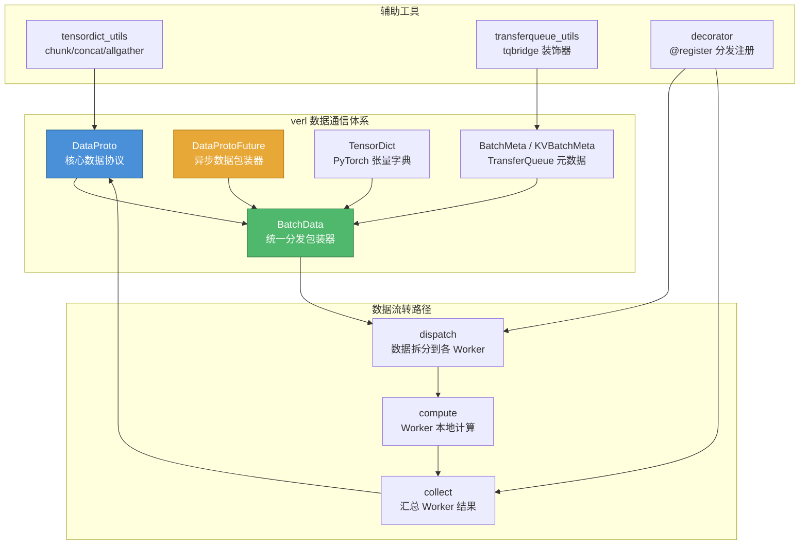
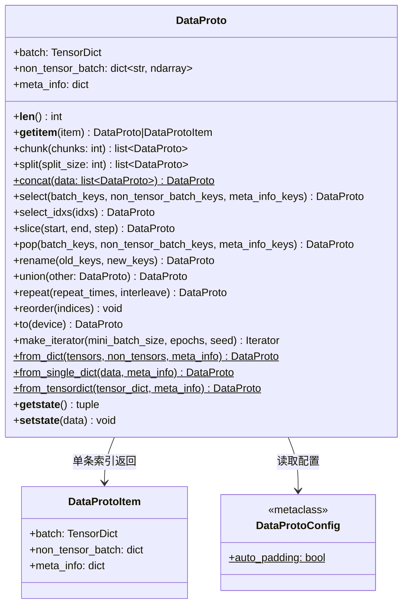
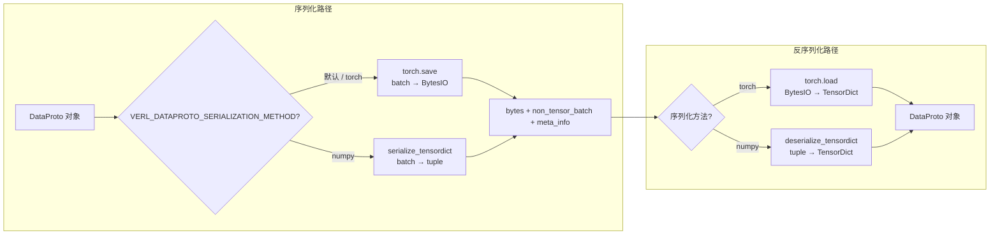
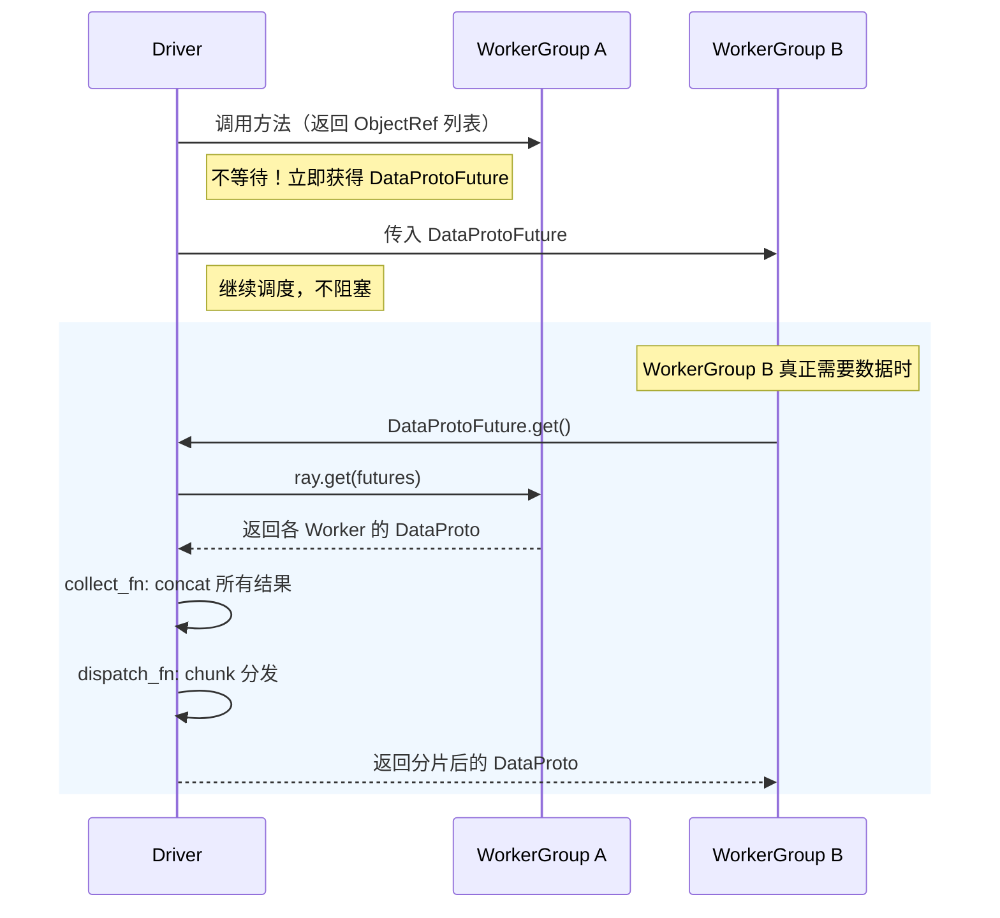
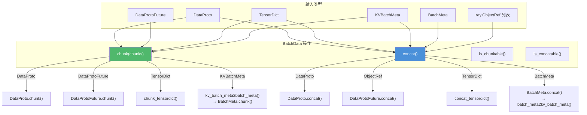
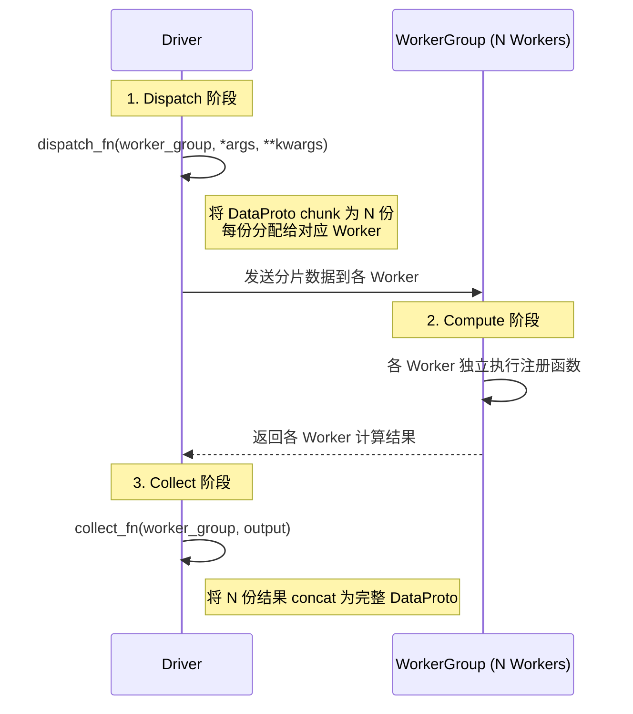

# verl 数据协议与通信机制

## 【总】开篇概述

在分布式强化学习训练中，不同模块（Actor、Critic、Reward Model、Reference Model）之间需要频繁交换大量异构数据——既有 GPU 上的张量（logits、values、log_probs），也有 CPU 上的非张量数据（token 文本、attention mask 元信息），还有全局配置信息（batch size、sequence length 等）。**如何统一这些异构数据的表示与传输，是 verl 架构设计的核心问题之一。**

verl 的答案是 **DataProto**——一个以 `dataclass` 形式定义的统一数据协议。它将"张量数据 + 非张量数据 + 元信息"三要素封装为一个不可分割的整体，使得函数间、模块间、Worker 间的数据交换有了统一的语言。围绕 DataProto，verl 还构建了异步数据包装器 `DataProtoFuture`、统一分发包装器 `BatchData`、以及完整的 dispatch-collect 数据流转机制，形成了一套层次分明、职责清晰的数据通信体系。



**关键结论预览：**

1. **三要素封装**：DataProto 将 `batch`（TensorDict）、`non_tensor_batch`（dict of ndarray）、`meta_info`（dict）封装为统一整体，消除了函数签名中零散的参数传递
2. **双模式序列化**：支持 `torch.save`（默认）和 `numpy` 序列化两种方式，通过环境变量 `VERL_DATAPROTO_SERIALIZATION_METHOD` 切换，适配不同传输场景
3. **异步解耦**：DataProtoFuture 通过延迟执行 collect_fn/dispatch_fn，使 Driver 无需等待数据就绪即可继续调度，实现真正的异步执行
4. **统一分发**：BatchData 将 DataProto / TensorDict / BatchMeta / KVBatchMeta 的 chunk/concat 操作统一抽象，上层调用者无需关心底层类型
5. **自动填充**：Auto Padding 机制确保数据量不被 Worker 数整除时仍能正确分发，避免运行时断言失败

---

## 【分】逐层展开

### 1. DataProto 数据协议

#### 1.1 设计动机

在 RLHF 训练流水线中，数据需要在多个阶段之间流转：Rollout → Reward → Ref → Critic → Update。每个阶段需要的数据既有重叠也有差异——例如 Rollout 产出 `input_ids`、`log_probs`、`values`，而 Reward 阶段只需要 `input_ids` 并产出 `reward`。如果用零散的参数传递，函数签名会极其冗长且难以维护。

DataProto 的设计灵感来自于 HTTP 协议的"Header + Body"模式：将数据分为"批量数据"和"元信息"两层，批量数据又细分为"可 GPU 加速的张量数据"和"只能 CPU 处理的非张量数据"。

#### 1.2 三要素结构



**三要素详解：**

| 要素 | 类型 | 存储位置 | 典型内容 |
|------|------|----------|----------|
| `batch` | `TensorDict` | GPU | `input_ids`, `log_probs`, `values`, `attention_mask` |
| `non_tensor_batch` | `dict[str, np.ndarray]` | CPU | `token_text`, `uid`, `reward_mask`（dtype=object） |
| `meta_info` | `dict` | CPU | `batch_size`, `eos_token_id`, `metrics`, `auto_padding` 标记 |

`check_consistency()` 方法在 `__post_init__` 中自动调用，确保：
- `batch` 只有 1 维 batch size（`len(batch.batch_size) == 1`）
- `non_tensor_batch` 中所有值都是 `np.ndarray`
- `non_tensor_batch` 中每个数组的第一维长度等于 `batch.batch_size[0]`

#### 1.3 核心方法详解

**chunk(chunks: int) → list[DataProto]**

沿 dim=0 将数据均分为 `chunks` 份。这是 dispatch 阶段的核心操作——将完整 batch 拆分到各 Worker。

实现要点：
- `batch` 部分直接调用 `TensorDict.chunk(chunks=chunks, dim=0)`
- `non_tensor_batch` 使用 `np.array_split` 按与 batch 相同的边界拆分
- `meta_info` 原样传递给每个子 DataProto（浅拷贝）
- 当 auto_padding 启用时，不要求 `len(self) % chunks == 0`

**split(split_size: int) → list[DataProto]**

按固定大小 `split_size` 拆分，内部通过 `self[i:i+split_size]` 循环实现，最终调用 `slice` 方法。

**concat(data: list[DataProto]) → DataProto**（静态方法）

将多个 DataProto 沿 dim=0 拼接。这是 collect 阶段的核心操作。

实现要点：
- `batch` 使用 `torch.cat(batch_lst, dim=0)` 拼接
- `non_tensor_batch` 先转为 dict of list，再用 `np.concatenate` 拼接
- `meta_info` 合并策略：非 metrics 键要求值一致（assert），metrics 键聚合为 list

**select(batch_keys, non_tensor_batch_keys, meta_info_keys) → DataProto**

按键名选择子集。`batch` 部分调用 `TensorDict.select(*keys)`，`non_tensor_batch` 和 `meta_info` 用字典推导过滤。支持 `deepcopy` 参数。

**rename(old_keys, new_keys) → DataProto**

重命名 `batch` 中的键，直接调用 `TensorDict.rename_key_()`（原地操作）。

**union(other: DataProto) → DataProto**

合并两个 DataProto。冲突键（同键不同值）会触发断言错误；不冲突的键直接合并。分别调用 `union_tensor_dict`、`union_numpy_dict`、`union_two_dict` 处理三个要素。

**repeat(repeat_times, interleave=True) → DataProto**

重复数据。`interleave=True` 时使用 `repeat_interleave`（交错排列），`interleave=False` 时使用 `expand + reshape`（连续排列）。同时处理 `non_tensor_batch` 的 `np.repeat` / `np.tile`。

**slice(start, end, step) → DataProto**

切片操作，返回新的 DataProto。`batch` 使用 `TensorDict[slice_obj]`，`non_tensor_batch` 使用 `ndarray[slice_obj]`。

**select_idxs(idxs) → DataProto**

按索引数组选择行。支持 `torch.Tensor`、`np.ndarray`、`list` 类型的索引，同时处理 bool mask 和整数索引。

**pop(batch_keys, non_tensor_batch_keys, meta_info_keys) → DataProto**

弹出指定键，返回包含被弹出键的新 DataProto，原 DataProto 中这些键被移除。

#### 1.4 序列化机制

DataProto 实现了自定义的 `__getstate__` / `__setstate__`，这是 Ray 远程调用中数据传输的关键。



**torch.save 模式（默认）：**
- 先对 batch 调用 `.contiguous().consolidate()`（tensordict >= 0.5.0），确保内存连续
- 使用 `torch.save(batch, buffer)` 将 TensorDict 序列化为字节流
- 反序列化时使用 `torch.load(buffer, weights_only=False)`

**numpy 模式（`VERL_DATAPROTO_SERIALIZATION_METHOD=numpy`）：**
- 将每个张量展平为 uint8 numpy 数组，记录 dtype 和 shape
- 支持嵌套张量（NestedTensor），记录 layout 信息
- 反序列化时从 uint8 缓冲区重建张量

numpy 模式的优势在于避免了 `torch.save` 对 pickle 的依赖，在某些跨进程传输场景中更稳定。

#### 1.5 自动填充（Auto Padding）机制

当 batch size 不能被 Worker 数整除时，chunk 操作会失败。Auto Padding 机制通过在数据末尾重复填充来解决这个问题。

```python
# 启用方式 1：环境变量
os.environ["VERL_AUTO_PADDING"] = "TRUE"

# 启用方式 2：全局配置
DataProtoConfig.auto_padding = True

# 启用方式 3：创建时指定
DataProto.from_dict(tensors=..., auto_padding=True)
```

核心函数 `pad_dataproto_to_divisor(data, size_divisor)`：
- 计算 `pad_size = size_divisor - len(data) % size_divisor`
- 从原数据头部取 `pad_size` 条作为填充
- 使用 `DataProto.concat([data] + padding_protos)` 拼接

对应的 `unpad_dataproto(data, pad_size)` 通过 `data[:-pad_size]` 去除填充。

在 dispatch 阶段，`_split_args_kwargs_data_proto_with_auto_padding` 会自动检测 padding 配置并执行填充，同时将 `padding_size` 作为 kwargs 传递，以便 collect 后去除填充。

#### 1.6 与 PyTorch DataLoader 的集成

`make_iterator` 方法将 DataProto 包装为可迭代的 mini-batch 生成器：

```python
iterator = data.make_iterator(mini_batch_size=32, epochs=4, seed=42)
for mini_batch in iterator:
    # mini_batch 是 DataProto，batch_size = 32
    process(mini_batch)
```

实现原理：
- DataProto 自身作为 `DataLoader` 的 dataset（实现了 `__getitem__` 和 `__len__`）
- `collate_fn` 将多个 `DataProtoItem` 堆叠回 `DataProto`
- 使用 `torch.stack` 拼接 batch，`list_of_dict_to_dict_of_list` 处理 non_tensor_batch

#### 1.7 工厂方法

| 方法 | 用途 | 输入 |
|------|------|------|
| `from_dict` | 从分离的张量字典和非张量字典创建 | `tensors: dict[str, Tensor]`, `non_tensors: dict`, `meta_info: dict` |
| `from_single_dict` | 从混合字典自动分类创建 | `data: dict[str, Tensor \| ndarray]` |
| `from_tensordict` | 从 TensorDict 提取创建 | `tensor_dict: TensorDict`（需 tensordict >= 0.10） |

`from_single_dict` 会自动根据值类型（`torch.Tensor` → batch，`np.ndarray` → non_tensor_batch）分类。`from_tensordict` 能识别 `NonTensorStack`（→ non_tensor_batch）和 `NonTensorData`（→ meta_info）。

---

### 2. DataProtoFuture 异步数据

#### 2.1 设计动机

在分布式 RL 训练中，Driver 进程需要协调多个 WorkerGroup（Actor、Critic、Reward 等）。如果 Driver 每次调用都同步等待数据返回，会形成严重的串行瓶颈。DataProtoFuture 的核心思想是：**数据不立即获取，而是记录"如何获取"和"如何分发"，等到真正需要时才执行。**



#### 2.2 核心实现

```python
@dataclass
class DataProtoFuture:
    collect_fn: Callable       # 如何汇总多个 Worker 的结果
    futures: list[ray.ObjectRef]  # Ray 远程对象的引用列表
    dispatch_fn: Callable = None   # 如何从汇总结果中提取所需分片
```

**collect_fn**：将 `ray.get(futures)` 返回的多个 DataProto 合并为一个。默认是 `DataProto.concat`。

**dispatch_fn**：从合并后的 DataProto 中提取当前 WorkerGroup 所需的分片。在 `chunk` 方法中通过闭包生成。

**get() 方法**的执行流程：
1. `ray.get(self.futures)` 获取所有 Worker 的远程结果
2. 根据结果类型（DataProto / TensorDict）调用对应的 concat 函数
3. 如果 `dispatch_fn` 不为 None，对合并结果执行 `dispatch_fn`

#### 2.3 chunk 方法的实现

```python
def chunk(self, chunks: int) -> list["DataProtoFuture"]:
    arg_future_lst = []
    for i in range(chunks):
        def dispatch_fn(x, i, chunks):
            return x.chunk(chunks=chunks)[i]
        arg_future = DataProtoFuture(
            collect_fn=self.collect_fn,
            dispatch_fn=partial(dispatch_fn, i=i, chunks=chunks),
            futures=self.futures
        )
        arg_future_lst.append(arg_future)
    return arg_future_lst
```

关键点：使用 `functools.partial` 捕获 `i` 和 `chunks`，避免闭包变量捕获的常见陷阱。每个分片共享相同的 `futures` 和 `collect_fn`，但 `dispatch_fn` 不同——各自提取属于自己的分片。

---

### 3. BatchData 统一分发包装器

#### 3.1 设计动机

verl 的数据类型不止 DataProto 一种——还有 TensorDict（vLLM 集成）、BatchMeta / KVBatchMeta（TransferQueue 集成）、DataProtoFuture（异步场景）。如果让每个调用者都写 `isinstance` 判断，代码会到处散落类型分支逻辑。BatchData 将所有类型分支集中到一处。



#### 3.2 类型分派逻辑

**chunk 操作：**

| 输入类型 | 处理方式 |
|----------|----------|
| `TensorDict` | `chunk_tensordict(data, chunks)` + `contiguous().consolidate()` |
| `KVBatchMeta` | 先转为 `BatchMeta`（减少 PUT/GET 通信），再调用 `.chunk()` |
| `DataProto` / `DataProtoFuture` | 直接调用 `.chunk(chunks=chunks)` |

**concat 操作：**

| 输入类型 | 处理方式 |
|----------|----------|
| `ray.ObjectRef` 列表 | `DataProtoFuture.concat(data)` |
| `TensorDict` 列表 | `concat_tensordict(data)` |
| `BatchMeta` 列表 | 手动合并 `extra_info`，`BatchMeta.concat()` 后转为 `KVBatchMeta` |
| `DataProto` 列表 | `type(sample).concat(data)` |

#### 3.3 验证方法

- `is_chunkable()`：检查数据是否为 `_chunkable_types` 中的类型（DataProto, DataProtoFuture, TensorDict, KVBatchMeta, BatchMeta）
- `is_concatable()`：检查数据是否为非空列表/元组，且首元素为 `_concatable_types` 中的类型（DataProto, ray.ObjectRef, TensorDict, KVBatchMeta, BatchMeta）

---

### 4. 数据在 Worker 间的流转

#### 4.1 Dispatch-Collect 模式

verl 的分布式计算遵循 **dispatch → compute → collect** 三阶段模式：



#### 4.2 预定义的 Dispatch 模式

| 模式 | dispatch_fn | collect_fn | 说明 |
|------|-------------|------------|------|
| `ONE_TO_ALL` | `dispatch_one_to_all` | `collect_all_to_all` | 同一数据广播到所有 Worker |
| `ALL_TO_ALL` | `dispatch_all_to_all` | `collect_all_to_all` | 各 Worker 各自持有数据，原样传递 |
| `DP_COMPUTE` | `dispatch_dp_compute` | `collect_dp_compute` | 数据已按 Worker 数拆分，直接分发 |
| `DP_COMPUTE_PROTO` | `dispatch_dp_compute_data_proto` | `collect_dp_compute_data_proto` | DataProto 自动 chunk/concat，支持 auto padding |
| `DP_COMPUTE_PROTO_WITH_FUNC` | `dispatch_dp_compute_data_proto_with_func` | `collect_dp_compute_data_proto` | 同上，但首个参数是函数对象 |
| `DP_COMPUTE_METRIC` | `dispatch_dp_compute_data_proto` | `collect_dp_compute` | dispatch 同 DP_COMPUTE_PROTO，collect 不 concat |

#### 4.3 DP_COMPUTE_PROTO 详解

这是最常用的模式，完整流程如下：

**Dispatch 阶段**（`dispatch_dp_compute_data_proto`）：
1. 调用 `_split_args_kwargs_data_proto_with_auto_padding`
2. 检查 auto_padding 是否启用
3. 若启用，计算 padding_size 并调用 `DataProto.padding(padding_size)`
4. 对每个参数调用 `DataProto.chunk(chunks=world_size)`
5. 返回拆分后的 args 和 kwargs

**Collect 阶段**（`collect_dp_compute_data_proto`）：
1. 验证输出列表可 concat（`BatchData(output).is_concatable()`）
2. 调用 `BatchData(output).concat()` 合并结果
3. 若有 padding_size，在后续步骤中去除填充

#### 4.4 @register 装饰器的串联

`@register` 装饰器是数据流转的入口，它串联了多个层次：

```python
@register(dispatch_mode=Dispatch.DP_COMPUTE_PROTO, execute_mode=Execute.ALL)
def my_function(data: DataProto):
    ...
```

装饰器执行链：
1. **tqbridge**：检查参数中是否有 BatchMeta/KVBatchMeta，有则转为 TensorDict
2. **_materialize_futures**：将 DataProtoFuture 转为实际 DataProto
3. **func**：执行用户函数
4. **WorkerGroup.execute_all/execute_rank_zero**：根据 execute_mode 决定执行方式
5. **dispatch_fn / collect_fn**：根据 dispatch_mode 决定数据分发和汇总方式

---

### 5. TensorDict 工具函数

#### 5.1 chunk_tensordict / concat_tensordict

这两个函数是 DataProto chunk/concat 在 TensorDict 层面的底层实现，也是 BatchData 处理 TensorDict 类型时调用的核心。

**chunk_tensordict(td, chunks)**：
- 将非嵌套张量部分用 `TensorDict.chunk()` 拆分
- 对嵌套张量（NestedTensor / jagged layout）特殊处理：
  - 2D jagged：直接 `unbind(dim=0)` 后按 chunk_size 分组
  - 3D+ jagged：先尝试 `unbind`，失败则 fallback 到 `to_padded_tensor → chunk → 重建 NestedTensor`
  - 这是为了规避 PyTorch 的 [已知 bug #153238](https://github.com/pytorch/pytorch/issues/153238)

**concat_tensordict(data)**：
- 无嵌套张量时直接 `TensorDict.cat(data, dim=0)`
- 有嵌套张量时：先拼接非嵌套部分，再逐个 key 用 `concat_nested_tensors` 拼接嵌套张量
- 空 batch_size（纯 NonTensorData）时返回第一个元素

#### 5.2 allgather 操作

`all_gather_data_proto(data, process_group)` 实现跨进程组的 DataProto 全收集：

1. 将 DataProto 移到当前设备
2. 对 `batch` 调用 `allgather_dict_tensors`（自定义的 allgather 实现，支持字典结构）
3. 对 `non_tensor_batch` 调用 `torch.distributed.all_gather_object`（序列化 Python 对象）
4. 将各 rank 的 non_tensor_batch 按 key concatenate
5. 将 DataProto 移回原设备

这个函数用于需要跨 DP 组同步数据的场景（如 VLM 中的全局 batch 统计）。

#### 5.3 其他工具函数

| 函数 | 用途 |
|------|------|
| `get_tensordict` | 从字典创建 TensorDict，自动处理 NonTensorStack/NonTensorData |
| `index_select_tensor_dict` | 按索引选择行，支持嵌套张量和 NonTensorStack |
| `union_tensor_dict` | 合并两个 TensorDict，冲突键断言 |
| `make_iterator` | 从 TensorDict 创建 DataLoader 迭代器 |
| `pad_to_divisor / unpad` | TensorDict 级别的填充/去填充 |
| `contiguous` | 使 TensorDict 连续，保留 NonTensorData/NonTensorStack |
| `assign_non_tensor` | 向 TensorDict 写入非张量数据（自动选择 NonTensorData 或 NonTensorStack） |
| `list_of_dict_to_tensordict` | 将 list[dict] 转为 TensorDict，自动推断张量/非张量 |

---

## 【总】总结升华

### 核心设计要点回顾

1. **DataProto 三要素封装**：将张量、非张量、元信息统一为一个数据单元，使得函数签名从 `(input_ids, log_probs, attention_mask, token_text, batch_size, ...)` 简化为 `(data: DataProto)`
2. **双序列化路径**：torch.save（默认，高效）和 numpy（兼容性好），通过环境变量灵活切换
3. **DataProtoFuture 异步解耦**：collect_fn + dispatch_fn 的延迟执行模式，让 Driver 调度与数据传输解耦
4. **BatchData 统一分发**：集中了 5 种数据类型的 chunk/concat 逻辑，上层代码零类型分支
5. **Auto Padding 容错**：自动处理 batch size 不整除 Worker 数的情况，提升系统鲁棒性

### 设计亮点与权衡

**亮点：**
- **渐进式类型系统**：DataProto → DataProtoFuture → BatchData → BatchMeta，每种类型解决一个特定问题，不搞过度抽象
- **元信息透传**：chunk 时 meta_info 浅拷贝到所有分片，concat 时智能合并 metrics，既避免了深拷贝开销，又保证了信息不丢失
- **嵌套张量兼容**：chunk_tensordict 对 3D+ jagged NestedTensor 的 fallback 处理，体现了对 PyTorch 已知 bug 的防御性编程

**权衡：**
- **non_tensor_batch 的 object dtype**：使用 `np.ndarray(dtype=object)` 存储非张量数据，虽然灵活但牺牲了类型安全和序列化效率
- **meta_info 的浅拷贝**：chunk 时所有分片共享同一 meta_info dict，修改会相互影响——这是有意为之（减少拷贝开销），但需要调用者注意
- **DataProtoFuture 的限制**：不支持在 Driver 上对 Future 做任何操作（如 select、rename），只能在最终消费时 get——这是为了保持语义简洁的合理限制

### 与 PyTorch 原生数据传输的对比

| 维度 | PyTorch 原生 | verl DataProto |
|------|-------------|----------------|
| 数据表示 | 零散的 Tensor 参数 | 统一的三要素封装 |
| 非张量数据 | 无标准方案 | non_tensor_batch (ndarray) |
| 元信息传递 | 额外参数或全局变量 | meta_info dict |
| 分布式拆分 | 手动 chunk/concat | 自动 chunk/concat + padding |
| 异步支持 | ray.ObjectRef | DataProtoFuture（内置 dispatch） |
| 序列化 | pickle / torch.save | 双模式（torch.save / numpy） |
| 类型安全 | 无 | check_consistency 自动校验 |

verl 的 DataProto 体系本质上是在 PyTorch 原生数据传输之上构建了一套**面向 RLHF 场景的领域特定数据协议**，通过统一的抽象层屏蔽了分布式训练中数据拆分、传输、汇总的复杂性，让算法开发者可以像单机编程一样编写分布式 RL 训练逻辑。
