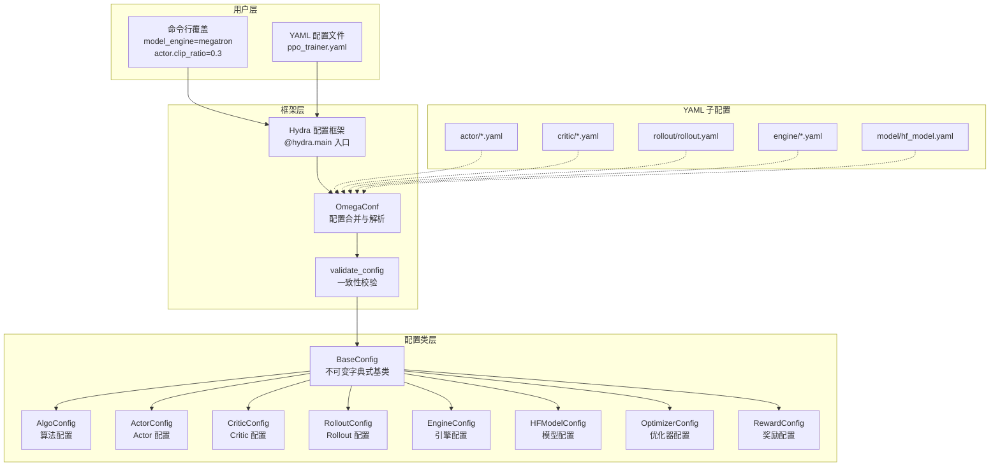
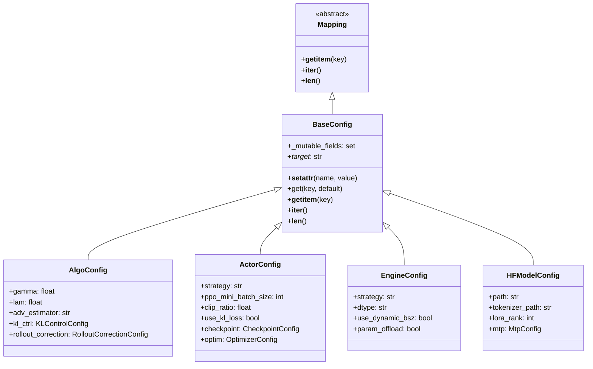
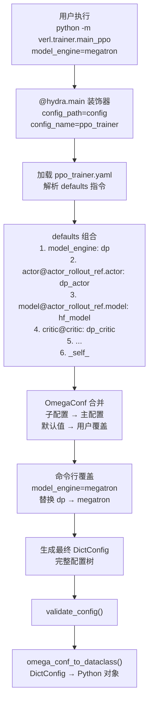

# verl 配置系统详解

## 【总】开篇概述

### 设计目标

verl 作为一个支持大规模 RLHF 训练的分布式框架，其配置系统需要应对以下核心挑战：

1. **多组件协同**：Actor、Critic、Rollout、Reward、Reference 等多个训练组件各自拥有独立配置，且相互之间存在依赖关系
2. **多后端适配**：同一训练流程需支持 FSDP、Megatron、VeOmni、TorchTitan、MindSpeed 等多种并行后端，每种后端的配置结构差异显著
3. **多算法支持**：PPO、GRPO、DAPO、SAPO 等算法的参数各有不同，需要灵活的配置切换机制
4. **不可变性与可变性平衡**：配置在初始化后应尽量不可变以保证训练稳定性，但部分字段（如动态 batch size）又需要运行时修改

### 核心问题

**verl 如何管理复杂的训练配置？** 答案是：通过 `BaseConfig` 不可变数据类 + Hydra/OmegaConf 声明式配置 + YAML 分层组合的三层架构，实现从声明到实例化的完整配置管理管线。

### 全局概览图



### 关键结论预览

1. **BaseConfig 是配置系统的基石**：通过继承 `collections.abc.Mapping` 实现字典式接口，通过 `__setattr__` 冻结检查实现不可变性，通过 `_target_` 字段桥接 Hydra 实例化
2. **Hydra + OmegaConf 实现声明式配置**：YAML 文件通过 `defaults` 指令实现配置组合，`${}` 插值实现跨配置引用，命令行覆盖实现零代码调参
3. **配置验证是多层次的**：从 `__post_init__` 的字段级校验，到 `validate()` 的运行时参数校验，再到 `validate_config()` 的全局一致性校验

---

## 【分】逐层展开

### 1. BaseConfig 基础配置类

`BaseConfig` 是 verl 所有配置类的根基，定义在 `verl/base_config.py` 中。它巧妙地将 Python dataclass 的类型安全性与字典的灵活性结合起来。

#### 类结构图



#### 继承自 collections.abc.Mapping

`BaseConfig` 继承了 `collections.abc.Mapping`，这意味着所有配置实例都可以像字典一样使用：

```python
config = AlgoConfig(gamma=0.99, lam=0.95)
config["gamma"]          # → 0.99（通过 __getitem__）
config.get("lam", 1.0)   # → 0.95（通过 get 方法）
len(config)               # → 字段数量（通过 __len__）
for key in config:        # → 遍历字段名（通过 __iter__）
```

这一设计使得 `BaseConfig` 实例可以无缝对接 OmegaConf 的 `DictConfig`，因为 OmegaConf 内部大量使用字典式接口访问配置。核心实现如下：

- `__getitem__`：委托给 `getattr(self, key)`
- `__iter__`：遍历 `fields(self)`（dataclass 的所有字段名）
- `__len__`：返回 `fields(self)` 的长度
- `get`：安全访问，不存在时返回默认值

#### 不可变字段与可变字段

`BaseConfig` 的核心设计之一是**冻结检查**机制。默认情况下，所有字段在首次赋值后即被冻结，不可修改：

```python
def __setattr__(self, name: str, value):
    if name in self.__dict__ and name not in getattr(self, "_mutable_fields", set()):
        raise FrozenInstanceError(f"Field '{name}' is frozen and cannot be modified")
    super().__setattr__(name, value)
```

逻辑解析：
1. 如果字段已存在于 `__dict__` 中（即已赋值过），且不在 `_mutable_fields` 集合中，则抛出 `FrozenInstanceError`
2. 首次赋值（字段不在 `__dict__` 中）不受限制，这是 dataclass `__init__` 正常工作的前提
3. `_mutable_fields` 是类级别属性，子类通过集合合并扩展

例如 `ActorConfig` 声明了以下可变字段：

```python
_mutable_fields = BaseConfig._mutable_fields | {
    "ppo_mini_batch_size",
    "ppo_micro_batch_size",
    "ppo_micro_batch_size_per_gpu",
    "ppo_infer_micro_batch_size_per_gpu",
    "engine",
    "model_config",
}
```

这些字段在运行时可能需要根据 GPU 数量或训练状态动态调整，因此被标记为可变。

#### _target_ 字段与 Hydra 实例化

`_target_` 字段是 Hydra 生态系统的核心约定。它指定了配置对应的 Python 类的完整路径，使得 `hydra.utils.instantiate()` 可以自动将配置字典转换为对应的 Python 对象。

在 YAML 配置中，每个需要实例化的配置块都包含 `_target_`：

```yaml
algorithm:
  _target_: verl.trainer.config.AlgoConfig
  gamma: 1.0
  kl_ctrl:
    _target_: verl.trainer.config.KLControlConfig
    type: fixed
```

`verl.utils.config.omega_conf_to_dataclass()` 函数负责将 OmegaConf 的 `DictConfig` 转换为对应的 dataclass 实例。当 `dataclass_type` 未提供时，它通过 `_target_` 字段调用 `hydra.utils.instantiate()` 完成实例化；当 `dataclass_type` 已提供时，它先创建默认的 dataclass 结构化配置，再用用户配置覆盖默认值，最终转换为 dataclass 对象。

### 2. Hydra 配置管理

verl 使用 Hydra 框架作为配置管理的入口和编排层，实现声明式配置加载、合并和覆盖。

#### 配置加载流程



#### @hydra.main 入口

verl 的 PPO 训练入口使用 `@hydra.main` 装饰器：

```python
@hydra.main(config_path="config", config_name="ppo_trainer", version_base=None)
def main(config):
    auto_set_device(config)
    config = migrate_legacy_reward_impl(config)
    run_ppo(config)
```

关键参数：
- `config_path="config"`：相对于 `main_ppo.py` 所在目录的配置目录，即 `verl/trainer/config/`
- `config_name="ppo_trainer"`：默认加载的主配置文件 `ppo_trainer.yaml`
- `version_base=None`：使用 Hydra 最新行为

#### OmegaConf 配置合并与解析

OmegaConf 提供了强大的配置合并能力。在 verl 中，配置合并遵循以下优先级（从低到高）：

1. **子配置默认值**：各子 YAML 文件中的默认值
2. **主配置覆盖**：`ppo_trainer.yaml` 中直接定义的值
3. **`_self_` 指令**：主配置自身的值覆盖所有 defaults 中的值
4. **命令行覆盖**：用户通过 `key=value` 传入的值，优先级最高

OmegaConf 的插值机制（`${}`）在 verl 中被广泛使用，实现配置间的动态引用：

```yaml
# 引用同级字段
load_contents: ${.save_contents}

# 引用其他配置块
strategy: ${actor_rollout_ref.actor.strategy}

# 条件引用（oc.select 提供默认值）
use_dynamic_bsz: ${oc.select:actor_rollout_ref.actor.use_dynamic_bsz,false}
```

### 3. YAML 配置体系

verl 的 YAML 配置采用分层组织，主配置文件通过 `defaults` 指令组合子配置。

#### ppo_trainer.yaml — 默认 PPO 配置结构

`ppo_trainer.yaml` 是整个配置体系的入口，其 `defaults` 指令定义了配置组合规则：

```yaml
defaults:
  - model_engine: dp                           # 选择模型引擎类型
  - actor@actor_rollout_ref.actor: ${model_engine}_actor   # 动态选择 actor 配置
  - data@data: legacy_data                     # 数据配置
  - ref@actor_rollout_ref.ref: ${model_engine}_ref         # 参考模型配置
  - rollout@actor_rollout_ref.rollout: rollout  # Rollout 配置
  - model@actor_rollout_ref.model: hf_model     # 模型配置
  - critic@critic: ${model_engine}_critic       # Critic 配置
  - model@critic.model: hf_model               # Critic 的模型配置
  - legacy_reward_impl                          # 奖励实现配置
  - reward@reward: reward                       # 奖励配置
  - algorithm@algorithm.rollout_correction: rollout_correction  # Rollout 修正
  - distillation@distillation: distillation     # 蒸馏配置
  - _self_                                      # 主配置覆盖所有
```

关键设计要点：

- **`@` 语法**：`actor@actor_rollout_ref.actor` 表示将 `actor/` 目录下的 YAML 加载到 `actor_rollout_ref.actor` 路径下
- **`${model_engine}` 插值**：根据 `model_engine` 的值动态选择子配置，例如 `model_engine=megatron` 时加载 `megatron_actor.yaml`
- **`_self_` 放在最后**：确保主配置文件中的值可以覆盖 defaults 中引入的值

主配置文件还定义了以下顶层配置块：

| 配置块 | 说明 |
|--------|------|
| `actor_rollout_ref` | Actor/Rollout/Reference 三合一配置 |
| `algorithm` | 算法参数（gamma、lam、KL 控制等） |
| `trainer` | 训练器参数（epochs、logger、checkpoint 等） |
| `global_profiler` | 全局性能分析配置 |
| `transfer_queue` | 异步数据传输配置 |
| `skip` | SkipManager 配置 |
| `ray_kwargs` | Ray 初始化参数 |

#### ppo_megatron_trainer.yaml — Megatron 后端配置

此文件已标记为 Deprecated，仅做向后兼容：

```yaml
defaults:
  - ppo_trainer
  - override model_engine: megatron
  - _self_
```

用户现在应直接使用 `model_engine=megatron` 命令行参数。

#### 子配置目录详解

verl 的配置目录结构如下：

```
verl/trainer/config/
├── ppo_trainer.yaml              # 主配置入口
├── ppo_megatron_trainer.yaml     # Megatron 兼容入口（已废弃）
├── actor/                        # Actor 配置
│   ├── actor.yaml                # 基础 Actor 配置
│   ├── dp_actor.yaml             # FSDP/DP 后端
│   ├── megatron_actor.yaml       # Megatron 后端
│   ├── veomni_actor.yaml         # VeOmni 后端
│   ├── torchtitan_actor.yaml     # TorchTitan 后端
│   └── mindspeed_actor.yaml      # MindSpeed 后端
├── critic/                       # Critic 配置
│   ├── critic.yaml               # 基础 Critic 配置
│   ├── dp_critic.yaml            # FSDP/DP 后端
│   ├── megatron_critic.yaml      # Megatron 后端
│   └── ...
├── engine/                       # 引擎配置
│   ├── fsdp.yaml                 # FSDP 引擎
│   ├── megatron.yaml             # Megatron 引擎
│   ├── veomni.yaml               # VeOmni 引擎
│   ├── torchtitan.yaml           # TorchTitan 引擎
│   ├── mindspeed.yaml            # MindSpeed 引擎
│   └── automodel.yaml            # Automodel 引擎
├── model/                        # 模型配置
│   └── hf_model.yaml             # HuggingFace 模型
├── model_engine/                 # 模型引擎选择
│   ├── dp.yaml                   # 默认 DP 引擎
│   ├── megatron.yaml             # Megatron 引擎
│   └── ...
├── optim/                        # 优化器配置
│   ├── fsdp.yaml
│   ├── megatron.yaml
│   └── ...
├── rollout/                      # Rollout 配置
│   └── rollout.yaml
├── reward/                       # 奖励配置
│   └── reward.yaml
├── ref/                          # Reference 模型配置
│   ├── ref.yaml
│   ├── dp_ref.yaml
│   └── ...
├── algorithm/                    # 算法子配置
│   └── rollout_correction.yaml
├── distillation/                 # 蒸馏配置
│   └── distillation.yaml
├── data/                         # 数据配置
│   └── legacy_data.yaml
└── profiler/                     # 性能分析配置
    └── profiler.yaml
```

#### 配置继承与覆盖规则

Hydra 的 `defaults` 指令遵循以下规则：

1. **列表顺序即优先级**：后出现的配置覆盖先出现的
2. **`_self_` 特殊位置**：放在列表末尾表示主配置文件自身具有最高优先级
3. **`override` 关键字**：`- override model_engine: megatron` 强制覆盖已定义的值
4. **命令行最高优先级**：`python -m verl.trainer.main_ppo actor.clip_ratio=0.3` 覆盖一切

### 4. AlgoConfig 算法配置

`AlgoConfig` 定义在 `verl/trainer/config/algorithm.py` 中，是算法参数的集中管理类。

#### 核心参数

| 参数 | 默认值 | 说明 |
|------|--------|------|
| `gamma` | 1.0 | 折扣因子 |
| `lam` | 1.0 | GAE 偏差-方差权衡系数 |
| `adv_estimator` | "gae" | 优势估计器类型：`gae`、`grpo`、`reinforce_plus_plus` 等 |
| `norm_adv_by_std_in_grpo` | True | GRPO 中是否按标准差归一化优势 |
| `use_kl_in_reward` | False | 是否在奖励中加 KL 惩罚 |
| `kl_penalty` | "kl" | KL 散度估计方式：`kl`、`abs`、`mse`、`low_var_kl`、`full` |
| `kl_ctrl` | KLControlConfig | KL 控制配置 |
| `filter_groups` | None | 过滤组配置（DAPO/Entropy 使用） |
| `rollout_correction` | None | Rollout 修正配置 |
| `gdpo_reward_keys` | None | GDPO 奖励维度键 |
| `gdpo_reward_weights` | None | GDPO 奖励权重 |

#### KL 控制配置（KLControlConfig）

KL 控制支持两种模式：

- **fixed**：固定 KL 系数，`kl_coef` 直接作为惩罚系数
- **adaptive**：自适应 KL 系数，根据 `target_kl` 和 `horizon` 动态调整

```yaml
kl_ctrl:
  _target_: verl.trainer.config.KLControlConfig
  type: fixed
  kl_coef: 0.001
  horizon: 10000
  target_kl: 0.1
```

#### Rollout 修正配置（RolloutCorrectionConfig）

`RolloutCorrectionConfig` 是 verl 配置系统中最为复杂的配置类之一，用于处理 off-policy 问题。它提供了丰富的工厂方法预设：

| 预设方法 | 模式 | 说明 |
|----------|------|------|
| `decoupled_token_is()` | 解耦 | Token 级截断重要性采样 |
| `decoupled_seq_is()` | 解耦 | 序列级截断重要性采样 |
| `decoupled_geo_rs()` | 解耦 | 几何均值拒绝采样 |
| `decoupled_k3_rs()` | 解耦 | K3 KL 估计器拒绝采样 |
| `bypass_ppo_clip()` | 旁路 | PPO 裁剪目标 |
| `bypass_pg_is()` | 旁路 | REINFORCE + IS 修正 |

两种操作模式：
- **Decoupled 模式**（三策略：π_rollout, π_old, π_θ）：IS 权重修正 π_old 与 π_rollout 之间的差距
- **Bypass 模式**（两策略：π_rollout = π_old, π_θ）：跳过 old_log_prob 计算，加速执行

### 5. Worker 配置类

verl 的 Worker 配置类构成了一个层次分明的继承体系，每种并行后端都有对应的配置子类。

#### 配置类继承图

```mermaid
classDiagram
    class BaseConfig {
        +_mutable_fields: set
        +_target_: str
    }

    class ActorConfig {
        +strategy: str
        +ppo_mini_batch_size: int
        +clip_ratio: float
        +use_kl_loss: bool
        +checkpoint: CheckpointConfig
        +optim: OptimizerConfig
        +validate(n_gpus, train_batch_size)
    }

    class FSDPActorConfig {
        +grad_clip: float
        +fsdp_config: FSDPEngineConfig
    }

    class McoreActorConfig {
        +megatron: McoreEngineConfig
        +use_rollout_log_probs: bool
    }

    class VeOmniActorConfig {
        +veomni: VeOmniEngineConfig
    }

    class TorchTitanActorConfig {
        +torchtitan: TorchtitanEngineConfig
    }

    class MindSpeedActorConfig {
        +mindspeed: MindSpeedEngineConfig
    }

    class EngineConfig {
        +strategy: str
        +dtype: str
        +use_dynamic_bsz: bool
        +param_offload: bool
    }

    class FSDPEngineConfig {
        +wrap_policy: dict
        +reshard_after_forward: bool
        +ulysses_sequence_parallel_size: int
    }

    class McoreEngineConfig {
        +tensor_model_parallel_size: int
        +pipeline_model_parallel_size: int
        +sequence_parallel: bool
    }

    class HFModelConfig {
        +path: str
        +lora_rank: int
        +mtp: MtpConfig
        +__post_init__()
    }

    class OptimizerConfig {
        +lr: float
        +weight_decay: float
        +clip_grad: float
    }

    class RolloutConfig {
        +name: str
        +temperature: float
        +tensor_model_parallel_size: int
        +multi_turn: MultiTurnConfig
    }

    BaseConfig <|-- ActorConfig
    ActorConfig <|-- FSDPActorConfig
    ActorConfig <|-- McoreActorConfig
    ActorConfig <|-- VeOmniActorConfig
    ActorConfig <|-- TorchTitanActorConfig
    ActorConfig <|-- MindSpeedActorConfig

    BaseConfig <|-- EngineConfig
    EngineConfig <|-- FSDPEngineConfig
    EngineConfig <|-- McoreEngineConfig

    BaseConfig <|-- HFModelConfig
    BaseConfig <|-- OptimizerConfig
    BaseConfig <|-- RolloutConfig
```



#### ActorConfig 体系

`ActorConfig` 是所有 Actor 配置的基类，定义在 `verl/workers/config/actor.py` 中。其核心字段包括：

- **训练策略**：`strategy`（必须指定，使用 `MISSING` 标记）
- **Batch 配置**：`ppo_mini_batch_size`、`ppo_micro_batch_size_per_gpu`、`use_dynamic_bsz`
- **PPO 参数**：`clip_ratio`、`clip_ratio_low`/`clip_ratio_high`（非对称裁剪）、`ppo_epochs`
- **KL 控制**：`use_kl_loss`、`kl_loss_coef`、`kl_loss_type`
- **损失聚合**：`loss_agg_mode`（`token-mean`、`seq-mean-token-sum` 等）
- **子配置**：`checkpoint`、`optim`、`policy_loss`、`router_replay`

每个后端子类在 `__post_init__` 中将对应的引擎配置赋值给 `self.engine`：

```python
class FSDPActorConfig(ActorConfig):
    strategy: str = "fsdp"
    fsdp_config: FSDPEngineConfig = field(default_factory=FSDPEngineConfig)

    def __post_init__(self):
        super().__post_init__()
        self.engine = self.fsdp_config  # 将引擎配置挂载到统一接口
```

`ActorConfig` 还包含 `validate()` 方法，在运行时校验 batch size 与 GPU 数量的兼容性。

#### CriticConfig 体系

`CriticConfig` 与 `ActorConfig` 结构类似，但增加了 Critic 特有的字段：

- `cliprange_value`：值函数裁剪范围（默认 0.5）
- `forward_max_token_len_per_gpu`：前向传播的最大 token 长度
- `enable`：是否启用 Critic（默认由 `adv_estimator` 决定）

Critic 同样按后端分为 `FSDPCriticConfig`、`McoreCriticConfig` 等子类。

#### EngineConfig 体系

`EngineConfig` 是所有并行引擎配置的基类，定义在 `verl/workers/config/engine.py` 中：

| 引擎配置 | 策略名 | 核心特性 |
|----------|--------|----------|
| `FSDPEngineConfig` | fsdp/fsdp2 | wrap_policy、reshard_after_forward、ulysses SP |
| `McoreEngineConfig` | megatron | TP/PP/CP/EP 并行、分布式优化器、mbridge |
| `VeOmniEngineConfig` | veomni | 注意力/MoE 实现选择、内核后端选择器 |
| `TorchtitanEngineConfig` | torchtitan | DP/TP/PP/CP 并行、flex 注意力 |
| `AutomodelEngineConfig` | automodel | FSDP2/MegatronFSDP/DDP、TP/CP/EP |
| `MindSpeedEngineConfig` | mindspeed | 继承 McoreEngineConfig，增加 mcore_kwargs/fsdp_kwargs |

`EngineConfig` 基类定义了所有引擎共享的字段：`param_offload`、`optimizer_offload`、`grad_offload`、`forward_only`、`dtype`、`use_dynamic_bsz` 等。

#### ModelConfig（HFModelConfig）

`HFModelConfig` 是模型配置的核心类，定义在 `verl/workers/config/model.py` 中。它的 `__post_init__` 方法执行了大量初始化工作：

1. 路径本地化：通过 `copy_to_local()` 将远程路径复制到本地（支持共享内存）
2. Tokenizer 初始化：加载 HuggingFace tokenizer 和 processor
3. 模型配置加载：通过 `AutoConfig.from_pretrained()` 加载模型配置
4. 配置覆盖：将 tokenizer 特殊 token ID 和用户自定义配置合并到模型配置中
5. MTP 处理：当 MTP 禁用时，将 MTP 层数清零

`HFModelConfig` 的 `_mutable_fields` 包含了运行时需要动态设置的字段：`model_type`、`hf_config`、`tokenizer`、`local_path` 等。

#### OptimizerConfig 体系

`OptimizerConfig` 基类定义了学习率、权重衰减、梯度裁剪等通用参数。各后端子类增加了特定参数：

- `FSDPOptimizerConfig`：`optimizer`（类名）、`optimizer_impl`（模块路径）、`lr_scheduler_type`
- `McoreOptimizerConfig`：`lr_decay_style`、`min_lr`、`weight_decay_incr_style`
- `VeOmniOptimizerConfig`：`lr_min`、`lr_start`、`lr_decay_ratio`
- `AutomodelOptimizerConfig`：`init_lr_ratio`、`min_lr_ratio`、`wd_incr_style`

`build_optimizer()` 函数支持动态导入优化器类，可以灵活切换 PyTorch 原生、TorchAO、BitsAndBytes 等优化器实现。

#### MtpConfig

`MtpConfig`（Multi-Token Prediction）配置支持推测解码，包含训练和推理两套参数：

- 训练参数：`enable_train`、`detach_encoder`、`mtp_loss_scaling_factor`
- vLLM 推理参数：`method`、`num_speculative_tokens`
- SGLang 推理参数：`speculative_algorithm`、`speculative_num_steps`、`speculative_eagle_topk`

#### DistillationConfig

`DistillationConfig` 支持多教师蒸馏，包含：

- `DistillationLossConfig`：损失模式（k1/k3/forward_kl_topk）、topk、任务奖励混合
- `DistillationTeacherModelConfig`：教师模型路径、推理配置、副本数
- 支持多教师路由：通过 `teacher_key` 将样本路由到不同教师模型

### 6. 配置验证

verl 的配置验证分为三个层次，从字段级到全局级逐层递进。

#### 字段级验证（__post_init__）

每个配置类的 `__post_init__` 方法执行字段级校验：

- `ActorConfig.__post_init__`：校验 `strategy` 不为 MISSING、`ppo_micro_batch_size` 与 `ppo_micro_batch_size_per_gpu` 互斥、`loss_agg_mode` 合法
- `McoreEngineConfig.__post_init__`：校验 `strategy == "megatron"`、`dtype` 合法、TP=1 时自动关闭 sequence parallel
- `HFModelConfig.__post_init__`：加载 tokenizer 和模型配置、校验架构唯一性

#### 运行时验证（validate 方法）

`ActorConfig.validate()` 和 `CriticConfig.validate()` 在运行时校验配置与实际环境的兼容性：

```python
def validate(self, n_gpus: int, train_batch_size: int, model_config: dict = None):
    # 校验 train_batch_size >= ppo_mini_batch_size
    # 校验 ppo_mini_batch_size % ppo_micro_batch_size == 0
    # 校验 ppo_micro_batch_size * sp_size >= n_gpus
```

#### 全局验证（validate_config）

`validate_config()` 函数定义在 `verl/utils/config.py` 中，执行全局一致性校验：

1. **GPU 与并行度校验**：验证总 GPU 数能被模型并行度整除
2. **Batch size 校验**：验证 `real_train_batch_size` 能被最小 batch size 整除
3. **互斥参数校验**：检查 `micro_batch_size` 与 `micro_batch_size_per_gpu` 不同时设置
4. **KL 双重启用警告**：同时启用 `use_kl_in_reward` 和 `use_kl_loss` 时打印提示
5. **Critic 校验**：当使用 Critic 时，调用 `critic_config.validate()`
6. **验证配置校验**：检查 `do_sample=True` 时 `temperature > 0`
7. **LoRA 校验**：检查 vLLM 的 LoRA rank 是否在支持范围内

验证通过后打印：`[validate_config] All configuration checks passed successfully!`

---

## 【总】总结升华

### 核心设计要点回顾

1. **BaseConfig 双面接口**：通过继承 `collections.abc.Mapping`，`BaseConfig` 同时具备 dataclass 的类型安全性和字典的灵活性，使得配置对象可以无缝对接 OmegaConf 生态

2. **冻结-可变分离**：`_mutable_fields` 机制在保证配置不可变性的同时，为运行时动态调整预留了受控出口。子类通过集合合并 `|` 运算符扩展可变字段，体现了开放-封闭原则

3. **Hydra 声明式组合**：`defaults` 指令 + `${}` 插值 + 命令行覆盖的三层机制，实现了从默认配置到用户定制的渐进式覆盖，无需修改任何代码即可切换后端和调整参数

4. **_target_ 桥接实例化**：YAML 中的 `_target_` 字段与 `omega_conf_to_dataclass()` 函数配合，实现了从声明式配置到命令式 Python 对象的无缝转换

5. **多层验证体系**：`__post_init__`（字段级）→ `validate()`（运行时级）→ `validate_config()`（全局级）的三层验证，确保配置在静态和动态层面的一致性

### 配置系统的灵活性分析

verl 配置系统的灵活性体现在以下维度：

- **后端切换**：只需 `model_engine=megatron` 即可从 FSDP 切换到 Megatron，所有相关的 actor、critic、engine、optim 配置自动联动
- **算法切换**：通过 `algorithm.adv_estimator` 即可在 GAE、GRPO、REINFORCE++ 等算法间切换
- **参数调优**：命令行覆盖支持任意深度的配置路径，如 `actor_rollout_ref.actor.clip_ratio=0.3`
- **扩展性**：新增后端只需添加对应的 YAML 子配置和 Config 子类，无需修改主配置结构

### 与其他框架配置系统的对比

| 特性 | verl | HuggingFace Transformers | Megatron-LM | DeepSpeed |
|------|------|--------------------------|-------------|-----------|
| 配置格式 | YAML + dataclass | dataclass + JSON | argparse + YAML | JSON |
| 配置组合 | Hydra defaults + 插值 | 无原生支持 | 无原生支持 | 无原生支持 |
| 不可变性 | FrozenInstanceError | 无 | 无 | 无 |
| 类型安全 | dataclass 类型注解 | dataclass | 无 | 无 |
| 运行时验证 | 三层验证体系 | 无 | 部分 | 部分 |
| 后端切换 | 单参数切换 | 不涉及 | 不涉及 | 不涉及 |

verl 的配置系统在 RLHF 训练框架中独树一帜，其 Hydra + dataclass 的双层架构既保留了声明式配置的可读性和可组合性，又通过 Python dataclass 提供了类型安全和运行时验证，是处理复杂分布式训练配置的优雅解决方案。
