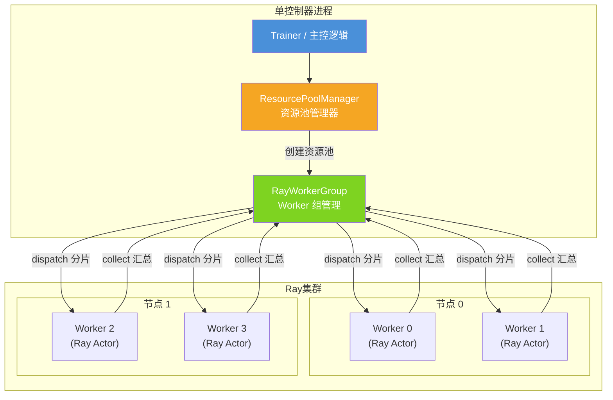
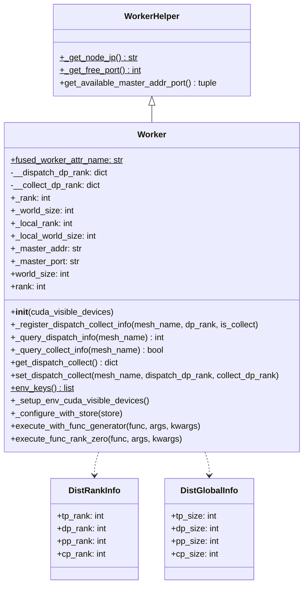
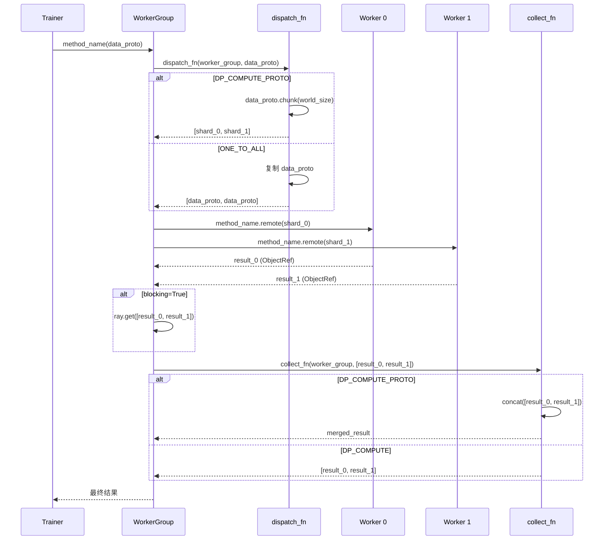
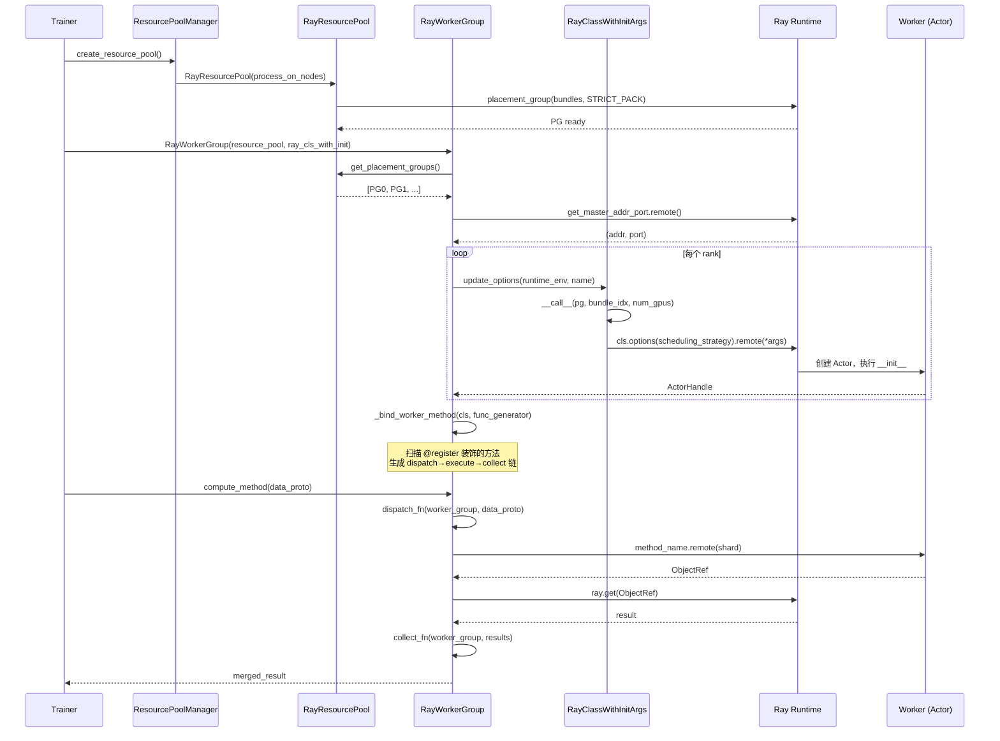

# 06 单控制器与分布式调度

## 【总】开篇概述

### 核心价值

verl 的单控制器（Single Controller）分布式调度模型是其训练框架的神经中枢。它将分布式训练的复杂性封装在一个单进程控制器中，使得上层训练逻辑只需像调用本地方法一样调用远程 Worker 方法，而无需关心数据分片、进程间通信、资源分配等底层细节。这种设计让 RLHF 等复杂训练流程的编排变得简洁而高效。

### 核心问题

**verl 如何在单进程控制器中协调多进程分布式训练？** 答案在于三层抽象的精巧配合：

1. **Worker** —— 远程进程中的最小执行单元，承载模型加载与计算
2. **WorkerGroup** —— 一组 Worker 的集合，提供统一的调度接口
3. **装饰器驱动的 dispatch/collect** —— 声明式地定义数据如何分发与汇总

### 全局概览



### 关键结论预览

- **Worker** 是 Ray Actor 的封装，通过环境变量注入分布式配置，生命周期由 WorkerGroup 管理
- **ClassWithInitArgs** 实现延迟实例化，将"用什么类+什么参数"与"何时何地实例化"解耦
- **@register 装饰器** 是整个调度模型的核心：声明 dispatch_mode 即可自动获得数据分片与汇总能力
- **RayWorkerGroup** 将装饰器元信息、dispatch/collect 函数、Ray 远程调用三者粘合，形成完整的调度链路
- **TransferQueue** 提供共享内存级别的零拷贝数据传输，用 BatchMeta/KVBatchMeta 替代实际数据在控制器与 Worker 间传递

---

## 【分】逐层展开

### 1. Worker 基类

Worker 是 verl 分布式训练中最小的执行单元，它运行在 Ray Actor 中，负责模型加载、初始化和计算执行。

#### 类结构



#### 生命周期管理

Worker 的初始化流程如下：

1. **环境变量注入**：WorkerGroup 在创建 Ray Actor 前，通过 `runtime_env.env_vars` 将 `WORLD_SIZE`、`RANK`、`LOCAL_RANK`、`MASTER_ADDR`、`MASTER_PORT` 等关键环境变量注入到 Actor 进程中
2. **CUDA 设备配置**：`_setup_env_cuda_visible_devices()` 处理 `CUDA_VISIBLE_DEVICES`/`HIP_VISIBLE_DEVICES`/`ROCR_VISIBLE_DEVICES` 的一致性，并支持 `RAY_EXPERIMENTAL_NOSET_*` 标志
3. **环境变量读取与存储**：`__init__` 从 `os.environ` 读取分布式配置，调用 `_configure_with_store` 将其存入实例属性并同步回环境变量
4. **dispatch/collect 信息注册**：初始化 `__dispatch_dp_rank` 和 `__collect_dp_rank` 字典，用于后续多维并行调度

#### 进程组初始化

Worker 本身不直接初始化 NCCL/HCCL 进程组，而是由具体的 Worker 子类（如 `ActorRolloutRefWorker`）在模型初始化阶段调用 `initialize_global_process_group_ray()` 完成。Worker 只负责提供 `MASTER_ADDR` 和 `MASTER_PORT`。

#### Worker 与 Ray Actor 的关系

Worker 类通过 `ray.remote(WorkerClass)` 变为 Ray Actor。Worker 的 `__init__` 在 Actor 进程内执行，因此环境变量注入必须在 Actor 创建之前完成。WorkerGroup 通过 `RayClassWithInitArgs` 延迟创建 Actor，在创建时传入 `placement_group` 和 `placement_group_bundle_idx` 来控制 Actor 的物理放置。

---

### 2. WorkerGroup

WorkerGroup 是一组 Worker 的管理容器，它提供统一的调度接口，屏蔽了底层 Ray 远程调用的复杂性。

#### ClassWithInitArgs 延迟实例化机制

```python
class ClassWithInitArgs:
    def __init__(self, cls, *args, **kwargs):
        self.cls = cls
        self.args = args
        self.kwargs = kwargs

    def __call__(self):
        return self.cls(*self.args, **self.kwargs)
```

`ClassWithInitArgs` 将"类 + 构造参数"打包为一个可调用对象，但不在构造时立即实例化。这种延迟实例化机制的关键价值在于：

- **远程实例化**：Ray Actor 需要在远程节点上创建，而非在控制器进程中实例化
- **参数预配置**：可以在创建 WorkerGroup 之前就确定 Worker 类及其参数，但将实际创建推迟到资源分配完成之后
- **共享与复用**：同一个 `ClassWithInitArgs` 可以被多个 WorkerGroup 使用，每个 WorkerGroup 在自己的资源池上独立实例化

`RayClassWithInitArgs` 继承了 `ClassWithInitArgs`，增加了 Ray 特有的配置能力：

- `_options`：Ray Actor 创建选项（如 `runtime_env`、`name`、`lifetime`）
- `_additional_resource`：额外的资源需求（如加速器类型）
- `__call__` 方法接受 `placement_group`、`placement_group_bundle_idx` 等参数，使用 `PlacementGroupSchedulingStrategy` 确保 Actor 被调度到指定节点

#### ResourcePool 资源池管理

```mermaid
graph LR
    subgraph ResourcePool
        RP["ResourcePool<br/>process_on_nodes = [4, 4]"]
    end

    subgraph 计算属性
        WS["world_size = 8"]
        LWS["local_world_size_list<br/>= [4,4,4,4,4,4,4,4]"]
        LR["local_rank_list<br/>= [0,1,2,3,0,1,2,3]"]
    end

    RP --> WS
    RP --> LWS
    RP --> LR

    subgraph RayResourcePool
        RRP["RayResourcePool<br/>+ use_gpu<br/>+ name_prefix<br/>+ pgs (Placement Groups)"]
        RRP -->|get_placement_groups| PG0["PG 0 (Node A)<br/>4 bundles"]
        RRP -->|get_placement_groups| PG1["PG 1 (Node B)<br/>4 bundles"]
    end

    ResourcePool <|-- RayResourcePool

    subgraph SubRayResourcePool
        SRP["SubRayResourcePool<br/>+ start_bundle_index<br/>+ subgroup_world_size"]
    end

    RayResourcePool <|-- SubRayResourcePool
```

`ResourcePool` 的核心属性：

| 属性 | 说明 | 示例（`process_on_nodes=[4, 4]`） |
|------|------|-----------------------------------|
| `world_size` | 总进程数 | 8 |
| `local_world_size_list` | 每个进程的 local_world_size | `[4,4,4,4,4,4,4,4]` |
| `local_rank_list` | 每个进程的 local_rank | `[0,1,2,3,0,1,2,3]` |
| `store` | 原始节点进程数列表 | `[4, 4]` |

`RayResourcePool` 在此基础上增加了 Ray Placement Group 管理：

- `get_placement_groups()`：按 `STRICT_PACK` 策略创建 Placement Group，每个 bundle 包含 `max_colocate_count` 个 CPU 和 1 个 GPU
- `sort_placement_group_by_node_ip()`：按节点 IP 排序 PG，确保 RANK 在多次 Ray Job 间保持一致
- `SubRayResourcePool`：支持从一个大的 ResourcePool 中切分出子集，用于多模型共存（colocate）场景

#### WorkerGroup 的创建与管理

WorkerGroup 的核心职责：

1. **Worker 创建**：根据 ResourcePool 的配置，为每个进程创建一个 Ray Actor
2. **方法绑定**：通过 `_bind_worker_method` 将 Worker 类上被 `@register` 装饰的方法绑定到 WorkerGroup 上
3. **存活检查**：通过 `_is_worker_alive` 和 `start_worker_aliveness_check` 监控 Worker 健康状态

```python
class WorkerGroup:
    def __init__(self, resource_pool: ResourcePool, **kwargs):
        self._workers = []          # Worker 句柄列表
        self._worker_names = []     # Worker 名称列表
        self._dispatch_info = {}    # 缓存的 dispatch 信息
        self._collect_info = {}     # 缓存的 collect 信息
        self._master_addr = None    # 分布式通信主地址
        self._master_port = None    # 分布式通信主端口
```

#### 资源分配逻辑

RayWorkerGroup 的资源分配流程：

1. 从 `RayResourcePool` 获取 Placement Group 列表
2. 通过 `get_master_addr_port` 远程任务获取 MASTER_ADDR 和 MASTER_PORT
3. 遍历每个 PG 的每个 bundle，调用 `_create_worker` 创建 Worker
4. 每个 Worker 的 `num_gpus = 1 / max_colocate_count`，实现 GPU 共享

---

### 3. 装饰器驱动的 dispatch/collect

这是 verl 单控制器模型最精妙的设计——通过 `@register` 装饰器声明式地定义数据分发与汇总策略，将分布式调度的复杂性从业务逻辑中彻底剥离。

#### @register 装饰器的工作原理

```python
def register(dispatch_mode=Dispatch.ALL_TO_ALL, execute_mode=Execute.ALL,
             blocking=True, materialize_futures=True):
    def decorator(func):
        func = tqbridge(dispatch_mode=dispatch_mode)(func)  # TransferQueue 桥接

        @wraps(func)
        def inner(*args, **kwargs):
            if materialize_futures:
                args, kwargs = _materialize_futures(*args, **kwargs)
            return func(*args, **kwargs)

        attrs = {"dispatch_mode": dispatch_mode, "execute_mode": execute_mode, "blocking": blocking}
        setattr(inner, MAGIC_ATTR, attrs)  # 将元信息附加到函数上
        return inner
    return decorator
```

`@register` 做了三件事：

1. **tqbridge 包装**：在函数外层包裹 TransferQueue 桥接逻辑，自动处理 BatchMeta/KVBatchMeta 与 TensorDict 的转换
2. **Future 物化**：如果 `materialize_futures=True`，自动将 `DataProtoFuture` 解析为实际数据
3. **元信息标记**：将 `dispatch_mode`、`execute_mode`、`blocking` 存入函数的 `MAGIC_ATTR` 属性，供 WorkerGroup 的 `_bind_worker_method` 读取

#### Dispatch 枚举

| Dispatch 模式 | dispatch 策略 | collect 策略 | 典型场景 |
|---------------|--------------|-------------|---------|
| `ONE_TO_ALL` | 将相同参数复制到所有 Worker | 原样返回所有结果 | 广播配置、初始化 |
| `ALL_TO_ALL` | 参数原样传递 | 原样返回 | 全对全通信 |
| `DP_COMPUTE` | 调用方预先按 world_size 分片 | 原样返回分片结果 | 手动数据并行 |
| `DP_COMPUTE_PROTO` | 自动将 DataProto 按 world_size 分片 | 自动 concat 结果 | DataProto 数据并行 |
| `DP_COMPUTE_PROTO_WITH_FUNC` | 第一个参数为函数，其余 DataProto 自动分片 | 自动 concat 结果 | 动态函数分发 |
| `DP_COMPUTE_METRIC` | 同 DP_COMPUTE_PROTO | 同 DP_COMPUTE | 指标计算 |
| `DIRECT_ROLLOUT_METHOD` | 抛出 NotImplementedError | 抛出 NotImplementedError | 直接 rollout 调用占位 |

#### make_nd_compute_dataproto_dispatch_fn

对于 Megatron 等多维并行场景，预定义的 Dispatch 模式无法满足需求。`make_nd_compute_dataproto_dispatch_fn` 提供了一种延迟绑定的方式：

```python
def make_nd_compute_dataproto_dispatch_fn(mesh_name):
    return {
        "dispatch_fn": partial(dispatch_lazy_compute_data_proto, mesh_name),
        "collect_fn": partial(collect_lazy_compute_data_proto, mesh_name),
    }
```

其工作流程：

1. **dispatch 阶段**：查询 WorkerGroup 中每个 Worker 的 `dp_rank` 映射（`_query_dispatch_info`），将 DataProto 按 `dp_size` 分片，再按 `dp_rank_mapping` 分配给各 Worker
2. **collect 阶段**：查询每个 Worker 是否需要 collect（`_query_collect_info`），仅从需要 collect 的 Worker 收集结果并 concat

这种设计支持 TP+DP 等多维并行：同一 TP 组内只有 rank 0 参与 collect，避免重复汇总。

#### 自动数据分片与汇总的完整流程



关键细节：在 `func_generator` 中，dispatch → execute → collect 的调用链被封装为一个动态生成的 Functor 类：

```python
def func_generator(self, method_name, dispatch_fn, collect_fn, execute_fn, blocking):
    class Functor:
        def __call__(this, *args, **kwargs):
            args, kwargs = dispatch_fn(self, *args, **kwargs)      # 分片
            padding_count = kwargs.pop(_padding_size_key, 0)
            output = execute_fn(method_name, *args, **kwargs)      # 远程执行
            if blocking:
                output = ray.get(output)                           # 同步等待
            output = collect_fn(self, output)                      # 汇总
            if padding_count > 0:
                # 去除自动填充的数据
                ...
            return output
    return type(method_name, (Functor,), {})()
```

`type(method_name, (Functor,), {})()` 动态创建一个以方法名命名的类，提升调试可观测性。

---

### 4. Ray 集成

Ray 是 verl 单控制器模型的底层执行引擎，负责 Actor 管理、资源调度和远程过程调用。

#### RayWorkerGroup

`RayWorkerGroup` 继承 `WorkerGroup`，是 Ray 环境下的具体实现。它的初始化有三种路径：

1. **`_init_with_resource_pool`**：从完整的 `RayResourcePool` 创建新 Worker
2. **`_init_with_subresource_pool`**：从 `SubRayResourcePool` 创建 Worker（用于 colocate 场景）
3. **`_init_with_detached_workers`**：连接到已有的 detached Worker

#### RayClassWithInitArgs

`RayClassWithInitArgs` 的 `__call__` 方法是创建 Ray Actor 的核心：

```python
def __call__(self, placement_group, placement_group_bundle_idx,
             use_gpu=True, num_gpus=1, sharing_with=None, device_name="cuda"):
    if sharing_with is not None:
        # 与已有 Actor 共享节点
        target_node_id = ray.get(sharing_with.get_node_id.remote())
        visible_devices = ray.get(sharing_with.get_cuda_visible_devices.remote())
        options = {"scheduling_strategy": NodeAffinitySchedulingStrategy(node_id=target_node_id, soft=False)}
        return self.cls.options(**options).remote(*self.args, cuda_visible_devices=visible_devices, **self.kwargs)

    # 使用 Placement Group 调度
    options = {
        "scheduling_strategy": PlacementGroupSchedulingStrategy(
            placement_group=placement_group,
            placement_group_bundle_index=placement_group_bundle_idx
        )
    }
    # GPU 资源配置
    if use_gpu:
        resource_opts = get_platform().ray_resource_options(num_gpus)
        options.update(resource_opts)
    return self.cls.options(**options).remote(*self.args, **self.kwargs)
```

关键设计点：

- **PlacementGroupSchedulingStrategy**：确保 Actor 被调度到指定的 PG bundle 上，实现精确的资源放置
- **NodeAffinitySchedulingStrategy**：当 `sharing_with` 不为 None 时，新 Actor 与指定 Actor 共享同一节点，用于 colocate 场景
- **num_gpus = 1/max_colocate_count**：通过分数 GPU 分配实现多模型共存

#### ResourcePoolManager

`ResourcePoolManager` 是资源池的声明式管理器：

```python
@dataclass
class ResourcePoolManager:
    resource_pool_spec: dict[str, list[int]]   # {"pool_name": [4, 4]}
    mapping: dict[int, str]                     # {role: pool_name}
    max_colocate_count: int = 3
    resource_pool_dict: dict[str, RayResourcePool] = field(default_factory=dict)
```

它将资源规格声明与资源池实例化分离：`resource_pool_spec` 定义每个资源池的节点进程数，`mapping` 定义角色到资源池的映射，`create_resource_pool` 按声明创建 `RayResourcePool` 实例。

#### create_colocated_worker_cls_fused

`create_colocated_worker_cls_fused` 是多模型共存的核心机制，它将多个 Worker 类合并为一个 FusedWorker：

```python
def create_colocated_worker_raw_cls(class_dict: dict[str, RayClassWithInitArgs]):
    class FusedWorker(Worker):
        def __init__(self, *args, **kwargs):
            super().__init__(*args, **kwargs)
            for cls_name, udc, ud_args, ud_kwargs in zip(...):
                with temp_env_var("DISABLE_WORKER_INIT", "1"):
                    self.fused_worker_dict[cls_name] = udc(*ud_args, **ud_kwargs)
                    setattr(self, cls_name, self.fused_worker_dict[cls_name])
            # 注入 fused_worker_dict 到每个子 Worker
            for _, worker in self.fused_worker_dict.items():
                setattr(worker, Worker.fused_worker_attr_name, self.fused_worker_dict)

        def _fuw_execute(self, method_name: str, *args, **kwargs):
            names = method_name.split("_fwmn_")
            cls_name = names[0]
            method_name = names[1]
            return getattr(self.fused_worker_dict[cls_name], method_name)(*args, **kwargs)
```

FusedWorker 的关键设计：

- **DISABLE_WORKER_INIT**：子 Worker 初始化时跳过 Worker 基类的 `__init__`，避免重复初始化分布式配置
- **fused_worker_dict**：存储所有子 Worker 实例，子 Worker 之间可以互相访问
- **_fuw_execute**：通过 `"{cls_name}_fwmn_{method_name}"` 格式的方法名路由到正确的子 Worker 方法

#### Ray 远程执行时序图



---

### 5. 分布式通信

#### initialize_global_process_group_ray

```python
def initialize_global_process_group_ray(timeout_second=None, backend=None):
    backend = backend or f"cpu:gloo,{get_device_name()}:{get_nccl_backend()}"
    if not torch.distributed.is_initialized():
        rank = int(os.environ.get("RANK", 0))
        world_size = int(os.environ.get("WORLD_SIZE", 1))
        torch.distributed.init_process_group(
            backend=backend,
            rank=rank,
            world_size=world_size,
            timeout=timeout,
            init_method=os.environ.get("DIST_INIT_METHOD", None),
        )
```

关键设计：

- **混合后端**：默认使用 `cpu:gloo,{device}:{nccl_backend}`，CPU 通信走 Gloo，GPU 通信走 NCCL/HCCL
- **环境变量驱动**：RANK、WORLD_SIZE 由 WorkerGroup 在创建 Actor 时注入
- **幂等性**：通过 `torch.distributed.is_initialized()` 检查，避免重复初始化

#### NCCL/HCCL 进程组

verl 通过 `get_nccl_backend()` 和 `get_device_name()` 抽象不同硬件后端：

- NVIDIA GPU → NCCL
- 昇腾 NPU → HCCL
- 通用回退 → Gloo

#### stateless_init_process_group

用于 vLLM 与训练进程之间的通信，创建独立的 `StatelessProcessGroup`，不依赖全局 `torch.distributed`：

```python
def stateless_init_process_group(master_address, master_port, rank, world_size, device):
    pg = create_process_group(host=master_address, port=master_port, rank=rank, world_size=world_size)
    pynccl = PyNcclCommunicator(pg, device=device)
    return pynccl
```

这种设计允许 vLLM Worker 和训练 Worker 在不同的全局进程组中通信，避免冲突。

#### Device Mesh 管理

Worker 通过 `_register_dispatch_collect_info` 注册每个 mesh 的 `dp_rank` 和 `is_collect` 信息：

```python
def _register_dispatch_collect_info(self, mesh_name: str, dp_rank: int, is_collect: bool):
    self.__dispatch_dp_rank[mesh_name] = dp_rank
    self.__collect_dp_rank[mesh_name] = is_collect
```

这些信息在 `dispatch_lazy_compute_data_proto` 中被查询，用于确定数据分片和汇总策略。例如，在 TP=2, DP=4 的配置中，8 个 Worker 的 `dp_rank_mapping` 为 `[0, 0, 1, 1, 2, 2, 3, 3]`，`collect_mask` 为 `[True, False, True, False, True, False, True, False]`，确保每个 TP 组只有 rank 0 参与 collect。

---

### 6. 数据传输优化

#### TransferQueue 机制

TransferQueue（TQ）是 verl 的零拷贝数据传输优化层。其核心思想是：**不在控制器与 Worker 之间传递实际数据，而是传递数据的元信息（BatchMeta），Worker 通过共享内存直接读取数据**。

`tqbridge` 装饰器是 TQ 的入口，它包裹在 `@register` 内部：

```python
def register(dispatch_mode=..., execute_mode=..., blocking=True, materialize_futures=True):
    def decorator(func):
        func = tqbridge(dispatch_mode=dispatch_mode)(func)  # TQ 桥接
        ...
```

`tqbridge` 的工作流程：

1. **输入检测**：检查参数中是否包含 `BatchMeta` 或 `KVBatchMeta`
2. **元数据转实数据**：通过 `_meta_to_realdata` 从 TQ 共享内存中读取实际 TensorDict
3. **执行原函数**：调用业务逻辑
4. **实数据转元数据**：如果输出是 TensorDict 且需要 collect，通过 `_update_meta_with_output` 将结果写回 TQ，返回 BatchMeta

#### 共享内存传输

TQ 的数据流转路径：

```
控制器进程                    Worker 进程
┌──────────┐               ┌──────────┐
│ DataProto │──put()──→    │ 共享内存   │
│           │               │          │
│ BatchMeta │──传递──→      │ BatchMeta │
│           │               │    ↓     │
│           │               │ get()    │
│           │               │    ↓     │
│           │               │TensorDict│
└──────────┘               └──────────┘
```

控制器只传递 `BatchMeta`（包含 partition_id、global_indexes 等轻量元信息），Worker 通过 `tq_client.async_get_data(meta)` 从共享内存读取实际数据。这避免了大数据在 Ray Object Store 中的序列化/反序列化开销。

#### KVBatchMeta 批量元数据

`KVBatchMeta` 是 `BatchMeta` 的扩展，用于 KV Cache 传输场景：

- `keys`：KV Cache 的键列表
- `partition_id`：分区标识
- `fields`：需要选择的字段

`KVBatchMeta` → `BatchMeta` 的转换通过 `async_kv_batch_meta2batch_meta` 完成：

```python
async def async_kv_batch_meta2batch_meta(meta: KVBatchMeta) -> BatchMeta:
    tq_client = tq.get_client()
    batch_meta = await tq_client.async_kv_retrieve_meta(
        keys=meta.keys, partition_id=meta.partition_id, create=False
    )
    if meta.fields is not None:
        batch_meta = batch_meta.select_fields(meta.fields)
    batch_meta.extra_info = meta.extra_info
    return batch_meta
```

#### _compute_need_collect 优化

在 TQ 场景下，`_compute_need_collect` 判断当前 Worker 是否需要 collect，避免不必要的共享内存写入：

```python
def _compute_need_collect(dispatch_mode, args):
    # 对于 lazy compute 模式，检查 Worker 的 collect 信息
    if isinstance(collect_fn, functools.partial):
        if collect_fn_name == "collect_lazy_compute_data_proto":
            return args[0].query_collect_info(collect_mesh_name)
    return True
```

当 `need_collect=False` 时，`_postprocess_common` 返回空的 `BatchMeta()` 或 `DataProto()`，跳过数据写回，减少共享内存压力。

---

## 【总】总结升华

### 核心设计要点回顾

1. **单控制器模型**：所有分布式调度逻辑集中在单进程中，Trainer 代码无需感知分布式细节
2. **装饰器驱动的声明式调度**：`@register(dispatch_mode=...)` 一行代码即可定义数据分发与汇总策略
3. **延迟实例化**：`ClassWithInitArgs` 将类定义与实例化解耦，支持远程、按需、带资源约束的实例化
4. **ResourcePool 抽象**：将集群资源建模为节点进程数列表，支持 split/merge/subpool 等灵活操作
5. **FusedWorker 共存**：多模型共享同一组 GPU，通过 `_fuw_execute` 路由方法调用
6. **TransferQueue 零拷贝**：用元信息替代实际数据传输，大幅降低序列化开销

### 单控制器模型的优劣势分析

| 维度 | 优势 | 劣势 |
|------|------|------|
| **编程模型** | 简单直观，像调用本地方法一样调用远程方法 | 控制器成为单点，所有数据必须经过控制器 |
| **调度灵活性** | dispatch/collect 可组合，支持多种并行策略 | 新的并行模式需要新增 Dispatch 枚举值 |
| **调试可观测性** | 单进程控制流清晰，日志集中 | 控制器瓶颈时难以定位是调度还是计算问题 |
| **扩展性** | Ray Actor 天然支持水平扩展 | 控制器的 dispatch/collect 是串行瓶颈 |
| **数据传输** | TransferQueue 提供零拷贝优化 | 不安装 TQ 时回退到 Ray Object Store，性能下降 |

### 与纯分布式调度模型的对比

| 特性 | verl 单控制器 | 纯分布式调度（如 Megatron-LM） |
|------|-------------|-------------------------------|
| 控制流 | 集中在单进程 | 分布在各进程 |
| 数据流 | 控制器中转或共享内存 | 进程间直接通信（NCCL） |
| 编程复杂度 | 低（声明式） | 高（需手动管理通信） |
| 容错 | 控制器单点故障 | 各进程独立，更健壮 |
| 灵活性 | 高（动态 dispatch/collect） | 低（编译时确定通信模式） |
| 典型场景 | RLHF 多模型编排 | 单模型大规模训练 |

verl 的单控制器模型本质上是一种**编排层抽象**：它不替代底层的 NCCL/HCCL 通信，而是在其上提供更高层次的调度语义。Worker 内部的 TP/PP/DP 通信仍然由 PyTorch 原生分布式处理，单控制器只负责跨 WorkerGroup 的数据分发与汇总。这种分层设计在保持底层性能的同时，极大简化了上层编排逻辑。
