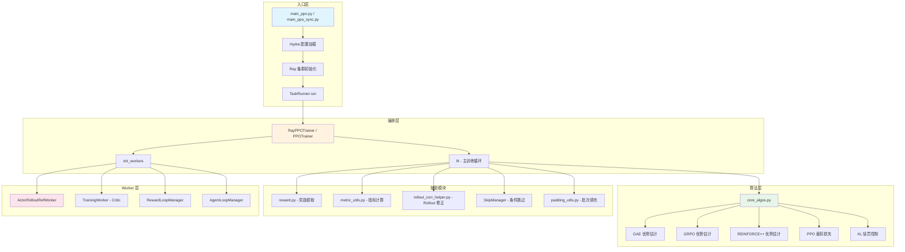
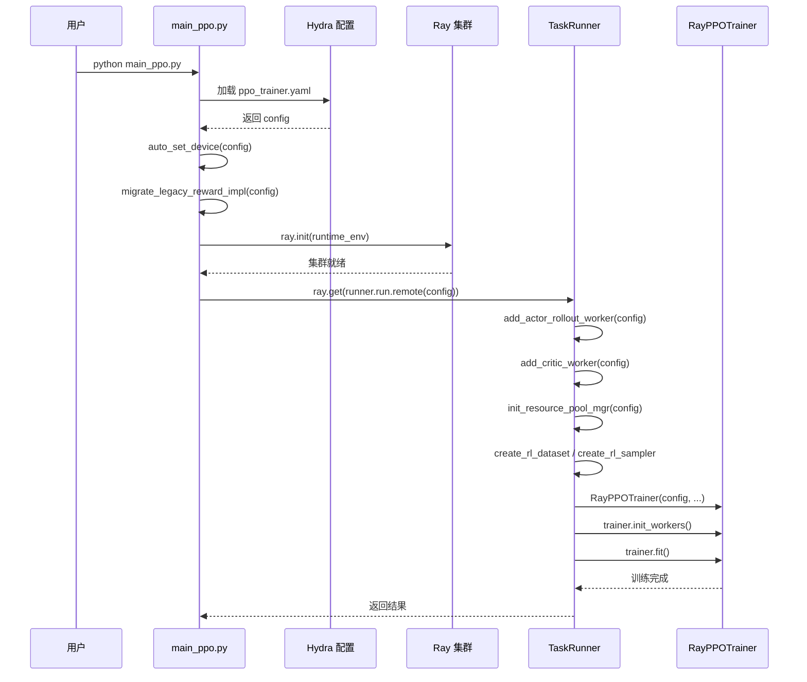
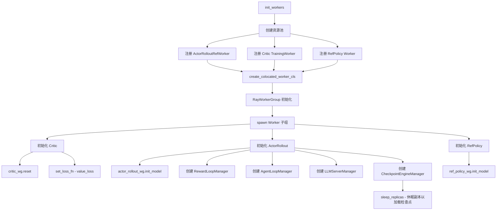

# 07 Trainer 模块详解

## 【总】开篇概述

### Trainer 模块的核心价值

Trainer 模块是 verl 训练流程的**控制中心**，负责编排完整的 PPO（Proximal Policy Optimization）训练循环。它将数据加载、模型推理、奖励计算、优势估计、策略更新等环节串联成一个端到端的训练流水线，同时协调多个分布式 Worker 之间的协作。

verl 的 Trainer 并非简单的训练脚本，而是一个精心设计的**分布式编排器**：驱动进程（Driver）仅执行轻量级的优势计算与数据调度，所有重计算（前向推理、反向传播）均通过 Ray RPC 委托给远端 Worker 执行，从而实现了控制逻辑与计算逻辑的彻底解耦。

### 核心问题

**verl 如何编排完整的 PPO 训练循环？** 具体而言：
- 如何从入口脚本启动分布式训练？
- 如何注册和初始化各类 Worker（Actor、Critic、RefPolicy 等）？
- 如何在单控制器上协调 Rollout → Reward → Advantage → Update 的完整数据流？
- 如何支持 GAE、GRPO、REINFORCE++ 等多种优势估计器？
- 如何处理 KL 惩罚、Rollout 修正等高级算法特性？

### 全局概览图



### 关键结论预览

1. **单控制器编排模式**：Trainer 运行在驱动进程上，通过 Ray RPC 调度 Worker，自身仅执行轻量计算（优势估计、KL 惩罚），实现了控制与计算的分离。
2. **可插拔算法架构**：通过 `@register_adv_est` 和 `@register_policy_loss` 装饰器注册机制，支持 GAE、GRPO、RLOO、ReMax 等 10+ 种优势估计器和 vanilla、DPPO、GSPO、SAPO 等 10+ 种策略损失函数。
3. **双模式训练**：同时支持异步 PPO（`RayPPOTrainer`，基于 DataProto）和同步 PPO（`PPOTrainer`，基于 TransferQueue），后者是未来主推方向。
4. **Rollout 修正体系**：通过重要性采样（IS）权重和拒绝采样（RS）修正 rollout 与训练策略之间的分布偏移，支持 Bypass 模式（跳过 old_log_prob 重计算）。
5. **Critic 暖启动**：支持 `critic_warmup` 机制，在指定步数内仅更新 Critic 而冻结 Actor，稳定训练初期。

---

## 【分】逐层展开

### 1. 入口与启动流程

#### 1.1 两种入口脚本

verl 提供两种 PPO 训练入口：

| 脚本 | Trainer 类 | 数据传输 | 状态 |
|------|-----------|---------|------|
| `main_ppo.py` | `RayPPOTrainer` | DataProto | 已废弃（v0.8.0 移除） |
| `main_ppo_sync.py` | `PPOTrainer` | TransferQueue | 推荐使用 |

两者共享 `run_ppo()` 函数进行 Ray 初始化和 TaskRunner 启动，差异在于数据传输机制和 Worker 协作方式。

#### 1.2 启动时序图



#### 1.3 Hydra 配置加载

通过 `@hydra.main(config_path="config", config_name="ppo_trainer")` 装饰器自动加载 YAML 配置。关键配置项包括：

- `actor_rollout_ref`：Actor/Rollout/RefPolicy 共享配置
- `critic`：Critic 模型配置
- `algorithm`：算法参数（adv_estimator、gamma、lam 等）
- `reward`：奖励配置（函数奖励/模型奖励）
- `trainer`：训练控制参数（总步数、保存频率等）
- `data`：数据集配置

#### 1.4 Ray 集群初始化

`run_ppo()` 函数负责 Ray 集群初始化：

```python
# 关键步骤
default_runtime_env = get_ppo_ray_runtime_env()  # 设置 TOKENIZERS_PARALLELISM、NCCL_DEBUG 等
ray.init(**OmegaConf.to_container(ray_init_kwargs))
```

`constants_ppo.py` 中定义了 Ray 运行时环境变量，包括 tokenizer 并行化、NCCL 调试级别、vLLM 日志级别等。

#### 1.5 TaskRunner

`TaskRunner` 是一个 Ray Remote 类，作为训练任务的远程执行器：

```python
@ray.remote(num_cpus=1)
class TaskRunner:
    def run(self, config):
        # 1. 注册 Worker
        self.add_actor_rollout_worker(config)
        self.add_critic_worker(config)
        # 2. 初始化资源池
        self.init_resource_pool_mgr(config)
        # 3. 创建数据集
        train_dataset = create_rl_dataset(...)
        val_dataset = create_rl_dataset(...)
        train_sampler = create_rl_sampler(...)
        # 4. 实例化 Trainer
        trainer = RayPPOTrainer(config, ...)
        trainer.init_workers()
        trainer.fit()
```

**Worker 注册逻辑**：

- `add_actor_rollout_worker()`：注册 `ActorRolloutRefWorker`，若使用 LoRA 则 RefPolicy 融合在 Actor 中（`Role.ActorRollout`），否则独立注册（`Role.ActorRolloutRef`）
- `add_critic_worker()`：注册 `TrainingWorker` 作为 Critic，仅在 `need_critic(config)` 为 True 时注册
- `add_reward_model_resource_pool()`：若启用奖励模型，注册独立资源池或共享全局池

**ResourcePool 初始化**：

```python
resource_pool_spec = {
    "global_pool": [n_gpus_per_node] * nnodes,  # Actor/Critic/Ref 共享
    "reward_pool": [...],  # 可选：独立奖励模型池
    "teacher_pool": [...],  # 可选：独立教师模型池
}
```

**数据集创建**：

- `create_rl_dataset()`：根据 `data_config` 动态选择数据集类（通过 `get_dataset_class`），支持 JSONL、Parquet 等格式
- `create_rl_sampler()`：创建采样器，支持随机采样（`RandomSampler`，可恢复种子）和顺序采样（`SequentialSampler`）

---

### 2. RayPPOTrainer 详解

#### 2.1 初始化

`RayPPOTrainer.__init__()` 完成以下初始化：

1. **配置解析**：解析 hybrid_engine、use_reference_policy、use_critic 等标志
2. **LoRA 判断**：根据 `lora_rank > 0` 或 `lora_adapter_path` 判断 RefPolicy 是否融合在 Actor 中
3. **KL 控制器**：若 `use_kl_in_reward=True`，创建 `AdaptiveKLController` 或 `FixedKLController`
4. **数据加载器**：创建训练/验证 DataLoader（`StatefulDataLoader`，支持断点恢复）

#### 2.2 init_workers() - Worker 初始化流程

`init_workers()` 是 Trainer 最复杂的初始化方法，负责创建所有分布式 Worker：



关键设计要点：

- **共置 Worker（Colocated Worker）**：Actor、Critic、RefPolicy 通过 `create_colocated_worker_cls` 创建为共置 Worker，共享同一组 GPU 资源，通过 `spawn` 拆分为独立子组
- **Critic 配置转换**：将 `CriticConfig` 转换为 `TrainingWorkerConfig`，统一由 `TrainingWorker` 处理
- **AgentLoopManager**：管理异步 Rollout，支持流式奖励计算（Agent-Reward Loop）
- **CheckpointEngineManager**：管理检查点的休眠/唤醒，实现训练权重到 Rollout 引擎的增量同步

#### 2.3 fit() - 主训练循环详解

`fit()` 是 Trainer 的核心方法，实现了完整的 PPO 训练循环：

```mermaid
flowchart TD
    START[fit 开始] --> LOAD[_load_checkpoint]
    LOAD --> UPDATE[checkpoint_manager.update_weights]
    UPDATE --> VAL_PRE{val_before_train?}
    VAL_PRE -->|Yes| VAL0[_validate]
    VAL_PRE -->|No| LOOP
    VAL0 --> LOOP

    LOOP[epoch 循环] --> BATCH[batch 循环]
    BATCH --> GEN[1. 生成 Rollout]
    GEN --> REWARD[2. 计算奖励]
    REWARD --> BALANCE[3. 平衡批次]
    BALANCE --> OLD_LP[4. 计算 old_log_prob]
    OLD_LP --> REF_LP{5. use_ref_policy?}
    REF_LP -->|Yes| REF[计算 ref_log_prob]
    REF_LP -->|No| VALUES
    REF --> VALUES{6. use_critic?}
    VALUES -->|Yes| VAL[计算 values]
    VALUES -->|No| ADV
    VAL --> ADV[7. 计算优势估计]
    
    ADV --> KL{use_kl_in_reward?}
    KL -->|Yes| KLP[apply_kl_penalty]
    KL -->|No| ROLLOUT_CORR
    KLP --> ROLLOUT_CORR{rollout_correction?}
    ROLLOUT_CORR -->|Yes| RC[compute_rollout_correction]
    ROLLOUT_CORR -->|No| ADV_EST
    RC --> ADV_EST[compute_advantage]
    
    ADV_EST --> CRITIC_UP{8. use_critic?}
    CRITIC_UP -->|Yes| CU[update_critic]
    CRITIC_UP -->|No| ACTOR_CHK
    CU --> ACTOR_CHK{critic_warmup?}
    ACTOR_CHK -->|未完成| WU[仅 update_weights]
    ACTOR_CHK -->|已完成| AU[9. update_actor]
    WU --> SAVE_CHK
    AU --> SAVE[10. save_checkpoint]
    SAVE --> WU2[update_weights]
    WU2 --> SAVE_CHK
    
    SAVE_CHK{需要验证?} -->|Yes| VALIDATE[_validate]
    SAVE_CHK -->|No| METRICS
    VALIDATE --> METRICS[11. 计算指标]
    METRICS --> LOG[logger.log]
    LOG --> NEXT[global_steps++]
    NEXT --> BATCH
    
    style GEN fill:#ffcdd2
    style REWARD fill:#fff9c4
    style ADV_EST fill:#c8e6c9
    style AU fill:#bbdefb
    style CU fill:#e1bee7
```



**各步骤详解**：

**a. 生成 Rollout**

```python
gen_batch_output = gen_batch.repeat(repeat_times=rollout_n, interleave=True)
combined_gen_output = self.async_rollout_manager.generate_sequences(combined_gen_batch)
```

- 将 prompt 重复 `rollout.n` 次（交错排列），用于 GRPO 等需要多样本的优势估计
- 若使用 ReMax，额外生成一条贪心基线
- 通过 `AgentLoopManager` 异步调度生成任务

**b. 计算奖励**

奖励计算分为两条路径：
- **函数奖励**：通过 `RewardLoopManager` 调用用户自定义的 `compute_score` 函数
- **模型奖励**：通过 `RewardLoopManager` 调用奖励模型（可共置或独立资源池）

**c. KL 惩罚（apply_kl_penalty）**

```python
def apply_kl_penalty(data, kl_ctrl, kl_penalty="kl"):
    kld = core_algos.kl_penalty(old_log_probs, ref_log_prob, kl_penalty)
    token_level_rewards = token_level_scores - beta * kld
    kl_ctrl.update(current_kl=current_kl, n_steps=batch_size)
```

KL 惩罚从 token 级别的奖励中减去 β × KL 散度，β 由 `AdaptiveKLController` 动态调整。

**d. 优势估计**

详见第 4 节 core_algos.py 分析。

**e. PPO 策略更新（update_actor）**

```python
actor_output = self.actor_rollout_wg.update_actor(batch_td)
```

将数据转换为 no-padding 格式后发送给 Actor Worker，Worker 内部执行 PPO 裁剪损失计算和梯度更新。

**f. Critic 更新（update_critic）**

```python
output = self.critic_wg.train_mini_batch(batch_td)
```

Critic 使用 `value_loss` 作为损失函数，支持 mini-batch 训练。

**g. 检查点保存**

保存 Actor、Critic 和 DataLoader 状态，支持本地和 HDFS 远程存储，可配置最大保留检查点数量。

**h. 验证循环**

`_validate()` 方法遍历验证集，生成响应并计算奖励，支持 majority voting、best-of-N 等评估指标。

---

### 3. 核心算法 core_algos.py

#### 3.1 算法调用关系图

```mermaid
graph TD
    subgraph "优势估计器注册表"
        REG["@register_adv_est 装饰器"]
        REG --> GAE[compute_gae_advantage_return]
        REG --> GRPO[compute_grpo_outcome_advantage]
        REG --> GRPO_VEC[compute_grpo_vectorized_outcome_advantage]
        REG --> GRPO_PASSK[compute_grpo_passk_outcome_advantage]
        REG --> RLOO[compute_rloo_outcome_advantage]
        REG --> RLOO_VEC[compute_rloo_vectorized_outcome_advantage]
        REG --> RF_PP[compute_reinforce_plus_plus_outcome_advantage]
        REG --> RF_PP_BSL[compute_reinforce_plus_plus_baseline_outcome_advantage]
        REG --> REMAX[compute_remax_outcome_advantage]
        REG --> OPO[compute_opo_outcome_advantage]
        REG --> GPG[compute_gpg_outcome_advantage]
        REG --> GDPO[compute_gdpo_outcome_advantage]
        REG --> OTB[compute_optimal_token_baseline_advantage]
        REG --> TIR_OTB[compute_multi_turn_optimal_token_baseline_advantage]
    end

    subgraph "策略损失注册表"
        PL["@register_policy_loss 装饰器"]
        PL --> VANILLA[compute_policy_loss_vanilla]
        PL --> DPPO_TV[compute_policy_loss_dppo_tv]
        PL --> DPPO_KL[compute_policy_loss_dppo_kl]
        PL --> GSPO[compute_policy_loss_gspo]
        PL --> SAPO[compute_policy_loss_sapo]
        PL --> GPG_LOSS[compute_policy_loss_gpg]
        PL --> CLIP_COV[compute_policy_loss_clip_cov]
        PL --> KL_COV[compute_policy_loss_kl_cov]
        PL --> GEO_MEAN[compute_policy_loss_geo_mean]
        PL --> CISPO[compute_policy_loss_cispo]
        PL --> BYPASS[compute_policy_loss_bypass_mode]
    end

    subgraph "辅助函数"
        AGG[agg_loss - 损失聚合]
        KL_P[kl_penalty - KL 惩罚计算]
        KL_CTRL[AdaptiveKLController / FixedKLController]
        VAL_LOSS[compute_value_loss - 价值损失]
    end

    GAE --> AGG
    VANILLA --> AGG
    DPPO_TV --> AGG
    GSPO --> AGG
    KL_P --> KL_CTRL

    style REG fill:#e8f5e9
    style PL fill:#e3f2fd
    style AGG fill:#fff3e0
```



#### 3.2 优势估计器详解

**GAE（Generalized Advantage Estimation）**

```python
def compute_gae_advantage_return(token_level_rewards, values, response_mask, gamma, lam):
    # 从后向前递推
    for t in reversed(range(gen_len)):
        delta = rewards[:, t] + gamma * nextvalues - values[:, t]
        lastgaelam = delta + gamma * lam * lastgaelam
        # 在 EOS 后跳过值和 TD 误差
    advantages = masked_whiten(advantages, response_mask)
    returns = advantages + values
```

GAE 是唯一需要 Critic 的优势估计器，通过 λ 参数平衡偏差与方差。

**GRPO（Group Relative Policy Optimization）**

```python
def compute_grpo_outcome_advantage(token_level_rewards, response_mask, index, ...):
    # 按 uid 分组
    for i in range(bsz):
        id2score[index[i]].append(scores[i])
    # 组内标准化
    scores[i] = (scores[i] - id2mean[index[i]]) / (id2std[index[i]] + epsilon)
    # 广播到 token 级别
    scores = scores.unsqueeze(-1) * response_mask
```

GRPO 不需要 Critic，通过同一 prompt 的多个响应进行组内相对比较。`norm_adv_by_std_in_grpo` 控制是否除以标准差（Dr.GRPO 建议设为 False）。

**REINFORCE++**

```python
def compute_reinforce_plus_plus_outcome_advantage(token_level_rewards, response_mask, config):
    # 从后向前累积回报
    for t in reversed(range(response_length)):
        running_return = rewards[:, t] + gamma * running_return
        returns[:, t] = running_return
        running_return *= response_mask[:, t]  # EOS 后重置
    advantages = masked_whiten(returns, response_mask)
```

REINFORCE++ 是 REINFORCE 的改进版，使用折扣累积回报而非单步奖励。

**其他估计器**：
- **RLOO**：Leave-One-Out 基线，`advantage = n/(n-1) * score - n/(n-1) * mean`
- **ReMax**：使用贪心基线，`advantage = returns - greedy_baseline`
- **GDPO**：组奖励解耦归一化，各奖励维度独立标准化后加权聚合
- **OTB**：最优 Token 基线，使用累积路径方差代理作为权重

#### 3.3 KL 惩罚控制

```python
class AdaptiveKLController:
    def update(self, current_kl, n_steps):
        proportional_error = np.clip(current_kl / target - 1, -0.2, 0.2)
        mult = 1 + proportional_error * n_steps / horizon
        self.value *= mult
```

KL 惩罚支持多种估计方法（k1/k2/k3），`k3+` 后缀表示使用 straight-through 梯度估计。

#### 3.4 PPO 裁剪损失

```python
def compute_policy_loss_vanilla(old_log_prob, log_prob, advantages, response_mask, ...):
    ratio = exp(log_prob - old_log_prob)
    pg_losses1 = -advantages * ratio
    pg_losses2 = -advantages * clamp(ratio, 1-clip_ratio, 1+clip_ratio)
    # 双裁剪 PPO
    pg_losses3 = -advantages * clip_ratio_c
    pg_losses = where(advantages < 0, min(pg_losses3, max(pg_losses1, pg_losses2)), max(pg_losses1, pg_losses2))
```

支持非对称裁剪（`clip_ratio_low` / `clip_ratio_high`）和双裁剪 PPO（`clip_ratio_c`）。

#### 3.5 损失聚合（agg_loss）

支持四种聚合模式：

| 模式 | 公式 | 说明 |
|------|------|------|
| `token-mean` | Σ(loss × mask) / total_tokens × dp_size | 全局 token 均值 |
| `seq-mean-token-sum` | Σ_seq(Σ_token(loss × mask)) / batch_size × dp_size | 序列均值 |
| `seq-mean-token-sum-norm` | seq-mean-token-sum / scale_factor | 带归一化 |
| `seq-mean-token-mean` | Σ_seq(Σ_token(loss × mask) / token_count) / batch_size | 序列内 token 均值 |

---

### 4. 奖励处理 reward.py

#### 4.1 奖励函数加载

`reward.py` 提供灵活的奖励函数加载机制：

```python
def get_custom_reward_fn(config):
    # 从外部文件动态加载奖励函数
    raw_fn = load_extern_object(module_path=module_path, object_name=fn_name)
    # 合并额外参数
    return partial(_call_with_kwargs, raw_fn, reward_kwargs)
```

支持同步和异步奖励函数（`_call_with_kwargs` / `_call_with_kwargs_async`）。

#### 4.2 RewardManager 加载

```python
def load_reward_manager(config, tokenizer, **reward_kwargs):
    compute_score = get_custom_reward_fn(config) or get_default_compute_score(...)
    reward_manager_cls = resolve_reward_manager_cls(config)
    return reward_manager_cls(config=config, tokenizer=tokenizer, compute_score=compute_score, ...)
```

RewardManager 支持两种来源：
- `register`：从注册表获取
- `importlib`：从外部模块动态导入

#### 4.3 extract_reward 函数

```python
def extract_reward(batch: DataProto):
    reward_tensor = batch.batch["rm_scores"]
    reward_extra_keys = batch.meta_info.get("reward_extra_keys", [])
    reward_extra_infos_dict = {key: batch.non_tensor_batch[key] for key in reward_extra_keys}
    return reward_tensor, reward_extra_infos_dict
```

从批次数据中提取奖励张量和额外信息（如各维度奖励分数），用于 GDPO 等需要细粒度奖励的算法。

#### 4.4 函数奖励 vs 模型奖励

| 特性 | 函数奖励 | 模型奖励 |
|------|---------|---------|
| 来源 | 用户自定义 `compute_score` | 奖励模型推理 |
| 执行位置 | RewardLoopManager | RewardLoopManager |
| 资源需求 | CPU 即可 | 需要 GPU |
| 独立资源池 | 不需要 | 可选（`enable_resource_pool`） |
| 典型场景 | 数学题验证、代码执行 | 对话质量评估 |

---

### 5. 指标系统 metric_utils.py

#### 5.1 compute_data_metrics

计算训练数据的核心统计指标：

- **分数指标**：`critic/score/mean|max|min` — 序列级分数统计
- **奖励指标**：`critic/rewards/mean|max|min` — 序列级奖励统计
- **优势指标**：`critic/advantages/mean|max|min` — 优势值统计
- **回报指标**：`critic/returns/mean|max|min` — 回报值统计
- **价值指标**（需 Critic）：`critic/values/mean|max|min`、`critic/vf_explained_var`
- **长度指标**：`response_length/mean|max|min|clip_ratio`、`prompt_length/...`
- **中止率**：`response/aborted_ratio` — 响应长度为 0 的比例
- **多轮指标**：`num_turns/mean|max|min`（多轮对话场景）

特别注意：非中止样本的响应长度单独统计（`response_length_non_aborted/*`），避免零长度样本扭曲统计。

#### 5.2 compute_throughout_metrics

计算吞吐量指标：

```python
{
    "perf/total_num_tokens": total_num_tokens,
    "perf/time_per_step": time,
    "perf/throughput": total_num_tokens / (time * n_gpus),
}
```

#### 5.3 compute_timing_metrics

计算各阶段耗时指标，包括原始耗时（`timing_s/{name}`）和每 token 耗时（`timing_per_token_ms/{name}`）：

- `gen`：Rollout 生成（仅计算响应 token）
- `ref`/`values`/`adv`/`update_critic`/`update_actor`：其他阶段（计算全部 token）

#### 5.4 compute_variance_proxy_metrics

计算方差代理指标，用于监控梯度方差：

- `variance_proxy/proxy1_signal_strength`：||ḡ||²（信号强度）
- `variance_proxy/proxy2_total_power`：E[||ĝ_τ||²]（总功率）
- `variance_proxy/proxy3_pure_noise`：方差估计

#### 5.5 process_validation_metrics

处理验证指标，支持丰富的统计方法：

- `mean@N` / `std@N`：N 个样本的均值/标准差
- `best@N/mean|std`：Best-of-N 的 bootstrap 统计
- `worst@N/mean|std`：Worst-of-N 的 bootstrap 统计
- `maj@N/mean|std`：Majority voting 的 bootstrap 统计

---

### 6. Skip 机制

#### 6.1 SkipManager 概述

`SkipManager` 是一个条件跳过训练步骤的管理器，通过装饰器模式实现：

```python
class SkipManager:
    config: SkipManagerConfig | None = None
    step: int = -1
    skip_instances: dict = {}

    @classmethod
    def annotate(cls, role: str, **kwargs_outer) -> Callable:
        # 装饰器：根据条件跳过或替换函数执行
```

#### 6.2 工作流程

1. `SkipManager.init(config)` — 从配置初始化，创建所有注册的 Skip 实例
2. `SkipManager.set_step(step)` — 设置当前全局步数
3. `@SkipManager.annotate(role)` — 装饰器，在指定步骤上：
   - 若满足前置条件（`meet_precondition`），执行替代函数（`warp_function`）
   - 否则正常执行，但收集数据（`prepare_data`）供后续步骤使用

4. 验证阶段自动跳过（`_should_bypass_for_validation`）

#### 6.3 使用场景

- 跳过某些步骤的 Rollout 生成，复用历史数据
- 在特定步骤使用缓存的优势估计
- 条件性地跳过奖励计算

---

### 7. Rollout 修正（rollout_corr_helper.py）

#### 7.1 问题背景

在 PPO 训练中，Rollout 策略（如 vLLM BF16）与训练策略（如 FSDP FP32）之间存在精度差异，导致 off-policy 问题。`rollout_corr_helper.py` 提供完整的修正方案：

#### 7.2 核心能力

1. **重要性采样（IS）权重**：
   - Token 级别：`w_t = π_train(y_t) / π_rollout(y_t)`
   - 序列级别：`w_seq = Π_t w_t`
   - 截断 IS（TIS）：`clamp(w, max=threshold)`
   - IcePop：`w ∈ [lower, upper]` 范围外置零

2. **拒绝采样（RS）**：
   - 基于 KL 散度的硬信任区域
   - 支持 token 级别和序列级别
   - 多种 KL 估计器：k1（直接估计）、k2（MSE）、k3（低方差估计）

3. **Off-policy 诊断指标**：
   - KL 散度、困惑度（PPL）、χ² 散度
   - 有效样本量（ESS）

#### 7.3 Bypass 模式

```python
def apply_bypass_mode(batch, rollout_corr_config, policy_loss_config):
    # 跳过 old_log_prob 重计算，直接使用 rollout_log_probs
    batch.batch["old_log_probs"] = batch.batch["rollout_log_probs"]
    policy_loss_config["loss_mode"] = "bypass_mode"
```

Bypass 模式将三策略（π_rollout, π_old, π_θ）简化为两策略（π_rollout, π_θ），节省一次 Actor 前向传播，同时通过 IS 权重和 RS 修正分布偏移。

#### 7.4 集成方式

在 `ray_trainer.py` 的 `fit()` 中：

```python
# 解耦模式：重新计算 old_log_prob 作为近端锚点
if not bypass_recomputing_logprobs:
    old_log_prob, old_log_prob_mfu = self._compute_old_log_prob(batch)

# 计算 Rollout 修正
if rollout_corr_config is not None and "rollout_log_probs" in batch.batch:
    batch, is_metrics = compute_rollout_correction_and_add_to_batch(batch, rollout_corr_config)
```

---

### 8. 辅助工具

#### 8.1 padding_utils.py

`upsample_batch_to_divisible_size()` 函数用于 TransferQueue 模式下，当批次大小不能被 DP 大小或 mini-batch 大小整除时，填充合成样本：

- 使用最小序列（1 prompt token + 1 response token）作为模板
- 填充样本的 `rm_scores`、`rollout_log_probs` 等置零，不影响 PPO 损失
- 在 tag 中标记 `is_padding=True`，供指标计算时过滤

#### 8.2 utils.py（Role 与条件判断）

`Role` 枚举定义了所有 Worker 角色：

| Role | 值 | 说明 |
|------|---|------|
| Actor | 0 | 策略模型 |
| Rollout | 1 | 生成引擎 |
| ActorRollout | 2 | Actor+Rollout 融合 |
| Critic | 3 | 价值模型 |
| RefPolicy | 4 | 参考策略 |
| RewardModel | 5 | 奖励模型 |
| ActorRolloutRef | 6 | Actor+Rollout+Ref 融合 |
| TeacherModel | 8 | 教师模型（蒸馏） |

条件判断函数：
- `need_reference_policy()`：`use_kl_in_reward` 或 `use_kl_loss` 为 True
- `need_critic()`：`critic.enable=True` 或 `adv_estimator=GAE`
- `need_reward_model()`：`reward.reward_model.enable=True`
- `need_teacher_policy()`：蒸馏启用时

---

## 【总】总结升华

### 核心设计要点回顾

1. **单控制器编排**：Trainer 在驱动进程上编排整个 PPO 循环，通过 Ray RPC 调度 Worker，自身仅执行轻量计算。这种设计使得训练逻辑集中、易于调试，同时充分利用分布式计算资源。

2. **可插拔算法注册表**：`@register_adv_est` 和 `@register_policy_loss` 装饰器实现了算法组件的开放-封闭原则——新增优势估计器或策略损失函数无需修改 Trainer 代码，只需注册即可。

3. **双模式数据传输**：DataProto 模式（异步 PPO）和 TransferQueue 模式（同步 PPO）分别适用于不同场景，后者支持零拷贝数据传输和流式奖励计算，是未来主推方向。

4. **Rollout 修正体系**：IS 权重 + RS 拒绝采样的组合，系统性地解决了 rollout 与训练策略之间的分布偏移问题，Bypass 模式进一步优化了计算效率。

5. **资源池管理**：通过 `ResourcePoolManager` 统一管理 GPU 资源分配，支持共置（Actor/Critic/Ref 共享 GPU）和独立（奖励模型独占 GPU）两种部署模式。

### 设计亮点与权衡

**亮点**：
- **Critic 暖启动**：初期仅更新 Critic，避免不准确的 Value 估计导致 Actor 更新不稳定
- **序列长度平衡**：`_balance_batch()` 按 token 负载均衡分配到各 DP rank，减少流水线气泡
- **增量权重同步**：`CheckpointEngineManager` 通过休眠/唤醒机制实现训练权重到 Rollout 引擎的高效同步
- **全面的指标体系**：从数据指标、时序指标、吞吐指标到方差代理指标，提供全方位的训练监控

**权衡**：
- **驱动进程瓶颈**：所有优势估计在驱动进程上执行，对于极大批次可能成为瓶颈（但实际中优势计算相比 GPU 计算很轻量）
- **两套 Trainer 的维护成本**：`RayPPOTrainer` 和 `PPOTrainer` 存在大量重复逻辑，未来需统一
- **配置复杂度**：Hydra 配置项众多，新用户上手门槛较高

### 与其他 RL 框架 Trainer 的对比

| 特性 | verl | TRL (PPOTrainer) | OpenRLHF |
|------|------|-------------------|----------|
| 分布式后端 | Ray | Accelerate/DeepSpeed | Ray |
| Rollout 引擎 | vLLM/SGLang | HuggingFace generate | vLLM |
| 优势估计器 | 10+ 种（注册表） | GAE | GAE/GRPO |
| 策略损失 | 10+ 种（注册表） | PPO-clip | PPO-clip |
| Rollout 修正 | IS + RS + Bypass | 无 | 无 |
| 资源管理 | ResourcePoolManager | 单 GPU/单节点 | Ray 资源池 |
| 多轮对话 | AgentLoop | 不支持 | 不支持 |
| 蒸馏支持 | TeacherModel | 不支持 | 不支持 |

verl 的 Trainer 在算法丰富度、分布式能力和工程可扩展性上具有明显优势，尤其适合大规模 LLM 的 RL 训练场景。其注册表机制和 Rollout 修正体系是区别于其他框架的核心差异化特性。
