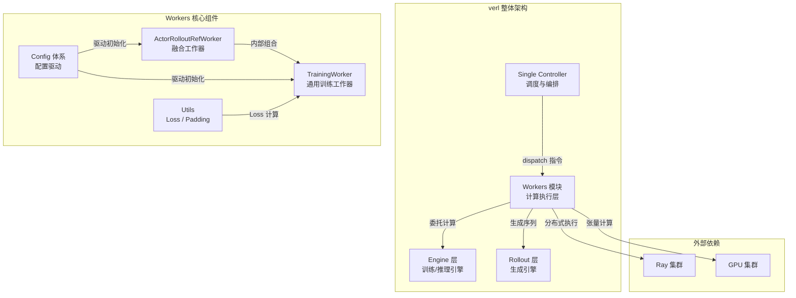
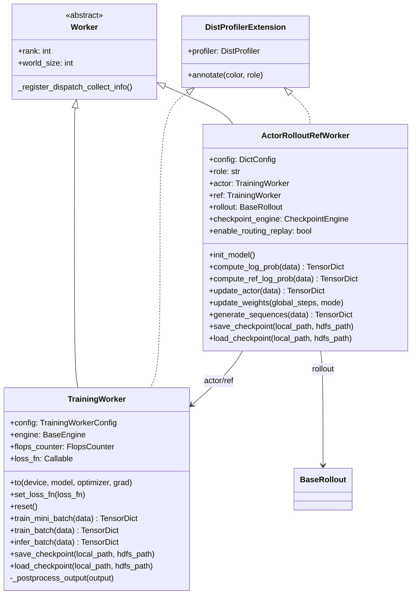

# verl Workers 模块详解

## 一、开篇概述

### 1.1 Workers 模块的核心价值

Workers 模块是 verl 框架的**计算执行层**，是将训练和推理任务封装为可分布式执行工作器的核心抽象。如果说 Single Controller 是 verl 的"大脑"负责调度决策，那么 Workers 就是"四肢"——真正执行模型训练、推理生成、权重同步等计算密集型任务的实体。

verl 的核心设计问题在于：**如何将 RLHF/GRPO 训练流程中的多种角色（Actor、Critic、Ref、Rollout）封装为可分布式执行的工作器，并支持灵活的融合与分离部署？** Workers 模块通过 `ActorRolloutRefWorker` 和 `TrainingWorker` 两个核心类，以及一套完善的配置体系，优雅地回答了这个问题。

### 1.2 全局架构位置



### 1.3 关键结论预览

1. **融合设计**：`ActorRolloutRefWorker` 将 Actor、Rollout、Ref 三种角色融合在同一个 Worker 进程中，通过 `role` 参数灵活控制激活哪些子模块，实现 GPU 显存复用和零拷贝权重同步。
2. **统一抽象**：`TrainingWorker` 提供了通用的训练/推理 API（`train_batch`、`infer_batch`），屏蔽了 FSDP/Megatron/VeOmni 等不同引擎后端的差异。
3. **配置驱动**：通过 `ActorConfig`、`CriticConfig`、`RolloutConfig` 等配置类，以声明式方式驱动引擎选择、并行策略和训练超参，实现了"配置即架构"。
4. **Router Replay**：针对 MoE 模型，通过 `_with_routing_replay_flag` 装饰器实现训练与推理间的路由一致性，保证 PPO 更新的正确性。

---

## 二、逐层展开

### 2.1 engine_workers.py 总览

`engine_workers.py` 是 Workers 模块的核心文件，定义了两个关键 Worker 类：`TrainingWorker` 和 `ActorRolloutRefWorker`。它们都继承自 `Worker` 基类（来自 `verl.single_controller.base`），并混入了 `DistProfilerExtension` 以支持分布式性能分析。



**类关系解读**：

- `TrainingWorker` 是**通用训练工作器**，封装了一个 `BaseEngine` 实例，提供 `train_batch` / `infer_batch` 等标准训练/推理接口。它既可以独立作为 Critic 工作器使用，也可以被 `ActorRolloutRefWorker` 内部组合使用。
- `ActorRolloutRefWorker` 是**融合工作器**，根据 `role` 参数（`"actor"` / `"rollout"` / `"ref"` / `"actor_rollout"` / `"actor_rollout_ref"`）决定激活哪些子模块。内部持有 `actor: TrainingWorker`、`ref: TrainingWorker`、`rollout: BaseRollout` 三个组件。
- 两者都混入 `DistProfilerExtension`，通过 `@DistProfiler.annotate()` 装饰器标注关键计算阶段，支持分布式性能追踪。

**Worker 生命周期**：`init_model()` → `compute_*()` / `train_*()` → `update_weights()` → `save/load_checkpoint()`

---

### 2.2 ActorRolloutRefWorker 详解

`ActorRolloutRefWorker` 是 verl PPO 训练的核心工作器，将 Actor（策略训练）、Rollout（序列生成）和 Ref（参考策略）三种角色融合在同一个 Ray Worker 进程中。

#### 2.2.1 生命周期状态图

```mermaid
stateDiagram-v2
    [*] --> Created: __init__(config, role)

    Created --> ModelInitialized: init_model()
    note right of ModelInitialized
        1. 构建 Ref TrainingWorker（如果 role 含 ref）
        2. 构建 Actor TrainingWorker（如果 role 含 actor）
        3. 构建 Rollout 引擎（如果 role 含 rollout）
        4. 构建 Checkpoint 引擎
    end

    ModelInitialized --> Computing: compute_* / train_*

    state Computing {
        [*] --> LogProbCompute: compute_log_prob()
        LogProbCompute --> RefLogProbCompute: compute_ref_log_prob()
        RefLogProbCompute --> ActorUpdate: update_actor()
    }

    Computing --> WeightSync: update_weights()
    note right of WeightSync
        同步模式: naive（进程内直接同步）
        异步模式: checkpoint_engine（跨进程传输）
        支持 LoRA base/adapter 分层同步
    end

    WeightSync --> Computing: 继续训练循环

    ModelInitialized --> Checkpoint: save/load_checkpoint()
    Checkpoint --> ModelInitialized

    Computing --> [*]: 训练结束
```

#### 2.2.2 init_model — 模型初始化

`init_model()` 是 `ActorRolloutRefWorker` 最关键的初始化方法，按序完成四个子步骤：

**步骤 1：构建 Ref 模型**（当 `role` 包含 `"ref"` 时）

```python
if "ref" in self.role:
    # 从 config.ref 构造 ActorConfig，再转换为 TrainingWorkerConfig
    ref_config: ActorConfig = omega_conf_to_dataclass(self.config.ref)
    ref_config.model_config = deepcopy(model_config)
    ref_config.model_config.mtp = MtpConfig(enable=False)  # Ref 不需要 MTP
    ref_training_config = TrainingWorkerConfig(...)
    self.ref = TrainingWorker(config=ref_training_config)
    self.ref.reset()  # 初始化引擎
```

Ref 模型是**仅推理**的，其 `engine_config.forward_only` 被设为 `True`，不需要优化器。它使用与 Actor 相同的模型架构，但禁用 MTP（Multi-Token Prediction）。

**步骤 2：构建 Actor 模型**（当 `role` 包含 `"actor"` 时）

```python
if "actor" in self.role:
    actor_config: ActorConfig = omega_conf_to_dataclass(self.config.actor)
    actor_training_config = TrainingWorkerConfig(...)
    # 设置 loss 函数
    if self.distillation_enabled:
        self.loss_fn = partial(distillation_ppo_loss, config=actor_config, distillation_config=distillation_config)
    else:
        self.loss_fn = partial(ppo_loss, config=actor_config)
    self.actor = TrainingWorker(config=actor_training_config)
    self.actor.reset()
    self.actor.set_loss_fn(self.loss_fn)
```

Actor 模型同时需要训练和推理能力。Loss 函数根据是否启用蒸馏来选择 `distillation_ppo_loss` 或 `ppo_loss`。

**步骤 3：构建 Rollout 引擎**（当 `role` 包含 `"rollout"` 时）

```python
if "rollout" in self.role:
    rollout_config: RolloutConfig = omega_conf_to_dataclass(self.config.rollout)
    # 构建 device mesh（dp × infer_tp × infer_pp）
    rollout_device_mesh = init_device_mesh(
        get_device_name(), mesh_shape=(dp, infer_tp, infer_pp),
        mesh_dim_names=["dp", "infer_tp", "infer_pp"]
    )
    # 通过工厂方法获取 Rollout 实现类
    rollout_cls: type[BaseRollout] = get_rollout_class(rollout_config.name, rollout_config.mode)
    self.rollout = rollout_cls(config=rollout_config, model_config=model_config, device_mesh=rollout_device_mesh)
```

Rollout 引擎通过 `get_rollout_class` 工厂方法动态选择实现（vLLM / SGLang / TRT-LLM / HF），并构建三维 device mesh 支持推理并行。

**步骤 4：构建 Checkpoint 引擎**

```python
if "actor" in self.role:
    self.checkpoint_engine = CheckpointEngineRegistry.new(backend, ...)
```

Checkpoint 引擎用于 Actor→Rollout 的权重同步，支持 naive / nccl / nixl / hccl 等后端。

#### 2.2.3 compute_log_prob — Actor 前向推理

```python
@register(dispatch_mode=make_nd_compute_dataproto_dispatch_fn(mesh_name="actor"))
@DistProfiler.annotate(color="blue", role="actor_compute_log_prob")
@_with_routing_replay_flag(enabled=True)
def compute_log_prob(self, data: TensorDict) -> TensorDict:
    output = self.actor.infer_batch(data)
    return output.cpu() if output is not None else None
```

关键设计：
- 使用 `make_nd_compute_dataproto_dispatch_fn(mesh_name="actor")` 实现数据并行分发
- `_with_routing_replay_flag(enabled=True)` 在 MoE 场景下启用路由重放标记
- 委托给 `TrainingWorker.infer_batch()` 执行实际推理

#### 2.2.4 compute_ref_log_prob — Ref 前向推理

```python
@register(dispatch_mode=make_nd_compute_dataproto_dispatch_fn(mesh_name="ref"))
@DistProfiler.annotate(color="olive", role="ref_compute_log_prob")
@_with_routing_replay_flag(enabled=False)
def compute_ref_log_prob(self, data: TensorDict) -> TensorDict:
    output = self.ref.infer_batch(data=data)
    return output.cpu() if output is not None else None
```

与 `compute_log_prob` 的区别：使用 `mesh_name="ref"` 的分发策略，且 `_with_routing_replay_flag(enabled=False)` —— Ref 模型不需要路由重放，因为它是参考策略，不参与 PPO 更新。

#### 2.2.5 update_weights — 权重更新

`update_weights()` 是 Actor→Rollout 权重同步的核心方法，支持两种模式：

**同步模式（naive）**：Actor 和 Rollout 共存于同一进程，直接从 Actor 引擎获取参数并写入 Rollout：

```python
# 1. 恢复 Rollout 权重内存（之前 sleep 释放了）
await self.rollout.resume(tags=["weights"])
# 2. 获取 Actor 参数（支持 LoRA 分层获取）
per_tensor_param, peft_config = self.actor.engine.get_per_tensor_param(...)
# 3. 更新 Rollout 权重
await self.rollout.update_weights(per_tensor_param, peft_config=peft_config, ...)
# 4. 恢复 KV Cache
await self.rollout.resume(tags=["kv_cache"])
```

**异步模式（checkpoint_engine）**：Actor 和 Rollout 分离部署，通过 CheckpointEngine 传输权重：

```python
per_tensor_param, _ = self.actor.engine.get_per_tensor_param()
await self.checkpoint_engine.send_weights(per_tensor_param, global_steps=global_steps)
```

**LoRA 支持**：当使用 LoRA 且 `peft_merge=False` 时，需要先同步 base 权重（仅首次），再同步 adapter 权重：

```python
if not self.peft_merge and peft_config is not None:
    do_lora_base_sync = not self.base_sync_done  # base 只需同步一次
if do_lora_base_sync:
    per_tensor_param_base, peft_config = self.actor.engine.get_per_tensor_param(base_sync_done=False)
    await self.rollout.update_weights(per_tensor_param_base, ...)
# 同步 adapter/merged 权重
await self.rollout.update_weights(per_tensor_param, base_sync_done=True, ...)
self.base_sync_done = True
```

#### 2.2.6 _with_routing_replay_flag 装饰器

```python
def _with_routing_replay_flag(enabled: bool):
    """Decorator to set 'enable_routing_replay' flag on the data TensorDict."""
    def decorator(func):
        @functools.wraps(func)
        def wrapper(self, data: TensorDict, *args, **kwargs):
            if self.enable_routing_replay:
                tu.assign_non_tensor_data(data, "enable_routing_replay", enabled)
            return func(self, data, *args, **kwargs)
        return wrapper
    return decorator
```

这是针对 MoE（Mixture of Experts）模型的关键机制。在 PPO 训练中，Actor 的 `compute_log_prob` 和 `update_actor` 需要使用与 Rollout 生成时相同的路由决策（`enabled=True`），而 Ref 模型的推理不需要（`enabled=False`）。这保证了训练和推理间专家路由的一致性，避免因路由差异导致的策略梯度偏差。

---

### 2.3 TrainingWorker 详解

`TrainingWorker` 是 verl 的通用训练工作器，封装了一个 `BaseEngine` 实例，提供标准的训练和推理 API。它既可以独立使用（如作为 Critic 工作器），也可以被 `ActorRolloutRefWorker` 内部组合使用。

#### 2.3.1 初始化流程

```python
class TrainingWorker(Worker, DistProfilerExtension):
    def __init__(self, config: TrainingWorkerConfig):
        Worker.__init__(self)
        initialize_global_process_group_ray()  # 初始化 Ray 分布式进程组
        set_numa_affinity()  # 绑定 NUMA 节点

        # 自动选择引擎后端（如果未显式指定）
        if self.engine_config is None:
            self.engine_config, self.optimizer_config = self.config.auto_select_engine_optim_fn(
                self.model_config, self.device_name
            )

        # 通过 EngineRegistry 创建引擎实例
        self.engine: BaseEngine = EngineRegistry.new(
            model_type=self.config.model_type,
            backend=self.engine_config.strategy,  # fsdp / megatron / veomni / torchtitan
            model_config=self.model_config,
            engine_config=self.engine_config,
            optimizer_config=self.optimizer_config,
            checkpoint_config=self.checkpoint_config,
        )
```

关键设计点：
- **自动引擎选择**：当 `engine_config` 为 None 时，通过 `auto_select_engine_optim_fn` 根据 `model_config` 和设备类型自动选择引擎后端
- **EngineRegistry 工厂模式**：通过 `strategy` 字符串（`"fsdp"` / `"megatron"` / `"veomni"` / `"torchtitan"` / `"automodel"`）动态创建对应的引擎实例
- **Dispatch 信息注册**：调用 `_register_dispatch_collect_info` 注册数据并行的分发/收集信息

#### 2.3.2 调用时序图

```mermaid
sequenceDiagram
    participant Controller as Single Controller
    participant ARR as ActorRolloutRefWorker
    participant Actor as TrainingWorker (Actor)
    participant Ref as TrainingWorker (Ref)
    participant Engine as BaseEngine
    participant Rollout as BaseRollout

    Note over Controller,Rollout: 初始化阶段
    Controller->>ARR: init_model()
    ARR->>Ref: TrainingWorker(config) + reset()
    ARR->>Actor: TrainingWorker(config) + reset() + set_loss_fn()
    ARR->>Rollout: get_rollout_class() + Rollout(config)

    Note over Controller,Rollout: PPO 训练循环
    Controller->>ARR: compute_log_prob(data)
    ARR->>Actor: infer_batch(data)
    Actor->>Engine: infer_batch(data, loss_function)
    Engine-->>Actor: output
    Actor-->>ARR: output.cpu()

    Controller->>ARR: compute_ref_log_prob(data)
    ARR->>Ref: infer_batch(data)
    Ref->>Engine: infer_batch(data, loss_function)
    Engine-->>Ref: output
    Ref-->>ARR: output.cpu()

    Controller->>ARR: update_actor(data)
    ARR->>Actor: train_mini_batch(data)
    Actor->>Actor: 拆分 mini-batch, 多 epoch 迭代
    loop 每个 mini-batch
        Actor->>Engine: train_batch(data, loss_function)
        Engine-->>Actor: output (loss, metrics)
    end
    Actor-->>ARR: aggregated output

    Note over Controller,Rollout: 权重同步
    Controller->>ARR: update_weights(global_steps)
    alt 同步模式 (naive)
        ARR->>Rollout: resume(tags=["weights"])
        ARR->>Actor: engine.get_per_tensor_param()
        ARR->>Rollout: update_weights(params)
        ARR->>Rollout: resume(tags=["kv_cache"])
    else 异步模式 (checkpoint_engine)
        ARR->>Actor: engine.get_per_tensor_param()
        ARR->>ARR: checkpoint_engine.send_weights(params)
    end
```

#### 2.3.3 train_mini_batch — 小批量训练

`train_mini_batch` 是 PPO 训练的核心入口，将一个 batch 拆分为多个 mini-batch，支持多 epoch 迭代：

```python
@register(dispatch_mode=make_nd_compute_dataproto_dispatch_fn(mesh_name="train"), blocking=False)
def train_mini_batch(self, data: TensorDict) -> TensorDict:
    # 解析训练参数
    mini_batch_size = tu.pop(data, key="mini_batch_size", default=None)
    num_mini_batch = tu.pop(data, key="num_mini_batch", default=None)
    epochs = tu.pop(data, key="epochs", default=1)

    # 构造数据迭代器
    dataloader = tu.make_iterator(data, mini_batch_size=mini_batch_size_per_gpu, epochs=epochs, seed=seed)

    with self.engine.train_mode():
        for batch_idx, mini_batch_td in enumerate(dataloader):
            # 统计全局 token 数（用于 MFU 计算）
            global_token_num = mini_batch_td["input_ids"].offsets().diff().tolist()
            # 执行单步训练
            actor_output = self.train_batch(mini_batch_td)
            output_lst.append(actor_output)
```

关键设计：
- **动态 batch size**：支持 `mini_batch_size` 或 `num_mini_batch` 两种方式指定
- **MFU 计算**：通过 `FlopsCounter` 估算模型算力利用率
- **LR 调度**：在最后一个 mini-batch 时更新学习率（`update_lr_scheduler=batch_idx == total_num_iterations - 1`）

#### 2.3.4 train_batch — 单步训练

```python
@register(dispatch_mode=make_nd_compute_dataproto_dispatch_fn(mesh_name="train"), blocking=False)
@DistProfiler.annotate(color="red", role="train_batch")
def train_batch(self, data: TensorDict) -> TensorDict:
    assert self.loss_fn is not None
    with self.engine.train_mode():
        output = self.engine.train_batch(data, loss_function=self.loss_fn)
    # 后处理：聚合 loss、metrics、MFU 等
    final_output = self._postprocess_output(output, ...)
    return final_output
```

`_postprocess_output` 负责：
1. **Loss 聚合**：跨 DP 组 all_reduce 求平均
2. **Metrics 收集**：跨 DP 组 all_gather，包含 grad_norm、lr、内存使用等
3. **MFU 估算**：基于 global_token_num 和 delta_time 计算模型算力利用率

#### 2.3.5 infer_batch — 推理

```python
@register(dispatch_mode=make_nd_compute_dataproto_dispatch_fn(mesh_name="train"), blocking=False)
def infer_batch(self, data: TensorDict) -> TensorDict:
    loss_function = self.loss_fn if compute_loss else None
    with self.engine.eval_mode():
        adapter_ctx = self.engine.disable_adapter() if no_lora_adapter else nullcontext()
        with adapter_ctx:
            output = self.engine.infer_batch(data, loss_function=loss_function)
```

推理模式支持：
- **可选 Loss 计算**：`compute_loss` 控制是否在推理时计算 loss（SFT 评估需要）
- **LoRA 适配器控制**：`no_lora_adapter` 可临时禁用 LoRA，获取 base 模型的推理结果
- **独立的 micro batch 配置**：推理使用 `infer_micro_batch_size_per_gpu` 和 `infer_max_token_len_per_gpu`，与训练配置解耦

#### 2.3.6 DistProfilerExtension 集成

`TrainingWorker` 和 `ActorRolloutRefWorker` 都混入了 `DistProfilerExtension`，通过 `@DistProfiler.annotate()` 装饰器标注关键计算阶段：

| 方法 | 颜色 | 角色 |
|------|------|------|
| `train_batch` | red | train_batch |
| `infer_batch` (actor) | blue | actor_compute_log_prob |
| `infer_batch` (ref) | olive | ref_compute_log_prob |
| `update_actor` | red | actor_update |

这些标注在分布式性能分析时，可以精确追踪每个阶段的耗时和资源使用。

---

### 2.4 Worker 配置体系

verl 的 Workers 模块采用**配置驱动**的设计，通过一套层次化的配置类控制 Worker 的行为。

#### 2.4.1 配置类继承图

```
BaseConfig
├── ActorConfig
│   ├── FSDPActorConfig (strategy="fsdp")
│   ├── McoreActorConfig (strategy="megatron")
│   ├── VeOmniActorConfig (strategy="veomni")
│   ├── TorchTitanActorConfig (strategy="torchtitan")
│   └── MindSpeedActorConfig (strategy="mindspeed")
├── CriticConfig
│   ├── FSDPCriticConfig
│   ├── McoreCriticConfig
│   ├── VeOmniCriticConfig
│   ├── TorchTitanCriticConfig
│   └── MindSpeedCriticConfig
├── EngineConfig
│   ├── FSDPEngineConfig
│   ├── McoreEngineConfig
│   ├── VeOmniEngineConfig
│   ├── TorchtitanEngineConfig
│   ├── AutomodelEngineConfig
│   └── MindSpeedEngineConfig
├── HFModelConfig
├── RolloutConfig
├── OptimizerConfig
│   ├── FSDPOptimizerConfig
│   ├── McoreOptimizerConfig
│   ├── VeOmniOptimizerConfig
│   ├── TorchtitanOptimizerConfig
│   └── AutomodelOptimizerConfig
└── TrainingWorkerConfig
```

#### 2.4.2 ActorConfig — Actor 配置

`ActorConfig` 是 Actor 模型的核心配置，包含 PPO 训练的所有超参数：

| 配置项 | 默认值 | 说明 |
|--------|--------|------|
| `strategy` | MISSING（必填） | 训练策略：fsdp / megatron / veomni / torchtitan |
| `ppo_mini_batch_size` | 256 | PPO mini-batch 大小 |
| `ppo_micro_batch_size_per_gpu` | None | 每 GPU micro-batch 大小 |
| `use_dynamic_bsz` | False | 是否使用动态 batch size |
| `ppo_max_token_len_per_gpu` | 16384 | 每 GPU 最大 token 长度 |
| `clip_ratio` | 0.2 | PPO 裁剪比率 |
| `entropy_coeff` | 0 | 熵正则系数 |
| `use_kl_loss` | False | 是否使用 KL 散度损失 |
| `kl_loss_coef` | 0.001 | KL 损失系数 |
| `ppo_epochs` | 1 | PPO 训练轮数 |
| `loss_agg_mode` | "token-mean" | 损失聚合模式 |
| `policy_loss` | PolicyLossConfig | 策略损失配置 |

**策略子类**通过 `__post_init__` 将特定引擎配置绑定到 `engine` 字段：

```python
class FSDPActorConfig(ActorConfig):
    strategy: str = "fsdp"
    fsdp_config: FSDPEngineConfig = field(default_factory=FSDPEngineConfig)
    def __post_init__(self):
        super().__post_init__()
        self.engine = self.fsdp_config  # 将 FSDP 配置绑定到 engine
```

#### 2.4.3 CriticConfig — Critic 配置

`CriticConfig` 与 `ActorConfig` 结构类似，但增加了 Critic 特有的参数：

| 配置项 | 默认值 | 说明 |
|--------|--------|------|
| `cliprange_value` | 0.5 | 值函数裁剪范围 |
| `ppo_max_token_len_per_gpu` | 32768 | Critic 通常需要更大的 token 限制 |
| `enable` | None | 是否启用 Critic（None 表示自动判断） |

#### 2.4.4 EngineConfig — 引擎配置

`EngineConfig` 是所有引擎后端的基类配置，定义了通用的引擎参数：

| 配置项 | 默认值 | 说明 |
|--------|--------|------|
| `param_offload` | False | 参数 CPU 卸载 |
| `optimizer_offload` | False | 优化器 CPU 卸载 |
| `grad_offload` | False | 梯度 CPU 卸载 |
| `forward_only` | False | 是否仅推理（Ref 模型） |
| `strategy` | None | 引擎后端标识 |
| `dtype` | "bfloat16" | 训练精度 |
| `use_dynamic_bsz` | True | 动态 batch size |
| `use_remove_padding` | True | 移除 padding 优化 |

**引擎子类**的特有配置：

- **McoreEngineConfig**：TP/PP/CP/EP 并行度、分布式优化器、MBridge 等
- **FSDPEngineConfig**：wrap policy、reshard 策略、Ulysses SP 等
- **VeOmniEngineConfig**：FSDP2 + SP、注意力/MoE 实现选择、算子后端选择等
- **TorchtitanEngineConfig**：DP/TP/PP/CP 并行度、注意力类型等
- **AutomodelEngineConfig**：NeMo AutoModel 后端、分布式策略选择等

#### 2.4.5 HFModelConfig — 模型配置

`HFModelConfig` 封装了 HuggingFace 模型的加载和配置：

| 配置项 | 说明 |
|--------|------|
| `path` | 模型路径（必填） |
| `model_type` | 模型类型：language_model / value_model |
| `lora_rank` | LoRA 秩（0 表示不使用） |
| `use_remove_padding` | 是否移除 padding |
| `enable_gradient_checkpointing` | 梯度检查点 |
| `mtp` | MTP（Multi-Token Prediction）配置 |
| `hf_config` | 自动加载的 HuggingFace 配置 |

`HFModelConfig.__post_init__` 完成模型路径本地化、tokenizer 加载、HF Config 构建等初始化工作。

#### 2.4.6 RolloutConfig — Rollout 配置

`RolloutConfig` 控制推理生成的所有参数：

| 配置项 | 默认值 | 说明 |
|--------|--------|------|
| `name` | MISSING（必填） | Rollout 实现：vllm / sglang / hf / trtllm |
| `tensor_model_parallel_size` | 2 | 推理 TP 并行度 |
| `data_parallel_size` | 1 | 推理 DP 并行度 |
| `gpu_memory_utilization` | 0.5 | GPU 显存利用率 |
| `free_cache_engine` | True | 是否在 sleep 时释放 KV Cache |
| `load_format` | "dummy" | 权重加载格式 |
| `checkpoint_engine` | CheckpointEngineConfig | 权重同步引擎配置 |
| `multi_turn` | MultiTurnConfig | 多轮对话配置 |
| `agent` | AgentLoopConfig | Agent 循环配置 |

#### 2.4.7 配置如何驱动引擎选择

配置驱动的引擎选择遵循以下流程：

```
用户 YAML 配置
    ↓
actor.strategy = "fsdp"  →  FSDPActorConfig  →  engine = FSDPEngineConfig
actor.strategy = "megatron"  →  McoreActorConfig  →  engine = McoreEngineConfig
actor.strategy = "veomni"  →  VeOmniActorConfig  →  engine = VeOmniEngineConfig
    ↓
TrainingWorkerConfig(engine_config=engine)
    ↓
EngineRegistry.new(backend=engine_config.strategy, ...)
    ↓
具体引擎实例（FSDPEngine / McoreEngine / VeOmniEngine / ...）
```

`strategy` 字段是整个链条的起点，它决定了使用哪个 ActorConfig 子类，进而决定了哪个 EngineConfig，最终通过 `EngineRegistry` 创建对应的引擎实例。

---

### 2.5 Worker 工具

#### 2.5.1 losses.py — PPO Loss 计算

`losses.py` 提供了三种损失函数，供 `TrainingWorker` 的 `loss_fn` 使用：

**ppo_loss — PPO 策略损失**

```python
def ppo_loss(config: ActorConfig, model_output, data: TensorDict, dp_group=None):
    log_prob = no_padding_2_padding(model_output["log_probs"], data)
    # 获取策略损失函数（vanilla / clip-cov / kl-cov / gpg）
    policy_loss_fn = get_policy_loss_fn(loss_mode)
    pg_loss, pg_metrics = policy_loss_fn(old_log_prob, log_prob, advantages, response_mask, ...)
    # 可选：熵正则
    if entropy is not None:
        policy_loss -= entropy_coeff * entropy_loss
    # 可选：KL 损失
    if config.use_kl_loss:
        kld = kl_penalty(logprob=log_prob, ref_logprob=ref_log_prob, ...)
        policy_loss += kl_loss * kl_loss_coef
    return policy_loss, metrics
```

核心流程：
1. 将模型输出的 `log_probs` 从 no-padding 格式转换为 padding 格式
2. 通过 `get_policy_loss_fn` 获取策略损失函数（支持 vanilla / clip-cov / kl-cov / gpg 四种模式）
3. 计算策略梯度损失（PPO clip）
4. 可选添加熵正则和 KL 散度损失
5. 返回总损失和 metrics 字典

**value_loss — Critic 值函数损失**

```python
def value_loss(config: CriticConfig, model_output, data: TensorDict, dp_group=None):
    vpreds = no_padding_2_padding(model_output["values"], data)
    vf_loss, vf_clipfrac = compute_value_loss(vpreds, values, returns, response_mask, cliprange_value, ...)
    return vf_loss, metrics
```

值函数损失使用裁剪值函数（clipped value function）目标，防止值函数更新过大。

**sft_loss — SFT 损失**

```python
def sft_loss(config: ActorConfig, model_output, data: TensorDict, dp_group=None):
    log_prob = model_output["log_probs"]
    loss = -masked_sum(log_prob_flatten, loss_mask_flatten) / batch_num_tokens * dp_size
    return loss, {}
```

SFT 损失是简单的负对数似然损失，支持 no-padding 和 padding 两种格式。

#### 2.5.2 padding.py — 填充工具

`padding.py` 提供了 verl 特有的 padding/no-padding 格式转换工具，是 Workers 数据处理的基础设施。

**left_right_2_no_padding — 从 padding 转换为 no-padding**

```python
def left_right_2_no_padding(data: TensorDict) -> TensorDict:
    # 输入：标准 padding 格式 (bsz, max_seq_len)
    # 输出：NestedTensor 格式（无 padding，变长序列）
    input_ids_rmpad, indices, cu_seqlens, *_ = unpad_input(input_ids.unsqueeze(-1), attention_mask)
    input_ids_nested = torch.nested.nested_tensor_from_jagged(input_ids_rmpad.squeeze(-1), offsets=cu_seqlens)
```

转换过程：
1. 使用 `unpad_input` 移除 padding，获取紧凑张量和索引
2. 使用 `nested_tensor_from_jagged` 构建 NestedTensor（Jagged Layout）
3. 同步转换 `position_ids`、`routed_experts`、`teacher_logprobs` 等字段
4. 附加 `max_seq_len`、`max_response_len`、`indices` 等元数据

**no_padding_2_padding — 从 no-padding 转换为 padding**

```python
def no_padding_2_padding(tensor: torch.Tensor, data: TensorDict) -> torch.Tensor:
    # 输入：NestedTensor 或紧凑张量 (total_nnz, *)
    # 输出：标准 padding 格式 (bsz, max_response_len, *)
    for resp_len, seq_offset in zip(response_lens, sequence_offsets):
        pad_size = max_response_len - resp_len
        response_list.append(F.pad(values[seq_offset - resp_len - 1 : seq_offset - 1], (0, 0, 0, pad_size)))
    output = torch.stack(response_list, dim=0)
```

关键设计：
- **左移一位**：`seq_offset - resp_len - 1 : seq_offset - 1` 实现了 log_probs/values 的左移对齐（因为第 t 个 token 的 log_prob 对应第 t+1 个 token 的预测）
- **右填充**：使用 `F.pad` 将变长序列填充到 `max_response_len`

**为什么需要两种格式？**

- **No-padding（NestedTensor）**：用于引擎内部计算，避免 padding token 的无效计算，提升训练效率
- **Padding（标准张量）**：用于 Loss 计算和 Metrics 聚合，方便 `response_mask` 等掩码操作

这种设计使得 verl 在保持计算效率的同时，不失 Loss 计算的便利性。

---

## 三、总结升华

### 3.1 核心设计要点回顾

1. **融合工作器模式**：`ActorRolloutRefWorker` 通过 `role` 参数灵活组合 Actor/Rollout/Ref 三种角色，在同一个 Worker 进程中实现 GPU 显存复用和零拷贝权重同步。

2. **统一训练抽象**：`TrainingWorker` 封装了 `BaseEngine`，通过 `EngineRegistry` 工厂模式屏蔽了 FSDP/Megatron/VeOmni/TorchTitan 等引擎后端的差异，提供统一的 `train_batch` / `infer_batch` API。

3. **配置驱动架构**：通过 `ActorConfig` → `EngineConfig` → `EngineRegistry` 的配置链条，实现了"配置即架构"——修改 YAML 配置即可切换引擎后端，无需修改代码。

4. **MoE 路由一致性**：`_with_routing_replay_flag` 装饰器确保 MoE 模型在训练和推理间使用一致的路由决策，避免策略梯度偏差。

5. **灵活的权重同步**：`update_weights` 支持 naive（进程内直接同步）和 checkpoint_engine（跨进程传输）两种模式，以及 LoRA base/adapter 分层同步。

### 3.2 Worker 融合设计的优势

| 维度 | 融合设计（verl） | 分离设计 |
|------|------------------|----------|
| **显存效率** | Actor/Rollout/Ref 共享 GPU，通过 sleep/wake 机制时分复用 | 每个角色独占 GPU，显存利用率低 |
| **权重同步** | 进程内直接获取参数，零拷贝，延迟极低 | 需要跨进程/跨节点传输，延迟高 |
| **部署灵活性** | 通过 `role` 参数灵活组合，同一代码支持多种部署模式 | 需要为每种部署模式维护独立代码 |
| **代码复杂度** | 融合逻辑集中在 `ActorRolloutRefWorker`，内部组合 `TrainingWorker` | 各角色独立实现，但需要额外的通信层 |
| **调试难度** | 所有角色在同一进程，便于断点调试 | 分布式调试复杂，需要追踪跨进程交互 |

### 3.3 与分离式设计的对比

传统的 RLHF 框架（如 TRL、OpenRLHF）通常将 Actor、Critic、Ref、Rollout 作为独立的服务部署，通过 RPC 或共享存储进行通信。verl 的融合设计在**同步训练**场景下具有显著优势：

- **零通信开销**：Actor→Rollout 权重同步在进程内完成，无需序列化/反序列化
- **显存时分复用**：Rollout 生成时 Actor sleep 释放显存，Actor 训练时 Rollout sleep 释放 KV Cache
- **简化部署**：一个 Ray Actor 即可承载多种角色，减少集群资源碎片

但在**异步训练**场景下，verl 也通过 `checkpoint_engine` 支持分离式部署，此时 Actor 和 Rollout 运行在不同进程/节点上，通过 NCCL/NIXL 等高速传输协议同步权重。这种设计使得 verl 能够在同一个框架内同时支持同步和异步两种训练范式，兼顾了效率和灵活性。
