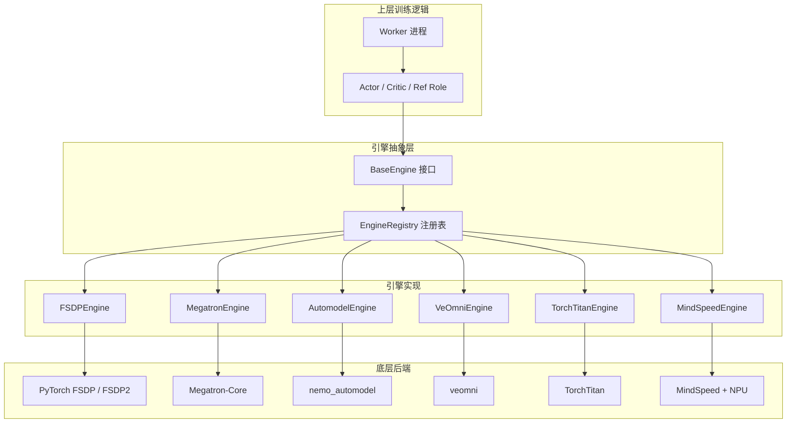
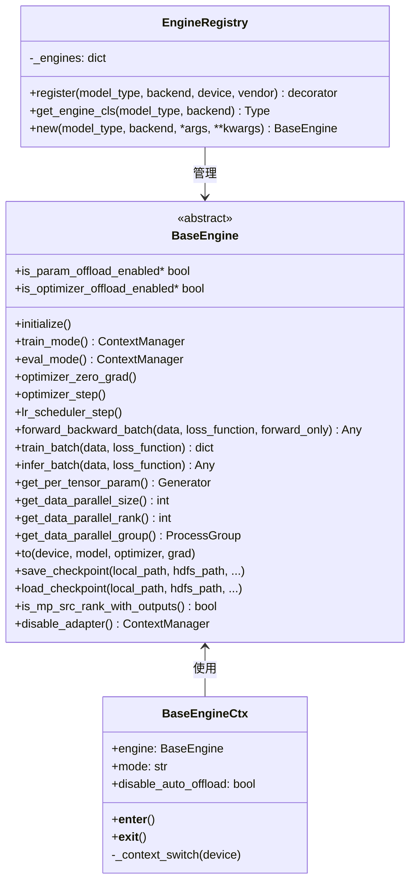
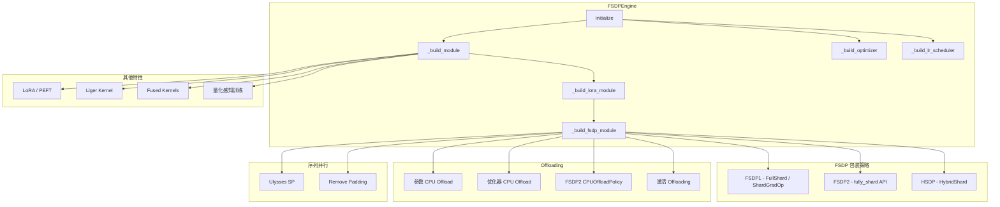
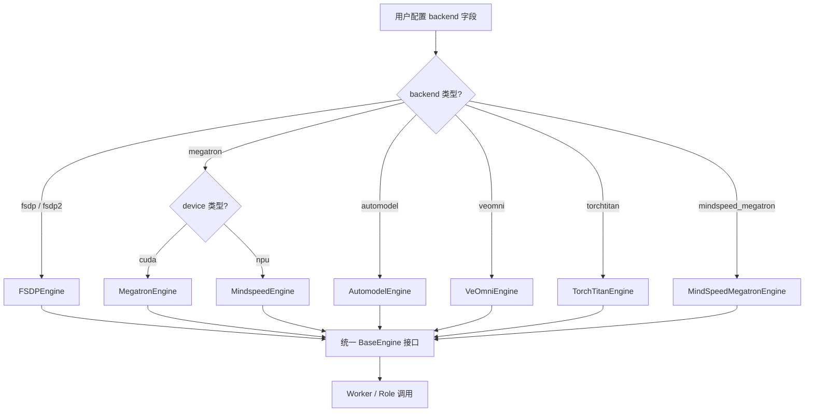

# verl 模型引擎详解

## 一、开篇概述

### 1.1 引擎层的核心价值

在 LLM 训练框架中，**模型引擎**（Engine）是连接上层训练逻辑与底层分布式后端的关键抽象层。verl 的引擎层将 FSDP、Megatron、TorchTitan 等截然不同的分布式训练方案统一到一套标准接口之下，使上层 Worker / Role 无需关心底层并行策略的实现细节。

**核心问题**：verl 如何统一多种训练后端（FSDP / Megatron / Automodel / VeOmni / TorchTitan / MindSpeed）的接口？

**答案**：通过 `BaseEngine` 抽象基类定义统一的生命周期接口，通过 `EngineRegistry` 注册机制实现后端的按需发现与实例化，各引擎子类在统一接口下封装各自的分布式策略细节。

### 1.2 全局架构概览



### 1.3 关键结论预览

1. **统一接口**：`BaseEngine` 定义了 `initialize`、`train_batch`、`infer_batch`、`forward_backward_batch` 等核心方法，所有引擎遵循同一契约。
2. **注册驱动**：`EngineRegistry` 以 `(model_type, backend, device, vendor)` 四元组为键，支持运行时按环境自动选择引擎。
3. **继承复用**：VeOmni 继承 FSDP，MindSpeed 继承 Megatron，通过继承而非重写实现扩展。
4. **配置切换**：用户仅需修改配置中的 `backend` 字段即可切换引擎，无需改动训练代码。

---

## 二、逐层展开

### 2.1 引擎基类 base.py

#### 2.1.1 BaseEngine 接口定义

`BaseEngine` 是所有引擎的抽象基类，定义了模型训练的完整生命周期接口：



**核心方法说明**：

| 方法 | 用途 |
|------|------|
| `initialize()` | 构建模型、优化器、学习率调度器 |
| `train_batch()` | 完整训练步骤：zero_grad → forward_backward → optimizer_step |
| `infer_batch()` | 推理步骤：no_grad 下执行 forward_backward |
| `forward_backward_batch()` | 前向+可选反向，各引擎的核心差异化实现 |
| `train_mode()` / `eval_mode()` | 上下文管理器，处理 offloading 和模式切换 |
| `save_checkpoint()` / `load_checkpoint()` | 检查点持久化 |

`train_batch` 和 `infer_batch` 在基类中提供了默认实现，内部调用 `forward_backward_batch`，子类只需实现后者即可。`train_batch` 还会自动将 `grad_norm` 写入 metrics。

#### 2.1.2 BaseEngineCtx 上下文管理

`BaseEngineCtx` 是引擎模式切换的上下文管理器基类，核心逻辑在 `_context_switch` 中：

- **进入上下文**：根据模式（train/eval）将模型、优化器、梯度从 CPU 加载到 GPU
- **退出上下文**：将模型、优化器、梯度卸载回 CPU（实现 CPU Offloading）

这确保了在 offload 场景下，模型参数只在需要时驻留 GPU，节省显存。

#### 2.1.3 EngineRegistry 注册机制

`EngineRegistry` 是引擎的注册中心，采用装饰器模式注册引擎类：

```python
@EngineRegistry.register(model_type="language_model", backend=["fsdp", "fsdp2"], device=["cuda", "npu"])
class FSDPEngineWithLMHead(FSDPEngine):
    ...
```

**注册键结构**：`_engines[model_type][backend][(device, vendor)]` → 引擎类

**查找优先级**（`get_engine_cls`）：
1. 精确匹配 `(device, vendor)` 组合
2. 回退到仅 `device` 匹配（vendor=None 注册的引擎）
3. 对 CUDA 兼容厂商回退到 `(cuda, nvidia)`
4. 支持环境变量 `VERL_ENGINE_DEVICE` / `VERL_ENGINE_VENDOR` 覆盖自动检测

#### 2.1.4 引擎工具函数（utils.py）

`engine/utils.py` 提供了所有引擎共享的工具函数：

- **`enable_full_determinism(seed)`**：设置全链路确定性，包括 Python/NumPy/PyTorch 随机种子、CUBLAS/CUDNN 确定性模式、NPU 的 HCCL 确定性模式
- **`prepare_micro_batches(data, ...)`**：将数据拆分为 micro-batch，支持动态 batch size 平衡和序列并行
- **`postprocess_batch_func(output_lst, indices, data)`**：后处理 micro-batch 输出，合并 model_output、loss、metrics

---

### 2.2 FSDP 引擎

#### 2.2.1 FSDP 架构图



#### 2.2.2 FSDPEngine 核心实现

**初始化流程**（`__init__` → `initialize`）：

1. **`_init_device_mesh()`**：创建分布式设备网格，支持 1D（纯 FSDP）和 2D（HSDP: ddp + fsdp）拓扑。若启用 Ulysses SP，额外创建 `(dp, sp)` 网格。
2. **`_build_module()`**：从 HuggingFace 加载预训练模型，应用 monkey patch（remove padding、fused kernels）、Liger kernel、梯度检查点等。
3. **`_build_lora_module()`**：若 `lora_rank > 0`，通过 PEFT 库包装 LoRA 适配器。
4. **`_build_fsdp_module()`**：核心 FSDP 包装步骤，根据 `fsdp_version()` 判断使用 FSDP1 还是 FSDP2 API：
   - **FSDP1**：使用 `FullyShardedDataParallel` 包装，配置 `MixedPrecision`、`CPUOffload`、wrap policy
   - **FSDP2**：使用 `apply_fsdp2()` + `MixedPrecisionPolicy` + `CPUOffloadPolicy`
5. **`_build_optimizer()`** / **`_build_lr_scheduler()`**：构建优化器和学习率调度器

**FSDP 包装策略**（`fsdp/utils.py`）：

- `create_device_mesh(world_size, fsdp_size)`：根据 fsdp_size 创建 1D 或 2D 设备网格
- `get_sharding_strategy(device_mesh, zero3_enable)`：
  - 1D 网格 → `FULL_SHARD`（ZeRO-3）或 `SHARD_GRAD_OP`（ZeRO-2）
  - 2D 网格 → `HYBRID_SHARD` 或 `_HYBRID_SHARD_ZERO2`

**FSDP2 支持**：verl 通过 `fsdp_version()` 检测 PyTorch 版本，自动选择 FSDP1 或 FSDP2 API。FSDP2 使用 `apply_fsdp2()` 进行模块级 `fully_shard`，支持 `CPUOffloadPolicy` 实现更高效的 CPU Offloading。

**CPU Offloading**：
- FSDP1：通过 `CPUOffload(offload_params=True)` 实现
- FSDP2：通过 `CPUOffloadPolicy` 实现，在 `_build_fsdp_module` 中设置 `_uses_fsdp2_cpu_offload_policy = True`
- 模型/优化器的 GPU↔CPU 迁移由 `load_fsdp_model_to_gpu` / `offload_fsdp_model_to_cpu` 等工具函数完成

**序列并行（Ulysses SP）**：
- 通过 `ulysses_sequence_parallel_size` 配置 SP 大小
- 在 `forward_backward_batch` 中对输入进行 `ulysses_pad_and_slice_inputs` 切分
- 输出通过 `gather_outputs_and_unpad` 聚合
- 要求 `use_remove_padding=True`

#### 2.2.3 FSDPEngineWithLMHead / FSDPEngineWithValueHead

FSDP 引擎通过两个子类区分模型类型：

- **`FSDPEngineWithLMHead`**：语言模型，注册为 `(language_model, fsdp/fsdp2, cuda/npu)`。实现 `prepare_model_inputs` / `prepare_model_outputs`，处理 remove padding、temperature、log_probs 计算等。
- **`FSDPEngineWithValueHead`**：价值模型，注册为 `(value_model, fsdp/fsdp2, cuda/npu)`。在 forward 中额外计算 value head 输出。

---

### 2.3 Megatron 引擎

#### 2.3.1 MegatronEngine 核心实现

Megatron 引擎是 verl 中功能最丰富的引擎，支持张量并行（TP）、流水线并行（PP）、专家并行（EP）、上下文并行（CP）和序列并行（SP）。

**初始化流程**：

1. **`_init_device_mesh()`**：调用 `mpu.initialize_model_parallel()` 初始化 Megatron 的并行状态，配置 TP/PP/EP/CP 大小
2. **`_build_tf_config()`**：通过 Megatron-Bridge（`AutoBridge`）将 HuggingFace 配置转换为 Megatron `TransformerConfig`，支持 vanilla_mbridge 和新版 bridge 两种模式
3. **`_build_megatron_module()`**：使用 `make_megatron_module` 构建 Megatron 模型，加载权重（支持 HF 权重和分布式检查点）
4. **`_build_optimizer()`** / **`_build_lr_scheduler()`**：使用 Megatron 的优化器和调度器

**张量并行 / 流水线并行**：

- TP 通过 `tensor_model_parallel_size` 配置，Megatron 自动切分线性层权重
- PP 通过 `pipeline_model_parallel_size` 配置，使用 `get_forward_backward_func()` 获取 PP 调度器
- VP（虚拟流水线并行）通过 `virtual_pipeline_model_parallel_size` 配置
- EP（专家并行）通过 `expert_model_parallel_size` 和 `expert_tensor_parallel_size` 配置

**序列并行**：通过 `sequence_parallel=True` 启用，Megatron 在 TP 组内对 LayerNorm 和 Dropout 的激活进行切分，减少通信量。

**上下文并行（CP）**：通过 `context_parallel_size` 配置，支持动态上下文并行（`dynamic_context_parallel`），在长序列训练中将序列沿时间维度切分到多个 CP rank。

**Router Replay**：针对 MoE 模型的优化，在 forward 时记录路由决策，在 backward 时重放，避免 forward 和 backward 的路由不一致导致的训练不稳定。

#### 2.3.2 MegatronEngineWithLMHead / MegatronEngineWithValueHead

- **`MegatronEngineWithLMHead`**：注册为 `(language_model, megatron)`。`forward_step` 中处理输入准备、logits 处理（vocab parallel log_probs / entropy）、fused kernels 等。
- **`MegatronEngineWithValueHead`**：注册为 `(value_model, megatron)`。在 forward 中使用 `value_model=True` 调用 forward 函数。

#### 2.3.3 Megatron 工具函数（megatron/utils.py）

- **`set_random_seed(seed)`**：设置 Megatron 的随机种子，包括 TP 组的 CUDA 手动种子

---

### 2.4 Automodel 引擎

#### 2.4.1 AutomodelEngine 实现

Automodel 引擎基于 NVIDIA 的 `nemo_automodel` 库，将模型构建、并行化、优化器分片、检查点等委托给 Automodel 基础设施，同时使用 verl 的训练循环和数据管道。

**核心特性**：

- **分布式策略**：支持 `fsdp2`、`megatron_fsdp`、`ddp` 三种策略（通过 `build_distributed_config_from_engine_config` 构建）
- **设备网格**：通过 `nemo_automodel` 的 `create_device_mesh` 创建，支持 TP/PP/CP/EP/DP 多维网格
- **模型构建**：使用 `NeMoAutoModelForCausalLM.from_pretrained()` 加载模型，自动应用分布式配置
- **FP8 量化**：通过 `enable_fp8` 配置启用
- **Torch Compile**：通过 `enable_compile` 配置启用
- **MoE 支持**：通过 `ep_size > 1` 启用专家并行，配置 `MoEParallelizerConfig`

**注册**：`(language_model, automodel, cuda)`

#### 2.4.2 Automodel 工具函数（automodel/utils.py）

- **`build_distributed_config_from_engine_config()`**：根据配置构建 FSDP2Config / MegatronFSDPConfig / DDPConfig
- **`build_automodel_model()`**：使用 `NeMoAutoModelForCausalLM.from_pretrained()` 构建模型
- **`maybe_fully_shard_optimizer()`**：对 MegatronFSDP 策略调用 `fully_shard_optimizer`
- **`offload_automodel_model_to_cpu()` / `load_automodel_model_to_gpu()`**：FSDP2 模型的 CPU/GPU 迁移，使用 `reshard()` + `model.cpu()` / `model.to(device)`

---

### 2.5 VeOmni 引擎

#### 2.5.1 VeOmniEngine 实现

VeOmni 引擎继承自 `FSDPEngine`，专门用于多模态模型（视觉-语言模型）的支持。它复用了 FSDP 的核心基础设施，在此基础上添加了多模态特有的输入处理逻辑。

**核心特性**：

- **继承 FSDPEngine**：复用 FSDP 的模型构建、优化器、检查点等逻辑
- **多模态输入处理**：`_apply_veomni_input_transforms` 处理图像/视频掩码、序列并行分片、Flash Attention 参数
- **视觉模型类型映射**：`VL_TYPE2INDEX` 定义了 `qwen2_5_vl`、`qwen3_vl`、`qwen3_5` 等模型的图像/视频 token 索引
- **VeOmni 并行状态**：使用 `veomni.distributed.parallel_state` 管理序列并行
- **Router Replay**：支持 MoE 模型的路由重放（`VeOmniRouterReplay`）
- **激活 Offloading**：通过 `veomni.distributed.offloading.build_activation_offloading_context` 实现

**注册**：`(language_model/value_model, veomni, cuda/npu)`

#### 2.5.2 VeOmni 工具函数（veomni/utils.py）

- **`VL_TYPE2INDEX`**：视觉模型类型到图像/视频输入索引的映射
- **`MOE_PARAM_HANDERS`**：MoE 模型参数处理函数映射，支持 `qwen3_moe`、`deepseek_v3`、`qwen3_5_moe`
- **`offload_veomni_model_to_cpu()` / `load_veomni_model_to_gpu()`**：FSDP2 模型的 CPU/GPU 迁移
- **`offload_veomni_optimizer()` / `load_veomni_optimizer()`**：支持 MultiOptimizer（EP+FSDP2 场景）的优化器迁移

---

### 2.6 TorchTitan 引擎

#### 2.6.1 TorchTitanEngine 实现

TorchTitan 引擎基于 PyTorch 官方的 TorchTitan 项目，使用 FSDP2 + TP + PP 的原生分布式方案。

**核心特性**：

- **FSDP2 + TP + PP**：使用 TorchTitan 的 `ParallelDims` 和 `Trainer` 管理分布式
- **模型映射**：`_HF_MODEL_TYPE_TO_TORCHTITAN_NAME` 将 HuggingFace 模型类型映射到 TorchTitan 模型名（如 `qwen2` → `qwen3`，`llama` → `llama3`）
- **Flavor 自动推导**：`derive_torchtitan_name_and_flavor` 根据 hidden_size / num_layers / vocab_size 自动匹配模型配置
- **注意力掩码**：支持 `flex`（FlexAttention）和 `varlen`（变长注意力）两种掩码类型
- **梯度除法重启用**：`enable_fsdp_gradient_division` 重新启用 FSDP 的自动梯度除法，确保 verl 的 loss 缩放正确
- **Expert Parallel**：`iter_per_tensor_params_ep` 支持按层/权重类型逐步 all-gather 专家权重，避免 OOM

**注册**：`(language_model, torchtitan, cuda/npu)`

#### 2.6.2 TorchTitan 工具函数（torchtitan/utils.py）

- **`NoOpDataLoader`**：空数据加载器，满足 TorchTitan Trainer 接口但实际由 verl 管理数据
- **`derive_torchtitan_name_and_flavor()`**：从 HuggingFace 配置推导 TorchTitan 模型名和 flavor
- **`enable_fsdp_gradient_division()`**：重新启用 FSDP 梯度除法
- **`get_attention_masks()`**：创建 FlexAttention 或 Varlen 注意力掩码
- **`iter_per_tensor_params_ep()`**：带 Expert Parallel 的参数迭代器

---

### 2.7 MindSpeed 引擎

#### 2.7.1 MindSpeed 引擎实现

MindSpeed 引擎是华为 NPU（Ascend）适配层，继承自 Megatron 引擎，通过 MindSpeed 的 patch 机制适配 NPU 硬件。

**核心类**：

- **`MindspeedEngineWithLMHead`**：注册为 `(language_model, megatron, npu)`，在 NPU 上使用 Megatron 后端
- **`MindspeedEngineWithValueHead`**：注册为 `(value_model, megatron, npu)`
- **`MindSpeedMegatronEngineWithLMHead`**：注册为 `(language_model, mindspeed_megatron, npu)`，使用 MindSpeed 自有的 Megatron 适配

**关键逻辑**：

- **`_mindspeed_repatch()`**：在 `_init_device_mesh` 之前调用 MindSpeed 的 `repatch`，确保 CP 相关的 wrapper 被正确注册
- **`apply_patch()`**：将 model_config / engine_config / optimizer_config 合并为 Megatron 参数，调用 `mindspeed_llm` 的 `repatch` 和 `set_global_config`
- **FP8 权重重用**：`reset_fp8_reuse_quantized_weight` 在模型迁移时清除 FP8 量化权重缓存，管理高精度权重的释放/恢复

#### 2.7.2 MindSpeed 工具函数（mindspeed/utils.py）

- **`get_base_mcore_config_from_model_config()`**：从 HF 配置提取 Megatron TransformerConfig 参数
- **`get_base_mcore_config_from_engine_config()`**：从引擎配置提取并行策略参数
- **`get_base_mcore_config_from_optim_config()`**：从优化器配置提取训练参数
- **`set_global_config()`**：设置 Megatron 全局变量
- **`gpt_model_provider()`**：构建 Megatron GPT 模型，支持 TE 和本地实现
- **`reset_fp8_reuse_quantized_weight()`**：管理 NPU 上的 FP8 量化权重缓存

---

### 2.8 引擎切换机制

#### 2.8.1 引擎选择流程



#### 2.8.2 配置驱动的引擎选择

引擎选择完全由配置驱动，核心流程：

1. 用户在配置中指定 `backend`（如 `fsdp`、`megatron`、`veomni` 等）
2. Worker 调用 `EngineRegistry.new(model_type, backend, ...)` 创建引擎实例
3. `EngineRegistry.get_engine_cls()` 根据自动检测的 device/vendor 或环境变量覆盖，查找匹配的引擎类
4. 返回引擎实例，上层通过 `BaseEngine` 接口统一调用

**环境变量覆盖**：
- `VERL_ENGINE_DEVICE`：覆盖自动检测的设备类型
- `VERL_ENGINE_VENDOR`：覆盖自动检测的硬件厂商

#### 2.8.3 统一的 Worker API

所有引擎都遵循 `BaseEngine` 的统一接口，Worker / Role 层只需调用：

```python
engine.initialize()                          # 初始化
with engine.train_mode():                    # 训练模式
    output = engine.train_batch(data, loss_fn)  # 训练
with engine.eval_mode():                     # 推理模式
    output = engine.infer_batch(data)           # 推理
engine.save_checkpoint(path)                 # 保存检查点
```

无需关心底层是 FSDP 还是 Megatron，切换引擎只需修改配置。

#### 2.8.4 各引擎对比表

| 特性 | FSDP | Megatron | Automodel | VeOmni | TorchTitan | MindSpeed |
|------|------|----------|-----------|--------|------------|-----------|
| **数据并行** | FSDP/ZeRO-2/3 | DP | FSDP2/MegatronFSDP/DDP | FSDP2 | FSDP2 | DP |
| **张量并行** | - | ✅ | ✅ | - | ✅ | ✅ |
| **流水线并行** | - | ✅ | ✅ | - | ✅ | ✅ |
| **专家并行** | - | ✅ | ✅ | - | ✅ | ✅ |
| **序列并行** | Ulysses SP | ✅ (Megatron SP) | ✅ | ✅ (VeOmni SP) | ✅ | ✅ |
| **上下文并行** | - | ✅ (动态CP) | ✅ | - | ✅ | ✅ |
| **CPU Offload** | ✅ (FSDP1/FSDP2) | ✅ | ✅ | ✅ | ✅ | ✅ |
| **LoRA** | ✅ (PEFT) | ✅ (Megatron PEFT) | - | ✅ | - | ✅ |
| **多模态** | 基础支持 | 基础支持 | - | ✅ (原生) | - | - |
| **FP8** | - | ✅ (QAT) | ✅ | - | - | ✅ |
| **Fused Kernels** | ✅ | ✅ | - | ✅ | - | - |
| **Router Replay** | - | ✅ | - | ✅ | - | - |
| **设备支持** | CUDA / NPU | CUDA | CUDA | CUDA / NPU | CUDA / NPU | NPU |
| **继承关系** | BaseEngine | BaseEngine | BaseEngine | FSDPEngine | BaseEngine | MegatronEngine |
| **适用场景** | 通用训练 | 大规模3D并行 | NeMo 生态 | 多模态VLM | PyTorch原生方案 | 华为NPU |

---

## 三、总结升华

### 3.1 核心设计要点回顾

1. **接口抽象**：`BaseEngine` 定义了 `initialize` → `train_batch` / `infer_batch` → `save_checkpoint` 的完整生命周期，所有引擎遵循同一契约。
2. **注册发现**：`EngineRegistry` 以 `(model_type, backend, device, vendor)` 四元组为键，支持装饰器注册和运行时自动发现，环境变量可覆盖硬件检测。
3. **继承复用**：VeOmni 继承 FSDP、MindSpeed 继承 Megatron，通过继承而非重写实现扩展，减少代码重复。
4. **配置驱动**：引擎选择完全由配置驱动，上层代码无需修改。
5. **共享工具**：`engine/utils.py` 的 `prepare_micro_batches` 和 `postprocess_batch_func` 被所有引擎复用，统一 micro-batch 处理逻辑。

### 3.2 引擎抽象层的优劣势分析

**优势**：

- **低切换成本**：切换后端只需修改配置，训练代码零改动
- **易扩展**：新引擎只需继承 `BaseEngine` 并用 `@EngineRegistry.register` 注册
- **统一测试**：上层逻辑可对 `BaseEngine` 接口编写通用测试
- **硬件适配**：通过 device/vendor 维度自动选择平台适配的引擎

**劣势**：

- **接口膨胀风险**：`BaseEngine` 接口需覆盖所有引擎的特性，可能逐渐臃肿
- **性能抽象泄漏**：不同引擎的并行策略差异大（如 Megatron 的 PP 调度 vs FSDP 的单步 forward），统一接口可能掩盖性能关键路径
- **功能不对等**：部分引擎支持 TP/PP/EP，部分不支持，用户需了解各引擎能力边界
- **调试复杂度**：引擎层引入额外抽象，排查问题需跨越接口层和实现层

### 3.3 扩展新引擎的指南

若需为 verl 添加新的训练后端引擎，遵循以下步骤：

1. **创建引擎目录**：在 `verl/workers/engine/` 下创建新目录（如 `newbackend/`），包含 `__init__.py`、`transformer_impl.py`、`utils.py`

2. **继承 BaseEngine**：实现所有抽象方法，至少包括：
   - `initialize()`：构建模型、优化器、调度器
   - `forward_backward_batch()`：核心前向/反向逻辑
   - `is_param_offload_enabled` / `is_optimizer_offload_enabled` 属性
   - `get_data_parallel_size/rank/group()`
   - `save_checkpoint()` / `load_checkpoint()`
   - `is_mp_src_rank_with_outputs()`

3. **注册引擎**：使用装饰器注册，指定 model_type、backend、device、vendor：
   ```python
   @EngineRegistry.register(model_type="language_model", backend="newbackend", device="cuda")
   class NewBackendEngineWithLMHead(NewBackendEngine):
       ...
   ```

4. **复用共享工具**：使用 `engine/utils.py` 的 `prepare_micro_batches` 和 `postprocess_batch_func`

5. **更新 `__init__.py`**：在 `verl/workers/engine/__init__.py` 中添加条件导入

6. **添加配置类**：在 `verl/workers/config/` 中添加对应的 EngineConfig 和 OptimizerConfig

7. **编写测试**：确保新引擎通过 `BaseEngine` 接口的通用测试
