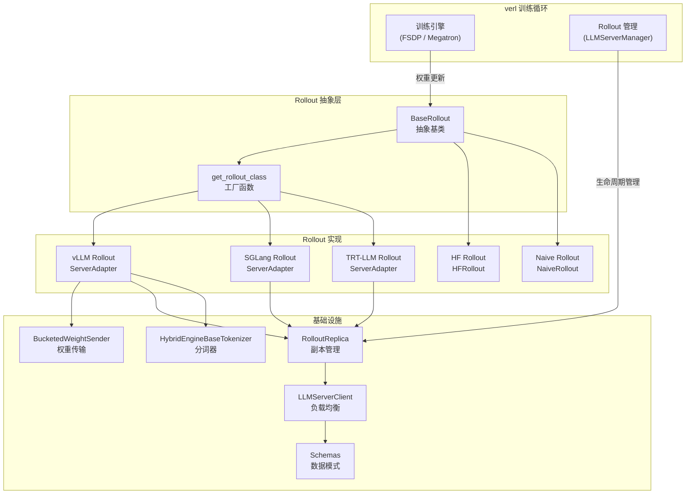
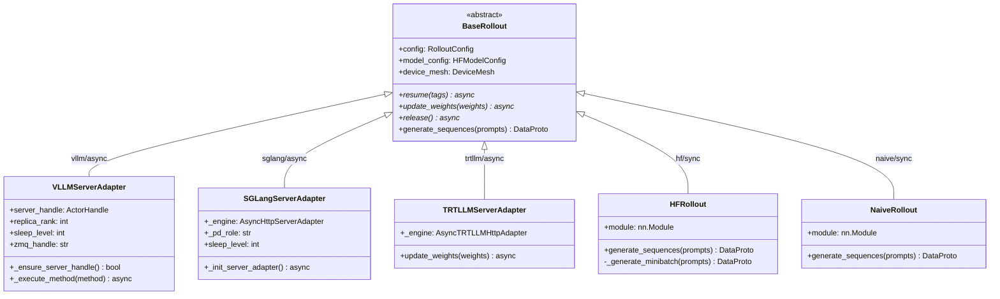
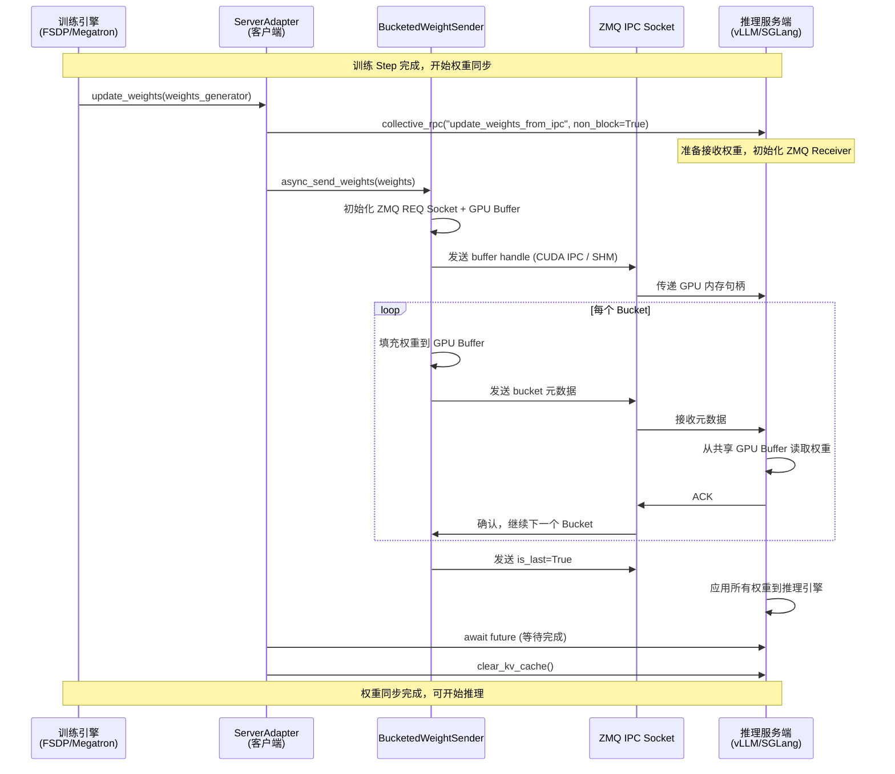

# verl 第十篇：Rollout 模块详解

## 【总】开篇概述

### 核心价值

Rollout 模块是 verl 框架的**推理生成层**，负责在 RL 训练循环中执行模型推理、生成序列（rollout sequences），为奖励模型和策略更新提供采样数据。它是连接"训练引擎"与"推理引擎"的桥梁，核心挑战在于：**如何统一多种高性能推理引擎（vLLM / SGLang / HuggingFace / TRT-LLM）的接口，并在训练-推理切换时高效同步权重？**

### 核心问题

verl 的 Rollout 模块需要解决以下关键问题：

1. **接口统一**：不同推理引擎（vLLM、SGLang、HF、TRT-LLM）的 API、配置、权重格式各异，如何用一套抽象接口屏蔽差异？
2. **权重同步**：训练引擎更新参数后，如何高效地将权重传输到推理引擎？特别是 GPU 间零拷贝传输如何实现？
3. **显存管理**：训练和推理共享 GPU 时，如何通过 sleep/wake 机制切换显存占用？
4. **部署模式**：如何支持 Hybrid（同进程）、Colocated（同节点不同进程）、Standalone（独立资源）三种部署模式？
5. **PD 分离**：如何支持 Prefill-Decode 分离部署以优化推理吞吐？

### 全局概览图



### 关键结论预览

- **BaseRollout** 定义了 `resume / release / update_weights / generate_sequences` 四大核心接口，所有实现均遵循此契约
- **工厂模式**通过 `_ROLLOUT_REGISTRY` 注册表 + `importlib` 动态加载，实现后端解耦
- **权重传输**采用 ZMQ + CUDA IPC 的 Bucketed 传输机制，避免序列化开销，实现 GPU 间零拷贝
- **三种部署模式**（Hybrid / Colocated / Standalone）通过 `RolloutReplica` 统一管理生命周期
- **SGLang 独占 PD 分离**能力，通过 `SGLangPDReplica` 实现 Prefill-Decode 不对称部署

---

## 【分】逐层展开

### 1. BaseRollout 抽象基类

`BaseRollout` 是所有 Rollout 实现的抽象基类，定义了推理引擎必须实现的接口契约。

#### 类定义与核心接口

```python
class BaseRollout(ABC):
    def __init__(self, config: RolloutConfig, model_config: HFModelConfig, device_mesh: DeviceMesh):
        self.config = omega_conf_to_dataclass(config)
        self.model_config = omega_conf_to_dataclass(model_config)
        self.device_mesh = device_mesh

    @abstractmethod
    async def resume(self, tags: list[str]): ...       # 恢复权重/KV缓存到GPU

    @abstractmethod
    async def update_weights(self, weights: Generator): ...  # 更新推理引擎权重

    @abstractmethod
    async def release(self): ...                        # 释放GPU显存

    def generate_sequences(self, prompts: DataProto) -> DataProto:  # 同步生成（可选）
        raise NotImplementedError
```

四大核心接口的职责：

| 方法 | 职责 | 调用时机 |
|------|------|----------|
| `resume(tags)` | 恢复权重或 KV 缓存到 GPU | 训练→推理切换时 |
| `release()` | 释放权重和 KV 缓存占用的 GPU 显存 | 推理→训练切换时 |
| `update_weights(weights)` | 从训练引擎同步权重到推理引擎 | 每次 training step 后 |
| `generate_sequences(prompts)` | 同步批量生成序列 | 仅 HF/Naive 模式使用 |

#### 工厂函数与注册表

```python
_ROLLOUT_REGISTRY = {
    ("vllm", "async"): "verl.workers.rollout.vllm_rollout.ServerAdapter",
    ("sglang", "async"): "verl.workers.rollout.sglang_rollout.sglang_rollout.ServerAdapter",
    ("trtllm", "async"): "verl.workers.rollout.trtllm_rollout.trtllm_rollout.ServerAdapter",
}

def get_rollout_class(rollout_name: str, mode: str = "async") -> type[BaseRollout]:
    fqdn = _ROLLOUT_REGISTRY[(rollout_name, mode)]
    module_name, class_name = fqdn.rsplit(".", 1)
    rollout_module = importlib.import_module(module_name)
    return getattr(rollout_module, class_name)
```

工厂函数通过 `(rollout_name, mode)` 二元组查找注册表，使用 `importlib` 延迟加载实现类，避免未安装的后端导致导入错误。当前仅支持 `async` 模式（SPMD 同步模式已在 PR #4411 中退役）。

#### Rollout 类继承图



---

### 2. vLLM Rollout

vLLM 是 verl 中最成熟、功能最完整的 Rollout 后端，采用 **ServerAdapter + vLLMHttpServer** 的客户端-服务端架构。

#### vllm_rollout.py — ServerAdapter

`ServerAdapter` 是 vLLM 后端的客户端适配器，驻留在训练 Worker 中，通过 Ray Actor 与 vLLM 服务端通信：

```python
class ServerAdapter(BaseRollout):
    def __init__(self, config, model_config, device_mesh, replica_rank=-1):
        super().__init__(config, model_config, device_mesh)
        self.server_handle = None  # Ray Actor Handle，延迟初始化
        self.sleep_level = VLLM_SLEEP_LEVEL  # 控制释放深度
        self.zmq_handle = f"ipc:///tmp/rl-colocate-zmq-{job_id}-replica-{replica_rank}-rank-{local_rank}.sock"
        self.use_shm = not is_support_ipc()  # NPU 等不支持 IPC 时回退到共享内存
```

**关键设计要点**：

- **延迟初始化**：`server_handle` 在首次调用 `_ensure_server_handle()` 时通过 `ray.get_actor()` 获取，避免初始化顺序问题
- **仅 rank-0 通信**：`rollout_rank != 0` 的 Worker 不与服务端交互，直接返回 None
- **ZMQ 句柄**：使用 `replica_rank + local_rank + job_id` 组合生成唯一 IPC 路径，避免多副本/多作业冲突
- **sleep_level**：控制 `release()` 的深度——level 2 释放权重+KV缓存，level 1 仅释放 KV 缓存（LoRA 场景）

**权重更新流程**：

```python
async def update_weights(self, weights, global_steps=None, **kwargs):
    # 1. 异步通知服务端准备接收
    future = await self._execute_method("update_weights_from_ipc", non_block=True)

    # 2. 通过 BucketedWeightSender 发送权重
    sender = BucketedWeightSender(zmq_handle=self.zmq_handle, bucket_size_mb=..., use_shm=self.use_shm)
    await sender.async_send_weights(weights)

    # 3. 等待服务端确认
    if future is not None:
        await future

    # 4. 清理 KV 缓存
    await self.server_handle.clear_kv_cache.remote()
```

#### vllm_async_server.py — vLLMHttpServer

`vLLMHttpServer` 是 vLLM 的服务端封装，等价于命令行 `vllm serve`：

```python
class vLLMHttpServer:
    def __init__(self, config, model_config, rollout_mode, workers, replica_rank, node_rank, gpus_per_node):
        # 初始化 vLLM AsyncEngineArgs
        # 启动 OpenAI 兼容 HTTP 服务
```

它负责：
- 管理 vLLM 推理引擎的生命周期
- 提供 `wake_up / sleep / update_weights_from_ipc / generate` 等方法
- 启动 FastAPI + Uvicorn HTTP 服务，对外提供 OpenAI 兼容 API

#### bucketed_weight_transfer.py — 分桶权重传输

`BucketedWeightSender` 是 vLLM Rollout 的核心权重传输组件，通过 **ZMQ + CUDA IPC** 实现高效的 GPU 间权重同步：

```python
class BucketedWeightSender:
    def __init__(self, zmq_handle, bucket_size_mb=512, use_shm=False):
        self.bucket_size = bucket_size_mb << 20  # 默认 512MB 的通信缓冲区
        self.use_shm = use_shm  # 不支持 IPC 时回退到共享内存
```

**分桶传输原理**：

1. 在 GPU 上分配固定大小的 `bucket_size` 缓冲区
2. 将权重张量依次填入缓冲区，记录元数据（名称、形状、偏移量）
3. 缓冲区满时，通过 ZMQ 发送元数据，接收端从同一块 GPU 内存读取
4. 超大张量（超过 bucket_size）走 `_direct_send_large_weight` 直接传输

**CUDA IPC vs 共享内存**：
- **CUDA IPC**（默认）：通过 `torch.multiprocessing.reductions.reduce_tensor` 传递 GPU 内存句柄，实现零拷贝
- **共享内存**（回退）：通过 `multiprocessing.shared_memory` 在 CPU 侧共享，需额外 GPU 拷贝，性能较差

#### vLLM 补丁与适配（utils.py）

`vllm_rollout/utils.py` 提供 vLLM 适配工具：

- `get_device_uuid(device_id)`：获取 GPU UUID，支持 CUDA 和 NPU
- `build_cli_args_from_config()`：将 RolloutConfig 转换为 vLLM 命令行参数
- `extract_prompt_logprobs()`：从 vLLM 输出中提取 prompt logprobs（用于蒸馏场景）
- `get_vllm_max_lora_rank()`：自动调整 LoRA rank 到 vLLM 允许的值
- `SuppressSignalInThread`：线程中抑制信号的上下文管理器

---

### 3. SGLang Rollout

SGLang 是 verl 支持的第二个高性能推理后端，架构与 vLLM 类似但增加了 **PD 分离**能力。

#### sglang_rollout.py — ServerAdapter

```python
class ServerAdapter(BaseRollout):
    def __init__(self, config, model_config, device_mesh, replica_rank=-1):
        super().__init__(config, model_config, device_mesh)
        self._engine = None  # AsyncHttpServerAdapter，延迟初始化
        self._pd_role = None  # "prefill" / "decode" / None
        self.sleep_level = 2  # 默认全量释放
```

**PD 分离支持**：当 `config.disaggregation.enabled=True` 时，ServerAdapter 会根据 `rollout_rank` 自动判断当前 Worker 属于 Prefill 还是 Decode 角色：

```python
if local < prefill_tp:
    self._pd_role = "prefill"
else:
    self._pd_role = "decode"
    self._pd_server_index = (local - prefill_tp) // decode_tp
```

每个 PD 角色只连接对应的服务端 Actor，避免跨角色通信。

#### async_sglang_server.py — SGLangReplica

`SGLangReplica` 是 SGLang 的服务端 Replica 实现，继承自 `RolloutReplica`：

```python
class SGLangReplica(RolloutReplica):
    async def launch_servers(self):
        # 在每个节点启动 SGLang HTTP 服务
        # 支持 Hybrid / Colocated / Standalone 三种模式
```

它负责：
- 根据 `RolloutMode` 选择初始化方式
- 启动 SGLang HTTP 服务进程
- 管理 `wake_up / sleep / update_weights / generate` 等生命周期方法

#### sglang_pd_replica.py — PD 分离副本

`SGLangPDReplica` 继承自 `SGLangReplica`，实现 Prefill-Decode 分离部署：

```python
class SGLangPDReplica(SGLangReplica):
    def __init__(self, replica_rank, config, model_config, gpus_per_node=8, ...):
        super().__init__(...)
        assert disagg.enabled, "SGLangPDReplica requires disaggregation.enabled=True"
        self._n_prefill = disagg.prefill_replicas  # 当前仅支持 1
        self._n_decode = disagg.decode_replicas
        self._prefill_tp = config.tensor_model_parallel_size
        self._decode_tp = disagg.decode_tensor_model_parallel_size or self._prefill_tp
```

**当前限制**：`prefill_replicas=1`，即每个 Replica 只有 1 个 Prefill 服务 + N 个 Decode 服务。

#### http_server_engine.py — HTTP 服务引擎

`AsyncHttpServerAdapter` 是 SGLang 的 HTTP 客户端适配器，通过 HTTP 请求与 SGLang 服务通信：

```python
class AsyncHttpServerAdapter:
    async def generate(self, prompt_ids, sampling_params, ...): ...
    async def update_weights_from_ipc(self, ...): ...
    async def wake_up(self): ...
    async def sleep(self): ...
```

与 vLLM 的 ZMQ+IPC 方式不同，SGLang 的权重更新通过 HTTP 接口完成，使用 `aiohttp` 连接池管理并发请求。

---

### 4. HF Rollout

`HFRollout` 使用 HuggingFace Transformers 原生推理，是最简单的 Rollout 实现：

```python
class HFRollout(BaseRollout):
    def __init__(self, module: nn.Module, config):
        self.module = module  # 直接持有 HF 模型

    def generate_sequences(self, prompts: DataProto) -> DataProto:
        batch_size = prompts.batch.batch_size[0]
        num_chunks = max(batch_size // self.config.get("micro_batch_size", batch_size), 1)
        batch_prompts = prompts.chunk(chunks=num_chunks)
        output = [self._generate_minibatch(p) for p in batch_prompts]
        return DataProto.concat(output)
```

**特点**：
- 直接调用 `module.generate()` 进行推理，无需启动独立服务
- 支持 micro-batch 分块，避免大 batch OOM
- 采样参数（temperature、top_p、top_k）可通过 `meta_info` 动态覆盖
- 区分训练/验证模式的采样策略
- **不支持** `resume / release / update_weights`（权重直接在模型上，无需同步）
- **已知问题**：FSDP HybridShard 下可能挂起（TODO 中标注）

---

### 5. TRT-LLM Rollout

`TRT-LLM Rollout` 使用 NVIDIA TensorRT-LLM 推理引擎，面向生产级高性能部署：

```python
class ServerAdapter(BaseRollout):
    # 通过 AsyncTRTLLMHttpAdapter 与 TRT-LLM 服务通信
```

**架构特点**：
- 使用 `AsyncTRTLLMHttpAdapter` 通过 HTTP 与 TRT-LLM 服务交互
- 支持重试机制（`max_attempts=3`）和指数退避
- 使用 `aiohttp.TCPConnector` 连接池管理（`max_connections=2000`）
- 通过 `pynvml` 获取 GPU UUID 用于权重传输
- 支持 `ExecutorMemoryType` 配置（TRT-LLM 特有的显存管理）

**权重更新**：TRT-LLM 的权重更新通过 HTTP 接口完成，与 SGLang 类似但使用不同的 API 端点。

---

### 6. Naive Rollout

`NaiveRollout` 是最简单的自回归生成实现，逐 token 采样：

```python
class NaiveRollout(BaseRollout):
    def __init__(self, module: nn.Module, config):
        self.module = module

    @torch.no_grad()
    def generate_sequences(self, prompts: DataProto) -> DataProto:
        for _ in range(self.config.response_length):
            output = self.module(input_ids=idx_cond, attention_mask=attention_mask, position_ids=position_ids)
            logits = output.logits[:, -1, :] / self.config.temperature
            probs = F.softmax(logits, dim=-1)
            idx_next = torch.multinomial(probs, num_samples=1)  # 或 argmax
            idx = torch.cat((idx, idx_next), dim=1)
```

**特点**：
- 纯 PyTorch 实现，无任何推理引擎依赖
- 逐 token 自回归生成，无 KV 缓存优化
- 支持 top-k 采样和贪心解码
- 自动处理 EOS token 和 attention mask
- **性能极低**，仅用于调试和验证

---

### 7. Rollout 基础设施

#### llm_server.py — LLM 服务管理

`LLMServerManager` 和 `LLMServerClient` 是 Rollout 的服务管理层：

**GlobalRequestLoadBalancer**（Ray Actor）：
- 全局粘性会话 + 最小负载均衡器
- `acquire_server(request_id)`：优先匹配粘性会话，否则选择最少 in-flight 请求的服务端
- `release_server(server_id)`：请求完成后释放计数
- `add_servers / remove_servers`：动态增删服务端

**LLMServerClient**：
- 封装多个 OpenAI 兼容 LLM 服务端的客户端
- 通过 `GlobalRequestLoadBalancer` 实现负载均衡
- `generate(request_id, prompt_ids, sampling_params)` 方法执行推理
- 支持多模态输入（image/video/audio）

#### replica.py — 副本管理

`RolloutReplica` 是推理服务副本的抽象基类，管理单个或跨节点的推理服务实例：

```python
class RolloutMode(Enum):
    HYBRID = "hybrid"        # 推理与训练同进程，共享 GPU
    COLOCATED = "colocated"  # 推理与训练同节点不同进程，共享 GPU
    STANDALONE = "standalone"  # 独立 GPU 资源，解耦架构
```

**三种初始化方式**：

| 方法 | 模式 | 资源 | 权重同步 |
|------|------|------|----------|
| `init_hybrid(worker_group)` | HYBRID | 共享进程 | IPC/共享内存 |
| `init_colocated(resource_pool)` | COLOCATED | 同节点独立进程 | 无需同步 |
| `init_standalone()` | STANDALONE | 独立资源池 | 无需同步 |

**生命周期管理**：
- `wake_up / sleep`：唤醒/休眠推理服务
- `abort_all_requests / resume_generation`：中断和恢复生成
- `clear_kv_cache / release_kv_cache / resume_kv_cache`：KV 缓存管理
- `start_profile / stop_profile`：性能分析

**RolloutReplicaRegistry**：工厂注册表，通过延迟加载避免导入未安装的后端：

```python
RolloutReplicaRegistry.register("vllm", _load_vllm)
RolloutReplicaRegistry.register("sglang", _load_sglang)
RolloutReplicaRegistry.register("trtllm", _load_trtllm)
```

**TokenOutput**：统一的推理输出数据模型：

```python
class TokenOutput(BaseModel):
    token_ids: list[int]           # 生成的 token IDs
    log_probs: Optional[list[float]]  # log 概率
    routed_experts: Optional[Any]     # MoE 路由专家
    stop_reason: Optional[str]        # 停止原因
    num_preempted: Optional[int]      # 抢占次数
```

#### tokenizer.py — 分词器

`HybridEngineBaseTokenizer` 是混合引擎分词器的抽象基类，定义了与 HuggingFace 分词器兼容的接口：

```python
class HybridEngineBaseTokenizer(ABC):
    @property vocab_size -> int
    @property pad_token_id -> int
    @property eos_token_id -> int
    @property all_special_ids -> list[int]
    @property all_special_tokens -> list[str]

    def encode(self, text) -> ...      # 文本→token IDs
    def decode(self, token_ids) -> str  # token IDs→文本
    def convert_ids_to_tokens(self, ids) -> str|list[str]
    def get_added_vocab(self) -> dict[str, int]
    def convert_tokens_to_string(self, tokens) -> str
```

此抽象确保非 HF 模型（如 Megatron 训练的模型）也能提供 vLLM 所需的分词器接口。

#### schemas.py — 数据模式

`schemas.py` 定义了异步 Rollout 的请求数据模型：

- **AsyncRolloutRequest**：完整的异步推理请求，包含消息、多模态数据、工具调用等
- **Message**：聊天消息，支持文本、多模态内容、工具调用
- **FinishReasonTypeEnum**：结束原因（LENGTH / STOP / TOOL_CALL）
- **AsyncRolloutRequestStateEnum**：请求状态（PENDING / RUNNING / COMPLETED / FAILED / TOOL_CALLING）

`AsyncRolloutRequest` 的核心能力：
- 自动应用 chat template 并分词
- 增量更新 input_ids / attention_mask / position_ids
- 支持多模态输入处理（Qwen2-VL 特殊 position_ids）
- Tokenization 一致性校验（STRICT / IGNORE_STRIPPABLE / DISABLE）

#### utils.py — 工具函数

`rollout/utils.py` 提供通用工具：

- `get_max_position_embeddings(hf_config)`：从 HF 配置获取最大位置编码
- `run_uvicorn(app, server_args, server_address)`：启动 Uvicorn HTTP 服务，支持自动端口分配
- `ensure_async_iterator(iterable)`：将同步/异步可迭代对象统一为异步迭代器
- `qwen2_5_vl_dedup_image_tokens()`：Qwen2.5-VL 图像 token 去重
- `update_prometheus_config()`：动态更新 Prometheus 监控配置

---

### 8. 权重传输机制

权重传输是 Rollout 模块最核心的技术挑战之一，直接影响训练-推理切换的效率。

#### 训练引擎 → 推理引擎的权重同步

在 Hybrid 模式下，训练引擎和推理引擎共享同一组 GPU，权重同步流程如下：



#### 3D-HybridEngine 的 Resharding

在 3D 并行（TP × DP × PP）场景下，训练引擎和推理引擎的并行策略可能不同（如训练用 FSDP TP=8，推理用 vLLM TP=4），需要进行权重 Resharding：

- **FSDP 场景**：使用 DTensor weight loader，通过 `state_dict` 在 TP ranks 间同步权重
- **Megatron 场景**：训练时仅当前 PP stage 持有参数，推理前需广播到所有 PP ranks，推理后再释放非本 stage 的参数

#### BucketedWeightSender 的优化原理

1. **分桶传输**：将大量小张量打包到固定大小的缓冲区，减少通信次数
2. **CUDA IPC 零拷贝**：通过 `reduce_tensor` 传递 GPU 内存句柄，避免 CPU 中转
3. **异步流水线**：`non_block=True` 让服务端准备和客户端发送并行执行
4. **大张量直传**：超过 bucket_size 的张量走 `_direct_send_large_weight`，避免缓冲区溢出
5. **共享内存回退**：NPU 等不支持 CUDA IPC 的设备，自动回退到 `shared_memory`

---

## 【总】总结升华

### 核心设计要点回顾

1. **抽象统一**：`BaseRollout` 定义四大核心接口，所有后端通过工厂模式注册和加载，实现接口统一
2. **客户端-服务端分离**：ServerAdapter（客户端）+ HttpServer（服务端）的架构，通过 Ray Actor 通信，解耦训练和推理
3. **高效权重传输**：ZMQ + CUDA IPC 的 Bucketed 传输，实现 GPU 间零拷贝权重同步
4. **灵活部署模式**：Hybrid / Colocated / Standalone 三种模式覆盖从开发到生产的全场景
5. **延迟加载与注册表**：`importlib` 动态加载 + `RolloutReplicaRegistry` 注册表，避免未安装后端的导入错误

### 各 Rollout 实现对比

| 特性 | vLLM | SGLang | HuggingFace | TRT-LLM | Naive |
|------|------|--------|-------------|---------|-------|
| **推理性能** | 高 | 高 | 低 | 最高 | 极低 |
| **权重传输** | ZMQ+IPC | HTTP | 直接内存 | HTTP | 直接内存 |
| **部署模式** | Hybrid/Colocated/Standalone | Hybrid/Colocated/Standalone | 仅 Hybrid | Hybrid/Colocated/Standalone | 仅 Hybrid |
| **PD 分离** | 不支持 | 支持 | 不支持 | 不支持 | 不支持 |
| **LoRA 支持** | 支持 | 支持 | 不支持 | 不支持 | 不支持 |
| **多模态** | 支持 | 支持 | 有限 | 有限 | 不支持 |
| **FP8 量化** | 支持 | 支持(≥0.5.5) | 不支持 | 支持 | 不支持 |
| **适用场景** | 通用 RL 训练 | PD分离/高吞吐 | 调试/小模型 | 生产部署 | 功能验证 |
| **成熟度** | 最高 | 高 | 中 | 中 | 低 |

### 扩展新 Rollout 后端的指南

若需添加新的推理引擎后端（如 vLLM 新版本、LightLLM 等），需完成以下步骤：

1. **实现 ServerAdapter**：继承 `BaseRollout`，实现 `resume / release / update_weights` 三个异步方法
2. **实现 RolloutReplica**：继承 `RolloutReplica`，实现 `launch_servers` 方法，管理服务端生命周期
3. **注册工厂**：在 `base.py` 的 `_ROLLOUT_REGISTRY` 中添加 `("backend_name", "async")` 条目
4. **注册 Replica**：在 `replica.py` 的 `RolloutReplicaRegistry` 中注册延迟加载函数
5. **权重传输**：若需 GPU 零拷贝，复用 `BucketedWeightSender`；否则实现 HTTP 权重更新接口
6. **配置扩展**：在 `RolloutConfig` 中添加后端特有配置项
7. **测试验证**：确保 `resume → update_weights → generate → release` 完整生命周期正常工作
