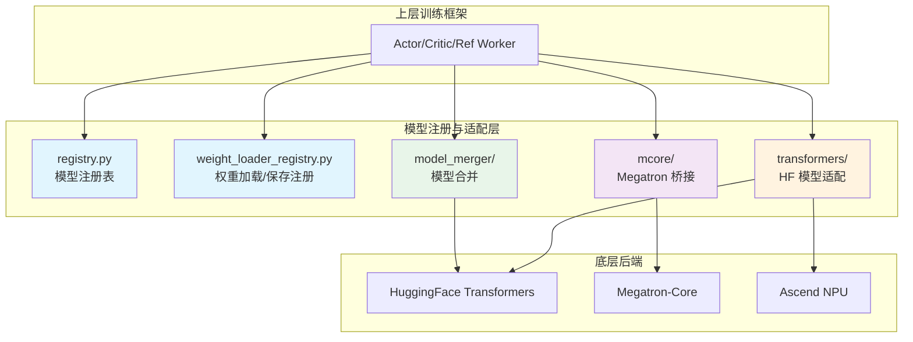
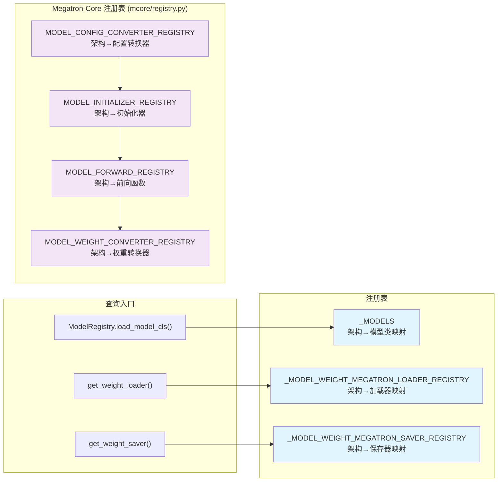
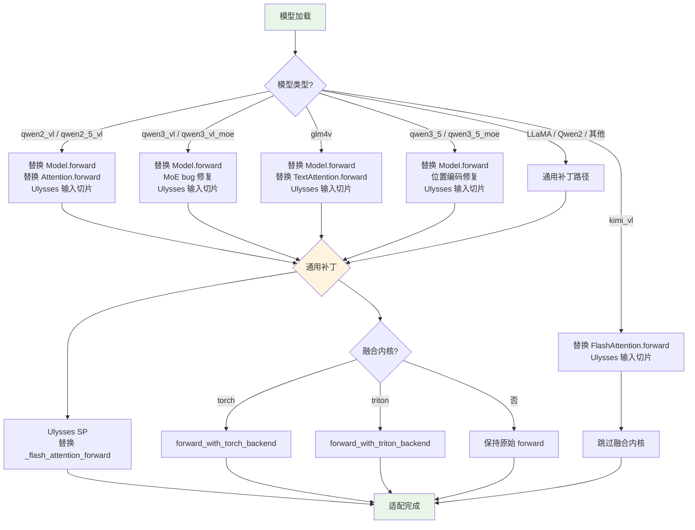
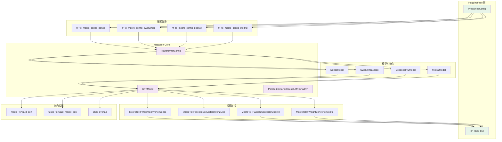

# 11. 模型注册与适配

## 【总】开篇概述

### 核心价值

模型注册与适配层是 verl 实现多模型支持的基础设施。在 RLHF/GRPO 等强化学习训练场景中，系统需要同时运行 Actor、Critic、Reference 等多个模型角色，且必须适配 LLaMA、Qwen2、GLM4V、DeepSeek-V3 等截然不同的模型架构。verl 通过**分层注册 + 猴子补丁 + 配置转换**三位一体的设计，将模型差异封装在适配层内部，使上层训练逻辑无需感知底层模型细节。

### 核心问题

> **verl 如何适配不同的模型架构（LLaMA/Qwen/GLM 等）？**

答案在于三层解耦：
1. **注册表层**：通过字典映射将架构名与实现类绑定，运行时动态查找
2. **Transformers 适配层**：通过猴子补丁注入 Ulysses 序列并行、融合内核等能力
3. **Megatron 桥接层**：将 HuggingFace 配置/权重转换为 Megatron-Core 格式，实现 3D 并行训练

### 全局概览图



### 关键结论预览

1. verl 采用**双轨注册**设计：Transformers 路径（FSDP 后端）和 Megatron 路径（Megatron 后端）各自拥有独立的注册表和适配逻辑
2. 猴子补丁是 Transformers 路径的核心机制，通过运行时替换方法注入 Ulysses SP、融合内核等能力
3. Megatron 路径的核心是**配置转换 + 权重转换**，将 HF 格式无损映射到 Megatron-Core 格式
4. 新增模型支持只需：注册架构名 → 实现适配函数 → 添加权重转换器

---

## 【分】逐层展开

### 1. 模型注册表

#### 1.1 核心注册机制 — `registry.py`

`ModelRegistry` 是 Megatron 后端的模型类注册表，维护架构名到模型类的映射：

```python
_MODELS = {
    "LlamaForCausalLM": (
        "llama",
        ("ParallelLlamaForCausalLMRmPadPP", "ParallelLlamaForValueRmPadPP", "ParallelLlamaForCausalLMRmPad"),
    ),
    "Qwen2ForCausalLM": (
        "qwen2",
        ("ParallelQwen2ForCausalLMRmPadPP", "ParallelQwen2ForValueRmPadPP", "ParallelQwen2ForCausalLMRmPad"),
    ),
    ...
}
```

**设计要点**：
- 每个架构映射一个三元组 `(module_name, (actor_cls, value_cls, non_pp_cls))`
- `value=False` 时返回 Actor/Ref 模型类（带 Pipeline Parallel），`value=True` 时返回 Critic/RM 模型类
- 使用 `importlib.import_module` 延迟加载，避免未安装 Megatron 时报错

#### 1.2 权重加载/保存注册 — `weight_loader_registry.py`

该文件提供两个函数，分别注册了权重加载器和保存器：

| 函数 | 作用 | 支持架构 |
|------|------|---------|
| `get_weight_loader(arch)` | 获取 Megatron 权重加载器 | LlamaForCausalLM, Qwen2ForCausalLM |
| `get_weight_saver(arch)` | 获取 Megatron 权重保存器 | LLaMA, Qwen2, Mixtral, Qwen2MoE, Qwen2.5-VL, DeepSeekV3, Qwen3, Qwen3MoE, LlamaForTokenClassification 等 |

保存器比加载器支持更多架构，因为保存时需要处理 MoE、VLM 等特殊结构的权重合并。

#### 1.3 注册机制图



---

### 2. Transformers 模型适配

#### 2.1 自动导入与注册 — `__init__.py`

Transformers 子包的 `__init__.py` 仅导出两个关键函数：

```python
from verl.models.transformers.monkey_patch import apply_monkey_patch
from verl.models.transformers.tiled_mlp import apply_tiled_mlp_monkey_patch
```

这是整个 Transformers 适配层的入口——所有适配能力都通过猴子补丁注入，而非子类化或包装器模式。

#### 2.2 LLaMA 模型适配 — `llama.py`

LLaMA 是 verl 最早支持的模型架构，适配重点在于 **Ulysses 序列并行**：

- `llama_flash_attn_forward()`：替换 LlamaFlashAttention2 的 forward 方法
- 在 QKV 投影后插入 `gather_seq_scatter_heads`（AlltoAll），将序列维度拆分到注意力头维度
- 在 Flash Attention 计算后插入 `gather_heads_scatter_seq`，恢复原始分布
- 兼容 `position_embeddings` 参数（transformers v4.46+ 新接口）

核心流程：
```
Q/K/V投影 → Ulysses AlltoAll → RoPE → KV Cache更新 → Flash Attention → Ulysses AlltoAll逆操作
```

#### 2.3 Qwen2 模型适配 — `qwen2.py`

Qwen2 的适配与 LLaMA 高度相似，主要差异：
- 使用 `-1` 代替 `self.num_heads` 进行 view reshape（兼容不同 head 配置）
- 在 AlltoAll 之后才进行 `repeat_kv`（GQA 展开），避免不必要的通信开销

#### 2.4 Qwen2-VL 视觉语言模型 — `qwen2_vl.py`

VLM 模型的适配远比纯文本模型复杂，需要处理：
- **图文混合数据**：替换 `Qwen2VLForConditionalGeneration.forward` 和 `Qwen2VLModel.forward`
- **视觉注意力**：替换 `Qwen2VLFlashAttention2.forward`，支持 remove_padding
- **Ulysses 输入切片**：通过 `patch_vlm_for_ulysses_input_slicing` 切分 `inputs_embeds`、`position_ids`、`visual_pos_masks`、`deepstack_visual_embeds`
- **融合内核**：提供 `forward_with_torch_backend` 和 `forward_with_triton_backend` 两种融合前向

#### 2.5 Qwen3 系列 — `qwen3_vl.py` / `qwen3_5.py`

Qwen3 系列在 Qwen2-VL 基础上增加了：
- **快速位置编码插值** `fast_pos_embed_interpolate`：修复 FSDP2 CPU offload 导致的位置编码设备不一致问题
- **MoE 补丁**：修复 transformers 4.57.3 版本中 `Qwen3VLMoeSparseMoeBlock` 的 bug
- **RMSNormGated**：Qwen3.5 引入的门控 RMSNorm，需要特殊的 NPU 补丁

#### 2.6 GLM4V 模型 — `glm4v.py`

GLM4V 的适配模式与 Qwen2-VL 一致：
- 替换 `Glm4vForConditionalGeneration.forward` 和 `Glm4vModel.forward`
- 替换 `Glm4vTextAttention.forward` 支持 Ulysses
- 通过 `patch_vlm_for_ulysses_input_slicing` 处理多模态输入切片

#### 2.7 Kimi-VL 模型 — `kimi_vl.py`

Kimi-VL 基于 DeepSeek-V3 架构，适配策略略有不同：
- 直接替换 `DeepseekV3FlashAttention2.forward` 为 `_ulysses_flash_attn_forward`
- 对 `DeepseekV3ForCausalLM` 进行 Ulysses 输入切片
- 不支持融合内核

#### 2.8 Apertus 模型 — `apertus.py`

Apertus 是较新的架构，特点：
- 支持 QK 归一化（QK Normalization），在 Q/K 投影后应用
- 适配 transformers >= 4.48.0 的新接口（使用 `position_embeddings` 参数）
- 使用 `ALL_ATTENTION_FUNCTIONS` 注册机制（新版 transformers）

#### 2.9 通用密集模型 — `dense_common.py`

`dense_common.py` 为所有纯文本密集模型提供通用前向函数：

- `CausalLMOutputForPPO`：扩展 `CausalLMOutputWithPast`，增加 `log_probs` 和 `entropy` 字段，直接输出 PPO 训练所需信息
- `forward_base_model()`：通用的 base model 前向，直接调用 `self.model()`
- `forward_with_torch_backend()`：使用 `FusedLinearForPPO` 融合 log_probs/entropy 计算，避免 materialize 完整 logits
- `forward_with_triton_backend()`：Triton 后端的融合前向

#### 2.10 猴子补丁核心 — `monkey_patch.py`

`apply_monkey_patch()` 是整个 Transformers 适配层的**调度中心**，根据模型类型分发不同的补丁策略：

```python
def apply_monkey_patch(
    model, ulysses_sp_size=1, use_remove_padding=True,
    use_fused_kernels=False, fused_kernels_backend=None,
    use_prefix_grouper=False, use_tiled_mlp=False, tiled_mlp_shards=4,
):
```

**补丁分发逻辑**：

| 模型类型 | 补丁内容 |
|---------|---------|
| qwen2_vl / qwen2_5_vl | 模型前向 + 视觉注意力 + Ulysses 输入切片 |
| qwen3_vl / qwen3_vl_moe | 模型前向 + MoE bug 修复 + Ulysses 输入切片 |
| glm4v | 模型前向 + 文本注意力 + Ulysses 输入切片 |
| kimi_vl | FlashAttention + Ulysses 输入切片 |
| qwen3_5 / qwen3_5_moe | 模型前向 + 视觉位置编码修复 + Ulysses 输入切片 |
| 其他（LLaMA/Qwen2等） | 通用 `_flash_attention_forward` 替换 |

**通用补丁**（所有模型都会应用）：
1. **Ulysses SP**：替换 `_flash_attention_forward` 为 `_ulysses_flash_attention_forward`，在 Flash Attention 前后插入 AlltoAll 通信
2. **融合内核**：通过 `patch_forward_with_backends` 替换模型 forward 方法
3. **PrefixGrouper**：包装 `ALL_ATTENTION_FUNCTIONS` 支持 `prefix_grouper` 参数
4. **TiledMLP**：减少 MLP 峰值显存占用

#### 2.11 NPU 补丁 — `npu_patch.py`

为华为 Ascend NPU 提供优化实现，**模块级直接替换**：

| 原始方法 | NPU 替换 |
|---------|---------|
| `Qwen2RMSNorm.forward` | `rms_norm_forward_npu`（`npu_rms_norm`） |
| `Qwen2MLP.forward` | `silu_forward_npu`（`npu_swiglu`） |
| `apply_rotary_pos_emb` | `apply_rotary_pos_emb_npu`（`npu_rotary_mul`） |
| `Qwen3MoeSparseMoeBlock.forward` | `qwen3_moe_sparse_moe_block_forward_npu`（`npu_moe_token_permute` + `NPUGmmFunction`） |

NPU 补丁通过 `NPUGmmFunction`（自定义 autograd 函数）实现分组矩阵乘法的反向传播，支持 MoE 模型在 NPU 上训练。

#### 2.12 分块 MLP — `tiled_mlp.py`

TiledMLP 通过将 MLP 的前向/反向计算分块执行来降低峰值显存：

- `GradientAccumulator`：跨分块累积梯度，通过 hook 机制在反向传播时收集梯度
- 线程安全设计（`threading.Lock`），防止并发梯度更新
- 适用于 FSDP2 训练场景，通过减少单次激活值大小降低显存峰值

#### 2.13 适配流程图



---

### 3. Megatron 模型桥接 mcore/

Megatron 桥接层是 verl 实现 3D 并行训练的关键，负责将 HuggingFace 格式的模型转换为 Megatron-Core 格式。

#### 3.1 模型桥接 — `bridge.py` / `mbridge.py`

verl 提供两种 Megatron 桥接方式：

| 文件 | 桥接方式 | 说明 |
|------|---------|------|
| `bridge.py` | `megatron.bridge.AutoBridge` | NVIDIA 官方 Megatron-Bridge 包 |
| `mbridge.py` | `mbridge.AutoBridge` | mbridge 社区包（VANILLA_MBRIDGE） |

两者都导出 `AutoBridge`、`make_value_model`、`freeze_moe_router` 等接口。`mbridge.py` 在导入前会先调用 `apply_patch_mbridge()` 应用补丁。

#### 3.2 配置转换 — `config_converter.py`

配置转换是 HF → Megatron 的核心桥梁，将 `PretrainedConfig` 转换为 `TransformerConfig`：

**基础配置提取** `_get_base_transformer_config()`：
- 模型架构参数：`num_layers`, `hidden_size`, `num_attention_heads`, `num_query_groups`, `ffn_hidden_size`
- 激活与归一化：`SiLU` + `RMSNorm` + `gated_linear_unit=True`
- 并行配置：TP/PP/EP/CP/VP 大小，`sequence_parallel`, `overlap_p2p_comm`
- 通用设置：`variable_seq_lengths`, `masked_softmax_fusion`

**架构特定转换器**：

| 转换器 | 适用架构 | 特殊配置 |
|--------|---------|---------|
| `hf_to_mcore_config_dense` | LLaMA, Qwen2, Qwen3 | QKV bias（Qwen2=True）, QK LayerNorm（Qwen3=True） |
| `hf_to_mcore_config_qwen2moe` | Qwen2MoE, Qwen3MoE | MoE FFN size, router 配置, shared expert |
| `hf_to_mcore_config_dpskv3` | DeepSeekV3 | MLA 配置（q_lora_rank, kv_lora_rank 等） |
| `hf_to_mcore_config_mixtral` | Mixtral | MoE 配置 |
| `hf_to_mcore_config_qwen2_5_vl` | Qwen2.5-VL | VLM 配置 |
| `hf_to_mcore_config_llama4` | Llama4 | 特殊配置 |

MLA（Multi-head Latent Attention）配置通过 `_get_mla_transformer_config()` 单独处理，包含 DeepSeek-V3 特有的 `q_lora_rank`, `kv_lora_rank`, `qk_head_dim` 等参数。

#### 3.3 模型加载 — `loader.py`

`load_state_dict_to_megatron_gptmodel()` 将合并后的 state_dict 加载到分片的 Megatron 模型中：

1. **层级映射** `_megatron_calc_layer_map()`：计算全局层索引到 `(pp_rank, virtual_pp_rank, local_layer_idx)` 的映射
2. **权重分发**：根据 TP/PP/DP 分片策略，将完整权重分发到对应 rank
3. **广播同步**：通过 `torch.distributed.broadcast` 在 DP 组内同步参数

#### 3.4 模型保存 — `saver.py`

`saver.py` 提供多种架构的检查点合并函数：

| 函数 | 适用架构 |
|------|---------|
| `merge_megatron_ckpt_gptmodel` | LLaMA, Qwen2, Qwen3 |
| `merge_megatron_ckpt_gptmodel_mixtral` | Mixtral |
| `merge_megatron_ckpt_gptmodel_qwen_moe` | Qwen2MoE, Qwen3MoE |
| `merge_megatron_ckpt_gptmodel_qwen2_5_vl` | Qwen2.5-VL |
| `merge_megatron_ckpt_gptmodel_dpskv3` | DeepSeek-V3 |

核心工具函数 `_megatron_calc_global_rank()` 根据 TP/DP/PP/CP 的 rank 计算全局 rank，遵循 `tp-cp-ep-dp-pp` 的顺序约定。

#### 3.5 前向传播 — `model_forward.py` / `model_forward_fused.py` / `model_forward_1f1b_overlap.py`

verl 为 Megatron 后端提供三种前向传播模式：

| 文件 | 模式 | 说明 |
|------|------|------|
| `model_forward.py` | 标准前向 | 支持 THD（packed）和 BSHD 两种数据格式，VLM 多模态输入 |
| `model_forward_fused.py` | 融合前向 | 使用 `linear_cross_entropy` 融合 logit 计算与交叉熵，避免 materialize 完整 logits |
| `model_forward_1f1b_overlap.py` | 1F1B 重叠 | Pipeline Parallel 的 1F1B 调度与通信重叠 |

`model_forward_gen(vision_model=False)` 是前向函数的工厂方法，`vision_model=True` 时跳过 `pre_process`（VLM 的输入在 forward 内部打包为 THD 格式）。

#### 3.6 模型初始化 — `model_initializer.py`

`BaseModelInitializer` 是模型初始化的抽象基类：

```python
class BaseModelInitializer(ABC):
    def initialize(self, pre_process, post_process, share_embeddings_and_output_weights, value, **extra_kwargs) -> GPTModel
```

具体实现：

| 初始化器 | 适用架构 | 特殊逻辑 |
|---------|---------|---------|
| `DenseModel` | LLaMA, Qwen2, Qwen3 | 标准 GPT 层规格 |
| `MixtralModel` | Mixtral | MoE 层规格 |
| `Qwen2MoEModel` | Qwen2MoE, Qwen3MoE | 带共享专家的 MoE |
| `DeepseekV3Model` | DeepSeek-V3 | MLA 层规格 |

#### 3.7 权重转换 — `weight_converter.py`

`McoreToHFWeightConverter` 负责 Megatron → HuggingFace 的权重名映射和格式转换：

- `McoreToHFWeightConverterDense`：通用密集模型转换
  - `linear_qkv.weight` → `q_proj.weight` + `k_proj.weight` + `v_proj.weight`
  - `linear_fc1.weight` → `gate_proj.weight` + `up_proj.weight`
  - `linear_fc2.weight` → `down_proj.weight`
- `McoreToHFWeightConverterMixtral`：Mixtral MoE 转换
- `McoreToHFWeightConverterQwen2Moe`：Qwen MoE 转换（含共享专家）
- `McoreToHFWeightConverterDpskv3`：DeepSeek-V3 MLA 转换
- `McoreToHFWeightConverterQwen2_5_VL`：Qwen2.5-VL 转换

#### 3.8 补丁 — `patch.py` / `mtp_patch.py`

- **`patch.py`**：修复 Megatron-Core 0.12 版本中 `get_query_key_value_tensors` 在 `packed_seq_params` 非空时的 bug，主要影响 MLA（DeepSeek-V3）模型
- **`mtp_patch.py`**：多 Token 预测（Multi-Token Prediction）补丁，修改 `_postprocess` 方法支持 MTP 训练

#### 3.9 mcore 注册表 — `registry.py`

`mcore/registry.py` 是 Megatron 后端的**统一注册中心**，维护五张注册表：

| 注册表 | 类型 | 说明 |
|--------|------|------|
| `MODEL_CONFIG_CONVERTER_REGISTRY` | `SupportedModel → ConfigConverter` | HF→Megatron 配置转换 |
| `MODEL_INITIALIZER_REGISTRY` | `SupportedModel → Initializer` | 模型初始化器 |
| `MODEL_FORWARD_REGISTRY` | `SupportedModel → ForwardFn` | 标准前向函数 |
| `MODEL_FORWARD_FUSED_REGISTRY` | `SupportedModel → FusedForwardFn` | 融合前向函数 |
| `MODEL_WEIGHT_CONVERTER_REGISTRY` | `SupportedModel → WeightConverter` | 权重转换器 |

`SupportedModel` 枚举定义了所有支持的架构（LLaMA, Qwen2, Mixtral, DeepSeekV3, Qwen3, Qwen3MoE, GLM4Moe 等），`SupportedVLM` 枚举定义了视觉语言模型。

关键入口函数：
- `hf_to_mcore_config()`：配置转换总入口
- `init_mcore_model()`：模型初始化总入口
- `get_mcore_weight_converter()`：权重转换器获取

#### 3.10 桥接架构图



---

### 4. 模型合并

训练完成后，需要将分布式检查点合并为 HuggingFace 格式以便推理和发布。verl 提供三种合并器：

#### 4.1 基类 — `base_model_merger.py`

`BaseModelMerger` 是抽象基类，定义合并/测试的通用框架：

- `ModelMergerConfig`：数据类配置，包含 `operation`（merge/test）、`backend`（fsdp/megatron）、`local_dir`、`target_dir` 等字段
- `_default_hf_model_config_path()`：根据后端类型返回 HF 配置路径（Megatron 使用 `model/huggingface` 子目录）
- 命令行接口 `parse_args()`：支持 `merge` 和 `test` 两种操作

#### 4.2 FSDP 合并器 — `fsdp_model_merger.py`

`FSDPModelMerger` 处理 FSDP 分布式检查点的合并：

- 从 `fsdp_config.json` 读取 world_size
- 支持 DTensor 和非 DTensor 两种检查点格式
- 并行加载各 rank 的分片参数
- 使用 `Shard` placement 信息进行参数重组

#### 4.3 Megatron 合并器 — `megatron_model_merger.py`

`MegatronModelMerger` 处理 Megatron 分布式检查点的合并：

- 初始化 Megatron 分布式环境（TP/PP/DP/CP）
- 调用 `hf_to_mcore_config()` 转换配置
- 使用 `get_model()` 初始化模型
- 通过 `weight_converter` 将 Megatron 权重名映射为 HF 权重名
- 支持 NPU（mindspeed）和 GPU 两种后端
- `get_dynamic_pipeline_shards()`：动态计算 PP 分片配置，使各 stage 层数尽可能均匀

---

## 【总】总结升华

### 回顾核心设计要点

1. **双轨适配**：Transformers 路径（猴子补丁）和 Megatron 路径（配置/权重转换）并行存在，分别服务 FSDP 和 Megatron 两种后端
2. **注册表驱动**：所有模型差异通过注册表映射消解，上层代码通过 `SupportedModel` 枚举和注册表函数访问，无需感知具体实现
3. **猴子补丁优先**：Transformers 路径采用运行时方法替换而非子类化，优势是无需修改 transformers 库源码，劣势是调试困难
4. **VLM 特殊处理**：视觉语言模型需要额外的输入切片、位置编码修复、MoE bug 修复等适配，代码复杂度显著高于纯文本模型
5. **NPU 深度优化**：通过模块级直接替换 + 自定义 autograd 函数，实现 MoE、RMSNorm、RoPE 等算子的 NPU 加速

### 设计亮点

- **延迟导入**：`importlib.import_module` 和函数内导入避免循环依赖和可选依赖报错
- **工厂模式**：`model_forward_gen(vision_model)` 和 `fused_forward_model_gen(vision_model)` 通过闭包生成前向函数，避免 if-else 散落各处
- **渐进式补丁**：`apply_monkey_patch()` 根据 `ulysses_sp_size`、`use_fused_kernels` 等参数决定补丁深度，不使用的功能零开销
- **版本兼容**：通过 `is_transformers_version_in_range()` 处理不同 transformers 版本的 API 差异

### 添加新模型支持的步骤指南

以添加 `NewModelForCausalLM` 为例：

**Transformers 路径（FSDP 后端）**：
1. 在 `verl/models/transformers/` 下创建 `new_model.py`，实现 Ulysses 适配的注意力前向函数
2. 在 `monkey_patch.py` 的 `apply_monkey_patch()` 中添加 `elif model.config.model_type == "new_model"` 分支
3. 如需融合内核，在 `dense_common.py` 或新文件中实现 `forward_with_torch_backend` / `forward_with_triton_backend`
4. 如需 NPU 支持，在 `npu_patch.py` 中添加对应的算子替换

**Megatron 路径（Megatron 后端）**：
1. 在 `mcore/registry.py` 的 `SupportedModel` 枚举中添加新架构
2. 在 `config_converter.py` 中实现 `hf_to_mcore_config_new_model()` 转换器
3. 在 `model_initializer.py` 中实现 `NewModelInitializer`（如架构特殊），或复用 `DenseModel`
4. 在 `weight_converter.py` 中实现 `McoreToHFWeightConverterNewModel`
5. 在 `weight_loader_registry.py` 中注册加载器和保存器
6. 在 `registry.py` 的 `_MODELS` 中添加架构到 Megatron 模型类的映射
