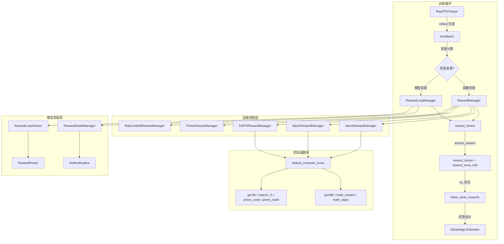
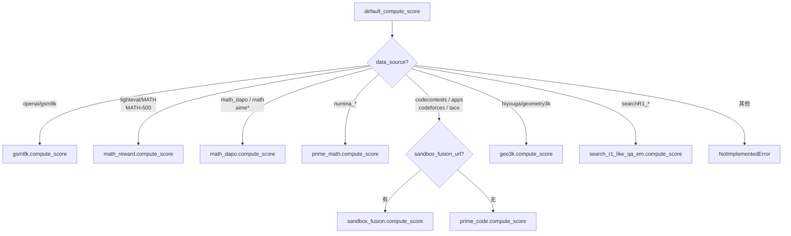
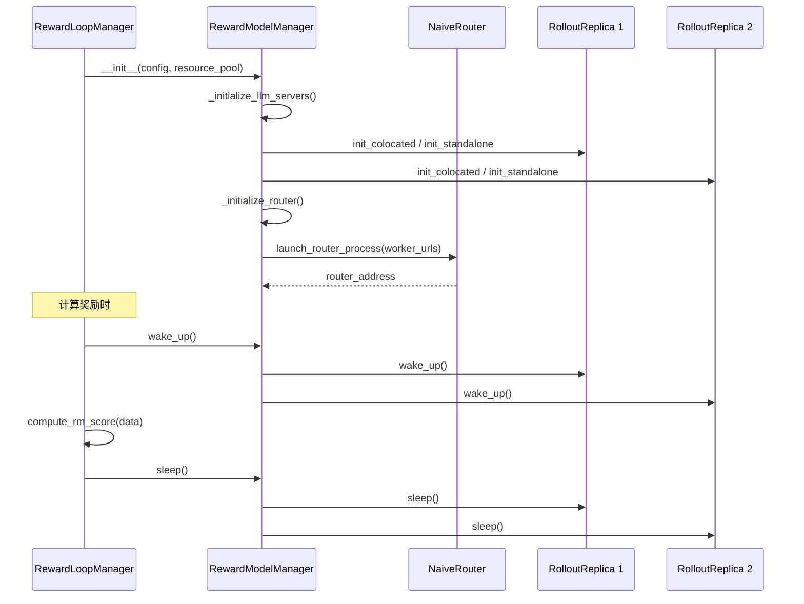

# verl 奖励系统详解

## 【总】开篇概述

### 奖励系统的核心价值

在强化学习（RL）训练中，奖励信号是策略优化的唯一驱动力。verl 作为一个面向大语言模型的后训练框架，其奖励系统承担着将模型输出映射为训练信号的关键职责。奖励的质量和灵活性直接决定了 RL 训练的效果——无论是数学推理的精确匹配、代码生成的沙箱执行，还是基于奖励模型的偏好对齐，都需要一套可扩展、可组合的奖励计算架构。

### 核心问题

verl 如何灵活支持多种奖励计算方式？具体而言：

1. **函数奖励 vs 模型奖励**：如何同时支持基于规则的函数判定和基于神经网络的奖励模型？
2. **同步 vs 异步**：如何兼顾朴素逐条计算和高性能批量/并行计算？
3. **策略扩展**：如何支持 DAPO（动态采样）、PRIME（过程奖励）、GDPO（组归一化）等不同训练策略的奖励需求？
4. **训练集成**：奖励如何与 KL 惩罚、优势估计等环节无缝衔接？

### 全局架构概览



### 关键结论预览

1. **双轨架构**：verl 采用 `workers/reward_manager/`（同步函数奖励）和 `experimental/reward_loop/`（异步模型奖励）双轨设计，前者直接在训练进程内计算，后者通过 Ray 远程调度。
2. **注册表机制**：所有奖励管理器通过 `@register("name")` 装饰器注册，支持 `register`（内置）和 `importlib`（外部）两种加载方式。
3. **函数奖励路由**：`default_compute_score` 根据 `data_source` 字段自动路由到对应的评分函数，覆盖数学、代码、QA 等多领域。
4. **奖励仅赋值于 EOS**：所有奖励管理器都将奖励值放置在有效响应的最后一个 token 位置，形成稀疏奖励结构。

---

## 【分】逐层展开

### 1. RewardManager 抽象

#### 1.1 抽象基类定义（abstract.py）

verl 的奖励管理器体系建立在两层抽象基类之上：

**同步版本** — `AbstractRewardManager`（`workers/reward_manager/abstract.py`）：

```python
class AbstractRewardManager(ABC):
    @abstractmethod
    def __init__(self, tokenizer, num_examine, compute_score, reward_fn_key="data_source", **kwargs):
        pass

    @abstractmethod
    def __call__(self, data: DataProto, return_dict: bool = False) -> torch.Tensor | dict[str, Any]:
        pass
```

- `tokenizer`：用于将 token ID 解码为文本
- `num_examine`：控制调试打印的样本数量
- `compute_score`：核心评分函数，类型为 `RawRewardFn = Callable[..., Any]`
- `reward_fn_key`：数据源标识键，默认为 `"data_source"`

**异步版本** — `RewardManagerBase`（`experimental/reward_loop/reward_manager/base.py`）：

```python
class RewardManagerBase(ABC):
    def __init__(self, config: DictConfig, tokenizer: AutoTokenizer, compute_score: RawRewardFn):
        self.config = config
        self.tokenizer = tokenizer
        self.compute_score = compute_score
        self.loop = get_event_loop()

    @abstractmethod
    async def run_single(self, data: DataProto):
        raise NotImplementedError

    @classmethod
    def assemble_rm_scores(cls, data: DataProto, scores: list[float]) -> torch.Tensor:
        # 将逐条分数组装为 rm_scores 张量
```

两者的核心差异：

| 维度 | AbstractRewardManager | RewardManagerBase |
|------|----------------------|-------------------|
| 调用方式 | 同步 `__call__` | 异步 `run_single` |
| 配置传入 | 散参数 | DictConfig |
| 返回形式 | reward_tensor 或 dict | `{"reward_score": ..., "reward_extra_info": ...}` |
| 使用场景 | 训练进程内直接调用 | Ray 远程 Worker 调用 |

#### 1.2 注册表机制（registry.py）

verl 为两套奖励管理器各维护一个注册表：

**同步注册表**（`workers/reward_manager/registry.py`）：

```python
REWARD_MANAGER_REGISTRY: dict[str, type[AbstractRewardManager]] = {}

def register(name: str):
    def decorator(cls):
        if name in REWARD_MANAGER_REGISTRY and REWARD_MANAGER_REGISTRY[name] != cls:
            raise ValueError(f"Reward manager {name} has already been registered")
        REWARD_MANAGER_REGISTRY[name] = cls
        return cls
    return decorator
```

**异步注册表**（`experimental/reward_loop/reward_manager/registry.py`）：

```python
REWARD_MANAGER: dict[str, type[RewardManagerBase]] = {}
# 同样的 register / get_reward_manager_cls 模式
```

注册表的使用流程：

1. 各实现类通过 `@register("name")` 装饰器完成注册
2. `resolve_reward_manager_cls(config)` 根据 `config.reward.reward_manager.source` 决定加载方式：
   - `"register"`：从内置注册表查找
   - `"importlib"`：从外部 Python 模块动态导入
3. `load_reward_manager(config, tokenizer)` 实例化奖励管理器

#### 类继承体系

```mermaid
classDiagram
    class AbstractRewardManager {
        <<abstract>>
        +__init__(tokenizer, num_examine, compute_score, reward_fn_key)
        +__call__(data, return_dict) torch.Tensor|dict
        +_extract_reward_from_rm_scores(data, return_dict)
    }

    class NaiveRewardManager {
        +__call__(data, return_dict)
    }

    class BatchRewardManager {
        +verify(data)
        +__call__(data, return_dict)
    }

    class DAPORewardManager {
        -overlong_buffer_cfg
        -max_resp_len
        +__call__(data, return_dict)
    }

    class PrimeRewardManager {
        +verify(data)
        +__call__(data, return_dict)
    }

    AbstractRewardManager <|-- NaiveRewardManager
    AbstractRewardManager <|-- BatchRewardManager
    AbstractRewardManager <|-- DAPORewardManager
    AbstractRewardManager <|-- PrimeRewardManager

    class RewardManagerBase {
        <<abstract>>
        +__init__(config, tokenizer, compute_score)
        +run_single(data) dict*
        +assemble_rm_scores(data, scores) torch.Tensor
    }

    class RLNaiveRewardManager {
        +run_single(data) dict
    }

    class RLDAPORewardManager {
        -overlong_buffer_cfg
        +run_single(data) dict
    }

    class GDPORewardManager {
        +run_single(data) dict
    }

    class RateLimitedRewardManager {
        -_semaphore
        -_rpm_limiter
        -_tpm_limiter
        +run_single(data) dict
        +__call__(data, return_dict)
    }

    class RemoteRewardManager {
        -reward_worker
        +run_single(data) dict
    }

    RewardManagerBase <|-- RLNaiveRewardManager
    RewardManagerBase <|-- RLDAPORewardManager
    RewardManagerBase <|-- GDPORewardManager
    RewardManagerBase <|-- RateLimitedRewardManager
    RewardManagerBase <|-- RemoteRewardManager
```



---

### 2. 奖励管理器实现

#### 2.1 NaiveRewardManager — 朴素实现

**注册名**：`"naive"`

这是最基础的奖励管理器，逐条（sample-by-sample）计算奖励：

1. 遍历 `data` 中的每一条数据
2. 解码 prompt 和 response 为文本
3. 提取 `ground_truth`、`data_source`、`extra_info`
4. 调用 `self.compute_score(data_source=..., solution_str=..., ground_truth=..., extra_info=...)`
5. 将奖励值赋在 `reward_tensor[i, valid_response_length - 1]`（仅 EOS 位置）
6. 按 `num_examine` 控制打印调试信息

核心特点：
- **逐条串行**：简单直观，但无并行优化
- **默认评分函数**：若未提供 `compute_score`，使用 `default_compute_score`
- **字典返回支持**：`compute_score` 可返回 `dict`（含 `"score"` 键）或 `float`

#### 2.2 BatchRewardManager — 批量实现

**注册名**：`"batch"`

针对批量计算场景优化，将解码和评分分离为两个阶段：

1. `verify(data)` 方法：批量解码所有 response，收集 `data_sources`、`ground_truths`、`extra_infos`，一次性调用 `self.compute_score(data_sources=..., solution_strs=..., ground_truths=..., extra_infos=...)`
2. `__call__` 方法：调用 `verify` 获取 scores，再逐条填充 `reward_tensor`

关键区别：
- `compute_score` 签名不同：接收列表参数（`solution_strs`、`ground_truths`）而非单个值
- 额外设置 `data.batch["acc"]` 张量，记录逐条正确率
- 适合可以批量处理的评分函数（如向量化比较）

#### 2.3 DAPORewardManager — DAPO 策略

**注册名**：`"dapo"`

DAPO（Dynamic Advantage Policy Optimization）在朴素实现基础上增加了**超长惩罚机制**：

```python
if self.overlong_buffer_cfg.enable:
    overlong_buffer_len = self.overlong_buffer_cfg.len
    expected_len = self.max_resp_len - overlong_buffer_len
    exceed_len = valid_response_length - expected_len
    overlong_penalty_factor = self.overlong_buffer_cfg.penalty_factor
    overlong_reward = min(-exceed_len / overlong_buffer_len * overlong_penalty_factor, 0)
    reward += overlong_reward
```

超长惩罚的设计意图：
- 当响应长度超过 `max_resp_len - overlong_buffer_len` 时，按超出比例施加负向奖励
- 惩罚值与超出长度线性相关，由 `penalty_factor` 控制强度
- 防止模型生成冗长无用的输出以"碰运气"
- 剥离 EOS token：DAPO 版本会额外去除 `tokenizer.eos_token`，避免 EOS 干扰评分

#### 2.4 PrimeRewardManager — PRIME 策略

**注册名**：`"prime"`

PRIME（Process Reinforcement through IMproved Evaluation）采用**多进程并行评分**：

```python
async def parallel_compute_score_async(evaluation_func, completions, references, tasks, extra_info=None, num_processes=64):
    with ProcessPoolExecutor(max_workers=num_processes) as executor:
        tasks_async = [
            single_compute_score(evaluation_func, c, r, t, ei, executor, timeout=300.0)
            for c, r, t, ei in zip(completions, references, tasks, extra_info)
        ]
        results = await asyncio.gather(*tasks_async)
```

核心设计：
- **ProcessPoolExecutor**：使用最多 64 个工作进程并行评分
- **超时保护**：每个评分任务 300 秒超时，超时返回 0.0
- **进程清理**：评分完成后通过 `psutil` 主动终止子进程，防止僵尸进程
- **批量解码**：使用 `tokenizer.batch_decode` 一次性解码所有 response
- **异常兜底**：全局超时或异常时，所有分数设为 0.0

#### 2.5 RateLimitedRewardManager — 限流实现

**注册名**：`"rate_limited"`（同时注册到同步和异步两个注册表）

专为 LLM-as-Judge 场景设计，实现三层限流：

1. **并发限制**（`max_concurrent`）：`asyncio.Semaphore` 控制同时进行的 API 请求数
2. **请求速率限制**（`max_rpm`）：`AsyncTokenBucket` 控制每分钟请求数
3. **Token 速率限制**（`max_tpm`）：`AsyncTokenBucket` 控制每分钟 Token 消耗量

`AsyncTokenBucket` 采用经典令牌桶算法：
- 桶初始满，以 `rate_limit` 速率持续补充
- `acquire(num_tokens)` 消耗令牌，不足时异步等待
- 所有限流器为**类级别全局共享**，跨 Worker 实例统一管控

此外还支持：
- **超时保护**：`asyncio.wait_for` 限制单次评分耗时
- **兼容模式**：同时实现 `run_single`（异步）和 `__call__`（同步），可被两套体系调用

#### 2.6 RemoteRewardManager — 远程进程实现

**注册名**：`"remote"`

通过 Ray 远程 Actor 在独立进程中计算奖励：

```python
@ray.remote(num_cpus=1)
class RewardComputeWorker:
    def __init__(self, compute_score_fn):
        self.compute_score_fn = compute_score_fn
    def compute_score(self, **kwargs) -> dict:
        return self.compute_score_fn(**kwargs)
```

- 创建 `num_reward_workers` 个 Ray 远程 Worker
- 使用 `itertools.cycle` 轮询分配任务
- 解决了默认线程池中某些库（如 math-verify）的兼容性问题
- 适合 CPU 密集型评分任务

---

### 3. 函数奖励

#### 3.1 奖励函数路由 — default_compute_score

`default_compute_score`（`utils/reward_score/__init__.py`）是函数奖励的核心路由器，根据 `data_source` 字段分发到对应的评分函数：



关键设计：
- **懒加载**：各评分模块在首次使用时才 `import`，避免不必要的依赖
- **沙箱支持**：代码类任务可配置 `sandbox_fusion_url`，在隔离环境中执行代码
- **返回值统一**：所有评分函数返回 `float` 或 `dict`（含 `"score"` 键），由 `default_compute_score` 统一转换为 `float`

#### 3.2 数学类奖励函数

**gsm8k.py** — GSM8K 数据集评分：

- `extract_solution(solution_str, method)`：从模型输出中提取最终答案
  - `"strict"` 模式：匹配 `#### 数字` 格式
  - `"flexible"` 模式：提取最后一个有效数字
- `compute_score(solution_str, ground_truth, method, format_score, score)`：
  - 答案正确返回 `score`（默认 1.0）
  - 格式正确但答案错误返回 `format_score`（默认 0.0）
  - 无答案返回 0

**math_reward.py** — MATH 数据集评分：

- 基于 `\boxed{}` LaTeX 表达式提取答案
- `strip_string()` 进行严格的数学字符串归一化（处理分数、根号、单位等）
- `is_equiv()` 比较归一化后的答案是否等价
- 返回 `float`：1.0（正确）或 0.0（错误）

**math_dapo.py** — DAPO 数学评分：

- 支持两种验证模式：
  - `strict_box_verify`：严格匹配 `\boxed{}` 内容
  - Minerva 风格：通过 `Answer:` 模式提取并归一化
- 返回 `dict`：`{"score": 1.0/-1.0, "acc": bool, "pred": str}`
- 注意：错误答案返回 **-1.0**（而非 0.0），提供更强的负向信号

**math_verify.py** — Math-Verify 集成：

- 使用 `math-verify` 库进行更精确的数学等价判断
- 在子进程中执行（因 `signal.alarm` 需要主线程），支持超时控制
- 支持 LaTeX 和表达式两种提取配置
- 需要额外安装：`pip install math-verify`

#### 3.3 几何与搜索类奖励函数

**geo3k.py** — Geometry3K 数据集评分：

- 使用 `mathruler` 库的 `grade_answer` 和 `extract_boxed_content`
- 组合格式奖励和正确性奖励：`compute_score = (1-format_score)*acc_reward + format_score*format_reward`
- 格式奖励检查 `思考...解答...\boxed{...}` 结构
- 默认 `format_score=0.1`，即 10% 权重给格式

**search_r1_like_qa_em.py** — Search-R1 QA 精确匹配：

- 从 `<answer>...</answer>` 标签中提取答案
- `em_check`：精确匹配（归一化后比较）
- `subem_check`：子串匹配
- 防御机制：`<answer>` 标签超过 10 个时，分数降为 1/4

#### 3.4 PRIME 子目录

**prime_math/** — PRIME 数学评分：

- `grade_answer(given_answer, ground_truth)`：多层等价判断
  1. `math_normalize.normalize_answer` 归一化比较
  2. `_normalize` 进一步归一化（处理单位、LaTeX 等）
  3. `are_equal_under_sympy`：通过 sympy 符号化简判断等价
- `match_answer(response)`：从模型输出中提取答案（支持 `answer:`、`\boxed{}` 等多种格式）
- 返回 `(is_correct, format_correctness, extracted_model_output)`

**prime_code/** — PRIME 代码评分：

- 从输出中提取 `` ```python ... ``` `` 代码块
- 使用 `apps_check_correctness` 执行测试用例
- 支持 `continuous` 模式：逐条测试用例评分，返回通过比例
- 超时保护：单条测试 5-10 秒超时

---

### 4. 模型奖励

#### 4.1 RewardModelManager — 奖励模型管理

`RewardModelManager`（`experimental/reward_loop/reward_model.py`）负责奖励模型的生命周期管理：



核心功能：
- **多副本管理**：根据 GPU 资源自动计算副本数（`num_replicas = world_size // rollout_world_size`）
- **路由器初始化**：启动 HTTP 路由器，将请求负载均衡到各副本
- **休眠/唤醒**：`wake_up()` / `sleep()` 管理 GPU 显存，与 Actor 模型交替使用

#### 4.2 RewardLoopWorker — 奖励计算工作器

`RewardLoopWorker`（`experimental/reward_loop/reward_loop.py`）是实际执行奖励计算的 Ray Actor：

**奖励计算逻辑**：

```
if 自定义奖励函数存在:
    → 直接使用自定义奖励函数
else:
    if 奖励模型已启用:
        → 假设为 DiSRM（判别式奖励模型），通过 HTTP 请求计算
    else:
        → 使用默认规则奖励函数
```

**DiSRM 计算流程**（`compute_score_disrm`）：

1. `_preprocess_reward_inputs`：将 prompt + response 拼接为奖励模型输入
2. 根据 LLM 引擎类型发送 HTTP 请求：
   - **vLLM**：`POST /classify` → 取 `probs[-1]`
   - **SGLang**：`POST /v1/embeddings` → 取 `embedding[-1]`
   - **TensorRT-LLM**：`POST /v1/completions` → 取 `context_logits`
3. 返回 `{"reward_score": rm_score}`

**RewardLoopManager** 管理多个 Worker：

- 按 `num_workers` 创建 Worker，轮询调度到各节点
- `compute_rm_score(data)` 将数据分块，并行分发到各 Worker
- 汇总结果，通过 `assemble_rm_scores` 组装为 `rm_scores` 张量

#### 4.3 路由器

路由器负责将奖励模型推理请求负载均衡到多个后端服务：

**NaiveRouter**（`router/naive_router.py`）：

- 基于 FastAPI + uvicorn 的异步 HTTP 代理
- 最少连接数负载均衡：`min(request_counts)` 选择最空闲的 Worker
- 内置重试机制：最多 3 次重试，指数退避
- 使用 `aiohttp.ClientSession` 管理连接池

**InnerSGLangRouter**（`router/inner_sglang_router.py`）：

- 基于 SGLang 官方路由器的封装
- 通过 `sglang_router.launch_server.RouterArgs` 配置
- 支持健康检查，确保路由器就绪后才返回

#### 4.4 异步奖励管理器体系

`experimental/reward_loop/reward_manager/` 下的异步奖励管理器与同步版本功能对应，但有以下差异：

| 管理器 | 注册名 | 核心差异 |
|--------|--------|----------|
| NaiveRewardManager | `"naive"` | `async run_single`，支持异步评分函数 |
| DAPORewardManager | `"dapo"` | 同步版一致的超长惩罚，异步执行 |
| GDPORewardManager | `"gdpo"` | 注入 `experiment_name` 到 `extra_info` |
| RateLimitedRewardManager | `"rate_limited"` | 三层限流 + 超时保护 |
| RemoteRewardManager | `"remote"` | Ray 远程进程执行，解决线程兼容性 |

所有异步管理器的 `run_single` 方法统一返回 `{"reward_score": float, "reward_extra_info": dict}`。

---

### 5. 奖励在训练循环中的集成

#### 5.1 extract_reward 函数

`extract_reward`（`trainer/ppo/reward.py`）是从 DataProto 中提取奖励的统一入口：

```python
def extract_reward(batch: DataProto):
    reward_tensor = batch.batch["rm_scores"]
    reward_extra_keys = batch.meta_info.get("reward_extra_keys", [])
    reward_extra_infos_dict = {key: batch.non_tensor_batch[key] for key in reward_extra_keys}
    return reward_tensor, reward_extra_infos_dict
```

无论奖励来自函数计算还是模型推理，最终都统一存储在 `batch["rm_scores"]` 中，通过此函数提取。

#### 5.2 奖励计算流程

在 `RayPPOTrainer` 的训练循环中，奖励计算按以下流程执行：

1. **Rollout 生成**：模型生成 response
2. **判断奖励来源**：
   - 若使用 Agent Loop（rollout 与奖励并行），`rm_scores` 已在 rollout 阶段计算
   - 否则，调用 `_compute_reward_colocate(batch)` 通过 `RewardLoopManager` 计算
3. **数据合并**：`batch = batch.union(batch_reward)` 将 `rm_scores` 合入批次数据
4. **提取奖励**：`reward_tensor, reward_extra_infos_dict = extract_reward(batch)`

#### 5.3 KL 惩罚与奖励的结合

当 `config.algorithm.use_kl_in_reward = True` 时，奖励会与 KL 散度惩罚结合：

```python
def apply_kl_penalty(data, kl_ctrl, kl_penalty="kl"):
    kld = core_algos.kl_penalty(data.batch["old_log_probs"], data.batch["ref_log_prob"], kl_penalty)
    kld = kld * response_mask
    beta = kl_ctrl.value
    token_level_rewards = token_level_scores - beta * kld
    data.batch["token_level_rewards"] = token_level_rewards
```

KL 惩罚支持多种计算方式：

| 方法 | 名称 | 公式 |
|------|------|------|
| `kl` / `k1` | 简单差值 | `logprob - ref_logprob` |
| `abs` | 绝对值 | `\|logprob - ref_logprob\|` |
| `mse` / `k2` | 均方误差 | `0.5 * (logprob - ref_logprob)²` |
| `low_var_kl` / `k3` | 低方差 KL | `ratio - log(ratio) - 1` |
| `k3+` | 直通梯度 | 前向 k3 + 反向 k2 |

KL 控制器支持两种模式：
- **FixedKLController**：固定 `kl_coef`
- **AdaptiveKLController**：根据实际 KL 与目标 KL 的偏差动态调整系数

#### 5.4 奖励归一化

奖励归一化在优势估计阶段完成，而非奖励计算阶段。verl 支持多种优势估计器（GRPO、REMAX、GDPO 等），其中 GDPO 的核心创新是**按奖励维度独立归一化**：

- GRPO：先求和所有奖励维度，再在组内归一化
- GDPO：每个奖励维度独立在组内归一化后再聚合，防止主导信号淹没弱信号

---

## 【总】总结升华

### 核心设计要点回顾

1. **双轨架构**：同步 `AbstractRewardManager`（`workers/reward_manager/`）适合简单场景，异步 `RewardManagerBase`（`experimental/reward_loop/`）适合需要模型奖励或高并发的场景。两者通过注册表机制统一管理。

2. **稀疏奖励结构**：所有奖励管理器都将奖励值放置在有效响应的**最后一个 token** 位置（`reward_tensor[i, valid_response_length - 1] = reward`），其余位置为 0。这与 PPO 的 token 级别优势计算天然兼容。

3. **灵活的评分函数接口**：`compute_score` 可返回 `float` 或 `dict`（含 `"score"` 及额外信息），支持从简单二值判定到多维度评估的渐进式扩展。

4. **多层防护**：DAPO 的超长惩罚、PRIME 的多进程超时、RateLimited 的三层限流、Remote 的进程隔离——每种实现都针对特定场景提供了鲁棒性保障。

### 函数奖励 vs 模型奖励对比

| 维度 | 函数奖励 | 模型奖励 |
|------|----------|----------|
| **计算方式** | 规则/代码判定 | 神经网络推理 |
| **确定性** | 高（相同输入相同输出） | 低（受模型随机性影响） |
| **适用场景** | 数学、代码、QA 等有客观标准 | 偏好对齐、开放性评估 |
| **计算成本** | 低（CPU 即可） | 高（需要 GPU 推理） |
| **扩展性** | 添加新评分函数 | 训练/微调奖励模型 |
| **延迟** | 毫秒级 | 秒级 |
| **实现路径** | `workers/reward_manager/` | `experimental/reward_loop/` |
| **调度方式** | 训练进程内同步调用 | Ray 远程 Worker 异步调度 |

### 扩展新奖励方式指南

**添加新的函数奖励**（3 步）：

1. 在 `verl/utils/reward_score/` 下创建评分模块，实现 `compute_score(solution_str, ground_truth, ...)` 函数
2. 在 `default_compute_score` 中添加 `data_source` 路由分支
3. 在配置中设置对应的 `data_source` 值

**添加新的奖励管理器**（3 步）：

1. 继承 `AbstractRewardManager`（同步）或 `RewardManagerBase`（异步）
2. 使用 `@register("your_name")` 装饰器注册
3. 在配置中设置 `reward.reward_manager.name = "your_name"`

**添加自定义奖励函数**（无需修改源码）：

1. 编写外部 Python 文件，实现评分函数
2. 在配置中设置：
   - `reward.custom_reward_function.path = "/path/to/your/module.py"`
   - `reward.custom_reward_function.name = "your_compute_score"`
3. 可选：通过 `reward.custom_reward_function.reward_kwargs` 传递额外参数

**添加外部奖励管理器**（无需修改源码）：

1. 编写外部 Python 文件，实现 `RewardManagerBase` 子类
2. 在配置中设置：
   - `reward.reward_manager.source = "importlib"`
   - `reward.reward_manager.module.path = "/path/to/your/module.py"`
   - `reward.reward_manager.name = "YourRewardManager"`
