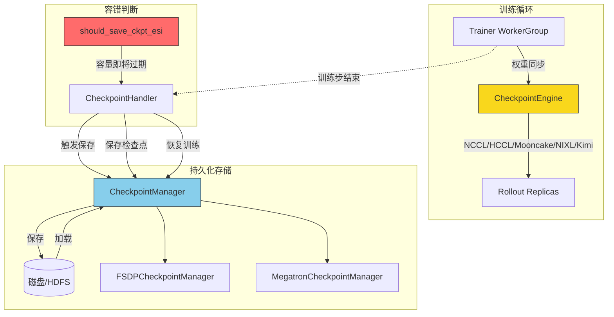
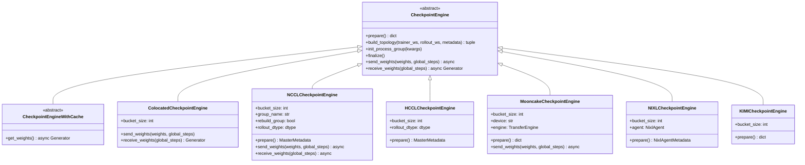
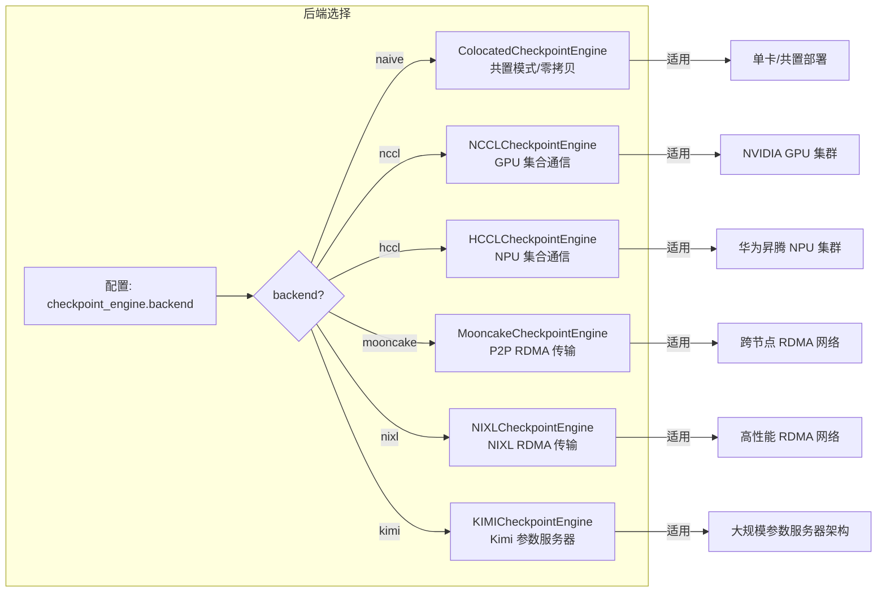
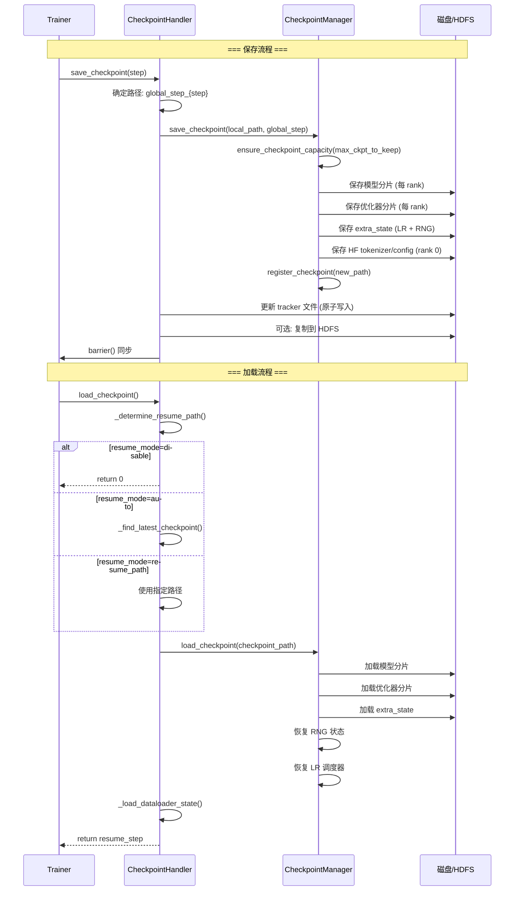

# 13. 检查点与容错

## 【总】开篇概述

在分布式 RLHF 训练中，训练任务通常持续数小时甚至数天，硬件故障、抢占式实例到期、网络抖动等异常随时可能中断训练。检查点（Checkpoint）系统是 verl 训练容错与恢复的基石——它不仅负责将模型权重、优化器状态、调度器状态等持久化到磁盘，还在训练与推理（Rollout）之间高效同步权重，确保训练流程的连续性。

**核心问题**：verl 如何在分布式训练中高效保存和恢复检查点？具体而言：
1. 如何抽象出统一的权重传输接口，适配多种通信后端（NCCL、HCCL、Mooncake、NIXL、Kimi）？
2. 如何管理检查点的保存/加载/恢复全流程，支持 FSDP 和 Megatron 两种并行策略？
3. 如何在抢占式环境中智能判断保存时机，避免因容量过期而丢失训练进度？



**关键结论预览**：
- verl 的检查点系统分为**权重同步引擎**（`CheckpointEngine`）和**持久化管理器**（`CheckpointManager`）两大子系统，前者负责 Trainer→Rollout 的实时权重传输，后者负责训练状态的磁盘持久化。
- 通过 `CheckpointEngineRegistry` 注册机制，系统支持 5 种通信后端的热插拔，用户可通过配置一键切换。
- `should_save_ckpt_esi` 函数实现了抢占式环境下的智能保存判断，确保训练进度不因容量过期而丢失。

---

## 【分】逐层展开

### 1. CheckpointEngine 抽象

#### 1.1 基类定义（base.py）

`CheckpointEngine` 是 verl 权重同步引擎的核心抽象，定义了 Trainer 与 Rollout 之间权重传输的标准协议。其设计哲学是：**训练侧发送权重，推理侧接收权重**，中间的通信机制由具体后端实现。



核心抽象方法的生命周期如下：

| 方法 | 阶段 | 职责 |
|------|------|------|
| `prepare()` | 初始化 | 分配权重桶（bucket）、可选注册 RDMA 内存、返回通信拓扑元数据 |
| `build_topology()` | 拓扑构建 | 根据 Trainer/Rollout 的 world_size 和元数据，构建通信拓扑参数 |
| `init_process_group()` | 通信建立 | 根据拓扑参数初始化进程组（NCCL group、ZMQ 连接等） |
| `send_weights()` | 权重发送 | Trainer 侧将权重分桶后异步发送 |
| `receive_weights()` | 权重接收 | Rollout 侧异步接收权重并还原为张量 |
| `finalize()` | 清理 | 释放权重桶、反注册 RDMA 内存、销毁进程组 |

此外，`CheckpointEngineWithCache` 是一个扩展抽象，支持本地缓存（共享内存/磁盘），允许 Rollout 在不中断正在进行的推理请求的情况下异步获取权重更新，这一设计参考了 [Laminar 论文](https://arxiv.org/abs/2510.12633)。

#### 1.2 TensorMeta 数据结构

`TensorMeta` 是权重传输的元数据载体，描述了每个张量在桶中的位置信息：

```python
@dataclass
class TensorMeta:
    name: str           # 权重张量名称
    shape: torch.Size   # 张量形状
    dtype: torch.dtype  # 数据类型
    chunk_offset: int   # 在原始张量中的分块偏移
    chunk_size: int     # 分块大小（字节）
    offset: int         # 在桶中的偏移位置
```

配合 `split_weight_chunks` / `merge_weight_chunks` 两个异步工具函数，系统实现了大张量的分桶传输——将超过 `bucket_size` 的张量拆分为多个块，逐桶传输后再合并还原。

#### 1.3 CheckpointEngineRegistry 注册机制

`CheckpointEngineRegistry` 采用装饰器模式实现后端的热插拔注册：

```python
class CheckpointEngineRegistry:
    _registry: dict[str, type["CheckpointEngine"]] = {}

    def register(backend: str):          # 装饰器：@CheckpointEngineRegistry.register("nccl")
        def wrapper(cls):
            CheckpointEngineRegistry._registry[backend] = cls
            return cls
        return wrapper

    @classmethod
    def get(cls, backend: str) -> type:  # 按名称获取引擎类
        return cls._registry[backend]

    @classmethod
    def new(cls, backend: str, *args, **kwargs) -> CheckpointEngine:  # 工厂方法
        return cls._registry[backend](*args, **kwargs)
```

在 `__init__.py` 中，各后端通过 `try/except ImportError` 按需加载，确保缺少可选依赖时不影响其他后端的使用。

#### 1.4 ColocatedCheckpointEngine（naive 后端）

当 Trainer 和 Rollout 共置在同一 GPU 上时，权重传输无需跨进程通信。`ColocatedCheckpointEngine`（注册名为 `"naive"`）通过简单的 Python 属性赋值实现零拷贝传输：`send_weights` 将权重生成器保存到 `self.weights`，`receive_weights` 直接 `yield from self.weights`。

#### 1.5 CheckpointEngineManager

`CheckpointEngineManager` 是权重同步的顶层协调器，管理 Trainer WorkerGroup 与多个 Rollout Replica 之间的权重更新流程。其核心方法 `update_weights` 的执行步骤如下：

1. **naive 后端**：直接调用 `trainer.update_weights()`，共置模式下零拷贝完成
2. **分布式后端**：
   - 中止所有 Rollout 副本上的未完成请求（`abort_replicas`）
   - 释放 KV Cache 以腾出显存（`release_kv_cache_replicas`）
   - 构建进程组（`build_process_group`：prepare → build_topology → init_process_group）
   - 执行权重同步（Trainer 侧 `send_weights` + Rollout 侧 `receive_weights` + `update_weights`）
   - 清理通信资源（`finalize`）
   - 恢复 KV Cache（`resume_kv_cache_replicas`）
   - 恢复推理请求（`resume_generation_replicas`）

该管理器还支持弹性伸缩：`add_replicas` / `remove_replicas` 可动态增减 Rollout 副本，并重建进程组。

### 2. 通信后端



#### 2.1 NCCLCheckpointEngine（nccl 后端）

NCCL 后端是 NVIDIA GPU 集群的默认选择，采用 **ZeroMQ + NCCL Broadcast** 的混合通信架构：

- **元数据传输**：通过 ZeroMQ PUB/SUB 模式，由 rank 0 广播桶元数据（`bucket_meta`）给所有 Rollout worker
- **权重数据传输**：通过 NCCL `broadcast` 操作，将桶内权重从 rank 0 广播到所有 Rollout rank
- **双缓冲机制**：使用 `send_buf` 和 `recv_buf` 两个缓冲区交替使用，实现发送与接收的流水线化
- **异步广播**：`BroadcastOperation` 将 NCCL 广播操作放入线程池执行，主协程可继续填充下一个桶

关键设计细节：
- Trainer 侧仅 rank 0 参与广播（其他 rank 的 `rank` 设为 -1，仅消费权重生成器）
- 使用 `cupy` 而非 `torch` 分配缓冲区，避免 `PYTORCH_CUDA_ALLOC_CONF=expandable_segments:True` 时的内存注册错误
- 支持 `rebuild_group` 选项，在每次权重更新后销毁并重建 NCCL 进程组

#### 2.2 HCCLCheckpointEngine（hccl 后端）

HCCL 后端是华为昇腾 NPU 集群的对应实现，架构与 NCCL 后端类似：

- 使用 `torch.npu` 替代 `torch.cuda`
- 使用 `StatelessProcessGroup` 替代 `ray.util.collective` 进行集合通信
- 同样采用 ZeroMQ PUB/SUB 广播元数据
- 在导入时检查 `torch.npu` 是否可用，不可用则抛出 `ImportError`

#### 2.3 MooncakeCheckpointEngine（mooncake 后端）

Mooncake 后端采用 **P2P RDMA** 传输模式，基于 Mooncake 的 `TransferEngine`：

- **初始化**：创建 `TransferEngine` 实例，通过 `P2PHANDSHAKE` 协议和 `rdma`（GPU）或 `ascend_direct`（NPU）传输模式建立连接
- **内存注册**：在构造函数中预分配双倍 `bucket_size` 的缓冲区，并通过 `batch_register_memory` 注册到 RDMA 引擎
- **拓扑构建**：Trainer rank 0 作为主节点，通过 `StatelessProcessGroup` 交换各 worker 的 `session_id` 和缓冲区指针
- **权重发送**：将权重填充到桶后，通过 `TransferEngine` 的 P2P 传输直接写入目标 worker 的已注册内存
- **完成通知**：使用 `magic_buf`（4KB 魔数缓冲区）作为传输完成的信号量

#### 2.4 NIXLCheckpointEngine（nixl 后端）

NIXL 后端基于 NVIDIA 的 NIXL（NVIDIA Infrastructure Exchange Library）实现高性能 RDMA 传输：

- **NixlAgent 封装**：对 `nixl_agent` 进行封装，使用 ZeroMQ 替代 `nixl_agent.send_notif` 传输桶元数据
- **异步操作模型**：`ReadableOperation`（发送侧）和 `ReadOperation`（接收侧）封装了完整的 RDMA 读写流程
- **通知机制**：通过 NIXL 的 `get_new_notifs` 轮询传输完成通知
- **分桶传输**：同样使用 `split_weight_chunks` / `merge_weight_chunks` 进行大张量分块

#### 2.5 KIMICheckpointEngine（kimi 后端）

Kimi 后端基于独立的 `checkpoint_engine` 库，采用 **参数服务器（Parameter Server）** 架构：

- 使用 `ParameterServer` 管理权重的分发
- 通过 `H2DBucket`（Host-to-Device Bucket）优化 CPU→GPU 的权重传输
- 支持按 rank 分桶（`ckpt_get_named_tensor_buckets`），每个 rank 只处理属于自己的权重分片
- 使用 `checkpoint_engine.distributed` 进行进程间通信

#### 2.6 各后端适用场景对比

| 后端 | 硬件平台 | 通信模式 | 元数据传输 | 适用场景 |
|------|----------|----------|------------|----------|
| naive | 任意 | 零拷贝 | 无 | Trainer/Rollout 共置同一 GPU |
| nccl | NVIDIA GPU | Broadcast | ZeroMQ PUB/SUB | NVIDIA GPU 集群标准场景 |
| hccl | 华为昇腾 NPU | Broadcast | ZeroMQ PUB/SUB | 昇腾 NPU 集群 |
| mooncake | GPU/NPU | P2P RDMA | StatelessProcessGroup | 跨节点 RDMA 网络、异构集群 |
| nixl | NVIDIA GPU | P2P RDMA | ZeroMQ PUSH/PULL | 高性能 RDMA 网络 |
| kimi | GPU | Parameter Server | 内置通信 | 大规模参数服务器架构 |

### 3. CheckpointManager

CheckpointManager 子系统负责训练状态的**磁盘持久化**，与 CheckpointEngine 的**实时权重同步**职责互补。

#### 3.1 BaseCheckpointManager（checkpoint_manager.py）

`BaseCheckpointManager` 定义了检查点持久化的基础框架：

**保存内容控制**：通过 `checkpoint_load_contents` 和 `checkpoint_save_contents` 配置项，用户可精确控制哪些组件需要保存/加载：
- `model` — 模型权重
- `optimizer` — 优化器状态
- `extra` — 额外状态（LR 调度器 + RNG 状态）
- `hf_model` — HuggingFace 格式模型

**检查点轮转**：
- `ensure_checkpoint_capacity()` — 在保存前预清理，确保不超过 `max_ckpt_to_keep` 限制
- `register_checkpoint()` — 保存成功后注册新路径，并清理超限的旧检查点
- `remove_previous_save_local_path()` — 删除旧的检查点目录

**RNG 状态管理**：
- `get_rng_state()` — 收集 CPU/NumPy/Random/CUDA 的随机数生成器状态
- `load_rng_state()` — 恢复所有 RNG 状态，确保恢复训练后的随机性可复现

**检查点发现**：
- `find_latest_ckpt_path()` — 通过 tracker 文件（`latest_checkpointed_iteration.txt`）定位最新检查点
- `get_checkpoint_tracker_filename()` — 返回 tracker 文件路径

#### 3.2 CheckpointHandler（checkpoint_handler.py）

`CheckpointHandler` 是检查点保存/加载的**上层编排器**，协调 Engine、DataLoader 和存储系统：

**保存流程**（`save_checkpoint`）：
1. 确定检查点路径：`{default_local_dir}/global_step_{step}`
2. 调用 `engine.save_checkpoint()` 保存模型/优化器/调度器状态
3. 保存 DataLoader 状态（仅 `is_mp_src_rank_with_outputs` 的 rank）
4. 保存 LoRA 训练元数据（仅 rank 0）
5. 原子更新 tracker 文件（先写临时文件再 rename）
6. 可选复制到 HDFS

**加载流程**（`load_checkpoint`）：
1. 通过 `_determine_resume_path()` 确定恢复路径
2. 调用 `engine.load_checkpoint()` 加载模型/优化器状态
3. 调用 `_load_dataloader_state()` 恢复 DataLoader 迭代位置

**恢复模式**（`resume_mode`）：
- `disable` — 不恢复，从头开始训练
- `auto` — 若指定了 `resume_from_path` 则从该路径恢复，否则自动查找最新检查点
- `resume_path` — 必须指定 `resume_from_path`，从指定路径恢复

**编排模式**（`OrchestrationMode`）：
- `SPMD` — 单进程多设备模式（torchrun），通过 `torch.distributed` 获取 rank 信息
- `RAY` — Ray 分布式模式，rank 固定为 0

#### 3.3 FSDPCheckpointManager（fsdp_checkpoint_manager.py）

`FSDPCheckpointManager` 针对 PyTorch FSDP（Fully Sharded Data Parallel）策略实现检查点管理：

**保存逻辑**：
- 每个 rank 独立保存自己的分片：`model_world_size_{ws}_rank_{rank}.pt`、`optim_world_size_{ws}_rank_{rank}.pt`、`extra_state_world_size_{ws}_rank_{rank}.pt`
- 使用 `ShardedStateDictConfig` + `ShardedOptimStateDictConfig` 配置 FSDP 的分片状态字典
- 支持 CPU offload（`offload_to_cpu=True`），在保存时将状态字典卸载到 CPU 以减少 GPU 内存占用
- Rank 0 额外保存 HuggingFace tokenizer/processor 和模型配置到 `huggingface/` 子目录
- 可选保存完整 HF 模型（`should_save_hf_model`），通过 `get_fsdp_full_state_dict` 聚合全量权重

**加载逻辑**：
- 每个 rank 加载对应的分片文件
- 先检查 `checkpoint_load_contents` 的合法性
- 恢复 RNG 状态确保可复现性
- 支持 `del_local_after_load` 选项，加载后删除本地文件（适用于 HDFS 场景）
- 所有 rank 完成加载后执行 `torch.distributed.barrier()` 同步

**FSDP 版本兼容**：通过 `fsdp_version()` 检测 FSDP 版本，v1 和 v2 的模型解包方式不同。

#### 3.4 MegatronCheckpointManager（megatron_checkpoint_manager.py）

`MegatronCheckpointManager` 针对 Megatron-LM 的分布式训练策略实现检查点管理，是最复杂的检查点管理器：

**双格式支持**：
- **Megatron 分布式检查点**（`use_dist_checkpointing=True`）：通过 `dist_checkpointing` 保存/加载 Megatron 分片权重，存储在 `model/dist_ckpt/` 目录
- **HuggingFace 格式**：通过 mbridge（Megatron-Bridge）将 Megatron 权重转换为 HF 格式，存储在 `model/huggingface/` 目录

**内容组合**：
- `model` + `use_dist_checkpointing=True` → 保存 Megatron 分片
- `model` + `use_dist_checkpointing=False` → 保存 HF 格式（需要 bridge）
- `hf_model` → 额外保存 HF 格式（需要 bridge）
- `model` + `hf_model` + bridge → 同时保存两种格式（去重，实际只写一次）

**配置持久化**：将训练配置（transformer_config、model_config 等）序列化为 JSON 安全格式，通过 `_to_json_safe_config_value` 递归处理不可序列化的类型（`torch.dtype`、`Enum`、`callable` 等）。

**优化器与调度器**：无论模型使用哪种格式，优化器、LR 调度器和 RNG 状态始终通过 `dist_checkpointing` 保存。

### 4. 检查点流程

#### 4.1 保存/加载流程



#### 4.2 保存时机与策略

检查点的保存时机由训练主循环控制，通常在以下场景触发：

1. **定期保存**：每隔 `save_steps` 步或 `save_interval` 时间间隔保存一次
2. **ESI 触发保存**：在抢占式环境中，通过 `should_save_ckpt_esi` 判断容量是否即将过期
3. **训练结束保存**：训练完成时保存最终检查点

#### 4.3 恢复训练

恢复训练时，系统需要还原以下状态：

| 状态组件 | 存储位置 | 恢复方式 |
|----------|----------|----------|
| 模型权重 | `model_world_size_{ws}_rank_{rank}.pt` | FSDP/Megatron 分片加载 |
| 优化器状态 | `optim_world_size_{ws}_rank_{rank}.pt` | 对应 rank 加载 |
| LR 调度器 | `extra_state_world_size_{ws}_rank_{rank}.pt` | `lr_scheduler.load_state_dict()` |
| RNG 状态 | `extra_state_world_size_{ws}_rank_{rank}.pt` | `torch.set_rng_state()` 等 |
| DataLoader | `data_{dp_rank}.pt` | `train_dataloader.load_state_dict()` |
| LoRA 元数据 | `lora_train_meta.json` | JSON 反序列化 |
| Tracker | `latest_checkpointed_iteration.txt` | 读取最新步数 |

#### 4.4 全局步数追踪

全局步数通过以下机制追踪：

1. **Tracker 文件**：`latest_checkpointed_iteration.txt` 记录最新的全局步数，使用原子写入（先写临时文件再 rename）确保一致性
2. **路径编码**：检查点目录名 `global_step_{step}` 直接编码了步数信息，`extract_step()` 函数通过正则提取
3. **恢复时**：`CheckpointHandler.load_checkpoint()` 返回 `resume_step`，训练主循环据此调整起始步数

#### 4.5 should_save_ckpt_esi 判断逻辑

`should_save_ckpt_esi` 是抢占式环境下的关键容错函数，其逻辑如下：

```python
def should_save_ckpt_esi(max_steps_duration, save_ckpt_duration=60, redundant_time=0):
    # 1. 读取容量过期时间戳（支持 VEMLP 和 AWS SageMaker 两种环境变量）
    exp_ts_mlp = os.getenv("MLP_CURRENT_CAPACITY_BLOCK_EXPIRATION_TIMESTAMP")   # VEMLP
    exp_ts_aws = os.getenv("SAGEMAKER_CURRENT_CAPACITY_BLOCK_EXPIRATION_TIMESTAMP")  # AWS

    # 2. 计算剩余时间
    remaining = expiration_timestamp - current_time

    # 3. 判断是否需要保存：剩余时间 > 0 且 <= 完成一步 + 保存检查点 + 冗余时间
    return remaining > 0 and remaining <= save_ckpt_duration + max_steps_duration + redundant_time
```

核心思想：**当容量剩余时间恰好足够完成当前训练步并保存检查点时，立即触发保存**。这确保了在抢占式实例到期前，训练进度不会丢失。参数含义：

- `max_steps_duration`：完成一步训练的预估时间（秒）
- `save_ckpt_duration`：保存检查点的预估时间（秒，默认 60）
- `redundant_time`：额外缓冲时间（秒，默认 0）

该函数在 `ray_trainer.py` 的训练主循环中被调用，当返回 `True` 时，即使未到定期保存的步数，也会立即保存检查点。

---

## 【总】总结升华

### 核心设计要点回顾

verl 的检查点系统采用了**双子系统分离**的架构设计：

1. **CheckpointEngine 子系统**（`verl/checkpoint_engine/`）：专注于 Trainer→Rollout 的**实时权重同步**，采用"准备-建拓扑-初始化-传输-清理"五阶段生命周期，通过注册机制支持多种通信后端的热插拔。

2. **CheckpointManager 子系统**（`verl/utils/checkpoint/`）：专注于训练状态的**磁盘持久化**，通过 Handler→Manager 的两层架构，将编排逻辑（路径管理、恢复模式）与存储逻辑（分片保存、格式转换）解耦。

### 通信后端对比分析

| 维度 | NCCL | HCCL | Mooncake | NIXL | Kimi |
|------|------|------|----------|------|------|
| 通信模式 | 集合广播 | 集合广播 | P2P RDMA | P2P RDMA | 参数服务器 |
| 拓扑结构 | 星形（rank 0 广播） | 星形 | 全互联 P2P | 全互联 P2P | 中心化服务器 |
| 元数据通道 | ZeroMQ PUB/SUB | ZeroMQ PUB/SUB | ProcessGroup | ZeroMQ PUSH/PULL | 内置 |
| 内存管理 | cupy 双缓冲 | torch 双缓冲 | 预注册 RDMA | NIXL Agent 注册 | H2D Bucket |
| 扩展性 | 受限于广播规模 | 受限于广播规模 | 节点数弹性 | 节点数弹性 | 服务器瓶颈 |
| 适用规模 | 中小集群 | 中小集群 | 大规模跨节点 | 大规模跨节点 | 超大规模 |

### 容错设计的关键权衡

1. **保存频率 vs 训练效率**：更频繁的检查点保存意味着更小的恢复窗口，但也引入了更多的 I/O 开销。verl 通过 `checkpoint_save_contents` 配置项允许用户选择只保存 `model`（跳过 `optimizer` 和 `extra`），在快速迭代阶段显著减少保存时间。

2. **一致性 vs 可用性**：Tracker 文件采用原子写入（临时文件 + rename）确保一致性；但在极端情况下（如保存过程中崩溃），可能出现模型分片已写入但 tracker 未更新的不一致状态。系统通过 `find_latest_ckpt_path` 的双重检查（tracker + 目录存在性验证）缓解此问题。

3. **ESI 保存 vs 训练中断**：`should_save_ckpt_esi` 在容量即将过期时触发紧急保存，但判断依赖于环境变量的准确性和时间预估的精确度。`redundant_time` 参数为不可预见的延迟提供了缓冲空间。

4. **权重同步 vs 推理连续性**：在分布式后端下，权重同步需要中止 Rollout 的推理请求并释放 KV Cache。`CheckpointEngineWithCache` 的本地缓存设计（参考 Laminar）提供了一种折中方案——Rollout 可在推理请求耗尽后再从本地缓存获取权重，避免强制中断。
