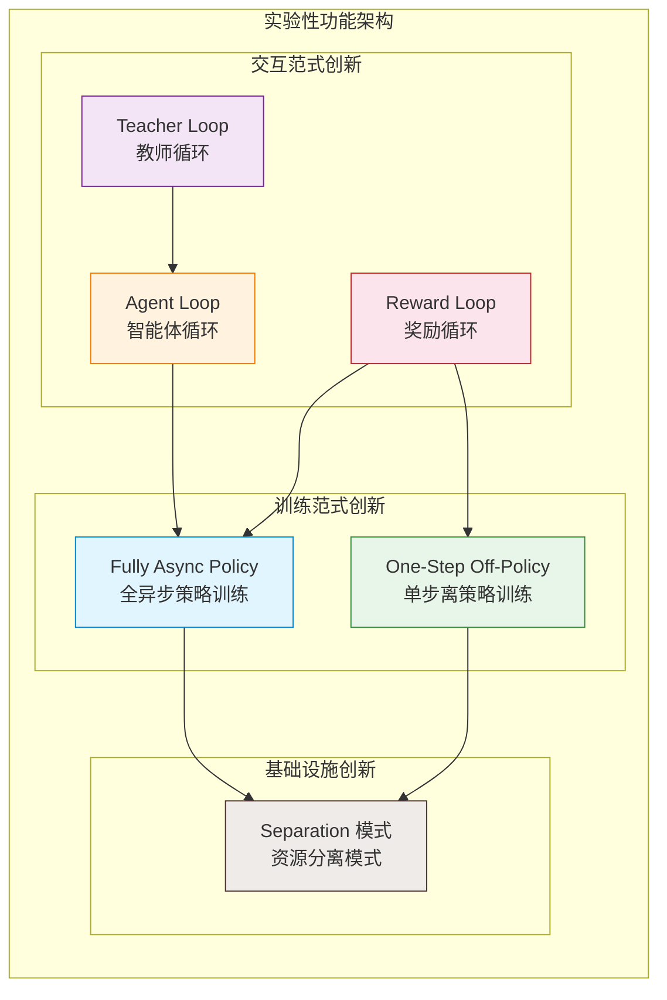
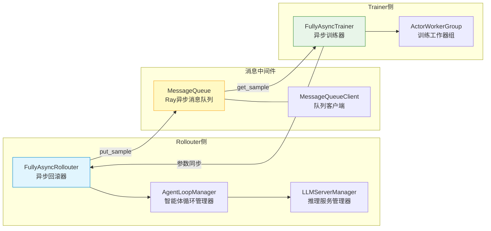
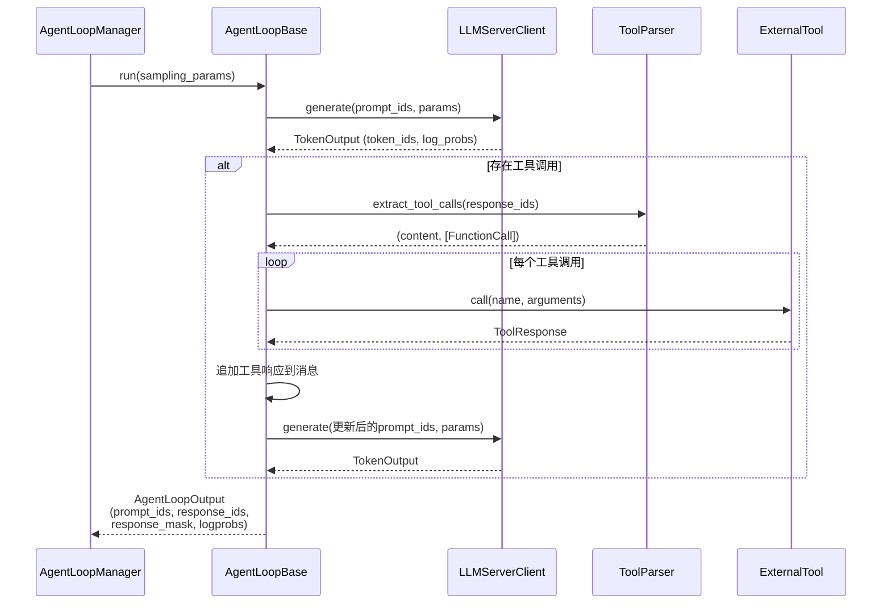
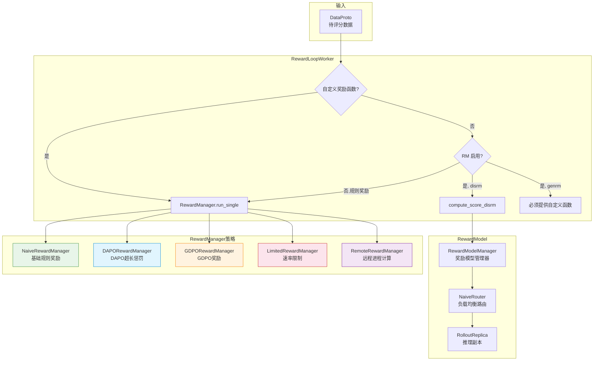

# verl 实验性功能详解

## 【总】开篇概述

### 核心价值

verl 的 `experimental` 模块是项目前沿探索的试验田，承载着对 RL 训练新范式的系统性探索。与主流程中稳定的同步 PPO 训练不同，实验性功能从**训练效率**、**策略更新方式**、**智能体交互**、**奖励计算**和**资源分离**五个维度，突破传统 on-policy 同步训练的瓶颈，为大规模 LLM 强化学习提供更灵活、更高效的解决方案。

### 核心问题

**verl 的实验性功能探索了哪些 RL 训练的新范式？** 具体而言：

1. 如何打破 rollout 与 training 的同步耦合，实现全异步训练？
2. 如何利用离策略（off-policy）数据提升样本效率？
3. 如何让 LLM 在 RL 训练中与外部工具和环境交互？
4. 如何将奖励计算解耦为独立的异步循环？
5. 如何通过教师模型实现知识蒸馏？
6. 如何在物理资源层面实现训练与推理的完全分离？

### 全局概览图



### 关键结论预览

| 功能模块 | 核心创新 | 成熟度 |
|---------|---------|--------|
| Fully Async Policy | Rollout/Training 完全解耦，消息队列驱动 | ★★★☆☆ |
| One-Step Off-Policy | 单步离策略更新，旧策略数据重用 | ★★★☆☆ |
| Agent Loop | 协程式多轮工具交互，ReAct 范式 | ★★★★☆ |
| Reward Loop | 独立异步奖励计算，可插拔管理器 | ★★★★☆ |
| Teacher Loop | 教师模型蒸馏，异步 logprob 计算 | ★★★☆☆ |
| Separation 模式 | 训练/推理资源物理隔离，DetachActor | ★★★★☆ |

---

## 【分】逐层展开

### 1. Fully Async Policy — 全异步策略训练

#### 1.1 设计动机

标准 PPO 训练中，rollout（采样）和 training（更新）严格串行：先采样一批数据，再更新模型，再采样……这导致 GPU 利用率低——训练时推理 GPU 空闲，推理时训练 GPU 空闲。Fully Async Policy 通过将 rollout 和 training 完全解耦为两个独立的 Ray Actor，以消息队列连接，实现真正的流水线并行。

#### 1.2 异步训练架构图



#### 1.3 核心组件详解

**fully_async_main.py — 入口编排器**

`FullyAsyncTaskRunner` 是整个异步训练的编排入口，作为 Ray Remote Actor 运行。其核心职责是：

- **组件初始化**：按序创建 Trainer → 注入 Hybrid Worker Group → 创建 Rollouter → 创建 MessageQueue
- **依赖注入**：将 Trainer 的 `actor_rollout_wg` 提取并注入到 Rollouter 中，支持 `use_trainer_do_validate` 模式下的混合验证
- **训练启动**：通过 `ray.wait` 并发监控 Rollouter 和 Trainer 两个 `fit.remote()` future，任一失败则取消全部

关键初始化顺序：Trainer 先于 Rollouter 创建（因为 hybrid worker group 需要从 Trainer 提取），MessageQueue 最后创建（依赖 Rollouter 的 `max_queue_size`）。

**fully_async_trainer.py — 异步训练器**

`FullyAsyncTrainer` 继承自 `SeparateRayPPOTrainer`，核心差异在于：

- **消息队列驱动**：不再从 DataLoader 获取数据，而是通过 `MessageQueueClient` 从队列消费 Rollouter 产生的 `RolloutSample`
- **参数版本追踪**：维护 `current_param_version`，记录训练步数对应的参数版本，用于判断样本的新鲜度
- **陈旧样本统计**：`stale_trajectory_processed` 统计因参数版本过旧而被丢弃的样本数
- **批量需求控制**：`require_batches` 控制每次训练需要的最小批次数，`required_samples = ppo_mini_batch_size × require_batches`
- **参数同步触发**：`trigger_parameter_sync_step` 控制每隔多少步触发一次向 Rollouter 的参数同步
- **混合检查点管理**：当 `use_trainer_do_validate=True` 时，创建 hybrid checkpoint manager 用于将训练权重同步到混合推理副本

**fully_async_rollouter.py — 异步回滚器**

`FullyAsyncRollouter` 同样继承自 `SeparateRayPPOTrainer`，负责持续采样：

- **FullyAsyncLLMServerClient**：扩展 `LLMServerClient`，支持 **partial rollout**（部分回滚恢复）。当推理被中断（`stop_reason=aborted`）时，自动恢复生成，对 AgentLoop 透明
- **FullyAsyncLLMServerManager**：扩展 `LLMServerManager`，支持 **hybrid replica** 管理。混合副本与训练引擎共置 GPU，可动态唤醒/休眠，实现训练-推理资源复用
- **版本信息传递**：每次生成结果附带 `global_steps`、`min_global_steps`、`max_global_steps`，用于训练器判断样本新鲜度

**message_queue.py — 消息队列**

`MessageQueue` 是基于 Ray Actor 的异步消息队列，核心特性：

- **有界队列**：`max_queue_size` 限制队列容量，满时丢弃最旧样本
- **异步条件变量**：使用 `asyncio.Condition` 实现生产者-消费者同步，消费者在队列为空时等待
- **统计信息**：追踪 `total_produced`、`total_consumed`、`dropped_samples`
- **验证队列**：独立的 `val_queue` 用于验证数据

`MessageQueueClient` 封装了远程调用逻辑，提供 `put_sample`、`get_sample`、`get_val_sample` 等异步接口。

**detach_utils.py — 梯度分离工具**

提供异步训练所需的数据处理工具：

- **RolloutSample**：数据类，封装完整批次信息、样本 ID、epoch 和回滚状态
- **prepare_single_generation_data**：从批次中提取单样本生成数据，类似 `ray_trainer._prepare_generate_batch` 的单样本版本
- **MetricsAggregator**：跨 GPU 聚合训练指标
- **assemble_batch_from_rollout_samples**：将多个 `RolloutSample` 组装为训练批次

#### 1.4 异步训练 vs 同步训练对比

| 维度 | 同步训练 (RayPPOTrainer) | 全异步训练 (FullyAsync) |
|------|------------------------|----------------------|
| 数据流 | Rollout → Training 串行 | Rollout → MQ → Training 并行 |
| GPU 利用率 | 推理/训练交替空闲 | 推理和训练持续运行 |
| 数据新鲜度 | On-policy（严格当前策略） | 近似 On-policy（存在延迟） |
| 参数同步 | 隐式（同一进程） | 显式（跨 Actor 参数同步） |
| 资源配置 | 共享资源池 | 独立资源池（Separation 模式） |
| 适用场景 | 小规模/严格 on-policy | 大规模/吞吐优先 |

---

### 2. One-Step Off-Policy — 单步离策略训练

#### 2.1 设计动机

标准 PPO 是严格的 on-policy 算法——每次更新后旧数据必须丢弃。One-Step Off-Policy 允许重用上一步策略产生的数据，在保持近 on-policy 性质的同时将样本效率提升近一倍。

#### 2.2 核心组件

**main_ppo.py — 入口**

`OneStepTaskRunner` 作为 Ray Remote Actor，初始化流程与标准 PPO 类似，但关键区别在于：

- 使用 `OneStepOffRayTrainer` 替代 `RayPPOTrainer`
- 从 `role_worker_mapping` 中移除 `Role.Rollout`（rollout 由 AgentLoop 管理）
- 使用 `separation.utils` 创建独立的资源池

**ray_trainer.py — 离策略训练器**

`OneStepOffRayTrainer` 继承自 `SeparateRayPPOTrainer`，核心特征：

- **非混合引擎**：`assert not self.hybrid_engine`，训练和推理使用独立资源池
- **Rollout 角色移除**：`role_worker_mapping.pop(Role.Rollout, None)`，rollout 由 AgentLoopManager 接管
- **ActorRollout 分离**：`_create_actor_rollout_classes` 仅创建 `Role.Actor`，不创建混合的 `ActorRollout`
- **数据重用**：训练循环中，上一步的 rollout 数据在下一步仍可用于训练（单步离策略）

#### 2.3 与标准 PPO 的差异

| 维度 | 标准 PPO | One-Step Off-Policy |
|------|---------|-------------------|
| 数据使用 | 严格 on-policy，一步一丢 | 近 on-policy，重用上一步数据 |
| 样本效率 | 基准 | ~2x 提升 |
| 策略偏差 | 无 | 单步偏差（可接受范围） |
| Rollout 管理 | Trainer 内部 | AgentLoopManager 独立管理 |
| 资源配置 | 可混合部署 | 必须分离部署 |

---

### 3. Agent Loop — 智能体循环

#### 3.1 设计动机

传统 RL 训练假设策略与环境是单轮交互：输入 prompt → 生成 response → 计算奖励。但现实任务（如代码生成、工具调用、多步推理）需要多轮交互。Agent Loop 将 LLM 的 RL 训练从单轮扩展到多轮，支持工具调用、环境反馈和 ReAct 范式。

#### 3.2 Agent 交互时序图



#### 3.3 核心组件详解

**agent_loop.py — 智能体循环基类**

这是整个 Agent Loop 框架的核心，定义了层次化的类体系：

- **AgentLoopMetrics**：性能指标数据类，追踪 `generate_sequences`、`tool_calls`、`compute_score`、`num_preempted`
- **AgentLoopOutput**：输出数据类，包含 `prompt_ids`、`response_ids`、`response_mask`（1=LLM 生成，0=工具响应）、`response_logprobs`、`routed_experts`、`reward_score`、`num_turns`
- **_InternalAgentLoopOutput**：内部输出，带 padding 后的张量，用于训练
- **AgentLoopBase**：抽象基类，提供 `apply_chat_template`、`process_multi_modal_info`、`run` 等接口
- **AgentLoopWorker**：在独立进程中运行多个 AgentLoop 协程
- **AgentLoopManager**：管理多个 AgentLoopWorker，并行执行 agent loop

注册机制：通过 `@register("agent_name")` 装饰器注册不同的 agent loop 实现，支持运行时按名称加载。

**tool_agent_loop.py — 工具智能体循环**

`ToolAgentLoop` 是最核心的多轮 agent 实现，采用状态机驱动：

- **AgentState 枚举**：`PENDING` → `GENERATING` → `PROCESSING_TOOLS` → `TERMINATED`
- **AgentData**：封装所有状态变量，包括消息历史、多模态数据、token 累积、工具调用、奖励分数等，支持 `extra_fields` 动态扩展
- **工具选择**：支持 per-sample 工具过滤（`tool_selection`），允许不同样本使用不同工具子集
- **多轮控制**：`max_user_turns`、`max_assistant_turns`、`max_parallel_calls` 限制交互轮次和并行工具调用数
- **响应掩码**：`response_mask` 区分 LLM 生成 token（1）和工具响应 token（0），确保训练时只对 LLM 生成部分计算损失

**single_turn_agent_loop.py — 单轮循环**

`SingleTurnAgentLoop` 是最简单的实现，只做单轮 chat completion：

- 提取多模态输入 → 应用 chat template → 生成序列 → 返回结果
- 不涉及工具调用，`response_mask` 全为 1

**tool_parser.py — 工具解析器**

`ToolParser` 是抽象基类，负责从 LLM 输出中提取工具调用：

- **FunctionCall**：数据类，包含 `name`（函数名）和 `arguments`（JSON 参数）
- **注册机制**：`_registry` 字典 + `get_tool_parser` 工厂方法
- **stop_token_ids**：可覆盖属性，某些模型（如 Gemma4）需要在工具调用 token 处停止生成
- **extract_tool_calls**：抽象方法，从 `response_ids` 中解析工具调用

**utils.py — 工具函数**

- **resolve_config_path**：在多节点 Ray 训练中解析配置文件路径，依次尝试当前目录、开发模式路径、安装模式路径
- **format_gpt_oss_tool_response_manually**：为 gpt-oss 模型手动格式化工具响应（因为 `apply_chat_template` 对工具调用消息处理不完善）

---

### 4. Reward Loop — 奖励循环

#### 4.1 设计动机

标准 PPO 中奖励计算与训练紧密耦合。Reward Loop 将奖励计算解耦为独立的异步循环，支持规则奖励、奖励模型、自定义奖励函数的灵活组合，并为 Agent Loop 的多轮交互提供异步奖励计算能力。

#### 4.2 Reward Loop 流程图



#### 4.3 核心组件详解

**reward_loop.py — 奖励循环**

`RewardLoopWorker` 是奖励计算的核心工作器，支持三种奖励计算路径：

1. **自定义奖励函数**：直接调用用户提供的 `compute_score` 函数
2. **判别式奖励模型（disrm）**：通过 `RewardModelManager` 调用推理服务获取奖励
3. **生成式奖励模型（genrm）**：必须配合自定义奖励函数使用

关键方法：
- `compute_score_batch`：批量异步计算，为每个样本创建独立 asyncio task
- `compute_score`：单样本计算，根据配置选择奖励路径
- `_post_request`：向 reward router 发送 HTTP 请求，支持指数退避重试（最多 16 次）
- `_preprocess_reward_inputs`：预处理奖励输入数据

`migrate_legacy_reward_impl` 函数处理旧配置到新配置的迁移，将 `reward_model`、`custom_reward_function`、`sandbox_fusion` 等旧配置统一迁移到 `reward` 命名空间下。

**reward_model.py — 奖励模型**

`RewardModelManager` 管理奖励模型的推理服务：

- **副本初始化**：根据 `resource_pool` 大小和 `rollout_world_size` 计算副本数，创建多个 `RolloutReplica`
- **部署模式**：支持 colocate（与训练共置）和 standalone（独立部署）两种模式
- **路由器**：初始化 HTTP 路由器进行负载均衡，将请求分发到不同副本

**reward_manager/ — 奖励管理器**

所有管理器继承自 `RewardManagerBase`，通过 `@register("name")` 注册：

| 管理器 | 注册名 | 核心功能 |
|--------|--------|---------|
| `NaiveRewardManager` | naive | 基础规则奖励，支持同步/异步 compute_score |
| `DAPORewardManager` | dapo | DAPO 算法奖励，增加超长响应惩罚（overlong buffer） |
| `GDPORewardManager` | gdpo | GDPO 算法奖励，附加实验名等额外信息 |
| `LimitedRewardManager` | limited | 基于 `AsyncTokenBucket` 的速率限制，防止 API 过载 |
| `RemoteRewardManager` | remote | 将奖励计算分发到独立 Ray 进程，解决线程池兼容性问题 |

`LimitedRewardManager` 中的 `AsyncTokenBucket` 实现了令牌桶算法，支持可变 token 消耗的速率限制，适用于调用外部 API（如 OpenAI）时的配额管理。

`RemoteRewardManager` 使用 `RewardComputeWorker`（Ray Remote Actor）在独立进程中计算奖励，解决了某些奖励函数（如 math-verify）在默认线程池中的兼容性问题。

**router/ — 路由器**

- **naive_router.py**：基于 FastAPI + uvicorn 的 HTTP 负载均衡路由器，通过多进程启动，将请求轮询分发到奖励模型推理副本

---

### 5. Teacher Loop — 教师循环

#### 5.1 设计动机

知识蒸馏是提升小模型性能的重要手段。Teacher Loop 在 RL 训练过程中引入教师模型，通过计算教师模型的 logprob 实现软标签蒸馏，使学生在强化学习的同时模仿教师的行为分布。

#### 5.2 核心组件

**teacher_manager.py — 教师模型管理**

`AsyncTeacherLLMServerManager` 是教师模型的核心管理器：

- **蒸馏配置**：从 `config.distillation` 解析 `DistillationConfig`，包含教师模型配置和损失配置
- **教师模型键**：`teacher_key` 指定当前使用的教师模型
- **采样参数**：`_get_teacher_sampling_params` 生成教师推理参数，`temperature=1.0`，`max_tokens=1`（仅需 prompt_logprobs）
- **输出填充**：`_pad_teacher_outputs` 对教师输出进行 padding，对齐 prompt 和 response 的维度

**teacher_model.py — 教师模型**

`TeacherModelManager` 管理教师模型的推理服务生命周期：

- **副本管理**：根据 `num_replicas` 和 `per_replica_world_size` 创建多个推理副本
- **资源验证**：严格检查资源池大小是否匹配预期（`num_replicas × per_replica_world_size`）
- **负载均衡**：初始化 load balancer handle，将请求分发到不同副本
- **模型加载**：使用 `RolloutReplica` 加载教师模型，支持 sglang/vLLM 等推理后端

Teacher Loop 与 Agent Loop 的集成：教师模型的 logprob 计算在 Agent Loop 的 `run` 方法中触发，结果通过 `AgentLoopOutput.extra_fields["teacher_ids"]` 和 `extra_fields["teacher_logprobs"]` 传递回训练流程。

---

### 6. Separation 模式 — 资源分离

#### 6.1 设计动机

标准 PPO 训练中，Actor、Rollout、Critic、RefPolicy 共享同一资源池，通过 hybrid engine 在训练和推理之间切换。Separation 模式将训练和推理资源物理隔离，为 Fully Async 和 One-Step Off-Policy 提供基础设施支撑。

#### 6.2 核心组件

**engine_workers.py — 分离式工作器**

`DetachActorWorker` 继承自 `ActorRolloutRefWorker`，核心能力是**模型状态的保存与恢复**：

- **策略处理器**：根据训练策略（FSDP、FSDP2、VeOmni、Megatron）选择对应的 save/restore handler
- **CPU 卸载**：将模型参数保存到 CPU 内存，释放 GPU 显存
- **GPU 恢复**：从 CPU 恢复模型参数到 GPU，继续训练
- **应用场景**：在异步训练中，训练完成后将参数卸载到 CPU，推理时从 CPU 加载到推理引擎

**ray_trainer.py — 分离式训练器**

`SeparateRayPPOTrainer` 继承自 `RayPPOTrainer`，是 Fully Async 和 One-Step Off-Policy 的共同基类：

- **状态管理**：维护 `global_steps`、`epoch`、`max_steps_duration` 等训练状态
- **奖励消息**：`future_reward`、`reward_tensor`、`reward_extra_infos_dict` 支持异步奖励计算
- **验证日志**：`ValidationGenerationsLogger` 记录验证生成结果

**utils.py — 工具函数**

- **create_resource_pool_manager**：创建资源池管理器，为训练角色（Actor、Critic、RefPolicy）分配 `trainer_pool`，为 Rollout 分配独立资源池
- **create_role_worker_mapping**：创建角色到工作器的映射，使用 `DetachActorWorker` 替代标准 `ActorRolloutRefWorker`，支持 `use_trainer_do_validate` 时的 `ActorRollout` 角色

#### 6.3 资源分离架构

Separation 模式的核心思想是将 GPU 资源分为两个独立池：

```
┌─────────────────────────┐    ┌─────────────────────────┐
│     Trainer Pool         │    │     Rollout Pool         │
│  ┌─────┐ ┌─────┐       │    │  ┌─────┐ ┌─────┐       │
│  │Actor│ │Critic│       │    │  │ LLM │ │ LLM │       │
│  │ GPU │ │ GPU  │       │    │  │Rep.1│ │Rep.2│       │
│  └─────┘ └─────┘       │    │  └─────┘ └─────┘       │
│  ┌─────┐ ┌─────┐       │    │  ┌─────┐ ┌─────┐       │
│  │ Ref │ │ ... │       │    │  │ LLM │ │ LLM │       │
│  │ GPU │ │     │       │    │  │Rep.3│ │Rep.4│       │
│  └─────┘ └─────┘       │    │  └─────┘ └─────┘       │
└─────────────────────────┘    └─────────────────────────┘
         ↕ 参数同步                      ↕
    DetachActorWorker              AgentLoopManager
    (save/restore)                (LLMServerManager)
```

---

## 【总】总结升华

### 回顾核心设计要点

verl 实验性功能的设计围绕一个核心矛盾展开：**on-policy 算法的严格数据新鲜度要求 vs 大规模训练的效率需求**。各模块从不同角度回应这一矛盾：

1. **Fully Async Policy** 选择**牺牲部分数据新鲜度换取吞吐**——通过消息队列解耦 rollout 和 training，使两者持续运行，GPU 利用率接近 100%。partial rollout 机制确保推理中断对上层透明。

2. **One-Step Off-Policy** 选择**有限度地重用旧数据**——单步离策略更新在理论保证和样本效率之间取得平衡，是异步训练的轻量替代方案。

3. **Agent Loop** 将 RL 训练从**单轮生成扩展到多轮交互**——状态机驱动的 ReAct 范式、response_mask 机制、工具解析器，共同构成了 LLM 作为智能体的 RL 训练基础设施。

4. **Reward Loop** 将奖励计算**从训练循环中解耦**——可插拔的 RewardManager 策略模式、独立的 RewardModel 推理服务、速率限制和远程计算，为复杂奖励场景提供灵活支持。

5. **Teacher Loop** 在 RL 训练中**引入教师信号**——异步 logprob 计算和蒸馏损失，使模型在强化学习的同时保持对教师分布的追踪。

6. **Separation 模式** 提供**资源隔离的基础设施**——DetachActorWorker 的 save/restore 机制和独立资源池管理，是上述所有异步/分离方案的基础支撑。

### 实验性功能的发展方向分析

1. **异步训练的深化**：当前 Fully Async 仍依赖显式参数同步步骤，未来可能探索更细粒度的参数增量同步（如基于 delta 的异步更新），进一步减少同步开销。

2. **Agent Loop 的生态化**：当前设计已预留与 NVIDIA Nemo-Gym、AWS Bedrock AgentCore、SWE-agent 等外部框架的集成接口，未来可能形成统一的 agent RL 训练标准。

3. **Reward Loop 的智能化**：从规则奖励到奖励模型再到 LLM-as-Judge，奖励计算正从确定性函数向可学习的评估系统演进，RemoteRewardManager 的进程隔离模式为复杂奖励计算提供了基础。

4. **资源调度的自适应化**：当前 hybrid replica 的唤醒/休眠是配置驱动的，未来可能根据队列积压和训练负载动态调整推理副本数量，实现真正的弹性调度。

### 各功能的成熟度评估

| 功能 | 成熟度 | 评估依据 |
|------|--------|---------|
| Agent Loop | ★★★★☆ | 类体系完整，注册机制成熟，已支持多种 agent 类型，文档注释详尽 |
| Reward Loop | ★★★★☆ | 策略模式完善，5 种管理器覆盖主要场景，配置迁移机制完备 |
| Separation 模式 | ★★★★☆ | DetachActorWorker 支持 4 种训练策略，资源池管理清晰，是异步训练的可靠基础 |
| Fully Async Policy | ★★★☆☆ | 核心架构完整，但 partial rollout、hybrid replica 等高级特性仍需更多实战验证 |
| One-Step Off-Policy | ★★★☆☆ | 架构清晰但功能相对简单，是异步训练的过渡方案 |
| Teacher Loop | ★★★☆☆ | 基础功能可用，但教师模型管理和蒸馏损失的集成深度有限 |

> **总体而言**，verl 的实验性功能展现了一个清晰的演进路径：从同步到异步、从单轮到多轮、从耦合到解耦。Agent Loop 和 Reward Loop 作为最成熟的模块，已经为 LLM 智能体训练提供了坚实的基础；而 Fully Async Policy 代表了最具野心的方向——完全打破 rollout 和 training 的耦合——虽然仍需打磨，但其架构设计为未来的大规模 RL 训练奠定了重要基础。
