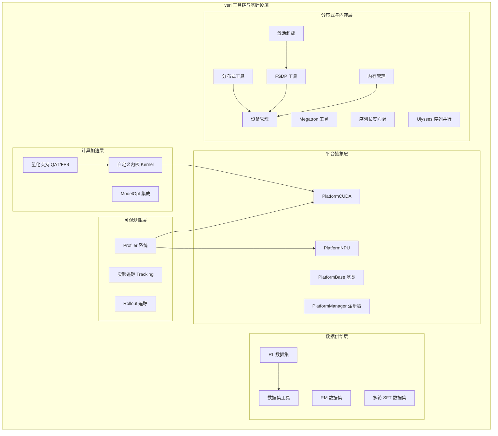
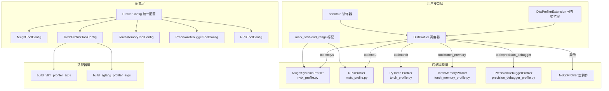
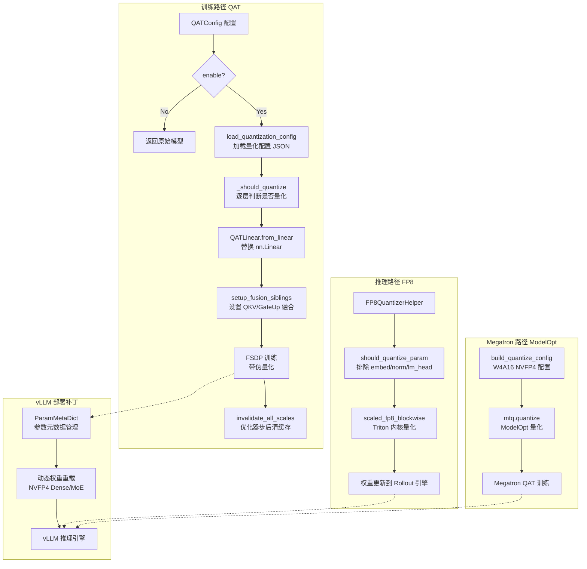
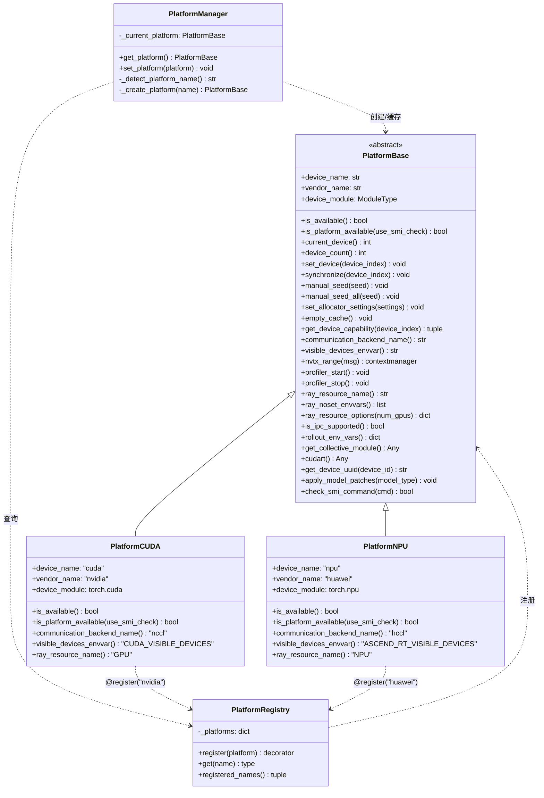
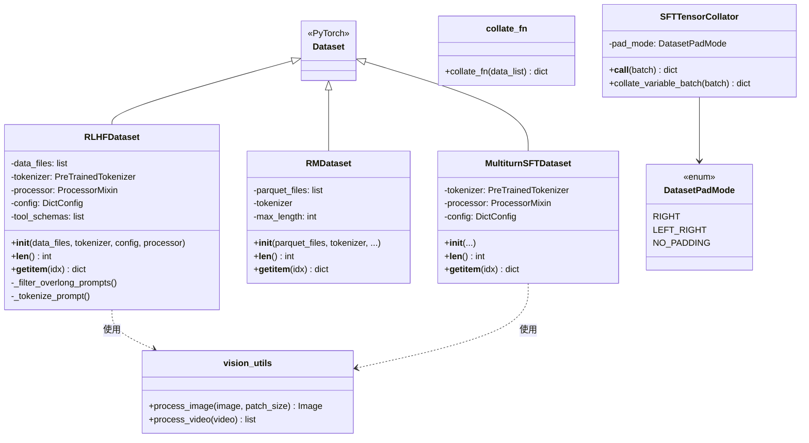

# verl 工具链与基础设施

## 【总】开篇概述

### 核心价值

工具链与基础设施是 verl 项目的运行支撑层，为大规模 RL 训练提供从性能剖析、量化加速、跨平台适配、数据管理到分布式协调的全栈基础设施。如果说 verl 的训练引擎和 Worker 体系是"肌肉"，那么工具链与基础设施就是"骨骼与神经系统"——它们不直接参与训练逻辑，却决定了整个系统能否高效、稳定、可观测地运行。

### 核心问题

**verl 提供了哪些基础设施来支撑高效的 RL 训练？** 这个问题可以从五个维度回答：

1. **可观测性**：Profiler 系统如何让训练瓶颈无所遁形？
2. **计算效率**：量化与自定义内核如何压榨硬件极限？
3. **跨平台兼容**：平台抽象层如何实现 CUDA/NPU 的统一管理？
4. **数据供给**：数据集系统如何支撑 RLHF、RM、多轮 SFT 等多样化训练范式？
5. **分布式协同**：分布式工具、内存管理、序列并行等如何保障大规模训练的稳定性？

### 全局概览图

### 关键结论预览

1. **Profiler 系统**采用策略模式，通过 `DistProfiler` 调度器统一管理 5 种后端（nsys/npu/torch/torch_memory/precision_debugger），实现按 rank/step 精确控制的开销极低剖析。
2. **量化体系**形成 QAT（训练时）+ FP8（推理时）+ ModelOpt（Megatron 集成）三线并行的架构，覆盖 W4A16/W4A4 等 NVFP4 量化模式。
3. **平台抽象层**通过注册器模式 + 自动检测 + 环境变量覆盖的三重机制，实现 CUDA/NPU 的零修改切换。
4. **数据集系统**以 `RLHFDataset` 为核心，支持多模态、工具调用、超长过滤等 RLHF 特有需求。
5. **分布式与内存工具**覆盖从进程组初始化、NUMA 亲和性、FSDP 分片策略到激活卸载的全链路优化。

---

## 【分】逐层展开

### 1. Profiler 系统

Profiler 系统是 verl 可观测性的核心，为开发者提供从 GPU 内核级到训练步骤级的全栈性能剖析能力。

#### 架构总览

#### profile.py — 统一 Profiler 入口

`DistProfiler` 是整个 Profiler 系统的调度中枢，采用**策略模式**根据 `config.tool` 字段懒加载对应的后端实现：

- **rank 选择**：支持 `all_ranks`（全量）、`ranks` 列表（指定）、默认 rank 0 三种模式
- **step 控制**：通过 `start()`/`stop()` 方法标记当前 step 是否需要剖析，`_this_step` 标志位实现按需剖析
- **装饰器机制**：`DistProfiler.annotate()` 类方法可在 Worker 方法上添加剖析注解，自动检查 enable/rank/step 三重条件，不满足则直接执行原函数（零开销）
- **分布式扩展**：`DistProfilerExtension` 通过 `@register(dispatch_mode=Dispatch.ONE_TO_ALL)` 将 `start_profile`/`stop_profile` 分发到所有 Worker

模块级函数 `mark_start_range`/`mark_end_range`/`mark_annotate` 在 `profile.py` 中提供 no-op 默认实现，在 `nvtx_profile.py` 和 `mstx_profile.py` 中被替换为真实实现——这是一种**模块级多态**设计，通过 Python 的模块导入机制实现零开销切换。

#### config.py — Profiler 配置体系

配置采用 `@dataclass` 继承体系，每种后端有独立的 ToolConfig：

| 配置类 | 对应后端 | 关键参数 |
|--------|---------|---------|
| `NsightToolConfig` | nsys | `discrete`（每任务独立数据库） |
| `TorchProfilerToolConfig` | torch | `contents`（cuda/cpu/memory/shapes/stack）、`profile_token_start/end`（token 级窗口） |
| `TorchMemoryToolConfig` | torch_memory | `trace_alloc_max_entries`、`stack_depth` |
| `PrecisionDebuggerToolConfig` | precision_debugger | `config_path`、`stages`（actor_update/critic_update 等） |
| `NPUToolConfig` | npu | `contents`、`level`（level0-2）、`analysis` |

`ProfilerConfig` 提供 `union()`/`intersect()` 方法，支持多角色配置的合并与交集运算——这在 Actor/Critic 共享 Profiler 配置时非常有用。

`build_vllm_profiler_args()` 和 `build_sglang_profiler_args()` 是适配器函数，将 verl 统一配置转换为 vLLM/SGLang 的特定参数格式，兼顾了 vLLM `< 0.13.0`（环境变量）和 `>= 0.13.0`（参数传递）两种 API 风格。

#### torch_profile.py — PyTorch Profiler

封装 `torch.profiler.profile`，支持：
- 按 `contents` 配置选择 `ProfilerActivity.CPU`/`CUDA`
- 自动生成带 rank、PID、时间戳的 trace 文件名
- 通过 `_trace_handler` 导出 Chrome Trace 格式（`.json.gz`）

#### nvtx_profile.py — NVTX Profiler（NVIDIA）

基于 `nvtx` 库实现，提供：
- `mark_start_range`/`mark_end_range`：NVTX range 标记
- `mark_annotate`：函数级 NVTX 注解装饰器
- `NsightSystemsProfiler` 类：完整 start/stop/annotate 生命周期

#### mstx_profile.py — MSTX Profiler（NPU）

基于 `torch_npu.npu.mstx` 实现，为华为 Ascend NPU 提供与 NVTX 对等的剖析能力：
- `mstx.range_start`/`range_end`：MSTX range 标记
- `mstx.mstx_range`：函数级 MSTX 注解

#### torch_memory_profile.py — 内存分析

`TorchMemoryProfiler` 在 step 边界 dump CUDA 内存快照：
- 首次构造时通过 `MemorySnapshotSampler` 启用内存历史记录
- `stop()` 时将快照保存为 pickle 文件
- 支持 `trace_alloc_max_entries` 和 `stack_depth` 参数控制追踪精度

#### performance.py — 性能分析

提供运行时性能监控工具：
- `_get_current_mem_info()`：获取当前设备内存使用（allocated/reserved/used/total）
- 基于 `codetiming.Timer` 的计时装饰器
- 与 `DecoratorLoggerBase` 集成的日志记录

#### precision_debugger_profile.py — 精度调试

集成 msprobe 精度调试器，支持按训练阶段（`actor_update`、`critic_update`、`compute_rm_score` 等）选择性采集精度数据。通过 `_STAGE_TO_ROLE` 和 `_MODEL_ATTRS_BY_ROLE` 映射表，自动定位当前 Worker 对应的模型实例。

---

### 2. 量化支持

量化是 verl 在有限显存下训练大模型的关键手段，覆盖训练时量化（QAT）和推理时量化（FP8）两条路径。

#### 量化流程图

#### qat/core.py — 量化感知训练核心

`QATConfig` 统一配置量化参数：
- `mode`：量化模式，默认 `"w4a16"`（4-bit 权重，16-bit 激活）
- `group_size`：分组大小，默认 16
- `ignore_patterns`：忽略量化的层，支持字面匹配和 `re:` 前缀的正则匹配（默认忽略 `lm_head`、`embed_tokens`、`re:.*mlp.gate$`）
- `activation_observer`：激活观察器类型，默认 `"static_minmax"`

`apply_qat()` 函数遍历模型所有 `nn.Linear` 层，通过 `_should_quantize()` 判断是否需要量化（排除不满足 group_size 整除的层），然后用 `QATLinear.from_linear()` 替换。`setup_fusion_siblings()` 为 QKV 和 GateUp 融合组建立弱引用关系，`invalidate_all_scales()` 在优化器步后清除缓存的缩放因子。

#### qat/linear.py — 量化线性层

`QATLinear` 是核心量化模块，支持 `QATMode.W4A16` 和 `QATMode.W4A4` 两种模式：
- 内置 Triton `_fp4_fake_quant_kernel` 实现 FP4 伪量化
- 使用 `FP4_E2M1_MAX=6.0` 和 `FP8_E4M3_MAX=448.0` 常量
- 支持 blockwise 和 global 两级缩放
- 与 FSDP 兼容，通过 `_fusion_siblings_ref` 实现跨层缩放融合

#### qat/quantizer.py — 量化器

`compute_blockwise_scale()` 函数计算 FP8 E4M3 blockwise 缩放因子：
- 将权重按 `group_size` 分组，计算每组的绝对值最大值
- 使用 `global_scale * local_scale` 得到 blockwise scale
- 针对零值添加 `eps` 保护

基于 `compressed_tensors` 库的 `NVFP4PackedCompressor` 和 `QuantizationArgs`，提供完整的 NVFP4 量化管线。

#### qat/vllm_patch.py — vLLM 量化补丁

`ParamMetaDict` 解决了 vLLM 中 NVFP4 量化模型的动态权重更新问题：
- 支持参数的元数据保存与重建（`rebuild`）
- 支持形状变化的张量交换（`tensor_swap`），保证 CUDA Graph 的地址稳定性
- 覆盖 Dense（W4A16-FP4、W4A4-FP4）和 MoE（NVFP4-MoE）两种方案

#### fp8_utils.py / fp8_kernel.py — FP8 工具

`FP8QuantizerHelper` 为推理路径提供 FP8 量化支持：
- `should_quantize_param()`：排除 embedding、norm、lm_head、MoE router 等层
- `scaled_fp8_blockwise()`：基于 Triton 内核的高性能 FP8 blockwise 量化
- 支持 `VERL_DISABLE_TRITON_FP8` 环境变量回退到 PyTorch 原生实现

#### kernel/kernels.py — 自定义内核

基于 Triton 实现高性能内核，核心是 `efficient_entropy_forward`——线性交叉熵的前向内核。支持 CUDA TMA（Tensor Memory Accelerator，需 SM90+），通过 `SUPPORT_CUDA_TMA` 标志自动检测。当 Triton 不可用时，提供 `null_decorator` 降级方案。

#### kernel/linear_cross_entropy.py — 线性交叉熵内核

`LinearCrossEntropy` 继承 `torch.autograd.Function`，实现**融合线性+交叉熵**的自定义算子：
- 前向：`hidden @ weight.T → log_softmax → cross_entropy`，避免实例化完整 logits 矩阵
- 支持分布式词汇表（`dist_process_group` 参数）
- 支持温度缩放和多种 reduction 模式
- 显著降低大词汇表模型的显存占用和计算开销

#### modelopt/ — ModelOpt 集成

`modelopt/quantize.py` 为 Megatron-LM 路径提供 ModelOpt 量化配置：
- `_NVFP4_W4A16_QUANTIZER_CFG`：定义 NVFP4 W4A16 量化器配置（2-bit+1-bit 权重、16 分组动态缩放）
- `build_quantize_config()`：构建完整的 `mtq.quantize` 配置，支持 ignore patterns 到 Megatron 命名规范的映射
- `modelopt/qat_utils.py` 和 `modelopt/qat_weight_exporter.py` 提供 QAT 工具和权重导出
- `modelopt/vllm_modelopt_patch.py` 提供 vLLM 与 ModelOpt 的集成补丁

---

### 3. 平台抽象

平台抽象层是 verl 跨硬件兼容的基石，通过注册器模式 + 自动检测实现 CUDA/NPU 的零修改切换。

#### 平台抽象层类图

#### platform_base.py — 平台基类

`PlatformBase` 定义了 7 大接口域共 20+ 个抽象方法：

1. **核心设备管理**：`device_name`、`vendor_name`、`device_module`、`is_available()`、`current_device()`、`device_count()`、`set_device()`、`synchronize()`
2. **随机数生成**：`manual_seed()`、`manual_seed_all()`
3. **内存管理**：`set_allocator_settings()`、`empty_cache()`
4. **设备属性**：`get_device_capability()`
5. **分布式通信**：`communication_backend_name()`、`visible_devices_envvar()`
6. **剖析辅助**：`nvtx_range()`、`profiler_start()`、`profiler_stop()`
7. **Ray 集成**：`ray_resource_name()`、`ray_noset_envvars()`、`ray_resource_options()`

`check_smi_command()` 是一个静态方法，用于检测系统管理命令（如 `nvidia-smi`）是否可用，在 CPU-only Ray Actor 中判断硬件是否存在时特别有用。

#### platform_cuda.py — CUDA 平台

`PlatformCUDA` 通过 `@PlatformRegistry.register(platform="nvidia")` 注册，关键实现：
- `is_platform_available(use_smi_check=True)`：在 CPU-only Ray Actor 中，`torch.cuda.is_available()` 可能返回 False，此时回退到 `nvidia-smi` 检测
- `ray_resource_options()`：使用 `{"num_gpus": N}` 标准 Ray GPU 资源分配
- 通信后端为 `nccl`

#### platform_npu.py — NPU 平台

`PlatformNPU` 通过 `@PlatformRegistry.register(platform="huawei")` 注册：
- `_ensure_torch_npu()`：模块加载时尝试导入 `torch_npu`，使 `torch.npu` 可用
- `is_platform_available(use_smi_check=True)`：仅需 `torch_npu` 可导入即返回 True（无需设备可见）
- `ray_resource_options()`：使用 `{"resources": {"NPU": N}}` 自定义 Ray 资源
- 通信后端为 `hccl`

#### platform_manager.py — 平台管理器

平台解析采用**三重检测机制**：

1. **环境变量覆盖**：`VERL_PLATFORM` 环境变量直接指定平台名
2. **自动探测**：遍历所有已注册平台，调用 `is_platform_available(use_smi_check=True)` 检测
3. **兜底默认**：若检测失败，回退到 `"nvidia"`

`get_platform()` 使用**单例模式**，首次调用时检测并缓存，后续调用直接返回。`set_platform()` 允许在初始化前手动覆盖。

---

### 4. 数据集系统

数据集系统为 verl 的多种训练范式提供统一的数据供给能力。

#### 数据集类图

#### rl_dataset.py — RL 数据集

`RLHFDataset` 是 verl 最核心的数据集类，专为 RLHF 训练设计：

- **数据源**：Parquet 文件，通过 HuggingFace `datasets` 库加载
- **多模态支持**：通过 `ProcessorMixin` 处理图像（`image_key`）、视频（`video_key`）、音频（`audio_key`）
- **工具调用**：集成 `tool_config_path`/`function_tool_path`，加载工具 schema 以对齐 Rollout 路径的 token 长度
- **超长过滤**：`filter_overlong_prompts` 选项，多进程并行过滤超过 `max_prompt_length` 的样本
- **Chat Template**：支持自定义 `chat_template_func` 和 `apply_chat_template_kwargs`
- **断点续训**：保留 `original_data_files` 用于 resume

`collate_fn()` 是配套的批处理函数，将 tensor 类型 stack 为批次张量，非 tensor 类型转为 `np.ndarray`（dtype=object）。

#### rm_dataset.py — 奖励模型数据集

`RMDataset` 为奖励模型训练提供 chosen/rejected 对数据：
- 支持 Parquet 文件输入
- 通过 `chosen_key`/`rejected_key` 配置字段名
- `download_files_distributed()` 确保分布式环境下仅 rank 0 下载，其余 rank 通过 barrier 等待

#### multiturn_sft_dataset.py — 多轮 SFT 数据集

`MultiturnSFTDataset` 支持多轮对话的 SFT 训练：
- 处理多轮对话的 loss mask，确保仅在 assistant 回复部分计算损失
- 集成 `vision_utils` 处理多模态输入
- 使用 `apply_chat_template` 和 `extract_system_prompt_and_generation` 进行模板处理
- `@once` 装饰器确保调试信息只打印一次

#### dataset_utils.py — 数据集工具

`SFTTensorCollator` 提供三种填充模式：
- `RIGHT`：右填充，使用 `default_collate`
- `LEFT_RIGHT`：左右填充，使用 `default_collate`
- `NO_PADDING`：不填充，使用 `nested_tensor_from_tensor_list` 转换为 NestedTensor

`DatasetPadMode` 枚举确保类型安全。

#### vision_utils.py — 视觉工具

提供 `process_image()` 和 `process_video()` 两个核心函数：
- `process_image()`：支持 PIL Image、URL、bytes 等多种输入格式，通过 `qwen_vl_utils.fetch_image` 获取
- `process_video()`：支持视频文件路径、帧列表、URL 等格式，支持 fps/min_frames/max_frames 参数

---

### 5. 其他关键工具

#### distributed.py — 分布式工具

提供分布式训练的基础设施工具：
- `set_numa_affinity()`：通过 `pynvml` 设置 NUMA 亲和性，将 CPU 核心绑定到 GPU 对应的 NUMA 节点
- `initialize_global_process_group()`：初始化全局进程组，自动选择 NCCL/HCCL 后端
- `initialize_global_process_group_ray()`：Ray 环境下的进程组初始化，支持 socket 和 IPv6

#### fsdp_utils.py — FSDP 工具

FSDP（FullyShardedDataParallel）工具集，是 verl FSDP 训练路径的核心：
- 兼容 PyTorch 2.4/2.6+ 的 FSDP API 变化（`fully_shard` 从 `_composable` 迁移到 `fsdp`）
- `get_init_weight_context_manager()`：非 rank 0 使用 `init_empty_weights` 节省内存
- `get_fsdp_wrap_policy()`：自动生成 FSDP 分片策略，支持 transformer 层级和大小两种策略
- `FSDPModule`/`MixedPrecisionPolicy`/`CPUOffloadPolicy` 等类型的条件导入

#### megatron_utils.py — Megatron 工具

为 Megatron-LM 训练路径提供工具函数：
- `get_model()`：构建 Megatron 模型，支持流水线并行和虚拟流水线并行
- 集成 `ModelParallelConfig`、`tensor_parallel`、`parallel_state` 等 Megatron 核心模块
- 支持 `Float16Module`、`ChainedOptimizer` 等 Megatron 特有组件

#### seqlen_balancing.py — 序列长度均衡

解决 RL 训练中序列长度差异导致的负载不均衡问题：
- `calculate_workload()`：基于 Transformer FLOPs 估算公式（`24576 * seqlen + seqlen²`，校准于 7B 模型 hidden_size=4096）计算工作负载
- `karmarkar_karp()`：实现 Karmarkar-Karp 差分法（Largest Differencing Method），将近优解的多路划分问题转化为启发式搜索
- 支持 `equal_size` 模式，确保每个分区的样本数严格相等

#### rollout_trace.py — Rollout 追踪

`RolloutTraceConfig` 是单例配置类，管理 Rollout 过程的追踪：
- 支持后端：Weave、MLflow、Trackio
- `max_samples_per_step_per_worker`：限制每 worker 每步追踪的样本数，避免追踪开销过大
- `token2text`：是否将 token ID 转换为可读文本
- 基于 `ContextVar` 实现线程安全的追踪开关

#### tracking.py — 实验追踪

`Tracking` 类提供统一的实验追踪接口，支持 8 种后端：

| 后端 | 用途 |
|------|------|
| `wandb` | 主流实验追踪 |
| `mlflow` | MLflow 追踪（支持重试） |
| `swanlab` | SwanLab 追踪 |
| `tensorboard` | TensorBoard 日志 |
| `console` | 控制台输出 |
| `clearml` | ClearML 追踪 |
| `trackio` | Trackio 追踪 |
| `file` | 文件日志 |

支持同时启用多个后端，通过 `default_backend` 参数配置。`vemlp_wandb` 为内部变体，`tracking` 为已弃用的别名。

#### activation_offload.py — 激活卸载

`CpuOffloadHookWithOffloadHandler` 实现激活的 CPU 卸载与恢复：
- 通过 `torch._C._autograd._push_saved_tensors_default_hooks` 注册自动梯度钩子
- `FSDPParameterFilter` 过滤模型参数，避免卸载 FSDP 管理的参数
- `OffloadHandler` 抽象接口，支持不同的卸载策略（同步/异步/预取）
- 与 FSDP2（`FSDPModule`）集成

#### ulysses.py — DeepSpeed Ulysses 序列并行

实现 DeepSpeed Ulysses 序列并行策略：
- `gather_seq_scatter_heads()`：alltoall 通信，gather 序列维度、scatter 头维度
- `scatter_seq_gather_heads()`：反向操作
- 全局进程组管理：`set/get_ulysses_sequence_parallel_group()`
- 支持 `unpadded_dim_size` 处理非对齐序列长度

#### device.py — 设备管理

`device.py` 是向后兼容的设备工具模块，所有函数内部委托给平台抽象层：
- `is_cuda_available`/`is_npu_available`：模块级可用性标志
- `get_resource_name()`：返回 Ray 资源名（GPU/NPU）
- `get_vendor()`：返回硬件供应商名
- `get_visible_devices_keyword()`：返回可见设备环境变量名
- `get_device_name()`：返回设备类型字符串
- `get_torch_device()`：返回 `torch.cuda`/`torch.npu` 模块

#### memory_utils.py — 内存管理

提供 GPU 内存管理的工具集：
- `aggressive_empty_cache()`：激进式内存清理，多次重试 GC + `empty_cache` + 同步，直到释放量小于 1GB
- `reset_memory_stats()`：重置 GPU 内存统计
- `MemorySnapshotSampler`：内存快照采样器，供 `TorchMemoryProfiler` 使用
- `enable_memory_visualize()`/`clear_memory_history()`：内存可视化控制

---

## 【总】总结升华

### 核心设计要点回顾

1. **策略模式驱动的 Profiler 系统**：`DistProfiler` 作为统一调度器，通过 `config.tool` 字段懒加载后端实现，实现了零开销的按需剖析。rank/step 双重过滤确保只剖析目标进程和目标步骤，`_NoOpProfiler` 兜底保证不启用时零开销。

2. **三线并行的量化架构**：QAT（训练时伪量化）→ FP8（推理时量化）→ ModelOpt（Megatron 路径）三条路径覆盖了从训练到部署的完整生命周期。`QATLinear` 的 Triton 内核实现了高性能 FP4 伪量化，`ParamMetaDict` 解决了 vLLM 动态权重更新的工程难题。

3. **注册器 + 自动检测的平台抽象**：`PlatformRegistry` 装饰器注册 + `_detect_platform_name()` 三重检测 + `get_platform()` 单例缓存，构成了一个优雅的跨平台方案。新增平台只需继承 `PlatformBase` 并添加 `@register` 装饰器。

4. **RLHF 特化的数据集系统**：`RLHFDataset` 深度集成了工具调用、多模态处理、超长过滤等 RLHF 特有需求，`collate_fn` 的 tensor/non-tensor 分离处理简洁高效。

5. **全链路的分布式与内存优化**：从 NUMA 亲和性、进程组初始化，到 FSDP 分片策略、激活卸载、序列长度均衡，再到 Ulysses 序列并行，verl 提供了从单卡到千卡级别的完整优化工具链。

### 工具链的完整性分析

verl 的工具链覆盖了 RL 训练的完整生命周期：

| 阶段 | 工具支撑 |
|------|---------|
| 环境初始化 | 平台检测、设备管理、进程组初始化 |
| 数据准备 | RL/RM/SFT 数据集、多模态处理、序列均衡 |
| 训练执行 | FSDP/Megatron 工具、量化、自定义内核、激活卸载 |
| 性能优化 | Profiler 系统、内存管理、序列并行 |
| 实验管理 | Tracking、Rollout 追踪 |
| 模型部署 | vLLM/SGLang 补丁、FP8 量化、权重导出 |

这种完整性使得开发者可以在 verl 框架内完成从数据准备到模型部署的全流程，无需切换工具链。

### 跨平台支持的设计权衡

verl 的跨平台设计在以下方面做出了权衡：

- **抽象粒度**：`PlatformBase` 定义了 20+ 个抽象方法，粒度较细。这保证了功能完整性，但也增加了新平台适配的工作量。未来可考虑将部分方法降级为默认实现（如 `rollout_env_vars` 已有默认空字典）。

- **运行时 vs 编译时**：平台检测在运行时完成（`get_platform()` 首次调用），而非导入时。这避免了在 CPU-only 环境中导入 CUDA/NPU 库导致的错误，但也意味着某些平台特定问题只能在运行时暴露。

- **兼容性优先**：`device.py` 保留了 80+ 个导入点的向后兼容接口，所有函数内部委托给平台抽象层。这种设计保证了迁移平滑，但也增加了维护成本。

- **Triton 依赖**：自定义内核（FP4 伪量化、FP8 量化、线性交叉熵）依赖 Triton，在 NPU 等非 CUDA 平台上需要回退方案。verl 通过 `HAVE_TRITON`/`SUPPORT_CUDA_TMA` 标志和 `null_decorator` 降级机制处理了这一问题，但性能回退不可避免。
