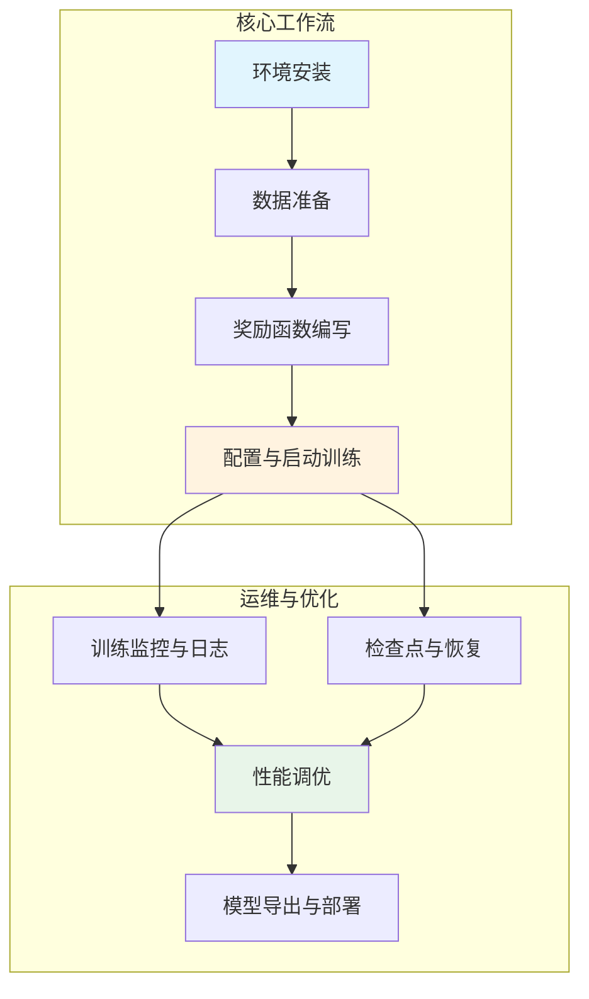
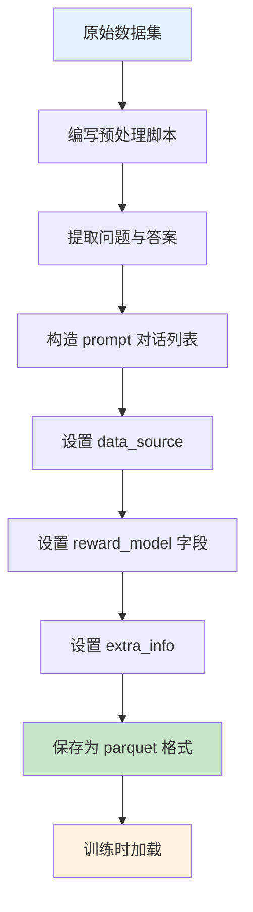
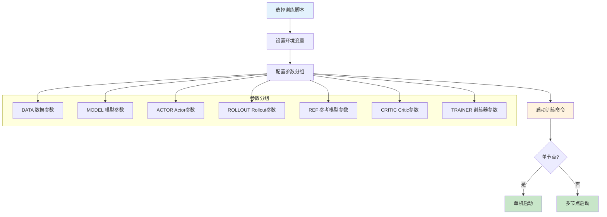
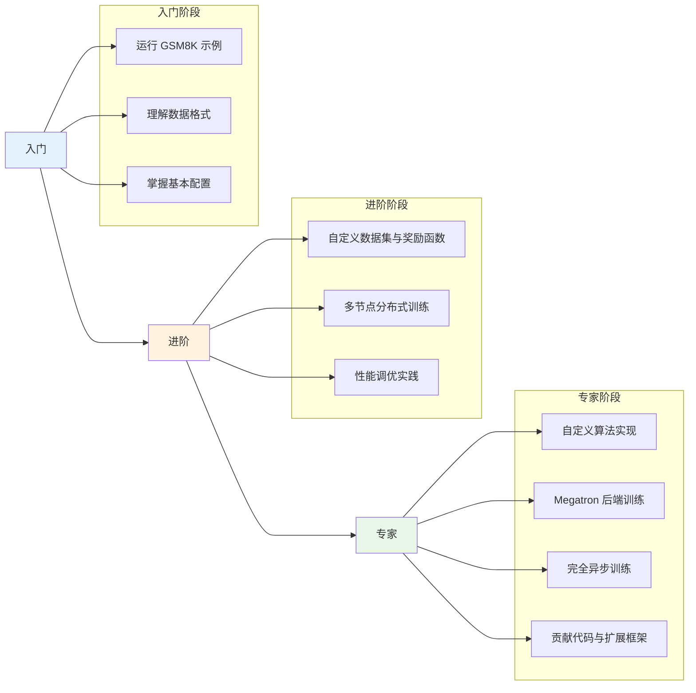

# verl 使用指南与实践

## 【总】开篇概述

本文是 verl 项目的实践指南，旨在帮助用户从零开始使用 verl 进行大语言模型的强化学习训练。verl（Volcano Engine Reinforcement Learning for LLM）是一个高性能、可扩展的 LLM RL 训练框架，支持 PPO、GRPO 等多种算法，兼容 vLLM、SGLang、TensorRT-LLM 等推理后端，并能在 GPU 和 NPU 上运行。

**核心问题：如何快速上手 verl 并完成一次完整的 RL 训练？**

本文将围绕这一问题，从环境安装、数据准备、奖励函数编写、配置启动训练、监控日志、检查点管理到性能调优，逐步展开，为用户提供端到端的实践指导。

### 全局概览图



### 关键结论预览

1. **安装简洁**：`pip install verl` 即可完成基础安装，可选 Docker 镜像一键部署
2. **数据格式统一**：所有训练数据需转换为 parquet 格式，包含 `prompt`、`data_source`、`ability`、`reward_model`、`extra_info` 五个核心字段
3. **奖励函数可扩展**：内置 GSM8K、MATH 等奖励函数，支持通过 `data_source` 自动路由，也可自定义奖励函数
4. **Hydra 配置灵活**：通过 YAML 配置文件 + 命令行覆盖的方式，无需修改代码即可调整所有训练参数
5. **监控体系完善**：支持 wandb、tensorboard、MLflow、SwanLab 等多种日志后端

---

## 【分】逐层展开

### 1. 环境安装

#### 安装流程图

```mermaid
flowchart TD
    Start[开始安装] --> Check{安装方式?}
    Check -->|pip 安装| Pip[pip install verl]
    Check -->|源码安装| Src[git clone + pip install -e .]
    Check -->|Docker| Docker[拉取 Docker 镜像]

    Pip --> Deps[安装可选依赖]
    Src --> Deps
    Docker --> Ready[环境就绪]
    Deps --> GPU{GPU 环境?}
    GPU -->|是| GPUInst[pip install verl[gpu,vllm]]
    GPU -->|NPU| NPUInst[安装 Ascend 工具链]
    GPUInst --> Ready
    NPUInst --> Ready

    style Start fill:#e3f2fd
    style Ready fill:#c8e6c9
```

#### 基础安装

verl 要求 **Python >= 3.10**，推荐使用 Python 3.10+。

**pip 安装（推荐）**：

```bash
pip install verl
```

**从源码安装**：

```bash
git clone https://github.com/verl-project/verl.git
cd verl
pip install -e .
```

#### 核心依赖说明

verl 的核心依赖在 `setup.py` 中定义，主要包括：

| 依赖 | 用途 | 版本要求 |
|------|------|----------|
| `torch` | 深度学习框架 | PyTorch 2.1+ |
| `ray[default]` | 分布式计算框架 | >= 2.41.0 |
| `hydra-core` | 配置管理系统 | - |
| `transformers` | HuggingFace 模型加载 | - |
| `accelerate` | 分布式训练加速 | - |
| `datasets` | 数据集加载 | - |
| `tensordict` | 张量字典数据结构 | >= 0.8.0, <= 0.10.0, != 0.9.0 |
| `wandb` | 实验追踪 | - |
| `tensorboard` | 训练可视化 | - |

#### 可选依赖（按功能分组安装）

```bash
# GPU 训练（Flash Attention + Liger Kernel）
pip install verl[gpu]

# vLLM 推理后端
pip install verl[vllm]

# SGLang 推理后端
pip install verl[sglang]

# TensorRT-LLM 推理后端
pip install verl[trtllm]

# Megatron 训练后端
pip install verl[mcore]

# 数学验证奖励
pip install verl[math]

# 常用组合：GPU + vLLM
pip install verl[gpu,vllm]
```

#### Docker 镜像使用

verl 提供了预构建的 Docker 镜像，包含所有依赖和 CUDA 环境：

| 镜像标签 | CUDA | PyTorch | Flash Attention | 适用场景 |
|----------|------|---------|-----------------|----------|
| `verl0.5-cu126-torch2.7-fa2.7.4` | CUDA 12.6 | PyTorch 2.7 | FA 2.7.4 | GPU 通用训练 |
| `verl0.5-cu126-torch2.7.1-fa2.8.0` | CUDA 12.6 | PyTorch 2.7.1 | FA 2.8.0 | GPU 最新版本 |
| `verl0.6-cu128-torch2.8.0-fa2.7.4` | CUDA 12.8 | PyTorch 2.8 | FA 2.7.4 | GPU 前沿版本 |

Docker 镜像目录结构为 `Dockerfile.base`（基础镜像）和 `Dockerfile.app.*`（应用镜像，含 vLLM/SGLang/Megatron 等组合）。

```bash
# 示例：构建含 vLLM + Megatron 的应用镜像
cd docker/verl0.5-cu126-torch2.7-fa2.7.4
docker build -f Dockerfile.app.vllm.mcore0.13 -t verl:vllm-mcore .
```

#### NPU 环境配置

verl 支持 Ascend NPU（昇腾）环境，需要额外安装：

1. 安装 CANN 工具链（8.2.rc1 / 8.3.rc1 / 8.5.0 / 9.0.0 等版本）
2. 安装 `torch_npu`
3. 设置 HCCL 相关环境变量：

```bash
export HCCL_CONNECT_TIMEOUT=1500
export HCCL_HOST_SOCKET_PORT_RANGE=60000-60050
export HCCL_NPU_SOCKET_PORT_RANGE=61000-60050
export RAY_EXPERIMENTAL_NOSET_ASCEND_RT_VISIBLE_DEVICES=1
```

NPU 专用 Docker 镜像位于 `docker/ascend/` 目录下，按 CANN 版本和芯片型号（A2/A3）分类。

#### 常见安装问题与解决

| 问题 | 原因 | 解决方案 |
|------|------|----------|
| Flash Attention 安装失败 | CUDA 版本不匹配 | 确保CUDA >= 11.6，或使用 `pip install flash-attn --no-build-isolation` |
| vLLM 版本冲突 | vLLM 对 PyTorch 版本敏感 | 使用 Docker 镜像或按 `verl[vllm]` 指定版本 |
| numpy 版本冲突 | numpy 2.x 不兼容 | verl 要求 `numpy<2.0.0` |
| Ray 初始化超时 | 端口未开放 | 检查防火墙设置，确保 Ray 端口可用 |

---

### 2. 数据准备

#### 数据准备流程图



#### 数据格式要求

verl 要求数据以 **parquet** 格式存储，每条数据包含以下核心字段：

| 字段 | 类型 | 说明 | 示例 |
|------|------|------|------|
| `prompt` | `list[dict]` | 对话列表，每项含 `role` 和 `content` | `[{"role": "user", "content": "问题文本"}]` |
| `data_source` | `str` | 数据来源标识，用于路由奖励函数 | `"openai/gsm8k"` |
| `ability` | `str` | 能力标签 | `"math"` |
| `reward_model` | `dict` | 奖励模型配置 | `{"style": "rule", "ground_truth": "42"}` |
| `extra_info` | `dict` | 额外信息 | `{"split": "train", "index": 0}` |

#### GSM8K 数据预处理示例

GSM8K 预处理脚本位于 `examples/data_preprocess/gsm8k.py`，核心逻辑如下：

```python
# 从原始答案中提取数值解
def extract_solution(solution_str):
    solution = re.search("#### (\-?[0-9\.\,]+)", solution_str)
    final_solution = solution.group(0).split("#### ")[1].replace(",", "")
    return final_solution

# 构造训练数据
data = {
    "data_source": "openai/gsm8k",
    "prompt": [{"role": "user", "content": question}],
    "ability": "math",
    "reward_model": {"style": "rule", "ground_truth": solution},
    "extra_info": {"split": split, "index": idx, "answer": answer_raw},
}
```

运行预处理：

```bash
python examples/data_preprocess/gsm8k.py \
    --local_save_dir ~/data/gsm8k
```

输出文件：`~/data/gsm8k/train.parquet` 和 `~/data/gsm8k/test.parquet`

#### MATH 数据预处理

MATH 数据集使用 `\boxed{}` 格式标注答案，预处理脚本位于 `examples/data_preprocess/math_dataset.py`：

```python
from verl.utils.reward_score.math_reward import last_boxed_only_string, remove_boxed

def extract_solution(solution_str):
    return remove_boxed(last_boxed_only_string(solution_str))

data = {
    "data_source": "DigitalLearningGmbH/MATH-lighteval",
    "prompt": [{"role": "user", "content": question}],
    "ability": "math",
    "reward_model": {"style": "rule", "ground_truth": solution},
    "extra_info": {"split": split, "index": idx},
}
```

运行预处理：

```bash
python examples/data_preprocess/math_dataset.py \
    --local_save_dir ~/data/math
```

#### 自定义数据集的准备方法

准备自定义数据集只需遵循以下步骤：

1. **将原始数据转换为对话格式**：`prompt` 字段必须是对话列表，至少包含一条 `role: "user"` 的消息
2. **设置 `data_source`**：选择一个唯一标识符，用于匹配奖励函数
3. **填写 `reward_model`**：
   - 规则奖励：`{"style": "rule", "ground_truth": "标准答案"}`
   - 模型奖励：`{"style": "model", "model_path": "奖励模型路径"}`
4. **保存为 parquet**：使用 `datasets` 库的 `to_parquet()` 方法

```python
import datasets
import pandas as pd

# 从自定义数据构造 Dataset
data = [
    {
        "data_source": "my_dataset",
        "prompt": [{"role": "user", "content": "你的问题"}],
        "ability": "reasoning",
        "reward_model": {"style": "rule", "ground_truth": "正确答案"},
        "extra_info": {},
    },
    # ... 更多数据
]

df = pd.DataFrame(data)
ds = datasets.Dataset.from_pandas(df)
ds.to_parquet("my_data/train.parquet")
```

#### 数据字段详解

**prompt（对话列表）**：

- 类型：`list[dict]`，每个 dict 包含 `role` 和 `content`
- `role` 可选值：`"user"`、`"system"`、`"assistant"`
- verl 会自动应用模型的 chat template 将对话转为 token 序列
- 支持多轮对话格式

```json
[
  {"role": "system", "content": "你是一个数学助手"},
  {"role": "user", "content": "计算 2+3"}
]
```

**data_source（数据来源标识）**：

- 类型：`str`
- 用于 `default_compute_score` 函数自动路由到对应的奖励函数
- 内置支持的 `data_source` 值：
  - `"openai/gsm8k"` → GSM8K 奖励函数
  - `"DigitalLearningGmbH/MATH-lighteval"` / `"lighteval/MATH"` / `"HuggingFaceH4/MATH-500"` → MATH 奖励函数
  - `"math_dapo"` / `"math"` → DAPO 数学奖励函数
  - `"codecontests"` / `"apps"` / `"codeforces"` / `"taco"` → 代码奖励函数
  - `"hiyouga/geometry3k"` → 几何奖励函数
  - `"searchR1_*"` → 搜索 QA 奖励函数

**reward_model（奖励模型配置）**：

- 类型：`dict`
- 规则奖励格式：`{"style": "rule", "ground_truth": "标准答案文本"}`
- `ground_truth` 的内容取决于奖励函数的实现，GSM8K 中为数值答案，MATH 中为 LaTeX 表达式

**extra_info（额外信息）**：

- 类型：`dict`
- 可存储任意辅助信息，如原始问题、答案、索引等
- 在奖励函数中可通过 `extra_info` 参数访问

---

### 3. 奖励函数编写

#### 函数奖励 vs 模型奖励

verl 支持两种奖励计算方式：

| 类型 | 说明 | 适用场景 |
|------|------|----------|
| **函数奖励** | 通过 Python 函数计算，基于规则匹配 | 数学题、代码题等有明确标准答案的任务 |
| **模型奖励** | 通过奖励模型推理计算 | 开放式对话、偏好对齐等无明确标准答案的任务 |

函数奖励是 verl 的默认和推荐方式，具有计算快、可解释性强的优势。

#### 奖励函数注册机制

verl 的奖励函数通过 `default_compute_score` 函数实现自动路由。该函数位于 `verl/utils/reward_score/__init__.py`，根据 `data_source` 字段自动选择对应的奖励函数：

```python
def default_compute_score(data_source, solution_str, ground_truth,
                          extra_info=None, **kwargs):
    if data_source == "openai/gsm8k":
        from . import gsm8k
        res = gsm8k.compute_score(solution_str, ground_truth)
    elif data_source in ["lighteval/MATH", "DigitalLearningGmbH/MATH-lighteval", ...]:
        from . import math_reward
        res = math_reward.compute_score(solution_str, ground_truth)
    # ... 更多 data_source
    else:
        raise NotImplementedError(f"Reward function is not implemented for {data_source=}")
```

#### GSM8K 奖励函数示例

GSM8K 奖励函数位于 `verl/utils/reward_score/gsm8k.py`，包含两个核心函数：

**`extract_solution`**：从模型输出中提取最终答案

```python
def extract_solution(solution_str, method="strict"):
    # 优化：仅匹配最后 300 字符，避免长文本正则性能问题
    if len(solution_str) > 300:
        solution_str = solution_str[-300:]

    if method == "strict":
        # 严格模式：匹配 "#### 数字" 格式
        solutions = re.findall("#### (\-?[0-9\.\,]+)", solution_str)
        final_answer = solutions[-1].replace(",", "").replace("$", "") if solutions else None
    elif method == "flexible":
        # 灵活模式：匹配最后一个数字
        answer = re.findall("(\-?[0-9\.\,]+)", solution_str)
        # ... 找到最后一个有效数字
    return final_answer
```

**`compute_score`**：计算奖励分数

```python
def compute_score(solution_str, ground_truth, method="strict",
                  format_score=0.0, score=1.0):
    answer = extract_solution(solution_str=solution_str, method=method)
    if answer is None:
        return 0          # 无答案 → 0 分
    elif answer == ground_truth:
        return score       # 正确 → 1 分
    else:
        return format_score  # 格式正确但答案错误 → 0 分（可调整）
```

#### 自定义奖励函数的编写方法

编写自定义奖励函数只需实现一个 `compute_score` 函数：

```python
# my_reward.py
def compute_score(solution_str, ground_truth, extra_info=None, **kwargs):
    """
    Args:
        solution_str: 模型生成的回复文本
        ground_truth: reward_model 中的 ground_truth 字段值
        extra_info: 数据中的 extra_info 字段
    Returns:
        float: 奖励分数
    """
    # 实现你的评分逻辑
    if solution_str.strip() == ground_truth.strip():
        return 1.0
    return 0.0
```

#### 奖励函数的配置方式

有两种方式使用自定义奖励函数：

**方式一：通过配置指定自定义奖励函数文件**

在启动训练时通过 `reward.custom_reward_function` 配置指定：

```bash
python3 -m verl.trainer.main_ppo \
    reward.custom_reward_function.path=/path/to/my_reward.py \
    reward.custom_reward_function.name=compute_score
```

**方式二：注册到 `default_compute_score`**

在 `verl/utils/reward_score/__init__.py` 中添加新的 `data_source` 分支：

```python
elif data_source == "my_dataset":
    from . import my_reward
    res = my_reward.compute_score(solution_str, ground_truth)
```

同时将数据中的 `data_source` 设置为 `"my_dataset"`。

**奖励模型配置**（使用模型奖励时）：

```bash
python3 -m verl.trainer.main_ppo \
    reward.reward_model.enable=True \
    reward.reward_model.model_path=/path/to/reward_model \
    reward.reward_model.enable_resource_pool=True \
    reward.reward_model.n_gpus_per_node=8 \
    reward.reward_model.nnodes=1
```

---

### 4. 配置与启动训练

#### 训练启动流程图



#### Hydra 配置系统概述

verl 使用 [Hydra](https://hydra.cc/) 作为配置管理系统，核心配置文件为 `verl/trainer/config/ppo_trainer.yaml`。Hydra 的优势在于：

- **层次化配置**：通过 `defaults` 引用子配置文件，自动组装完整配置
- **命令行覆盖**：无需修改 YAML 文件，通过命令行参数即可覆盖任意配置项
- **配置组**：支持多套配置方案切换（如 `model_engine: dp` / `model_engine: megatron`）

配置文件的层次结构：

```
ppo_trainer.yaml                    # 主配置
├── model_engine/dp.yaml            # 模型引擎配置
├── actor/dp_actor.yaml             # Actor 配置
├── data/legacy_data.yaml           # 数据配置
├── ref/dp_ref.yaml                 # 参考模型配置
├── rollout/rollout.yaml            # Rollout 配置
├── model/hf_model.yaml             # 模型配置
├── critic/dp_critic.yaml           # Critic 配置
├── reward/reward.yaml              # 奖励配置
├── algorithm/rollout_correction.yaml # 算法配置
└── distillation/distillation.yaml  # 蒸馏配置
```

#### 关键配置参数说明

**算法参数（algorithm）**：

| 参数 | 默认值 | 说明 |
|------|--------|------|
| `algorithm.adv_estimator` | `gae` | 优势估计器：`gae`(PPO)、`grpo`(GRPO)、`reinforce_plus_plus` 等 |
| `algorithm.gamma` | `1.0` | 折扣因子 |
| `algorithm.lam` | `1.0` | GAE 的 λ 参数 |
| `algorithm.use_kl_in_reward` | `False` | 是否在奖励中使用 KL 惩罚 |
| `algorithm.kl_ctrl.type` | `fixed` | KL 控制类型：`fixed` 或 `adaptive` |
| `algorithm.kl_ctrl.kl_coef` | `0.001` | KL 惩罚系数 |

**数据参数（data）**：

| 参数 | 默认值 | 说明 |
|------|--------|------|
| `data.train_files` | - | 训练数据路径（parquet），支持列表 |
| `data.val_files` | - | 验证数据路径（parquet），支持列表 |
| `data.train_batch_size` | `1024` | 每次迭代的训练批大小 |
| `data.max_prompt_length` | `512` | 最大 prompt 长度 |
| `data.max_response_length` | `512` | 最大生成长度 |
| `data.filter_overlong_prompts` | `False` | 是否过滤超长 prompt |
| `data.truncation` | `error` | 超长截断策略：`error`/`left`/`right`/`middle` |

**Actor 参数（actor_rollout_ref.actor）**：

| 参数 | 默认值 | 说明 |
|------|--------|------|
| `actor_rollout_ref.actor.optim.lr` | `1e-6` | 学习率 |
| `actor_rollout_ref.actor.clip_ratio` | `0.2` | PPO 裁剪比率 |
| `actor_rollout_ref.actor.use_kl_loss` | `False` | 是否使用 KL 损失（GRPO 中设为 True） |
| `actor_rollout_ref.actor.kl_loss_coef` | `0.001` | KL 损失系数 |
| `actor_rollout_ref.actor.kl_loss_type` | `low_var_kl` | KL 损失类型：`kl`/`abs`/`mse`/`low_var_kl`/`full` |
| `actor_rollout_ref.actor.entropy_coeff` | `0` | 熵正则化系数 |
| `actor_rollout_ref.actor.ppo_mini_batch_size` | `256` | PPO mini-batch 大小 |
| `actor_rollout_ref.actor.use_dynamic_bsz` | `False` | 是否使用动态批大小 |
| `actor_rollout_ref.actor.ppo_max_token_len_per_gpu` | `16384` | 每 GPU 最大 token 数 |
| `actor_rollout_ref.actor.ppo_epochs` | `1` | 每批数据的 PPO 更新轮数 |

**Rollout 参数（actor_rollout_ref.rollout）**：

| 参数 | 默认值 | 说明 |
|------|--------|------|
| `actor_rollout_ref.rollout.name` | - | 推理后端：`vllm`/`sglang`/`trtllm`/`hf` |
| `actor_rollout_ref.rollout.n` | `1` | 每个 prompt 的采样数（GRPO 中设为 >1） |
| `actor_rollout_ref.rollout.tensor_model_parallel_size` | `2` | 推理 TP 并行度 |
| `actor_rollout_ref.rollout.gpu_memory_utilization` | `0.5` | 推理引擎 GPU 显存利用率 |
| `actor_rollout_ref.rollout.temperature` | `1.0` | 采样温度 |
| `actor_rollout_ref.rollout.enable_chunked_prefill` | `True` | 是否启用分块预填充 |

**Trainer 参数**：

| 参数 | 默认值 | 说明 |
|------|--------|------|
| `trainer.total_epochs` | `30` | 总训练轮数 |
| `trainer.save_freq` | `-1` | 检查点保存频率（-1 表示不保存） |
| `trainer.test_freq` | `-1` | 验证频率 |
| `trainer.balance_batch` | `True` | 是否均衡批次 |
| `trainer.logger` | `["console","wandb"]` | 日志后端列表 |
| `trainer.resume_mode` | `auto` | 恢复模式：`auto`/`disable`/`resume_path` |

#### 命令行启动方式

**GRPO 训练示例**（来自 `examples/grpo_trainer/run_qwen3_8b_fsdp.sh`）：

```bash
python3 -m verl.trainer.main_ppo \
    algorithm.adv_estimator=grpo \
    algorithm.use_kl_in_reward=False \
    data.train_files="['$HOME/data/gsm8k/train.parquet', '$HOME/data/math/train.parquet']" \
    data.val_files="['$HOME/data/gsm8k/test.parquet', '$HOME/data/math/test.parquet']" \
    data.train_batch_size=1024 \
    data.max_prompt_length=1024 \
    data.max_response_length=2048 \
    actor_rollout_ref.model.path=Qwen/Qwen3-8B \
    actor_rollout_ref.actor.use_kl_loss=True \
    actor_rollout_ref.actor.kl_loss_coef=0.001 \
    actor_rollout_ref.rollout.name=vllm \
    actor_rollout_ref.rollout.n=5 \
    trainer.total_epochs=15 \
    trainer.logger='["console","wandb"]'
```

**PPO 训练示例**（来自 `examples/ppo_trainer/run_qwen3_8b_fsdp.sh`）：

```bash
python3 -m verl.trainer.main_ppo \
    algorithm.adv_estimator=gae \
    data.train_files="['$HOME/data/gsm8k/train.parquet', '$HOME/data/math/train.parquet']" \
    data.val_files="['$HOME/data/gsm8k/test.parquet', '$HOME/data/math/test.parquet']" \
    data.train_batch_size=1024 \
    actor_rollout_ref.model.path=Qwen/Qwen3-8B \
    critic.model.path=Qwen/Qwen3-8B \
    actor_rollout_ref.actor.use_kl_loss=False \
    actor_rollout_ref.rollout.n=1 \
    trainer.total_epochs=15
```

#### 环境变量覆盖机制

训练脚本通过环境变量实现参数化，方便在不同环境间切换：

```bash
# 核心环境变量
export MODEL_PATH=Qwen/Qwen3-8B       # 模型路径
export NNODES=1                         # 节点数
export NGPUS_PER_NODE=8                 # 每节点 GPU 数
export INFER_BACKEND=vllm               # 推理后端

# 训练超参
export TRAIN_BATCH_SIZE=1024
export MAX_PROMPT_LENGTH=1024
export MAX_RESPONSE_LENGTH=2048
export ACTOR_LR=1e-6
export KL_LOSS_COEF=0.001
export ROLLOUT_N=5                      # GRPO 采样数

# 运行脚本
bash examples/grpo_trainer/run_qwen3_8b_fsdp.sh
```

#### 单节点 vs 多节点启动

**单节点训练**（默认）：

```bash
export NNODES=1
export NGPUS_PER_NODE=8
bash examples/grpo_trainer/run_qwen3_8b_fsdp.sh
```

**多节点训练**：

```bash
# 主节点
export NNODES=2
export NGPUS_PER_NODE=8
bash examples/grpo_trainer/run_qwen3_8b_fsdp.sh

# 需配合 Ray 集群使用
ray start --head --port=6379
# 工作节点
ray start --address=<主节点IP>:6379
```

---

### 5. 训练监控与日志

#### wandb 集成

wandb 是 verl 的默认日志后端之一，配置方式：

```bash
# 登录 wandb
wandb login

# 或设置环境变量
export WANDB_ENTITY=your_entity

# 训练时启用
trainer.logger='["console","wandb"]' \
trainer.project_name=verl_grpo_gsm8k_math \
trainer.experiment_name=qwen3_8b_grpo_vllm_fsdp
```

wandb 会记录所有训练指标，并支持生成验证样本的可视化表格。

#### tensorboard 集成

```bash
# 训练时启用
trainer.logger='["console","tensorboard"]'

# 自定义日志目录
export TENSORBOARD_DIR=/path/to/tb_logs

# 启动 tensorboard 查看
tensorboard --logdir=/path/to/tb_logs
```

#### 其他日志后端

verl 的 `Tracking` 类（`verl/utils/tracking.py`）支持以下后端：

| 后端 | 配置值 | 说明 |
|------|--------|------|
| Console | `console` | 终端打印（默认启用） |
| WandB | `wandb` | Weights & Biases |
| TensorBoard | `tensorboard` | PyTorch TensorBoard |
| MLflow | `mlflow` | MLflow 实验追踪 |
| SwanLab | `swanlab` | SwanLab 实验追踪 |
| ClearML | `clearml` | ClearML 实验管理 |
| Trackio | `trackio` | Trackio 追踪 |
| File | `file` | JSONL 文件日志 |

可同时启用多个后端：`trainer.logger='["console","wandb","tensorboard"]'`

#### 关键指标说明

| 指标 | 含义 | 理想趋势 |
|------|------|----------|
| `actor/reward_kl_penalty` | KL 散度惩罚值 | 逐渐降低 |
| `actor/reward_kl_penalty_coeff` | KL 惩罚系数 | 稳定或自适应调整 |
| `train/reward` | 训练奖励均值 | 持续上升 |
| `train/score` | 训练得分（正确率） | 持续上升 |
| `train/kl` | 策略与参考策略的 KL 散度 | 适中，不宜过大 |
| `train/entropy` | 策略熵 | 逐渐降低但不宜过快 |
| `train/clip_ratio` | PPO 裁剪比率 | 适中 |
| `train/loss` | 策略损失 | 下降趋势 |
| `val/score` | 验证得分 | 持续上升 |
| `rollout/spec_accept_rate` | 推测解码接受率 | 越高越好 |

#### 训练日志分析

训练日志以 `step:XX - metric1:val1 - metric2:val2` 格式输出到控制台。建议关注：

1. **reward 上升趋势**：正常训练中 reward 应逐步提升
2. **KL 散度**：KL 过大说明策略偏离参考策略太多，可能需要增大 `kl_loss_coef`
3. **entropy 急剧下降**：可能意味着策略过早收敛，可增大 `entropy_coeff`
4. **clip_ratio 过高**：说明策略更新步长过大，可减小学习率

---

### 6. 检查点与恢复

#### 检查点保存策略

verl 的检查点管理由 `BaseCheckpointManager`（`verl/utils/checkpoint/checkpoint_manager.py`）实现，保存内容包括：

- **模型权重**（model）：分片保存，支持 FSDP/Megatron 格式
- **优化器状态**（optimizer）：分片保存
- **学习率调度器**（lr_scheduler）：完整保存
- **额外状态**（extra）：包括随机数种子、训练步数等
- **数据加载器状态**（data.pt）：保存 dataloader 的 state_dict

检查点保存路径格式：

```
checkpoints/{project_name}/{experiment_name}/
├── global_step_10/
│   ├── actor/          # Actor 模型检查点
│   ├── critic/         # Critic 模型检查点（PPO）
│   └── data.pt         # 数据加载器状态
├── global_step_20/
│   └── ...
└── latest_checkpointed_iteration.txt
```

**保存频率控制**：

```bash
trainer.save_freq=20          # 每 20 步保存一次
trainer.max_actor_ckpt_to_keep=3   # 最多保留 3 个 Actor 检查点
trainer.max_critic_ckpt_to_keep=3  # 最多保留 3 个 Critic 检查点
```

**检查点内容配置**：

```bash
actor_rollout_ref.actor.checkpoint.save_contents="['model','optimizer','extra']"
actor_rollout_ref.actor.checkpoint.load_contents="['model','optimizer','extra']"
```

#### 从检查点恢复训练

verl 支持三种恢复模式，通过 `trainer.resume_mode` 配置：

| 模式 | 值 | 行为 |
|------|----|------|
| 自动恢复 | `auto`（默认） | 自动查找最新检查点并恢复 |
| 禁用恢复 | `disable` | 始终从头开始训练 |
| 指定路径 | `resume_path` | 从指定路径恢复 |

```bash
# 自动恢复（默认）
trainer.resume_mode=auto

# 禁用恢复
trainer.resume_mode=disable

# 从指定检查点恢复
trainer.resume_mode=resume_path \
trainer.resume_from_path=checkpoints/my_project/my_exp/global_step_50
```

恢复训练时会加载：
1. Actor/Critic 模型权重和优化器状态
2. 数据加载器状态（确保数据顺序一致）
3. 全局训练步数

#### 模型导出

训练完成后，检查点中的模型权重可直接用于推理。如需导出为 HuggingFace 格式：

```bash
# 检查点中已包含模型配置和 tokenizer
# 可直接加载使用
from transformers import AutoModelForCausalLM
model = AutoModelForCausalLM.from_pretrained("checkpoints/.../global_step_100/actor")
```

---

### 7. 性能调优实践

#### 动态批大小（use_dynamic_bsz）

动态批大小是 verl 的重要性能优化特性，通过序列打包（sequence packing）提高 GPU 利用率：

```bash
# Actor 端启用动态批大小
actor_rollout_ref.actor.use_dynamic_bsz=True
actor_rollout_ref.actor.ppo_max_token_len_per_gpu=24576

# Rollout 端启用动态批大小
actor_rollout_ref.rollout.log_prob_use_dynamic_bsz=True
actor_rollout_ref.rollout.log_prob_max_token_len_per_gpu=24576

# 参考模型端启用动态批大小
actor_rollout_ref.ref.log_prob_use_dynamic_bsz=True
actor_rollout_ref.ref.log_prob_max_token_len_per_gpu=24576
```

`ppo_max_token_len_per_gpu` 控制每个 GPU 一次前向/反向传播处理的最大 token 数，推荐设置为 `n * max_prompt_length + max_response_length` 的整数倍。

#### 序列均衡（balance_batch）

`trainer.balance_batch=True` 启用序列长度均衡，确保各 GPU 的工作负载相近，避免因序列长度差异导致的负载不均：

```bash
trainer.balance_batch=True
```

#### 参数卸载（param_offload, optimizer_offload）

在显存不足时，可将模型参数和优化器状态卸载到 CPU：

```bash
# Actor 参数卸载
actor_rollout_ref.actor.fsdp_config.param_offload=True
actor_rollout_ref.actor.fsdp_config.optimizer_offload=True

# 参考模型参数卸载（默认开启）
actor_rollout_ref.ref.fsdp_config.param_offload=True

# Critic 参数卸载
critic.fsdp.param_offload=True
critic.fsdp.optimizer_offload=True
```

> **注意**：参数卸载会降低训练速度，仅在显存不足时使用。NPU 环境下默认开启参数卸载。

#### 推理后端选择（vLLM vs SGLang）

| 特性 | vLLM | SGLang | TensorRT-LLM |
|------|------|--------|---------------|
| 配置值 | `vllm` | `sglang` | `trtllm` |
| 成熟度 | 高 | 中 | 低 |
| 性能 | 优秀 | 优秀（某些场景更快） | 极致优化 |
| 多轮工具调用 | 有限支持 | 完整支持 | 不支持 |
| NPU 支持 | 有限 | 支持（ascend 后端） | 不支持 |
| 显存效率 | 高 | 高 | 高 |

```bash
# 使用 vLLM
export INFER_BACKEND=vllm

# 使用 SGLang
export INFER_BACKEND=sglang

# 使用 TensorRT-LLM（仅 GPU）
export INFER_BACKEND=trtllm
```

#### 梯度检查点与 remove_padding

```bash
# 启用梯度检查点（节省显存，降低速度）
actor_rollout_ref.model.enable_gradient_checkpointing=True

# 启用 remove_padding（提升训练效率）
actor_rollout_ref.model.use_remove_padding=True
```

#### torch.compile 加速

```bash
# 启用 torch.compile（默认开启）
actor_rollout_ref.actor.use_torch_compile=True

# NPU 环境下关闭
actor_rollout_ref.actor.use_torch_compile=False
```

#### 常见性能瓶颈与优化建议

| 瓶颈 | 表现 | 优化方案 |
|------|------|----------|
| GPU 显存不足 | OOM 错误 | 启用 `param_offload`/`optimizer_offload`，减小 `ppo_max_token_len_per_gpu`，启用梯度检查点 |
| 推理速度慢 | rollout 阶段耗时长 | 增大 `gpu_memory_utilization`，启用 `enable_chunked_prefill`/`enable_prefix_caching` |
| 训练速度慢 | actor 更新耗时长 | 启用 `use_dynamic_bsz`，增大 `ppo_max_token_len_per_gpu` |
| 通信开销大 | 多节点训练慢 | 增大 `update_weights_bucket_megabytes`，使用 NCCL/HCCL 后端 |
| 数据加载慢 | 数据准备耗时长 | 增大 `dataloader_num_workers`，启用 `use_shm` |

---

### 8. 常见问题与排错

#### OOM 问题

**现象**：`CUDA out of memory` 或 `RuntimeError: CUDA error: out of memory`

**解决方案**：

1. 启用参数卸载：`actor_rollout_ref.actor.fsdp_config.param_offload=True`
2. 启用优化器卸载：`actor_rollout_ref.actor.fsdp_config.optimizer_offload=True`
3. 减小批大小：`data.train_batch_size=512`
4. 减小每 GPU token 数：`actor_rollout_ref.actor.ppo_max_token_len_per_gpu=16384`
5. 减小推理显存占用：`actor_rollout_ref.rollout.gpu_memory_utilization=0.4`
6. 启用梯度检查点：`actor_rollout_ref.model.enable_gradient_checkpointing=True`
7. 减小最大序列长度：`data.max_response_length=1024`

#### 训练不稳定

**现象**：reward 震荡、loss 爆炸、KL 散度急剧增大

**解决方案**：

1. 减小学习率：`actor_rollout_ref.actor.optim.lr=5e-7`
2. 增大 KL 约束：`actor_rollout_ref.actor.kl_loss_coef=0.01`
3. 减小 PPO 裁剪比率：`actor_rollout_ref.actor.clip_ratio=0.1`
4. 增加熵正则：`actor_rollout_ref.actor.entropy_coeff=0.01`
5. 使用自适应 KL 控制：`algorithm.kl_ctrl.type=adaptive`
6. 减小 rollout 采样数：`actor_rollout_ref.rollout.n=3`

#### 通信超时

**现象**：`NCCL error: timeout` 或 `Ray get timeout`

**解决方案**：

1. 增大 NCCL 超时：`actor_rollout_ref.nccl_timeout=1200`
2. NPU 环境设置 HCCL 超时：`export HCCL_CONNECT_TIMEOUT=1500`
3. 检查网络连接和防火墙设置
4. 确保 Ray 集群正常：`ray status`

#### 常用环境变量

| 环境变量 | 用途 | 示例值 |
|----------|------|--------|
| `MODEL_PATH` | 模型路径 | `Qwen/Qwen3-8B` |
| `NNODES` | 训练节点数 | `1` / `2` / `4` |
| `NGPUS_PER_NODE` | 每节点 GPU 数 | `8` |
| `INFER_BACKEND` | 推理后端 | `vllm` / `sglang` |
| `DEVICE` | 设备类型 | `gpu` / `npu`（自动检测） |
| `WANDB_ENTITY` | wandb 实体 | `your_team` |
| `TENSORBOARD_DIR` | TensorBoard 日志目录 | `/path/to/logs` |
| `NCCL_DEBUG` | NCCL 调试级别 | `INFO` |
| `RAY_EXPERIMENTAL_NOSET_CUDA_VISIBLE_DEVICES` | Ray GPU 可见性 | `1` |

---

## 【总】总结升华

### 回顾核心使用流程

使用 verl 进行 RL 训练的完整流程可概括为六个步骤：

1. **安装环境**：`pip install verl[gpu,vllm]` 或使用 Docker 镜像
2. **准备数据**：将数据集转换为 parquet 格式，包含 `prompt`/`data_source`/`ability`/`reward_model`/`extra_info` 五个字段
3. **编写奖励函数**：实现 `compute_score` 函数，或使用内置奖励函数
4. **配置并启动训练**：通过 Hydra 配置 + 命令行覆盖，运行 `python3 -m verl.trainer.main_ppo`
5. **监控训练**：通过 wandb/tensorboard 追踪 reward、score、KL 等指标
6. **保存与恢复**：利用检查点机制实现训练中断恢复和模型导出

### 最佳实践总结

| 实践 | 建议 |
|------|------|
| 数据格式 | 严格遵循 parquet 五字段格式，`data_source` 与奖励函数对应 |
| 奖励函数 | 优先使用规则奖励；自定义奖励函数通过 `reward.custom_reward_function.path` 配置 |
| 算法选择 | 数学推理推荐 GRPO（`adv_estimator=grpo`，`rollout.n=5`）；通用对齐推荐 PPO（`adv_estimator=gae`） |
| 显存优化 | 优先启用 `use_dynamic_bsz` 和 `use_remove_padding`；显存不足时启用 `param_offload` |
| 训练稳定性 | GRPO 中开启 `use_kl_loss=True`，PPO 中控制 KL 惩罚系数 |
| 检查点 | 设置合理的 `save_freq`，启用 `resume_mode=auto` 以支持断点续训 |
| 推理后端 | GPU 环境默认 vLLM；多轮工具调用选 SGLang；NPU 环境选 SGLang |

### 从入门到进阶的学习路径建议



**入门阶段**：从运行 `examples/grpo_trainer/run_qwen3_8b_fsdp.sh` 开始，使用 GSM8K 数据集完成一次完整训练，理解数据格式和基本配置参数。

**进阶阶段**：学习自定义数据集和奖励函数的编写方法，尝试多节点训练，掌握 `use_dynamic_bsz`、`param_offload` 等性能调优手段。

**专家阶段**：深入理解 verl 的架构设计，实现自定义算法（如 SAPO、GDPO 等），使用 Megatron 后端训练超大模型，探索完全异步训练模式，最终为社区贡献代码和扩展框架。
