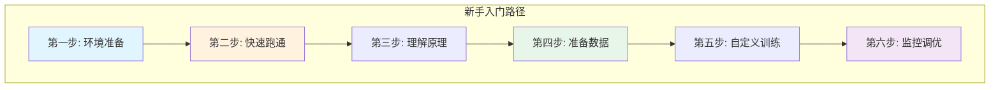
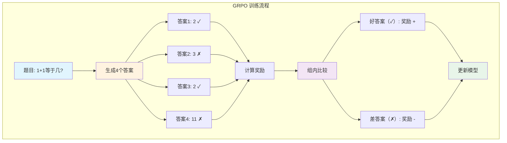
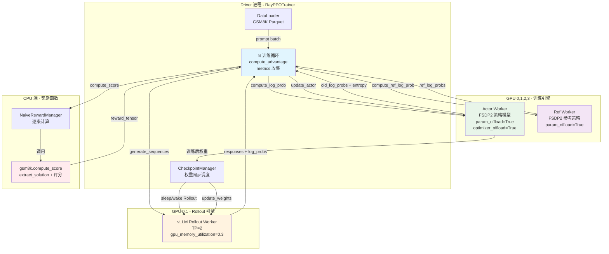
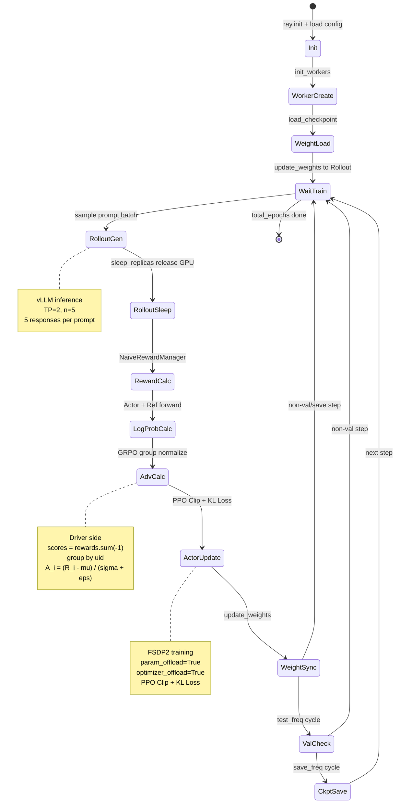
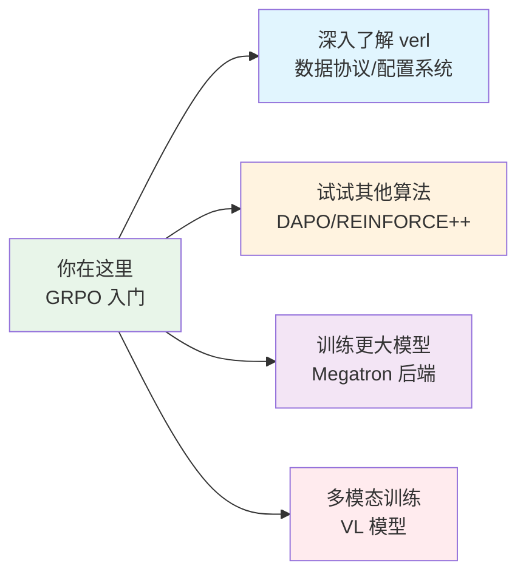

# 17. GRPO 新手入门手把手操作指南

## 【总】开篇概述

欢迎来到 verl GRPO 新手入门教程！这篇文档将像老师一样，一步一步教你如何从零开始，完成一次完整的 GRPO 训练。

**GRPO 是什么？**
GRPO（Group Relative Policy Optimization，组相对策略优化）是一种非常高效的大模型强化学习算法。它的最大特点是——**不需要 Critic 模型**！这意味着你只需要维护一个模型，显存和计算开销直接减半。

**你将学到什么？**
1. ✅ 环境搭建（5分钟）
2. ✅ 快速跑通第一个 GRPO 训练（10分钟）
3. ✅ 准备自己的数据和奖励函数
4. ✅ 理解 GRPO 为什么有效
5. ✅ 常见问题排查



---

## 【分】逐层展开

---

### 第一步：环境准备（5分钟搞定）

#### 1.1 系统要求

在开始之前，请确保你有：
- **GPU 环境**：建议 8×A100 80GB（或等效配置）
- **操作系统**：Linux（Ubuntu 20.04+ 推荐）
- **Python 版本**：3.10 或 3.11
- **CUDA 版本**：12.1 或更高

#### 1.2 克隆项目

```bash
# 1. 克隆 verl 仓库
git clone https://github.com/volcengine/verl.git
cd verl

# 2. 创建虚拟环境（推荐）
conda create -n verl python=3.10 -y
conda activate verl
```

#### 1.3 安装依赖

```bash
# 3. 安装 verl 核心包
pip install -e .

# 4. 安装 vLLM（用于推理）
pip install vllm

# 5. 安装其他常用依赖
pip install transformers datasets wandb
```

#### 1.4 验证安装

```bash
# 运行简单的测试
python -c "import verl; print(f'verl 版本: {verl.__version__}')"
```

如果没有报错，恭喜！环境准备好了！

---

### 第二步：快速跑通第一个训练（10分钟）

现在我们来用最简单的配置，跑通一个 GRPO 训练！

#### 2.1 准备模型

首先，下载一个小模型，比如 Qwen2.5-7B：

```bash
# 使用 huggingface-cli 下载
huggingface-cli download Qwen/Qwen2.5-7B-Instruct --local-dir ./models/Qwen2.5-7B-Instruct
```

或者你可以直接使用 `Qwen/Qwen2.5-7B-Instruct` 作为路径，verl 会自动下载。

#### 2.2 准备数据

我们使用 verl 自带的 GSM8K 数学题数据集，无需手动处理！

#### 2.3 运行训练脚本

进入 `examples/grpo_trainer` 目录，有一个最简单的脚本 `run_minimal.sh`（我们来创建它）：

```bash
# 创建最小化训练脚本
cat > examples/grpo_trainer/run_minimal.sh << 'EOF'
#!/bin/bash

# 新手配置 - 最小化版本
export MODEL_PATH=Qwen/Qwen2.5-7B-Instruct  # 或你的本地模型路径
export NGPUS_PER_NODE=4  # 如果 GPU 少，用 2 或 1
export INFER_BACKEND=vllm
export TRAIN_BATCH_SIZE=32  # 新手先用小 batch
export ROLLOUT_N=4  # 每个问题生成 4 个答案
export ACTOR_LR=1e-6
export KL_LOSS_COEF=0.001
export MAX_PROMPT_LENGTH=512
export MAX_RESPONSE_LENGTH=1024
export TOTAL_EPOCHS=3  # 先训练 3 轮试试

# 启动训练
python -m verl.trainer.main_ppo \
  algorithm.adv_estimator=grpo \
  data.train_files=[gsm8k] \
  data.val_files=[gsm8k] \
  data.train_batch_size=${TRAIN_BATCH_SIZE} \
  data.max_prompt_length=${MAX_PROMPT_LENGTH} \
  data.max_response_length=${MAX_RESPONSE_LENGTH} \
  actor_rollout_ref.model.path=${MODEL_PATH} \
  actor_rollout_ref.actor.optim.lr=${ACTOR_LR} \
  actor_rollout_ref.actor.use_kl_loss=True \
  actor_rollout_ref.actor.kl_loss_coef=${KL_LOSS_COEF} \
  actor_rollout_ref.rollout.name=${INFER_BACKEND} \
  actor_rollout_ref.rollout.n=${ROLLOUT_N} \
  trainer.total_epochs=${TOTAL_EPOCHS} \
  trainer.logger=["console"]
EOF

# 给脚本执行权限
chmod +x examples/grpo_trainer/run_minimal.sh

# 运行！
bash examples/grpo_trainer/run_minimal.sh
```

#### 2.4 预期输出

如果一切顺利，你会看到类似这样的日志：

```
[INFO] Starting training...
[INFO] Sampling prompts...
[INFO] Rollout in progress...
[INFO] Reward computation done!
[INFO] critic/rewards/mean: 0.23
[INFO] actor/entropy: 2.45
[INFO] Epoch 1/3 completed!
```

恭喜！你已经完成了第一次 GRPO 训练！🎉

---

### 第三步：GRPO 到底是什么？（通俗解释）

恭喜你跑通了训练！现在我们来理解一下 GRPO 是怎么工作的。

#### 3.1 一个生活中的类比

想象你在教一个学生做数学题：

| 传统方法（PPO） | GRPO 方法 |
|--------------|---------|
| 老师要同时教学生做题 + 估计题目难度 | 老师只需要教学生做题 |
| 需要一个"难度评估员"（Critic） | 不需要难度评估员 |
| 双倍工作量 | 单倍工作量 |

GRPO 的聪明之处在于：**让学生自己和自己比**！

#### 3.2 GRPO 工作原理（图解）



**核心思想**：
1. **组采样**：对同一个题目，让模型生成 4 个答案
2. **组内比较**：算出这 4 个答案的平均得分
3. **相对奖励**：比平均分高的答案被表扬，比平均分低的被批评

#### 3.3 为什么这有效？

| 问题 | GRPO 的解决方案 |
|------|---------------|
| 需要 Critic 模型吗？ | ❌ 不需要！用组平均分当基线 |
| 奖励怎么给？ | 组内归一化，只看相对好坏 |
| 显存够不够？ | ✅ 省一半显存，只需要一个模型 |

---

### 第四步：准备你自己的数据（手把手）

现在你已经跑通了例子，接下来我们来学习如何用**你自己的数据**训练！

#### 4.1 数据长什么样？

verl 需要的数据格式是这样的（Parquet 文件）：

```python
# verl 需要的数据格式
{
    "prompt": [{"role": "user", "content": "你的问题"}],  # 问题
    "ability": "math",  # 任务类型
    "reward_model": {
        "style": "rule",  # 奖励类型：rule（规则）或 model（模型）
        "ground_truth": "123"  # 正确答案
    },
    "extra_info": {
        "index": 0,
        "split": "train"
    }
}
```

#### 4.2 手把手：创建你自己的数据集

假设你有一个小学数学题数据集，我们来把它转换成 verl 格式！

```python
# 创建一个简单的预处理脚本: my_data_preprocess.py
import pandas as pd
from datasets import Dataset

# 1. 假设你有这样的原始数据
raw_data = [
    {"question": "1 + 1 = ?", "answer": "2"},
    {"question": "2 + 3 = ?", "answer": "5"},
    {"question": "5 × 2 = ?", "answer": "10"},
]

# 2. 转换成 verl 格式
def convert_to_verl_format(example):
    return {
        "data_source": "my_math_data",
        "prompt": [
            {"role": "user", "content": f"{example['question']} Let's think step by step and output the final answer after '####'."}
        ],
        "ability": "math",
        "reward_model": {
            "style": "rule",
            "ground_truth": example["answer"]
        },
        "extra_info": {
            "index": example.get("index", 0),
            "split": "train"
        }
    }

# 3. 处理数据
dataset = Dataset.from_list(raw_data)
dataset = dataset.map(convert_to_verl_format, remove_columns=dataset.column_names)

# 4. 保存为 Parquet
dataset.to_parquet("./data/my_math_train.parquet")
print("数据已保存到 ./data/my_math_train.parquet")
```

运行它：
```bash
python my_data_preprocess.py
```

#### 4.3 手把手：编写你的奖励函数

现在我们来写一个奖励函数，用来判断模型的答案对不对：

```python
# 创建: verl/utils/reward_score/my_math_reward.py
import re

def extract_solution(solution_str):
    """从模型输出中提取答案（找 #### 后面的数字）"""
    # 只看最后 300 字符，答案通常在最后
    if len(solution_str) > 300:
        solution_str = solution_str[-300:]
    
    # 匹配 #### 后面的数字
    solutions = re.findall(r"#### (\-?[0-9\.]+)", solution_str)
    if solutions:
        return solutions[-1].replace(",", "")
    return None

def compute_score(solution_str, ground_truth, **kwargs):
    """
    计算奖励分数
    返回值: 1.0（正确）或 0.0（错误）
    """
    extracted = extract_solution(solution_str)
    
    if extracted is None:
        return 0.0  # 没提取到答案
    
    if extracted == str(ground_truth):
        return 1.0  # 答案正确！
    
    return 0.0  # 答案错误
```

#### 4.4 用你自己的数据训练

修改训练脚本，使用你的数据：

```bash
# 在 run_minimal.sh 中修改这一行：
data.train_files=[./data/my_math_train.parquet]
```

---

### 第五步：配置详解（看懂每一个参数）

现在你已经入门了，我们来深入了解重要的配置参数！

#### 5.1 最关键的参数（必须记住）

| 参数 | 新手推荐值 | 作用 |
|------|----------|------|
| `rollout.n` | 4-8 | 每个问题生成几个答案（越大越稳定，但越慢） |
| `train_batch_size` | 32-128 | 每步训练用多少个问题 |
| `actor_lr` | 1e-6 到 5e-6 | 学习率（太大训练不稳定，太小学得慢） |
| `kl_loss_coef` | 0.001-0.01 | KL 惩罚系数（防止模型变化太快） |
| `max_response_length` | 1024-2048 | 答案最大长度 |

#### 5.2 FSDP 后端完整配置示例

如果你有 8 张 GPU，推荐使用这个配置（来自 `run_qwen3_8b_fsdp.sh`）：

```mermaid
sequenceDiagram
    participant You as "新手"
    participant Script as "run_qwen3_8b_fsdp.sh"
    participant Ray as "Ray 训练器"
    participant Rollout as "Rollout 工作器"
    participant Actor as "Actor 训练器"

    You->>Script: bash run_qwen3_8b_fsdp.sh
    Script->>Ray: 启动训练
    loop 每一轮
        Ray->>Rollout: 生成答案
        Rollout-->>Ray: 返回4个答案/问题
        Ray->>Ray: 计算奖励
        Ray->>Actor: 更新模型
        Actor-->>Ray: 更新完成
    end
```

#### 5.3 GPU 少怎么办？

如果你只有 1-2 张 GPU，这样调整：

```bash
# 减少并行度
export NGPUS_PER_NODE=2
export TRAIN_BATCH_SIZE=16
export ROLLOUT_N=3
export MAX_RESPONSE_LENGTH=512
```

---

### 第六步：训练监控与常见问题

#### 6.1 看这些指标就够了

训练时，关注这些关键指标：

| 指标 | 好的趋势 | 坏的趋势 |
|------|---------|---------|
| `critic/rewards/mean` | 📈 上升 | 📉 下降或不变 |
| `actor/entropy` | 📉 缓慢下降 | 📉 骤降（学太快）或 📈 上升（没学到） |
| `critic/advantages/mean` | 接近 0 | 绝对值很大 |

#### 6.2 新手常见问题 FAQ

**Q1: 显存不够报错怎么办？**
A: 试试这些方法：
   - 减小 `train_batch_size`
   - 减小 `max_response_length`
   - 开启梯度检查点：`actor_rollout_ref.model.enable_gradient_checkpointing=True`

**Q2: 奖励一直不涨怎么办？**
A: 检查：
   1. 奖励函数是不是正确？（打印几个看看）
   2. `rollout.n` 是不是太小？（至少 4）
   3. 学习率是不是合适？

**Q3: KL 散度太大怎么办？**
A: 增大 `kl_loss_coef` 或减小学习率

**Q4: 训练太慢了？**
A: 试试：
   - 增大 `train_batch_size`（如果显存够）
   - 用更好的推理后端（SGLang 比 vLLM 更快）

**Q5: 怎么保存和加载模型？**
A: verl 会自动保存，设置 `trainer.save_freq=5` 每 5 轮保存一次

---

### 进阶：GRPO 训练深度流程解析

以下图表基于 verl 源码（[ray_trainer.py](file:///workspace/verl/trainer/ppo/ray_trainer.py)、[core_algos.py](file:///workspace/verl/trainer/ppo/core_algos.py)、[main_ppo.py](file:///workspace/verl/trainer/main_ppo.py)）绘制，对应你运行的训练命令中的完整执行流程。

#### A. GRPO 完整流程图（Flowchart）

从 `main_ppo.py` 入口到 `ray_trainer.py` 的 `fit()` 训练循环，每一步的数据变换：

```mermaid
flowchart TD
    START([python -m verl.trainer.main_ppo]) --> HYDRA[Hydra 加载配置<br/>ppo_trainer.yaml]
    HYDRA --> RAY_INIT[ray.init 初始化集群]
    RAY_INIT --> TASK_RUNNER[TaskRunner.run]
    TASK_RUNNER --> SETUP[初始化阶段]
    
    SETUP --> LOAD_DATA[加载数据集<br/>RLDataset.from_parquet]
    LOAD_DATA --> CREATE_TRAINER[创建 RayPPOTrainer]
    CREATE_TRAINER --> INIT_WORKERS[init_workers<br/>创建 ActorRolloutRef / Critic Worker]
    INIT_WORKERS --> LOAD_CKPT[_load_checkpoint<br/>加载检查点]
    LOAD_CKPT --> UPDATE_WEIGHTS[checkpoint_manager.update_weights<br/>同步权重到 Rollout 引擎]

    UPDATE_WEIGHTS --> FIT_START[fit 训练循环]
    
    subgraph 训练循环 [每个 Training Step]
        FIT_START --> SAMPLE[DataLoader 采样 batch<br/>train_batch_size=1024 条 prompt]
        SAMPLE --> ADD_UID[为每条数据分配 uuid<br/>用于 GRPO 分组]
        ADD_UID --> REPEAT[batch.repeat n=5<br/>每条 prompt 复制 5 份]
        REPEAT --> ROLLOUT[Rollout 生成响应<br/>vLLM 推理引擎<br/>TP=2, gpu_mem=0.3]
        ROLLOUT --> SLEEP[checkpoint_manager.sleep_replicas<br/>释放 Rollout GPU 显存]
        SLEEP --> UNION[batch = batch.union gen_output<br/>合并 prompt + response]
        UNION --> REWARD[计算奖励<br/>NaiveRewardManager<br/>data_source→gsm8k.compute_score]
        REWARD --> OLD_LOG[计算 old_log_prob<br/>Actor 前向推理]
        OLD_LOG --> REF_LOG[计算 ref_log_prob<br/>Ref 策略前向推理]
        REF_LOG --> ADV[compute_advantage<br/>GRPO 组内归一化]
        ADV --> UPDATE_ACTOR[_update_actor<br/>PPO Clip + KL Loss]
        UPDATE_ACTOR --> SAVE_CKPT{是否保存?}
        SAVE_CKPT -->|是| DO_SAVE[_save_checkpoint]
        SAVE_CKPT -->|否| UPDATE_W
        DO_SAVE --> UPDATE_W[update_weights<br/>同步权重到 Rollout]
        UPDATE_W --> LOG[记录 metrics<br/>rewards/entropy/KL/throughput]
    end

    LOG --> NEXT_STEP{还有 step?}
    NEXT_STEP -->|是| SAMPLE
    NEXT_STEP -->|否| DONE([训练完成])

    style START fill:#e1f5fe
    style ROLLOUT fill:#fff3e0
    style REWARD fill:#ffebee
    style ADV fill:#f3e5f5
    style UPDATE_ACTOR fill:#e8f5e9
    style DONE fill:#e8f5e9
```



#### B. GRPO 组件协作图（Collaboration Diagram）

展示各 Worker 组件之间的协作关系和 GPU 资源分配：



#### C. GRPO 训练时序图（Sequence Diagram）

展示单个 Training Step 中各组件的交互时序：

```mermaid
sequenceDiagram
    participant DL as "DataLoader"
    participant Driver as "RayPPOTrainer (Driver)"
    participant Rollout as "vLLM Rollout (GPU 0,1)"
    participant Reward as "NaiveRewardManager"
    participant Actor as "Actor Worker (GPU 0-3, FSDP2)"
    participant Ref as "Ref Worker (GPU 0-3, FSDP2)"
    participant Ckpt as "CheckpointManager"

    DL->>Driver: 采样1024条prompt
    Driver->>Driver: 分配uuid, repeat(n=5) 得到5120条数据

    Note over Driver,Rollout: 阶段1: Rollout生成
    Driver->>Rollout: generate_sequences(5120条)
    Rollout-->>Driver: 返回responses + input_ids
    Driver->>Ckpt: sleep_replicas() 释放Rollout显存

    Note over Driver,Reward: 阶段2: 奖励计算
    Driver->>Reward: compute_score(data_source, solution, ground_truth)
    Reward->>Reward: data_source=openai/gsm8k - extract_solution - compute_score
    Reward-->>Driver: reward_tensor (5120, response_len)

    Note over Driver,Actor: 阶段3: 计算旧策略对数概率
    Driver->>Actor: compute_log_prob(batch)
    Actor-->>Driver: old_log_probs + entropy

    Note over Driver,Ref: 阶段4: 计算参考策略对数概率
    Driver->>Ref: compute_ref_log_prob(batch)
    Ref-->>Driver: ref_log_probs

    Note over Driver: 阶段5: GRPO优势计算 (Driver端)
    Driver->>Driver: token_level_rewards = reward_tensor
    Driver->>Driver: compute_grpo_outcome_advantage 按uid分组-组内归一化
    Driver->>Driver: 得到advantages, returns

    Note over Driver,Actor: 阶段6: 更新Actor
    Driver->>Actor: update_actor(batch_with_advantages)
    Actor->>Actor: PPO Clip Loss + KL Loss mini_batch=1280
    Actor-->>Driver: metrics (loss/grad_norm/mfu)

    Note over Driver,Ckpt: 阶段7: 权重同步
    Driver->>Ckpt: update_weights()
    Ckpt->>Rollout: 同步更新后的Actor权重到vLLM

    Note over Driver: 记录metrics到logger
```

#### D. GRPO 训练状态图（State Diagram）

展示训练过程中系统的状态变迁：



#### E. GRPO 数据流图（Data Flow Diagram）

展示数据在各阶段的变化，特别是张量形状的变换：

```mermaid
flowchart LR
    subgraph 输入 [1. 数据输入]
        A["Parquet 文件<br/>prompt / data_source<br/>reward_model / extra_info"]
    end

    subgraph 采样 [2. Prompt 采样]
        B["batch: (1024,)<br/>每条含 prompt_ids<br/>+ uid + ground_truth"]
    end

    subgraph 重复 [3. Repeat n=5]
        C["batch: (5120,)<br/>每条 prompt 复制5份<br/>uid 相同 → 同组"]
    end

    subgraph Rollout [4. Rollout 生成]
        D["responses: (5120, 1024)<br/>attention_mask: (5120, 1536)<br/>rollout_log_probs: (5120, 1024)"]
    end

    subgraph 奖励 [5. 奖励计算]
        E["reward_tensor: (5120, 1024)<br/>仅最后一个token非零<br/>1.0 或 0.0"]
    end

    subgraph LogProb [6. LogProb 计算]
        F["old_log_probs: (5120, 1024)<br/>ref_log_probs: (5120, 1024)<br/>entropy: (5120, 1024)"]
    end

    subgraph 优势 [7. GRPO 优势]
        G["advantages: (5120, 1024)<br/>returns: (5120, 1024)<br/>组内归一化结果"]
    end

    subgraph 更新 [8. Actor 更新]
        H["PPO Clip Loss<br/>KL Loss<br/>梯度更新 Actor 权重"]
    end

    A --> B --> C --> D --> E --> F --> G --> H

    style A fill:#e1f5fe
    style D fill:#fff3e0
    style E fill:#ffebee
    style G fill:#f3e5f5
    style H fill:#e8f5e9
```



#### F. 关键代码对应关系

| 流程步骤 | 源码位置 | 关键函数/方法 |
|---------|---------|-------------|
| 入口 | [main_ppo.py:39](file:///workspace/verl/trainer/main_ppo.py#L39) | `@hydra.main → main(config)` |
| 初始化 Worker | [main_ppo.py:312](file:///workspace/verl/trainer/main_ppo.py#L312) | `trainer.init_workers()` |
| 训练循环 | [ray_trainer.py:1362](file:///workspace/verl/trainer/ppo/ray_trainer.py#L1362) | `fit()` |
| Prompt 采样+Repeat | [ray_trainer.py:1448](file:///workspace/verl/trainer/ppo/ray_trainer.py#L1448) | `gen_batch.repeat(n=5, interleave=True)` |
| Rollout 生成 | [ray_trainer.py:1470](file:///workspace/verl/trainer/ppo/ray_trainer.py#L1470) | `async_rollout_manager.generate_sequences()` |
| 奖励计算 | [ray_trainer.py:1525](file:///workspace/verl/trainer/ppo/ray_trainer.py#L1525) | `extract_reward(batch)` → `NaiveRewardManager.__call__()` |
| old_log_prob | [ray_trainer.py:1543](file:///workspace/verl/trainer/ppo/ray_trainer.py#L1543) | `self._compute_old_log_prob(batch)` |
| ref_log_prob | [ray_trainer.py:1579](file:///workspace/verl/trainer/ppo/ray_trainer.py#L1579) | `self._compute_ref_log_prob(batch)` |
| GRPO 优势计算 | [ray_trainer.py:1625](file:///workspace/verl/trainer/ppo/ray_trainer.py#L1625) | `compute_advantage()` → `compute_grpo_outcome_advantage()` |
| Actor 更新 | [ray_trainer.py:1649](file:///workspace/verl/trainer/ppo/ray_trainer.py#L1649) | `self._update_actor(batch)` |
| 权重同步 | [ray_trainer.py:1675](file:///workspace/verl/trainer/ppo/ray_trainer.py#L1675) | `checkpoint_manager.update_weights()` |

---

### 进阶：从 GRPO 到 Dr.GRPO

如果你想试试更先进的 Dr.GRPO（效果可能更好），只需改三个参数：

```bash
# Dr.GRPO 配置
algorithm.norm_adv_by_std_in_grpo=False
actor_rollout_ref.actor.loss_agg_mode=seq-mean-token-sum-norm
actor_rollout_ref.actor.use_kl_loss=False
```

---

## 【总】总结与下一步

### 回顾：你学到了什么？

1. ✅ **环境搭建**：克隆项目、安装依赖
2. ✅ **快速上手**：用最小配置跑通训练
3. ✅ **理解原理**：GRPO = 组采样 + 相对奖励
4. ✅ **数据准备**：转换自己的数据格式
5. ✅ **奖励函数**：写自己的评分逻辑
6. ✅ **调参监控**：知道看什么指标

### 下一步学习路径



### 推荐资源

- 📄 论文：[DeepSeekMath](https://arxiv.org/pdf/2402.03300)
- 📄 论文：[Understanding R1-Zero-Like Training](https://arxiv.org/pdf/2503.20783)（Dr.GRPO）
- 📁 代码：`verl/trainer/ppo/core_algos.py`（看 GRPO 实现）
- 📁 示例：`examples/grpo_trainer/`（更多脚本）

---

**加油！** 你已经迈出了 GRPO 训练的第一步。多尝试，多调参，你会训练出很棒的模型！有问题欢迎提 Issue！🚀
