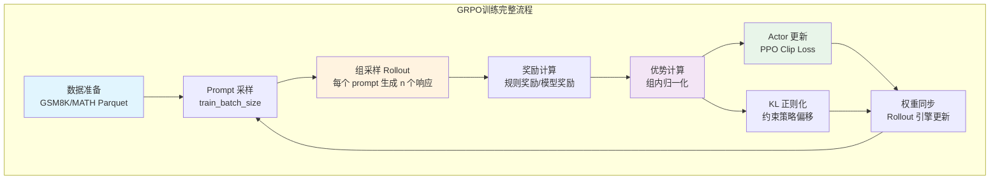
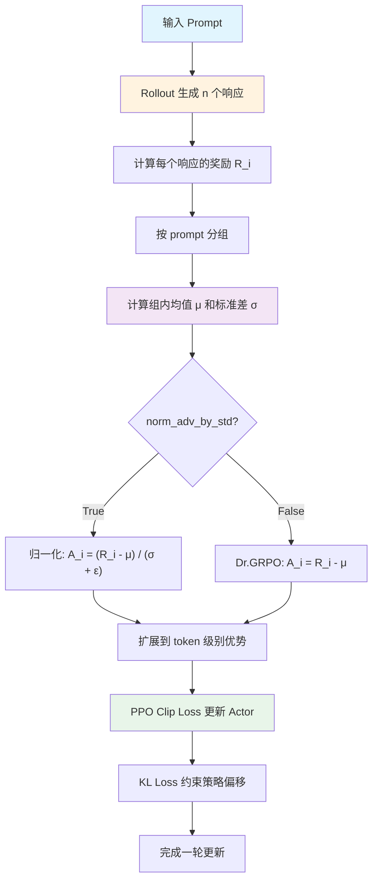
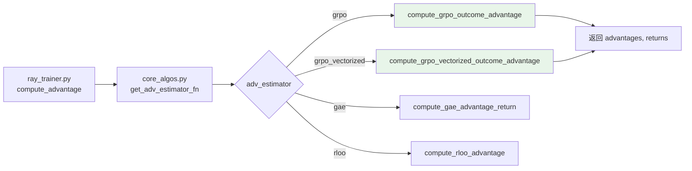
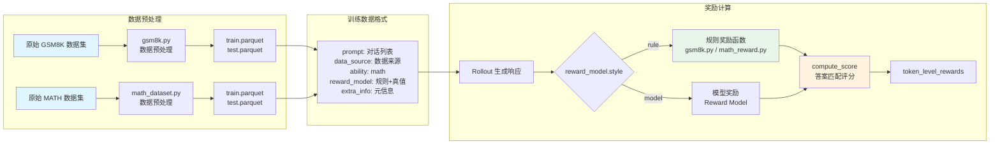

# 17. GRPO 训练例子详解

## 【总】开篇概述

GRPO（Group Relative Policy Optimization，组相对策略优化）是 verl 中最常用、最核心的强化学习算法。自 DeepSeekMath 论文提出以来，GRPO 凭借其无需 Critic 模型的简洁设计，已成为大语言模型后训练的事实标准。verl 对 GRPO 提供了完整的支持，包括 FSDP 和 Megatron 两种训练后端、vLLM/SGLang/TensorRT-LLM 三种推理后端，以及从 8B 到 671B 的模型规模覆盖。

**核心问题**：GRPO 的原理是什么？如何在 verl 中运行 GRPO 训练？

**关键结论预览**：
1. **不需要 Critic**：GRPO 用组内平均奖励替代 PPO 中的价值函数，省去一个与 Actor 同等规模的模型
2. **组采样**：每个 prompt 生成 n 个响应，形成"组"，组内比较决定优劣
3. **相对奖励**：奖励在组内归一化，优于平均的响应被强化，劣于平均的响应被抑制



---

## 【分】逐层展开

### 1. GRPO 算法原理

#### 1.1 GRPO vs PPO 的核心区别

PPO（Proximal Policy Optimization）是经典的强化学习算法，它依赖一个 Critic 模型来估计状态价值函数（Value Function），从而计算优势（Advantage）。Critic 模型通常与 Actor 模型同等规模，这意味着 PPO 需要维护两个大模型，显存和计算开销翻倍。

GRPO 的核心创新在于**用组内统计量替代 Critic**：对同一个 prompt 采样多个响应，用组内平均奖励作为基线，无需训练额外的价值网络。

| 特性 | PPO | GRPO |
|------|-----|------|
| Critic 模型 | 需要（与 Actor 同规模） | 不需要 |
| 基线来源 | 价值函数 V(s) | 组平均奖励 |
| 显存开销 | 高（Actor + Critic） | 低（仅 Actor + Ref） |
| 采样方式 | 每个 prompt 1 个响应 | 每个 prompt n 个响应 |
| 优势计算 | GAE（时序差分） | 组内归一化 |
| 适用场景 | 通用 RL | 可验证奖励的任务（数学、代码等） |

#### 1.2 组采样（Group Sampling）

GRPO 的关键操作是对每个 prompt 生成 n 个响应（n ≥ 2），形成一个"组"。这 n 个响应来自当前策略的独立采样，它们面对同一个问题但可能给出不同的解答。

例如，对于一道数学题，rollout_n=5 意味着模型会生成 5 个不同的解题过程和答案。如果其中 2 个答案正确（奖励=1）、3 个答案错误（奖励=0），则组平均奖励为 0.4。

#### 1.3 相对奖励（Relative Rewards）

GRPO 不使用绝对奖励值，而是在组内进行归一化。对于组内第 i 个响应，其优势计算为：

$$A_i = \frac{R_i - \mu_G}{\sigma_G + \epsilon}$$

其中 $\mu_G$ 是组内平均奖励，$\sigma_G$ 是组内标准差，$\epsilon$ 是防止除零的小常数。

这种归一化使得：
- **优于平均的响应**获得正优势（被强化）
- **劣于平均的响应**获得负优势（被抑制）
- **组内唯一响应**的优势为 0（不产生梯度）

#### 1.4 基线计算

组平均奖励作为基线，天然具有低方差的优势：
- 同一 prompt 的响应共享相同的问题难度，组内比较更公平
- 不需要学习价值函数，避免了 Critic 训练的不稳定性
- 当组内只有 1 个响应时，基线设为 0、标准差设为 1，确保不产生错误的梯度信号

#### 1.5 策略更新

GRPO 的策略更新沿用 PPO 的裁剪目标（Clipped Objective），但优势来自组内归一化而非 Critic：

$$L_{actor} = -\min\left(\frac{\pi_\theta(a|s)}{\pi_{old}(a|s)} \cdot A, \ clip\left(\frac{\pi_\theta(a|s)}{\pi_{old}(a|s)}, 1-\epsilon, 1+\epsilon\right) \cdot A\right)$$

同时，可通过 KL 散度损失约束策略不偏离参考策略太远：

$$L_{kl} = \mathbb{E}\left[\log\frac{\pi_\theta(a|s)}{\pi_{ref}(a|s)}\right]$$

论文参考：[DeepSeekMath: Pushing the Limits of Mathematical Reasoning in Open Language Models](https://arxiv.org/pdf/2402.03300)



---

### 2. GRPO 核心算法实现

#### 2.1 算法调用关系



#### 2.2 compute_grpo_outcome_advantage 函数详解

该函数位于 `verl/trainer/ppo/core_algos.py` 第 266-331 行，是 GRPO 算法的核心实现。

**函数签名**：

```python
@register_adv_est(AdvantageEstimator.GRPO)
def compute_grpo_outcome_advantage(
    token_level_rewards: torch.Tensor,  # (bs, response_length)
    response_mask: torch.Tensor,         # (bs, response_length)
    index: np.ndarray,                   # prompt 分组索引
    epsilon: float = 1e-6,              # 防除零常数
    norm_adv_by_std_in_grpo: bool = True, # 是否用标准差归一化
    config: Optional[AlgoConfig] = None,
) -> tuple[torch.Tensor, torch.Tensor]:
```

**处理流程**：

**步骤 1：计算每个响应的总奖励**

```python
scores = token_level_rewards.sum(dim=-1)
```

将 token 级别的奖励沿响应维度求和，得到每个响应的标量总奖励。对于 GRPO，通常只有最后一个 token 有非零奖励（结果奖励），其余 token 的奖励为 0。

**步骤 2：按 prompt index 分组**

```python
id2score = defaultdict(list)
id2mean = {}
id2std = {}
for i in range(bsz):
    id2score[index[i]].append(scores[i])
```

`index` 数组标识每个响应属于哪个 prompt。同一个 prompt 生成的 n 个响应共享相同的 index，被归入同一组。

**步骤 3：计算组内均值和标准差**

```python
for idx in id2score:
    if len(id2score[idx]) == 1:
        id2mean[idx] = torch.tensor(0.0)
        id2std[idx] = torch.tensor(1.0)
    elif len(id2score[idx]) > 1:
        scores_tensor = torch.stack(id2score[idx])
        id2mean[idx] = torch.mean(scores_tensor)
        id2std[idx] = torch.std(scores_tensor)
```

关键细节：当组内只有 1 个响应时，均值设为 0、标准差设为 1，使得归一化后优势为 0，不产生梯度信号。这是合理的，因为单个响应无法进行组内比较。

**步骤 4：归一化**

```python
for i in range(bsz):
    if norm_adv_by_std_in_grpo:
        scores[i] = (scores[i] - id2mean[index[i]]) / (id2std[index[i]] + epsilon)
    else:
        scores[i] = scores[i] - id2mean[index[i]]
```

- `norm_adv_by_std_in_grpo=True`（标准 GRPO）：用标准差归一化，优势值范围更稳定
- `norm_adv_by_std_in_grpo=False`（Dr.GRPO）：仅减去均值，保留奖励的绝对量级信息

**步骤 5：扩展到 token 级别**

```python
scores = scores.unsqueeze(-1) * response_mask
return scores, scores
```

将标量优势扩展到每个 token，乘以 `response_mask` 确保只有有效 token 位置有非零值。注意 GRPO 中 advantages 和 returns 相同（因为没有 Critic 的价值估计）。

#### 2.3 norm_adv_by_std_in_grpo 参数

| 参数值 | 算法变体 | 归一化方式 | 特点 |
|--------|---------|-----------|------|
| `True` | 标准 GRPO | `(R - μ) / (σ + ε)` | 优势值标准化，范围稳定 |
| `False` | Dr.GRPO | `R - μ` | 保留奖励量级，配合 `loss_agg_mode=seq-mean-token-sum-norm` |

Dr.GRPO 变体来自论文 [Understanding R1-Zero-Like Training: A Critical Perspective](https://arxiv.org/pdf/2503.20783)，其核心发现是标准 GRPO 的标准差归一化会引入偏差，去掉标准差归一化并调整损失聚合方式可以获得更好的训练效果。

---

### 3. GRPO 配置参数详解

#### 3.1 必需参数

| 参数 | 说明 | 要求 |
|------|------|------|
| `algorithm.adv_estimator=grpo` | 指定使用 GRPO 优势估计器 | 必须设置 |
| `actor_rollout_ref.rollout.n` | 每个 prompt 的采样数 | 必须 ≥ 2 |

#### 3.2 关键参数

| 参数 | 默认值 | 说明 |
|------|--------|------|
| `data.train_batch_size` | 1024 | 每步采样的 prompt 数量，总轨迹数 = train_batch_size × n |
| `actor_rollout_ref.actor.ppo_mini_batch_size` | 256 | Actor 更新的全局 mini-batch 大小，必须整除 train_batch_size × n |
| `actor_rollout_ref.actor.clip_ratio` | 0.2 | PPO 裁剪范围 ε，控制策略更新幅度 |
| `actor_rollout_ref.actor.use_kl_loss` | True | 是否启用 KL 散度损失 |
| `actor_rollout_ref.actor.kl_loss_coef` | 0.001 | KL 损失系数 |
| `actor_rollout_ref.actor.kl_loss_type` | low_var_kl | KL 损失类型 |
| `actor_rollout_ref.actor.entropy_coeff` | 0 | 熵正则化系数 |
| `actor_rollout_ref.actor.loss_agg_mode` | token-mean | 损失聚合方式 |
| `algorithm.norm_adv_by_std_in_grpo` | True | 是否用标准差归一化 GRPO 优势 |
| `algorithm.use_kl_in_reward` | False | 是否在奖励中应用 KL 惩罚 |

#### 3.3 loss_agg_mode 选项

| 模式 | 计算方式 | 适用场景 |
|------|---------|---------|
| `token-mean` | 所有 token 的损失取均值 | 默认方式 |
| `seq-mean-token-sum` | 先对每个序列的 token 求和，再对序列取均值 | 长序列场景 |
| `seq-mean-token-mean` | 先对每个序列的 token 取均值，再对序列取均值 | 均衡场景 |
| `seq-mean-token-sum-norm` | 先 token 求和再归一化，最后序列取均值 | Dr.GRPO 专用 |

#### 3.4 Dr.GRPO 配置

在标准 GRPO 配置基础上，需额外设置：

```
actor_rollout_ref.actor.loss_agg_mode=seq-mean-token-sum-norm
actor_rollout_ref.actor.use_kl_loss=False
algorithm.norm_adv_by_std_in_grpo=False
```

---

### 4. FSDP 后端 GRPO 训练实战

#### 4.1 FSDP 训练时序图

```mermaid
sequenceDiagram
    participant Main as main_ppo
    participant RT as RayTrainer
    participant Rollout as Rollout Worker<br/>(vLLM/SGLang)
    participant Actor as Actor Worker<br/>(FSDP)
    participant Ref as Ref Worker<br/>(FSDP)
    participant RM as Reward Manager

    Main->>RT: 启动训练循环
    loop 每个 training step
        RT->>RT: 采样 prompt batch<br/>(train_batch_size)
        RT->>Rollout: 生成响应<br/>(每个 prompt n 个)
        Rollout-->>RT: 返回 trajectories
        RT->>RM: 计算奖励
        RM-->>RT: 返回 token_level_rewards
        RT->>Actor: 计算 old_log_prob
        Actor-->>RT: 返回 log_probs + entropy
        RT->>Ref: 计算 ref_log_prob
        Ref-->>RT: 返回 ref_log_probs
        RT->>RT: compute_grpo_outcome_advantage<br/>(组内归一化)
        RT->>Actor: 更新 Actor<br/>(PPO Clip + KL Loss)
        Actor-->>RT: 返回更新指标
        RT->>Rollout: 同步更新后的权重
    end
```

#### 4.2 基于 run_qwen3_8b_fsdp.sh 的完整解析

脚本路径：`examples/grpo_trainer/run_qwen3_8b_fsdp.sh`

**环境变量配置**：

| 变量 | 默认值 | 说明 |
|------|--------|------|
| `MODEL_PATH` | Qwen/Qwen3-8B | 模型路径 |
| `NNODES` | 1 | 节点数 |
| `NGPUS_PER_NODE` | 8 (GPU) / 8 (NPU) | 每节点 GPU 数 |
| `INFER_BACKEND` | vllm | 推理后端：vllm / sglang / trtllm |
| `TRAIN_BATCH_SIZE` | 1024 | 每步 prompt 数 |
| `PPO_MINI_BATCH_SIZE` | 256 | Actor mini-batch 大小 |
| `ROLLOUT_N` | 5 | 每 prompt 采样数 |
| `ROLLOUT_TP` | 2 (GPU) / 4 (NPU) | Rollout 张量并行度 |
| `ACTOR_LR` | 1e-6 | Actor 学习率 |
| `KL_LOSS_COEF` | 0.001 | KL 损失系数 |
| `MAX_PROMPT_LENGTH` | 1024 | 最大 prompt 长度 |
| `MAX_RESPONSE_LENGTH` | 2048 | 最大响应长度 |

**参数分组详解**：

```
DATA[]:
  algorithm.adv_estimator=grpo          # GRPO 优势估计
  algorithm.use_kl_in_reward=False       # 不在奖励中加 KL 惩罚
  data.train_files=[gsm8k, math]        # 训练数据
  data.val_files=[gsm8k, math]          # 验证数据
  data.train_batch_size=1024            # prompt 数
  data.max_prompt_length=1024           # 最大 prompt 长度
  data.max_response_length=2048         # 最大响应长度
  data.filter_overlong_prompts=True     # 过滤超长 prompt
  data.truncation='error'               # 截断模式为 error

MODEL[]:
  actor_rollout_ref.model.path          # 模型路径
  actor_rollout_ref.model.use_remove_padding=True   # 移除 padding
  actor_rollout_ref.model.enable_gradient_checkpointing=True  # 梯度检查点

ACTOR[]:
  actor_rollout_ref.actor.optim.lr=1e-6           # 学习率
  actor_rollout_ref.actor.ppo_mini_batch_size=256  # mini-batch 大小
  actor_rollout_ref.actor.use_dynamic_bsz=True     # 动态 batch size
  actor_rollout_ref.actor.use_kl_loss=True         # 启用 KL 损失
  actor_rollout_ref.actor.kl_loss_coef=0.001       # KL 系数
  actor_rollout_ref.actor.kl_loss_type=low_var_kl  # KL 类型
  actor_rollout_ref.actor.entropy_coeff=0          # 熵系数

ROLLOUT[]:
  actor_rollout_ref.rollout.name=vllm              # 推理后端
  actor_rollout_ref.rollout.tensor_model_parallel_size=2  # TP 度
  actor_rollout_ref.rollout.gpu_memory_utilization=0.6    # GPU 显存利用率
  actor_rollout_ref.rollout.n=5                    # 采样数

REF[]:
  actor_rollout_ref.ref.log_prob_use_dynamic_bsz=True
  actor_rollout_ref.ref.fsdp_config.param_offload=True  # Ref 参数卸载

TRAINER[]:
  trainer.balance_batch=True         # 平衡 batch
  trainer.logger=["console","wandb"] # 日志后端
  trainer.total_epochs=15            # 总 epoch 数
  trainer.save_freq=20               # 保存频率
  trainer.test_freq=5                # 测试频率
```

#### 4.3 GPU vs NPU 配置差异

| 配置项 | GPU | NPU |
|--------|-----|-----|
| `actor_param_offload` | False | True |
| `actor_optimizer_offload` | False | True |
| `rollout_tp` | 2 | 4 |
| `sp_size` (序列并行) | 1 | 4 |
| `train_batch_size` | 1024 | 16 |
| `ppo_mini_batch_size` | 256 | 16 |
| `max_response_length` | 2048 | 32768 |
| `rollout_gpu_mem_util` | 0.6 | 0.3 |
| `use_torch_compile` | 默认 | False |
| 额外配置 | — | ulysses_sequence_parallel_size, micro_batch_size=1 |

NPU 配置的特点是大量使用参数卸载和序列并行来适应显存限制，同时大幅缩小 batch size 并增大响应长度上限。

#### 4.4 启动命令

```bash
# 基础启动
bash examples/grpo_trainer/run_qwen3_8b_fsdp.sh

# 自定义参数启动
MODEL_PATH=Qwen/Qwen3-14B \
NNODES=2 NGPUS_PER_NODE=8 \
INFER_BACKEND=sglang ROLLOUT_N=8 TRAIN_BATCH_SIZE=2048 \
bash examples/grpo_trainer/run_qwen3_8b_fsdp.sh
```

---

### 5. Megatron 后端 GRPO 训练实战

#### 5.1 基于 run_qwen3_8b_megatron.sh 的完整解析

脚本路径：`examples/grpo_trainer/run_qwen3_8b_megatron.sh`

**Megatron 特有参数**：

| 参数 | 默认值 | 说明 |
|------|--------|------|
| `actor_tp` | 2 | Actor 张量并行度 |
| `actor_pp` | 2 | Actor 流水线并行度 |
| `model_engine` | megatron | 指定使用 Megatron 引擎 |

**Megatron 配置关键差异**：

```
ACTOR[]:
  actor_rollout_ref.actor.megatron.tensor_model_parallel_size=2   # 张量并行
  actor_rollout_ref.actor.megatron.pipeline_model_parallel_size=2  # 流水线并行

REF[]:
  actor_rollout_ref.ref.megatron.tensor_model_parallel_size=2
  actor_rollout_ref.ref.megatron.pipeline_model_parallel_size=2

EXTRA[]:
  model_engine=megatron  # 使用 Megatron 引擎
```

#### 5.2 与 FSDP 的配置差异对比

| 配置项 | FSDP | Megatron |
|--------|------|----------|
| 模型引擎 | 默认（FSDP） | `model_engine=megatron` |
| 张量并行 | 不支持 | `actor_tp=2` |
| 流水线并行 | 不支持 | `actor_pp=2` |
| 梯度检查点 | `enable_gradient_checkpointing=True` | 不使用 |
| 参数卸载 | `fsdp_config.param_offload` | 不适用 |
| Ref 并行 | 不适用 | 共享 actor_tp/actor_pp |
| CUDA 优化 | 默认 | `CUDA_DEVICE_MAX_CONNECTIONS=1` |
| 适用规模 | 中小模型（≤30B） | 大模型（≥30B，MoE） |

Megatron 后端通过张量并行和流水线并行支持更大规模的模型训练，特别适合 30B 以上的模型和 MoE 架构（如 Qwen3-235B、DeepSeek-V3-671B）。

---

### 6. 数据准备与奖励函数

#### 6.1 数据+奖励流程图



#### 6.2 GSM8K 数据预处理

脚本路径：`examples/data_preprocess/gsm8k.py`

**数据格式**：

```python
{
    "data_source": "openai/gsm8k",
    "prompt": [
        {"role": "user", "content": "问题 Let's think step by step and output the final answer after \"####\"."}
    ],
    "ability": "math",
    "reward_model": {"style": "rule", "ground_truth": "123"},  # 正确答案
    "extra_info": {
        "split": "train",
        "index": 0,
        "answer": "原始答案文本",
        "question": "原始问题文本"
    }
}
```

关键处理步骤：
1. 加载 `openai/gsm8k` 数据集
2. 拼接 `instruction_following` 提示模板：`Let's think step by step and output the final answer after "####".`
3. 用 `extract_solution` 从原始答案中提取 `####` 后的数字
4. 构造标准化的数据格式，保存为 parquet 文件

#### 6.3 MATH 数据预处理

脚本路径：`examples/data_preprocess/math_dataset.py`

与 GSM8K 类似，但有以下差异：
- 数据源：`DigitalLearningGmbH/MATH-lighteval`
- 提示模板：`Let's think step by step and output the final answer within \boxed{}.`
- 答案提取：使用 `remove_boxed(last_boxed_only_string(solution_str))` 从 LaTeX `\boxed{}` 格式中提取

#### 6.4 GSM8K 奖励函数

代码路径：`verl/utils/reward_score/gsm8k.py`

**extract_solution 函数**：

```python
def extract_solution(solution_str, method="strict"):
    # 优化：只匹配最后 300 字符（答案通常在末尾）
    if len(solution_str) > 300:
        solution_str = solution_str[-300:]

    if method == "strict":
        # 严格模式：匹配 #### 后的数字
        solutions = re.findall("#### (\\-?[0-9\\.\\,]+)", solution_str)
        final_answer = solutions[-1].replace(",", "").replace("$", "") if solutions else None
    elif method == "flexible":
        # 灵活模式：匹配最后一个有效数字
        answer = re.findall("(\\-?[0-9\\.\\,]+)", solution_str)
        final_answer = ...  # 取最后一个非空非点的数字
    return final_answer
```

**compute_score 函数**：

| 条件 | 返回值 | 说明 |
|------|--------|------|
| 答案为 None | 0 | 无法提取答案 |
| 答案 == ground_truth | 1.0 | 答案正确 |
| 答案 ≠ ground_truth | format_score | 格式正确但答案错误 |

#### 6.5 自定义奖励函数的方法

要为自定义数据集实现奖励函数，需要：

1. **创建奖励函数文件**：在 `verl/utils/reward_score/` 下创建新的评分模块
2. **实现 compute_score 函数**：接收 `solution_str` 和 `ground_truth`，返回分数
3. **注册奖励函数**：在奖励管理器中注册新的数据源和对应的评分函数
4. **数据格式对齐**：确保 `reward_model.style` 和 `reward_model.ground_truth` 字段正确

---

### 7. 支持的模型与后端矩阵

来自 verl GRPO README 的完整矩阵：

| 模型家族 | vLLM | SGLang | TensorRT-LLM | 训练后端 | 平台 |
|---------|:----:|:------:|:------------:|---------|------|
| Qwen3-8B (dense) | ✓ | ✓ | ✓ | FSDP, Megatron | NVIDIA, NPU (FSDP+MindSpeed), GB200 |
| Qwen2.5-VL-7B | ✓ | ✓ | ✓ | FSDP, Megatron | NVIDIA |
| Qwen3-VL-8B | ✓ | | | FSDP, Megatron | NVIDIA, NPU (FSDP) |
| Qwen3-VL-30B-A3B | ✓ | | | FSDP, Megatron | NVIDIA, NPU (FSDP, VeOmni) |
| Qwen3-VL-235B-A22B | ✓ | | | Megatron | NVIDIA |
| Qwen3-30B-A3B (MoE) | ✓ | ✓ | ✓ | FSDP, Megatron | NVIDIA, NPU (MindSpeed, VeOmni) |
| Qwen3-235B-A22B | ✓ | | ✓ | Megatron | NVIDIA, NPU |
| Qwen3-Next-80B-A3B | ✓ | | | FSDP | NPU |
| Qwen3.5-27B (dense) | ✓ | | | FSDP2 | NVIDIA, NPU |
| Qwen3.5-35B (dense) | ✓ | | | FSDP2, Megatron | NVIDIA, NPU |
| Qwen3.5-35B-A3B (MoE) | | ✓ | | VeOmni | NVIDIA |
| Qwen3.5-122B-A10B | ✓ | | | Megatron | NVIDIA |
| DeepSeek-V3 671B | ✓ | | | Megatron | NVIDIA |
| GLM-4.1V-9B | ✓ | | | FSDP | NVIDIA |
| MiniCPM-o-2.6 | ✓ | | | FSDP | NVIDIA |
| Moonlight-16B-A3B | ✓ | | | Megatron | NVIDIA |
| Nemotron-Nano-v3-30B-A3B | ✓ | | | Megatron | NVIDIA |
| Seed-OSS-36B | ✓ | | | FSDP2 | NVIDIA |
| GPT-OSS-20B | | ✓ | | FSDP | NVIDIA |
| Mistral-Nemo-12B (RM demo) | ✓ | | | FSDP | NVIDIA |

---

### 8. 训练监控与调优

#### 8.1 关键指标

verl 的 `metric_utils.py` 提供了丰富的训练指标，核心监控指标如下：

| 指标 | 含义 | 理想趋势 |
|------|------|---------|
| `critic/score/mean` | 序列得分均值（PPO clip 前） | 上升 |
| `critic/rewards/mean` | 序列奖励均值 | 上升 |
| `critic/advantages/mean` | 优势均值 | 趋近 0 |
| `actor/entropy` | 策略熵 | 逐渐下降但不过低 |
| `critic/rewards/max` | 最大奖励 | 上升 |
| `response_length/mean` | 平均响应长度 | 稳定或略增 |
| `response/aborted_ratio` | 响应截断比例 | 低 |
| `perf/throughput` | 吞吐量（token/s/GPU） | 高 |

#### 8.2 常见调优场景

**奖励不增长**：
- 检查奖励函数是否正确：验证 `compute_score` 的输出
- 增大 `rollout_n`（如从 5 增到 8），提供更丰富的组内比较
- 检查 `train_batch_size` 是否过小，导致梯度估计不稳定
- 确认 `max_response_length` 足够长，模型有空间生成完整解答

**KL 过大（策略偏移严重）**：
- 增大 `kl_loss_coef`（如从 0.001 增到 0.01）
- 减小 `actor_lr`（如从 1e-6 降到 5e-7）
- 减小 `ppo_epochs`（减少内循环次数）

**训练不稳定**：
- 减小学习率
- 增大 `ppo_mini_batch_size`（更稳定的梯度估计）
- 减小 `clip_ratio`（如从 0.2 降到 0.1）
- 启用 `trainer.balance_batch=True`（平衡 batch 中不同 prompt 的采样数）

**响应长度异常增长**：
- 检查奖励函数是否隐式奖励了更长响应
- 增大 `kl_loss_coef` 约束策略偏移
- 设置合理的 `max_response_length`

#### 8.3 性能优化

| 优化项 | 配置 | 效果 |
|--------|------|------|
| 动态 batch size | `use_dynamic_bsz=True` | 根据序列长度动态调整，提高 GPU 利用率 |
| 序列平衡 | `balance_batch=True` | 平衡不同 prompt 的组大小，避免负载不均 |
| 参数卸载 | `param_offload=True` | 将不活跃的参数卸载到 CPU，节省显存 |
| 梯度检查点 | `enable_gradient_checkpointing=True` | 用计算换显存，支持更大模型 |
| Ref 参数卸载 | `ref.fsdp_config.param_offload=True` | Ref 模型仅在计算 log_prob 时加载 |
| 序列并行 | `ulysses_sequence_parallel_size=4` | NPU 上通过序列并行降低单卡显存需求 |

---

## 【总】总结升华

### 回顾 GRPO 的核心设计

GRPO 的精髓在于三个设计选择：
1. **去 Critic 化**：用组内统计量替代价值函数，将模型开销减半
2. **组采样**：同一 prompt 多次采样，提供组内比较的基础
3. **相对奖励**：组内归一化消除绝对奖励的偏差，使训练信号更稳定

这三个选择使得 GRPO 特别适合有可验证奖励的任务（数学、代码等），也是 DeepSeek-R1 等推理模型的核心训练算法。

### GRPO vs PPO 的选择建议

| 场景 | 推荐算法 | 原因 |
|------|---------|------|
| 可验证奖励（数学、代码） | GRPO | 无需 Critic，效率高 |
| 人类偏好奖励（RLHF） | PPO | 奖励不可分组比较，需要 Critic 估计基线 |
| 资源受限 | GRPO | 省去 Critic 模型的显存和计算 |
| 需要精细信用分配 | PPO + GAE | GAE 提供更细粒度的 token 级优势 |
| 大规模 MoE 模型 | GRPO | Critic 对 MoE 的支持更复杂 |

### 从 GRPO 到其他算法的扩展路径

verl 提供了丰富的算法生态，从 GRPO 出发可以自然扩展到：

- **Dr.GRPO**：去掉标准差归一化，调整损失聚合方式，可能获得更好的训练效果
- **DAPO**：在 GRPO 基础上增加动态采样和过滤，是当前 SOTA 算法（AIME 2024 达到 50 分）
- **ReMax**：用最佳响应的奖励作为基线，替代组平均奖励
- **REINFORCE++**：REINFORCE 的改进版本，带基线的策略梯度
- **RLOO**：Leave-One-Out 基线，与 GRPO 的组归一化思路类似但实现不同
- **GPG**：Group Policy Gradient，GRPO 的策略梯度变体

这些算法在 verl 中都有对应的 `adv_estimator` 实现，切换算法只需修改配置参数 `algorithm.adv_estimator`，无需改动训练代码。
